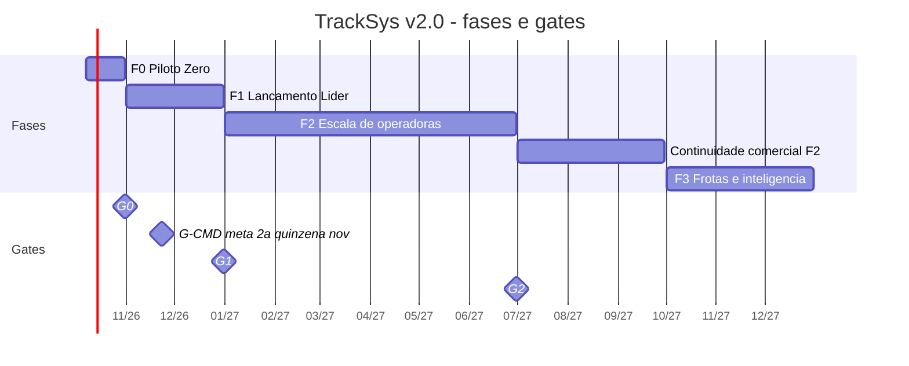

# 02 — Escopo e fases

> **Resumo:** A TrackSys entrega em quatro fases com data: F0 Piloto Zero (07/10 → 31/10/2026, só rastreamento em 5–10 veículos), F1 Lançamento Lider (01/11 → 31/12/2026, bloqueio após G-CMD, cobrança, migração da base, operação a 99,5%), F2 Escala de operadoras (jan → jun/2027) e F3 Frotas e inteligência (a partir de out/2027). Cada fase fecha num gate (G0, G-CMD, G1, G2) com item, medida e evidência. Este capítulo traz o cronograma semanal do F0, o plano de corte, a primeira fatia vertical, o mapeamento M1–M10 da v1.1 e as dependências de DEC por fase.
> **Fases:** F0, F1, F2, F3  ·  **Status:** Aprovado para execução
> **Muda em relação à v1.1:**
> - As entregas E0–E4/EC, sem prazo, viram fases F0–F3 com datas.
> - Segurança primeiro: SOS, corte de alimentação e sem comunicação entram no F0; o bloqueio entra no F1 (na v1.1 era a trilha EC, por último).
> - O app Flutter sobe para o F0 (era E2).
> - Gates viram checklists com medida e evidência. O G-CMD separa a liberação do bloqueio real do resto.
> - Módulos de frota (M1 frota, M2, M4, M5 frota, M7) vão para F3.

**Nesta página**

- [1. Visão geral](#1-visão-geral)
- [2. F0 — Piloto Zero (07/10 → 31/10/2026)](#2-f0--piloto-zero-0710--31102026)
- [3. Primeira fatia vertical](#3-primeira-fatia-vertical)
- [4. F1 — Lançamento Lider (01/11 → 31/12/2026)](#4-f1--lançamento-lider-0111--31122026)
- [5. F2 — Escala de operadoras (jan → jun/2027)](#5-f2--escala-de-operadoras-jan--jun2027)
- [6. F3 — Frotas e inteligência (a partir de out/2027)](#6-f3--frotas-e-inteligência-a-partir-de-out2027)
- [7. Fora de escopo por fase](#7-fora-de-escopo-por-fase)
- [8. Mapeamento da v1.1](#8-mapeamento-da-v11)
- [9. Dependências críticas (DEC) por fase](#9-dependências-críticas-dec-por-fase)
- [10. Registro de evidências dos gates](#10-registro-de-evidências-dos-gates)
- [11. Requisitos](#11-requisitos)

## 1. Visão geral

| Fase | Período | Objetivo | Escala | Gate de saída |
|---|---|---|---|---|
| F0 — Piloto Zero | 07/10 → 31/10/2026 | Rastreamento real com dados isolados | 5–10 veículos, 1 operadora | G0 (31/10/2026) |
| F1 — Lançamento Lider | 01/11 → 31/12/2026 | Paridade com o tracker-net e migração da base | ~300 veículos | G-CMD (meta 16–30/11/2026); G1 (31/12/2026, meta) |
| F2 — Escala de operadoras | 01/01 → 30/06/2027 | Onboarding ≤ 14 dias, SVA, agentes de IA | 6+ operadoras | G2 (30/06/2027) |
| F3 — Frotas e inteligência | a partir de 01/10/2027 | Módulos de frota e inteligência | 12 operadoras, 3.000 veículos no mês 12 | — |



**Regras de fase.**

1. Uma fase só fecha com o gate aprovado no registro de evidências (REQ-NEG-016).
2. Gate atrasado não para trabalho que não depende dele. O F1 começa em 01/11/2026 com as tarefas sem dependência do G0 (cobrança, carteira, importador, comandos em bancada).
3. Bloqueio em veículo real só existe após o G-CMD (REQ-NEG-011).
4. Jul–set/2027 é continuidade do F2: escala comercial até 12 operadoras, sem escopo funcional novo. O backlog do F3 começa em out/2027 [PREMISSA].

## 2. F0 — Piloto Zero (07/10 → 31/10/2026)

### 2.1 Conteúdo

5 a 10 veículos (frota própria, funcionários ou clientes voluntários da Lider). **Somente rastreamento.**

1. VM primária Oracle com Docker Compose (`db`, `traccar`, `api`, `worker`, `caddy`); subdomínios `gps.`, `api.`, `app.`; backup diário + WAL para object storage; 1 restore testado; sonda externa ([13](13-infra-e-operacao.md)).
2. Ingestão J16 via Traccar → `ingest_inbox` → `position`/`device_state` com normalização, dedupe e compactação de parado ([05](05-ingestao-e-telemetria.md)).
3. Isolamento em 3 níveis (T-001) e autenticação básica (e-mail + senha) para `operator_admin`, `operator_agent` e `tenant_owner` ([04](04-dominio-e-dados.md), [08](08-identidade-e-seguranca.md)).
4. Console web mínimo: login; cadastro de cliente, veículo, rastreador e vínculo (com `cut_point`); mapa ao vivo da operadora; histórico por veículo/dia ([10](10-apps-e-ux.md)).
5. App Flutter (TestFlight + teste fechado Google Play): login, lista de veículos, mapa ao vivo com estados honestos, histórico do dia, push de alertas, "Falar com a central" (deep link WhatsApp), "Navegar até o veículo" (deep link Google Maps/Waze), marca básica da operadora (nome, logo, cor) ([10](10-apps-e-ux.md)).
6. Alertas: ignição ligada, modo vigilância, corte de alimentação (se o J16 reportar — DEC-02), SOS (se instalado), sem comunicação, comunicação perdida em movimento ([07](07-alertas-e-tempo-real.md)).
7. Migração manual por SMS de 5–10 veículos, com rollback testado em 1 veículo ([11](11-onboarding-e-migracao.md)).
8. Termo simples de participação no piloto ([Anexo B](../anexos/B-juridico.md)).

**Fora do F0:** bloqueio em veículo real (só bancada), cobrança, SVA, lojas públicas, VM standby, agentes de IA de operação e suporte.

**Piloto e bloqueio.** O veículo que sai do tracker-net perde o bloqueio remoto durante o piloto. Se o J16 aceitar servidor secundário, o piloto PODE manter o tracker-net como primário e a TrackSys como secundário, sem perder o bloqueio [VALIDAR — DEC-02]. Sem essa capacidade, só entram veículos cujo titular assinou o termo ciente da perda.

### 2.2 Cronograma semanal

| Semana | Entregas | Tarefas | Ações do fundador | Horas do fundador (estimativa) [PREMISSA] | Marco de fim |
|---|---|---|---|---|---|
| **S1** 07–13/10 (qua–ter) | Repositório com spec, `AGENTS.md` e CI; isolamento em 3 níveis verde no CI; VM primária com Compose e subdomínios em domínio provisório (`TRACKSYS_DOMAIN`); J16 de bancada transmitindo para o Traccar da VM; capturas reais em `packages/testkit`; `capability_profile` J16 em `'draft'`; contratos iniciais | T-001, T-002, T-003, T-004 | DEC-03 (09/10); DEC-12 (10/10); DEC-01 e DEC-02 (13/10); 2 J16 + 2 chips emnify na bancada; senha SMS do J16 com a Lider; lista de 5–10 veículos voluntários (placa, IMEI, ICCID, titular). Só 4 dias úteis (12/10 é feriado): os pedidos à Meta Telecom, à emnify e à Lider saem em 09/10 | 45 h | 13/10: resultado do spike registrado; posição do J16 de bancada visível no Traccar da VM; checkpoint de 13/10, 18:00 BRT |
| **S2** 14–20/10 | Ingestão ponta a ponta; login; cadastro no console; mapa ao vivo e histórico no console; app com login, lista e mapa ao vivo | T-005, T-006, T-007, T-008, T-009, T-019 | DEC-04 e DEC-10 (17/10); projeto Firebase (FCM + chave APNs); testadores do TestFlight e do teste fechado Google Play; termo de participação; sessão de 1 h com a Lider operando o tracker-net (app e central) em tela compartilhada: inventário de paridade em `docs/runbooks/onboarding/lider-paridade.md`, com função, quem usa, frequência, equivalente TrackSys e fase | 50 h | 16/10: checkpoint 18:00 BRT. 20/10: primeira fatia vertical demonstrada (REQ-NEG-014; plano B: esqueleto mínimo do console) |
| **S3** 21–27/10 | Histórico e deep links no app; alertas do F0 com push; deploy automatizado; backup diário + WAL; 1 restore testado; sondas externas; 1 veículo da frota da Lider migrado em 22/10, rollback testado e migrado de novo | T-010, T-011, T-012, T-032, T-013, T-014 | Teste fechado do Google Play com ≥ 12 testadores iniciado até 27/10 [VALIDAR — regra do Google Play para o tipo de conta]; termos assinados; checkpoints de corte 23/10 e 27/10, 18:00 BRT | 55 h | 27/10: alerta provocado chega ao celular; restore registrado |
| **S4** 28–31/10 (qua–sáb) | 5–10 veículos migrados até 29/10 12:00 BRT; acompanhamento de 48 h; relatório do G0 | T-014 (execução), T-015 | DEC-06 e DEC-14 (31/10); acompanhamento; avaliação do G0 em 31/10 após 12:00 BRT | 45 h | 31/10: G0 |

**S1 (pedidos externos):** 4 dias úteis (12/10 é feriado): pedidos à Meta Telecom, à emnify e à Lider saem em 09/10; ação do fundador: sessão de 1 h com a Lider operando o tracker-net → `docs/runbooks/onboarding/lider-paridade.md`.

**Feriados nacionais de 2026:** 12/10, 02/11, 20/11 e 25/12. Janela de onda e deploy N0 só em dia útil sem feriado (calendário em `packages/domain/src/calendar/holidays-br.ts`; [11 §4.1](11-onboarding-e-migracao.md#41-liberação-modo-e-janela) e [14 §6](14-qualidade-e-processo-ia.md#6-níveis-de-risco)).

**Horas do fundador.** A coluna é o orçamento da semana. Previsão acima de 60 h aciona os cortes 0a–0d da seção 2.4.

**Prazo duro do S4.** O G0 exige 48 h contínuas. A janela de 29/10 12:00 BRT a 31/10 12:00 BRT só fecha a tempo se os veículos estiverem transmitindo até 29/10 12:00 BRT.

### 2.3 Cartões de tarefa do F0

Cada cartão é escrito em `tasks/T-NNN-*.md` com aceite congelado em `tests/acceptance/T-NNN/` ([14](14-qualidade-e-processo-ia.md)). O índice de todos os cartões (F0 e F1) é [tasks/INDEX.md](../../tasks/INDEX.md); esta tabela é dona de fase, dependência e risco do F0.

| Tarefa | Título | Semana | Depende de | Risco | Capítulo dono |
|---|---|---|---|---|---|
| T-001 | Fundação do monorepo e isolamento | S1 | — | N0 | [04](04-dominio-e-dados.md), [14](14-qualidade-e-processo-ia.md) |
| T-002 | Spike J16 em bancada: capturas, `capability_profile` draft | S1 | Hardware na bancada | N1 | [05](05-ingestao-e-telemetria.md), [06](06-comandos-e-bloqueio.md) |
| T-003 | VM primária, Docker Compose, firewall e DNS | S1 | DEC-12 | N0 (caminho) | [13](13-infra-e-operacao.md) |
| T-004 | Contratos iniciais (Zod → OpenAPI 3.1 → clientes TS e Dart); dono da CAT-07 | S1 | T-001 | N0 (caminho) | [09](09-api-e-contratos.md) |
| T-005 | Ingestão Traccar → `ingest_inbox` → `position`/`device_state`/`outbox` | S2 | T-001, T-002, T-004 | N0 (caminho) | [05](05-ingestao-e-telemetria.md) |
| T-006 | Autenticação (Better Auth) e contexto RLS por requisição | S2 | T-001, T-004 | N0 | [08](08-identidade-e-seguranca.md) |
| T-007 | Console: login e cadastro de cliente, veículo, rastreador e vínculo | S2 | T-004, T-005, T-006 | N1 | [10](10-apps-e-ux.md) |
| T-008 | Console: mapa ao vivo (SSE) e histórico por veículo/dia | S2 | T-005, T-006, T-007 | N0 (caminho) | [10](10-apps-e-ux.md), [07](07-alertas-e-tempo-real.md) |
| T-009 | App: login, lista, mapa ao vivo com estados honestos, marca básica | S2 | T-004, T-006, T-008 | N0 (caminho) | [10](10-apps-e-ux.md) |
| T-010 | App: histórico do dia, deep links (WhatsApp, navegação) e distribuição F0 (REQ-UX-030) | S3 | T-008, T-009 | N0 (caminho) | [10](10-apps-e-ux.md) |
| T-011 | Motor de alertas do F0 | S3 | T-002, T-005, T-006, T-007, T-008 | N0 (caminho) | [07](07-alertas-e-tempo-real.md) |
| T-012 | Push no servidor: migration, `claim_push_token`, rotas, `alerts.deliver` e FCM | S3 | T-011 | N0 (caminho) | [07](07-alertas-e-tempo-real.md) |
| T-032 | App: push, telas de alertas (A05), modo vigilância (A06) e notificações (A09) | S3 | T-009, T-012 | N2 (N0 se tocar `.github/**`) | [10](10-apps-e-ux.md) |
| T-013 | Deploy por tag (manual assistido), WAL-G, restore testado, sondas e limites de recurso | S3 | T-003, T-004 | N0 (caminho) | [13](13-infra-e-operacao.md) |
| T-014 | Migração manual por SMS, rollback e `pilot provision` | S3–S4 | T-005, T-007, T-013, DEC-02, DEC-04 | N1 | [11](11-onboarding-e-migracao.md) |
| T-015 | Consultas do G0 (lacunas, reconciliação, latência de alerta) | S4 | T-005, T-012 | N2 | este capítulo |
| T-019 | Guardas de processo no CI | S1–S2 | T-001 | N0 | [14](14-qualidade-e-processo-ia.md) |

**Caminho crítico (duas cadeias que se juntam):**

1. T-001 → T-004 → T-006 → T-007 → T-008 → T-011 → T-012 → T-014 → 48 h → G0.
2. T-002 → T-005 → T-011.

Atraso em qualquer elo aciona o plano de corte (seção 2.4).

**Risco pelo caminho.** O nível do PR é o maior entre os arquivos alterados ([14 §6](14-qualidade-e-processo-ia.md#6-níveis-de-risco)). "N0 (caminho)" significa N0 só nos arquivos da tabela abaixo; leitura linha a linha e revisor de outro fornecedor valem para eles, e o resto segue o checklist do nível do arquivo (N1 ou N2).

| Tarefa | Arquivos N0 pelo caminho |
|---|---|
| T-003 | `.github/**`, `.sops.yaml`, `infra/secrets/**` |
| T-004 | `.github/workflows/ci.yml`, migration do `pg-boss`, CAT-07 e `app.tg_immutable_columns()` (alteração só aditiva em `package.json` e `biome.json` é N1) |
| T-005 | Migration, `catalog-allowlist.json`, CAT-07 e as 6 funções `SECURITY DEFINER` (as 5 de [04 §4.4](04-dominio-e-dados.md#44-funções-security-definer-lista-fechada) e `app.device_ingest_probe`) |
| T-008 | `apps/api/src/realtime/**`, `apps/api/src/telemetry/**` e a migration de índice (REQ-ALR-016, REQ-ALR-019 e REQ-API-008 são N0) |
| T-009 | `.github/workflows/ci.yml` |
| T-010 | `.github/workflows/mobile-release.yml` |
| T-011 | Migration `20261021120000_alertas.sql`, `apps/api/src/realtime/**` e `.github/workflows/ci.yml` |
| T-012 | Migration, `app.claim_push_token` e `catalog-allowlist.json` |
| T-013 | `.github/workflows/**`, migration do schema `ops`, extensão da CAT-06 a `ops.audit_log` e `infra/scripts/deploy.sh` (REQ-OPS-007 é N0) |
| T-032 | Nenhum, salvo se tocar `.github/**` |

T-001, T-006 e T-019 são N0 inteiras.

**Fatias.** T-005, T-006 e T-019 declaram `## Fatias` no cartão: um PR por fatia, branch `t-NNN-<k>-slug`, até 400 linhas de produção por fatia em N0, cada uma com o subconjunto dos testes que ela torna verdes. Não há ID novo por fatia.

**Dependências de dados.**

| Tarefa | Usa de | Artefato | Plano B |
|---|---|---|---|
| T-007 | T-005 | `capability_profile`, `sim_card`, `device`, `device_assignment`, `device_state` e o helper de outbox; religa `device_state` ao abrir ou encerrar vínculo (CT-DAD-011, 2ª parte) | — |
| T-008 | T-007 | Esqueleto do console; entrega a metade HTTP/SSE do CT-NEG-017 | Esqueleto mínimo |
| T-009 | T-008 | Rotas de estado e SSE, na mesma semana | Fixtures |
| T-010 | T-008 | Rota de histórico | — |
| T-011 | T-006, T-007, T-008 | Sessão, contexto RLS e `audit_log` (T-006); `vehicle-transfer.ts`, passo 7 de [04 §9.1](04-dominio-e-dados.md#91-transferência-sem-mover-histórico-inv-06) (T-007); `presence.ts`, `AlertSource` e `WatchModeStatusReader` (T-008) | — |
| T-012 | T-006, T-008, T-011 | `signInAs` em `packages/testkit` (T-006); evento SSE `alert` (T-008); rotas do motor (T-011) | — |
| T-032 | T-010, T-012 | Ações A07 e A08 (T-010); rotas de push e FCM (T-012) | Até a T-010 entrar, o detalhe da A05 mostra só "Ver no mapa" |
| T-013 | T-004, T-012 | Imagem `tracksys-app` e `/health/ready` (T-004); fake de FCM em `packages/testkit/src/fakes/fcm.ts`, criado na T-012 | Criar o fake localmente |
| T-014 | T-002, T-007, T-013 | Modelos de SMS e perfil J16 (T-002); API de rastreadores e tela C05 (T-007); sonda TCP (T-013) | — |
| T-015 | T-011, T-013, T-014 | `evidence.timings.originAt` (T-011); relatório de restore (T-013); seções do piloto no `G0.md` (T-014) | — |

**Donos de fronteira.**

| Artefato | Dono | Quem estende |
|---|---|---|
| `GET /api/v1/vehicles` e `GET /api/v1/vehicles/{id}` | T-008 (estado honesto, REQ-API-011) | T-007, se criar a rota antes; a T-008 a estende |
| Evento SSE `alert` | T-008: porta `AlertSource` com `NullAlertSource` e LISTEN `alert_changed` | T-011: adaptador SQL sobre `app.alert` |
| `GET`/`PUT /api/v1/operator/brand` | Sem dono no F0 (cada cartão afetado registra a lacuna no PR) | O app usa o `brand` de `GET /api/v1/me` (T-006); a T-009 completa com `loadBrand` se faltar |
| Provisionamento no Traccar (`device.traccar_device_id`; `provisioning` de `pending` para `done`) | T-014: subcomando `pilot provision`, como `tracksys_app` com contexto da operadora (nunca `tracksys_owner`) | Demonstração de 20/10: passo manual do runbook da T-014. Job automático no F1, com o importador (T-024) |
| `packages/domain/src/alerts/presence.ts` | T-008 | T-011 reutiliza |
| `docs/runbooks/gates/G0.md` | T-005, T-008 e T-012 acrescentam suas demonstrações | T-014 cria "Migração do piloto" e "Termos de participação (G0-9)"; T-015 cria `## Itens`, `## Cortes` e `## Lacunas explicadas`, sem apagar o que existe |
| CAT-07, `app.tg_immutable_columns()` e as políticas `*_definer_read` compartilhadas | T-004 | T-005 e T-006 só acrescentam entradas em `securityDefiner` |
| `withContext` com `userId` opcional | T-006 | Sem quebrar os testes da T-001 |

Sem o `pilot provision`, a ingestão põe toda mensagem em quarentena `device_identity_mismatch` ([04 §4.1](04-dominio-e-dados.md#41-contexto-por-transação)).

**Donos dos requisitos que estavam sem cartão no F0.**

| Tarefa | Requisitos |
|---|---|
| T-005 | REQ-ARQ-009, REQ-ARQ-013, REQ-API-015, REQ-ONB-019, REQ-QLD-009 (INV-01 a INV-04; INV-05 fica com a T-005 no reprocessamento e com a T-011 no motor de alertas) e o índice de REQ-DAD-012 com a sua consulta |
| T-007 | REQ-DAD-018 (rota de vínculo); SDK do Sentry no console (inicialização mínima, `VITE_SENTRY_DSN` opcional; sem DSN, desligado) |
| T-008 | REQ-ARQ-011; índice de REQ-DAD-012 com a sua consulta |
| T-013 | REQ-DAD-020; REQ-ARQ-012 (limites de recurso; o teste de carga é da T-033); REQ-ING-021 (sonda de atraso da ingestão por timer na primária, com page no Pushover; o Uptime Kuma da standby entra no F1 com a T-028) |
| T-015 | REQ-ING-016 (reconciliação, consultas e relatório) |
| T-019 | REQ-QLD-001, 002, 003, 004, 006, 007, 008, 011, 015, 016, 018, 020, 021 e REQ-DAD-021 (linter de migrations) |
| T-032 | REQ-UX-009, REQ-UX-010 e REQ-UX-012; a A06 sai com o corte 3 |

**Adiado para o F1** (registrado em [15 §5](15-decisoes-riscos-premissas.md#5-propostas-de-decisão-registradas-nos-capítulos)):

- Retenção da inbox, da outbox e das filas e `app.retention_purge` (REQ-ING-018, REQ-DAD-013): T-027. Até lá o payload da inbox fica além de 7 dias (risco aceito R-21, [15 §3](15-decisoes-riscos-premissas.md#3-riscos)).
- Backfill automático (parte de REQ-ING-016 exercida pelo CT-ING-016), métricas Prometheus da ingestão e porta `Metrics` (REQ-ING-021): T-028.
- Deploy automatizado com rollback, Alloy/Grafana/Alertmanager, migration-compat, teste de carga (CT-ARQ-012) e cópia R2: T-033.
- Teste de desempenho CT-DAD-012 e gateway de incidentes: T-034.
- Fila de alertas no console ([07 §9](07-alertas-e-tempo-real.md#9-fila-de-alertas-no-console-da-central)): T-029.

### 2.4 Plano de corte

Checkpoints, sempre às 18:00 BRT:

- **13/10/2026:** T-001 mergeada e J16 de bancada visível no Traccar da VM.
- **16/10/2026:** T-004 e T-006 (fatia 1) mergeadas; T-005 com aceite congelado em `main`.
- **23/10/2026 e 27/10/2026:** o fundador compara o trabalho restante com os dias restantes.

Falhou um critério → cortes 0a–0d antes do corte 1; depois, os cortes 1 a 7 na ordem até caber. Também aciona 0a–0d: semana prevista acima de 60 h do fundador (seção 2.2) ou lead time N0 acima de 2 dias úteis ([14 §14](14-qualidade-e-processo-ia.md#14--qualidade-e-processo-com-ia)). Cada corte é registrado na seção "Cortes" de `docs/runbooks/gates/G0.md`.

| Ordem | Corte | O que fica no lugar | Volta em |
|---|---|---|---|
| 0a | T-019 fatias 2 e 3 | `acceptance-freeze` da T-001 + checklist do PR conferido pelo fundador | F1, 01–15/11, antes do 1º PR da T-016 |
| 0b | Qualquer item da T-033 puxado para o F0 | T-013 só com o essencial (deploy por tag, WAL-G, restore G0-7, UptimeRobot, Pushover, sonda de ingestão) | F1 (T-033) |
| 0c | Revisor de outro fornecedor em N1 de `apps/console/**` e `apps/mobile/**` | Leitura dirigida do fundador, ≤ 15 min | F1 |
| 0d | Cópia do backup na R2 | Só Object Storage da Oracle (risco aceito até 15/11) | F1, até 15/11 |
| 1 | Logo e cor da operadora no app | Nome da operadora + tema padrão | F1, 1ª semana |
| 2 | Alerta "comunicação perdida em movimento" | Alerta "sem comunicação" (parado > 30 min) | F1, 1ª semana |
| 3 | Modo vigilância (rotas da T-011 e tela A06 da T-032) | Alerta de ignição ligada | F1, 1ª semana |
| 4 | Mapa ao vivo e histórico no console | Lista de veículos com última posição, idade e link de mapa | F1, 1ª quinzena |
| 5 | Cadastro pelo console | SQL executado pelo fundador como `tracksys_app` com contexto RLS da operadora (nunca como `tracksys_owner`) | F1, 1ª quinzena |
| 6 | iOS no G0 (se DEC-03 atrasar) | G0 só com Android em teste fechado | F1 |
| 7 | 10 veículos no piloto | 5 veículos | F1 (ondas) |

**Nunca cortar:** isolamento (T-001) com seus CTs; ingestão com dedupe e janela de tempo; autenticação; mapa ao vivo e histórico no app (Android no mínimo); push de ignição ligada e de sem comunicação (mais corte de alimentação e SOS se DEC-02 confirmar); backup WAL-G com restore testado (T-013); rollback de SMS; termo de participação.

**Atraso do G0.** Se menos de 5 veículos estiverem transmitindo em 29/10 12:00 BRT, o G0 passa para o fim da janela de 48 h, no máximo em 07/11/2026. Se o G0 não for aprovado até 07/11/2026, G-CMD e ondas de migração andam o mesmo número de dias.

### 2.5 Gate G0 (31/10/2026)

Pré-condições: DEC-02 resolvida; domínio definitivo (DEC-04) no ar antes do 1º SMS de servidor enviado a veículo real.

| Item | Critério | Como medir | Limite |
|---|---|---|---|
| G0-1 | 5–10 veículos reais transmitindo 48 h contínuas | Consulta de T-015 sobre `ingest_inbox` (retida 7 dias): por dispositivo, maior intervalo entre mensagens consecutivas na janela. Limiar de lacuna = 2 × intervalo parado medido no spike; padrão 10 min [VALIDAR — DEC-02]. Lacuna acima do limiar exige causa registrada (garagem sem sinal, bateria desconectada, sem cobertura confirmada na emnify) | ≥ 5 veículos; 0 lacuna sem causa |
| G0-2 | Sem perda não explicada | Por dispositivo, contagem de posições no Traccar (`GET /api/positions?deviceId=…&from=…&to=…`) comparada com `ingest_inbox` `kind = 'position'` na mesma janela; contagem de linhas `failed` e de `pending` com mais de 5 min | Diferença 0 ou explicada por linha `quarantined` com motivo; 0 `failed`; 0 `pending` > 5 min |
| G0-3 | App mostra mapa ao vivo | Roteiro manual com 2 contas `tenant_owner` de clientes diferentes, em 1 Android (teste fechado) e 1 iPhone (TestFlight; dispensado só se o corte 6 for aplicado): veículo aparece; posição nova aparece sem recarregar; estado "sem sinal" aparece com o J16 de bancada desligado. Vídeo ≤ 2 min por plataforma | 100% dos passos |
| G0-4 | App mostra histórico | Mesmo roteiro: trajeto do dia anterior de 1 veículo; horário do 1º e do último ponto igual ao da API de histórico | 100% dos passos |
| G0-5 | Alertas entregues p95 ≤ 60 s | Consulta de T-015: por `alert_delivery` `status = 'sent'` na janela, latência = `sent_at` − recebimento da mensagem de origem pelo Traccar (`serverTime`, ver [05](05-ingestao-e-telemetria.md)); para "sem comunicação", origem = instante em que o limiar foi cruzado. Amostra ≥ 20 entregas, com ≥ 1 alerta provocado de cada tipo ativo no F0 | p95 ≤ 60 s |
| G0-6 | CT de isolamento verde no CI | Pipeline do commit implantado em produção: suíte de isolamento de [04](04-dominio-e-dados.md) e [08](08-identidade-e-seguranca.md) mais CT-NEG-017 (fatia vertical, nas suítes da T-005 e da T-008) | 0 falha; 0 teste pulado |
| G0-7 | 1 restore de backup testado | Restaurar base + WAL do WAL-G em ambiente limpo; medir duração e perda; contagens por tabela iguais às de produção no instante-alvo; worker restaurado não envia push nem comando (INV-05) | Duração ≤ 2 h; perda ≤ 5 min |
| G0-8 | Rollback de SMS em 1 veículo | SMS devolve 1 veículo ao servidor da SmartGPS; a Lider confirma o veículo transmitindo no tracker-net; depois o veículo é migrado de novo | Transmissão no tracker-net ≤ 10 min após o SMS |
| G0-9 | Termo de participação assinado | 1 termo por titular de veículo do piloto, assinado antes do SMS de migração; o termo informa se o veículo fica sem bloqueio remoto durante o piloto | Termos = titulares do piloto |

Regras de avaliação da T-015 (tabela completa no cartão). Sem medida, o item fica `pendente`, nunca `ok` (INV-03).
- **G0-1:** contam só veículos com pelo menos 1 mensagem na janela. A lacuna é explicada por uma linha de "Lacunas explicadas" do mesmo veículo que a cubra com tolerância de ±60 s, com causa e evidência. Janela menor que 48 h deixa o item `pendente`.
- **G0-5:** a latência é medida em toda entrega `sent` da janela. Fica `falhou` com p95 > 60 s ou com entrega sem instante de origem, mesmo com amostra pequena. Fica `pendente` com menos de 20 entregas ou com tipo ativo sem entrega; nesse caso, o fundador provoca mais alertas e roda de novo.

## 3. Primeira fatia vertical

Objetivo: provar, antes de ampliar a superfície, as decisões mais caras de errar: isolamento em 3 níveis, identidade de origem, atualidade e recuperação após falha. Prazo: 20/10/2026 (fim do S2). Aceite automatizado em `tests/acceptance/T-005/` (ingestão e banco) e `tests/acceptance/T-008/` (passos 2 a 5: visibilidade, 404 e SSE) com capturas reais do J16 (`packages/testkit`); demonstração manual com o J16 de bancada ao vivo, registrada em `docs/runbooks/gates/G0.md`.

| Dado de teste | Valor |
|---|---|
| Operadoras | Alfa (teste) e Beta (teste) |
| Clientes | A1 e A2 na Alfa; B1 na Beta |
| Usuários | `admin.alfa` (`operator_admin`), `agente.alfa` (`operator_agent`), `dono.a1` e `dono.a2` (`tenant_owner`), `admin.beta` (`operator_admin`) |
| Veículos | V1 (placa TST1A23, carro, cliente A1); V2 (placa TST2B34, moto, cliente B1) |
| Rastreadores | J16 de bancada (IMEI real) com vínculo primário em V1 e `cut_point = 'fuel_pump'`; dispositivo simulado por captura em V2 |

Os payloads automatizados de V1 são posições em movimento (ignição ligada, 30 km/h), derivadas das capturas reais, para que a compactação de parado ([05](05-ingestao-e-telemetria.md)) não interfira nas contagens.

Roteiro e resultado esperado:

1. O J16 transmite → Traccar → `POST /internal/v1/traccar/positions` → 202. Resultado: 1 linha `processed` em `ingest_inbox`, 1 linha em `position` com `operator_id` da Alfa e `tenant_id` de A1, `device_state` de V1 com o `fix_time` dessa posição.
2. `dono.a1` vê V1 no app e `agente.alfa` vê V1 no console, ambos com `fix_time` e idade da posição.
3. `dono.a2` recebe lista vazia; `GET /api/v1/vehicles/{V1}` responde 404; o SSE de `dono.a2` não recebe evento de V1.
4. `agente.alfa` vê V1 e qualquer veículo de A2 (escopo operadora), e nenhum veículo da Beta.
5. `admin.beta` vê só V2; o SSE da Beta não recebe evento de V1; `admin.alfa` não vê V2.
6. No banco, como `tracksys_app` com contexto da Beta: `SELECT count(*) FROM app.position WHERE vehicle_id = '<V1>'` retorna 0; `INSERT` em `app.position` com `tenant_id` de A1 falha por RLS (WITH CHECK).
7. Duplicação: o mesmo payload é reenviado 10 vezes. Resultado: 10 respostas 202; 1 linha em `ingest_inbox`; 1 em `position`; `device_state.revision` não muda após a 1ª entrega; 0 evento extra na `outbox`.
8. Reinício da API: (a) processo morto após o INSERT e antes do COMMIT → nada gravado; a reentrega do Traccar grava 1 vez (retry do forwarder, ver [05](05-ingestao-e-telemetria.md)); (b) processo morto após o COMMIT e antes da resposta → a reentrega é deduplicada. Total: 1 linha.
9. Reinício do worker: linha `pending` por falha injetada na projeção → o worker reiniciado reprocessa → 1 `position`, 0 push duplicado.
10. Posição com `fix_time` 10 min anterior chega depois da atual → vai para o histórico; `device_state` não regride (INV-02).

## 4. F1 — Lançamento Lider (01/11 → 31/12/2026)

### 4.1 Conteúdo

1. Bloqueio/desbloqueio (app + console) com política por tipo de instalação, step-up, máquina de estados, assimetria e SMS de desbloqueio — **liberado só após o G-CMD** (meta: 2ª quinzena de novembro) ([06](06-comandos-e-bloqueio.md)).
2. Modo ocorrência (furto/roubo): intervalo reduzido (se suportado), visão da equipe de busca, compartilhamento com a polícia, BO, linha do tempo, pacote de evidências.
3. Cobrança Asaas: vincular a conta da operadora, sincronizar clientes e cobranças, webhooks, inadimplência, PIX no app, split de R$ 3,90 ([12](12-cobranca-e-svas.md)).
4. Carteira completa no console: clientes, veículos, rastreadores, chips (ICCID), instalações, usuários, marca da operadora.
5. Atendimento: registro de atendimento (ticket) com contexto + deep link WhatsApp.
6. Guincho parceiro: botão no app + registro de indicação + relatório mensal.
7. Migração em ondas da base Lider: importador de planilha + ondas por SMS, automáticas se DEC-01, manuais senão ([11](11-onboarding-e-migracao.md)).
8. VM standby + failover + status page + paging + runbooks + runbook do plantonista + SLO 99,5% medido; diagnóstico automático por IA (somente leitura) anexado ao alerta ([13](13-infra-e-operacao.md)).
9. Publicação nas lojas (Google Play após 14 dias de teste fechado; App Store).
10. Compartilhamento temporário de localização (família/polícia); cerca virtual simples; alerta de excesso de velocidade.
11. Audit log, registros de acesso (Marco Civil), legal hold, pacote de evidências ([08](08-identidade-e-seguranca.md)).
12. Retenção quente/frio operando até **31/01/2027**.
13. Pacote jurídico revisado (DEC-08) antes do G1 ([Anexo B](../anexos/B-juridico.md)).

### 4.2 Plano por quinzena

| Quinzena | Entregas | Pré-requisitos |
|---|---|---|
| 01–15/11 | Cobrança Asaas com split e PIX no app; carteira completa; atendimento; importador de planilha do tracker-net; domínio de comandos + suíte CT-CMD em bancada; VM standby + failover (T-028); alerta crítico (`sos`, `power_cut`, `signal_lost_moving`) chega à central de plantão por Pushover (REQ-ALR-024, T-029) | G0; DEC-06; DEC-12; DEC-14 |
| 16–30/11 | G-CMD; bloqueio liberado na Lider; ondas de migração; modo ocorrência; guincho parceiro; compartilhamento temporário; cerca simples; excesso de velocidade; Google Play em produção; App Store; métrica de minuto ruim ativa; deploy automatizado com rollback e observabilidade avançada (T-033); código de ativação para titular sem e-mail (T-024); filtro "sem comunicação > 24 h / > 7 dias" com CSV na C02 (T-029) | DEC-01 (ondas automáticas); DEC-04; DEC-07; DEC-10 |
| 01–15/12 | Janela de 30 dias do SLO do G1 em curso desde 01/12; ondas em massa; audit log, registros de acesso, legal hold, pacote de evidências; runbooks e runbook do plantonista; gateway de incidentes e diagnóstico por IA anexado ao alerta (T-034) | DEC-13 |
| 16–31/12 | Ensaio de contingência com o plantonista; contrato e DPA revisados; G1 em 31/12 | DEC-08; DEC-11; DEC-15 |
| até 31/01/2027 | Retenção quente/frio operando (1º Parquet mensal exportado) | — |

**Feriados no F1:** 02/11 (1º dia útil do F1), 20/11 (dentro da janela do G-CMD) e 25/12. Ondas e deploy N0 só em dia útil sem feriado.

**Redação do DoR dos cartões do F1.** O calendário (quem redige, rascunho até, leitura do fundador até) está em [tasks/INDEX.md](../../tasks/INDEX.md); no máximo 3 cartões N0 em revisão ao mesmo tempo.

**Prazo duro do F1.** O G1 exige 30 dias de SLO medido. A sonda externa, a métrica de latência de alerta por minuto e o cálculo de minuto ruim DEVEM estar ativos até 01/12/2026.

### 4.3 Gate G-CMD (meta: 16–30/11/2026)

| Item | Critério | Como medir | Limite |
|---|---|---|---|
| GC-1 | DEC-07 resolvida | `command_policy` vigente da Lider com `max_moving_cut_kmh = 40` (teto da plataforma: 40 km/h). Moto (`vehicle.kind = 'motorcycle'`) mantém teto efetivo 0 até decisão explícita na DEC-07 | Registro existe |
| GC-2 | Perfil J16 homologado em bancada | Suíte CT-CMD de [06](06-comandos-e-bloqueio.md) verde no CI e na bancada; 20 ciclos consecutivos de bloqueio/desbloqueio com o relé observado fisicamente (LED ou multímetro na saída); planilha com `command_id`, horário, estado observado e estado final do comando; tempo pedido → atuação medido (também no GC-6) | 20/20 ciclos; 0 falsa confirmação (CONFIRMED sem atuação observada) |
| GC-3 | `cut_point` obrigatório | CT de [06](06-comandos-e-bloqueio.md): pedido de bloqueio em vínculo com `cut_point = NULL` fica indisponível | 0 `command_attempt` criado |
| GC-4 | Termo de ciência do bloqueio aceito | CT de [08](08-identidade-e-seguranca.md): titular sem aceite registrado em `consent` não bloqueia pelo app; aceite do titular do veículo do teste supervisionado registrado | CT verde; aceite existe |
| GC-5 | Step-up funcionando | CTs de [06](06-comandos-e-bloqueio.md) e [08](08-identidade-e-seguranca.md): assinatura pela chave do aparelho com desafio de 60 s e uso único; console com 2º fator nos últimos 5 min + motivo; reenvio da mesma assinatura recusado | 0 falha |
| GC-6 | Teste supervisionado | 1 veículo da Lider com `cut_point = 'fuel_pump'` e `COMMAND_BLOCK_SCOPE=pilot:<veículo>`, área fechada, motorista ciente: (a) parado: bloqueio + desbloqueio; (b) em movimento ≤ 20 km/h: bloqueio + desbloqueio. Vídeo + `command_event` + velocidade no momento da decisão | Todos os comandos em estado final coerente com o observado; 0 reação inesperada do veículo |
| GC-7 | Senha SMS rotacionada | No rastreador de teste, SMS com a senha de fábrica ou da SmartGPS não comanda mais; SMS com a senha da operadora comanda; `migration_item.password_rotated_at` preenchido ([11 §5](11-onboarding-e-migracao.md#5-modelos-de-sms-e-senha-do-dispositivo)) | 0 comando aceito com a senha antiga |
| GC-8 | Allowlist da APN na porta 5023 | Conexão à porta 5023 de IP fora das faixas da APN é recusada; ou risco aceito por escrito pelo fundador em [15 §3](15-decisoes-riscos-premissas.md#3-riscos) | Allowlist ativa ou risco registrado |

**Sequência de aprovação** ([06 §13.5](06-comandos-e-bloqueio.md#135-g-cmd)):

1. GC-2 aprovado.
2. Migration N0 do fundador cria o perfil J16 `homologated`, com `evidence_ref` = caminho do `manifest.json` + SHA-256.
3. Deploy N0 com `COMMAND_BLOCK_SCOPE=pilot:<veículo do GC-6>`.
4. GC-6 executado.
5. `docs/runbooks/gates/G-CMD.md` com GC-1 a GC-8 em `ok`.
6. Deploy N0 com `COMMAND_BLOCK_SCOPE=all`.

### 4.4 Gate G1 (31/12/2026, meta)

| Item | Critério | Como medir | Limite |
|---|---|---|---|
| G1-1 | Pré-condição: G-CMD aprovado | `docs/runbooks/gates/G-CMD.md` aprovado; perfil J16 `'homologated'`; `COMMAND_BLOCK_SCOPE=all` | Aprovado |
| G1-2 | Base Lider migrada | Consulta em `migration_item` da Lider: veículos da planilha importada em estado final (migrado ou exceção com motivo) | 100% em estado final; exceções ≤ 5% [PREMISSA]; 0 item em estado intermediário |
| G1-3 | 30 dias com SLO ≥ 99,5% | Janela contínua de 30 dias encerrada até 31/12/2026, com manutenção anunciada com 48 h fora do cálculo ([13](13-infra-e-operacao.md)) | ≤ 216 min ruins |
| G1-4 | Contrato + DPA revisados | DEC-08 e DEC-15 resolvidas; contrato e DPA assinados pela Lider; política de privacidade publicada no app | Documentos assinados |
| G1-5 | Lojas publicadas | App em produção no Google Play e na App Store | Links públicos ativos |
| G1-6 | Contingência ensaiada com o plantonista | Ensaio com indisponibilidade simulada: o plantonista consulta a status page, localiza 1 veículo por SMS e desbloqueia 1 veículo por SMS pelo portal, seguindo o runbook de 1 página ([Anexo C](../anexos/C-operacional.md)); ata com horários | ≤ 15 min do início ao desbloqueio confirmado [PREMISSA] |

## 5. F2 — Escala de operadoras (jan → jun/2027)

### 5.1 Conteúdo

Onboarding ≤ 14 dias; importadores para outras plataformas de origem; homologação de novos modelos de rastreador; agente de suporte por IA; agente SRE por IA com cardápio de ações; SVA (assistência 24h, revisões com oficinas, gestão de custos PF); motor de indicações com portal do parceiro e split; plano superior; WhatsApp Cloud API (cobrança e avisos); app dedicado opcional (opção B); portal web do cliente (Flutter Web); geocodificação com cache; diagnóstico de chip emnify no console.

### 5.2 Ordem sugerida [PREMISSA]

| Mês | Foco |
|---|---|
| jan/2027 | Importadores de outras plataformas; playbook de onboarding ≤ 14 dias; geocodificação com cache; 2ª operadora |
| fev/2027 | Agente SRE com cardápio de ações; homologação do 2º modelo de rastreador; plano superior (DEC-09) |
| mar/2027 | Motor de indicações com portal do parceiro e split (DEC-05); WhatsApp Cloud API |
| abr/2027 | Agente de suporte por IA (DEC-13); diagnóstico de chip emnify no console |
| mai/2027 | SVA: assistência 24h, revisões com oficinas, gestão de custos PF; portal web do cliente |
| jun/2027 | App dedicado opcional (opção B); G2 em 30/06/2027 |

### 5.3 Gate G2 (30/06/2027)

| Item | Critério | Como medir | Limite |
|---|---|---|---|
| G2-1 | 6+ operadoras ativas | Definição de operadora ativa em [01 §8](01-visao-e-negocio.md#8-metas-de-12-meses): contrato assinado, ≥ 1 veículo ativo no mês, tarifa do mês anterior liquidada | ≥ 6 em jun/2027 |
| G2-2 | Onboarding medido ≤ 14 dias | `onboarding_days` (REQ-NEG-005) das operadoras com contrato de 01/01/2027 a 15/06/2027 | Todas ≤ 14 dias; no máximo 1 exceção, com causa registrada atribuível à operadora |
| G2-3 | SVA gerando receita | Receita de indicação da Versix no relatório de unidade econômica (REQ-NEG-004) | > R$ 0 em mai/2027 e em jun/2027 |

## 6. F3 — Frotas e inteligência (a partir de out/2027)

Módulos de frota (M1 manutenção, M2 condução, M4 ociosidade, M5 viagens/custos, M7 BLE, M8 elétrica avançada), colisão (só hardware compatível homologado), score de risco experimental (M10) e curfew (M3). O F3 recebe gate e datas próprios quando o F2 fechar.

## 7. Fora de escopo por fase

| Item | F0 | F1 | F2 | F3 |
|---|---|---|---|---|
| Bloqueio em veículo real | Não (só bancada) | Sim, após G-CMD | Sim | Sim |
| Cobrança Asaas e split | Não | Sim | Sim | Sim |
| SVA guincho (indicação) | Não | Sim | Sim | Sim |
| SVA assistência 24h, revisões, custos PF | Não | Não | Sim | Sim |
| Plano superior | Não | Não | Sim | Sim |
| Lojas públicas | Não (TestFlight + teste fechado) | Sim | Sim | Sim |
| VM standby e failover | Não (RTO ≤ 2 h) | Sim (RTO ≤ 30 min) | Sim | Sim |
| Agente SRE por IA | Não | Só diagnóstico, somente leitura | Cardápio de ações | Sim |
| Agente de suporte por IA | Não | Não | Sim | Sim |
| Importador de planilha | Não | tracker-net | Outras plataformas | Sim |
| Ordem de serviço (instalação, manutenção, retirada) | Não | Não (janela de 2 h do instalador) | Sim | Sim |
| Alerta crítico à central de plantão (Pushover) | Não (o pânico avisa só o titular) | Sim | Sim | Sim |
| Lista "sem comunicação > 24 h / > 7 dias" com CSV | Não | Sim | Sim | Sim |
| Ondas de migração automáticas | Não | Só com DEC-01 | Sim | Sim |
| Modo ocorrência, compartilhamento, cerca, velocidade | Não | Sim | Sim | Sim |
| App dedicado, portal web do cliente, WhatsApp Cloud API | Não | Não | Sim | Sim |
| Geocodificação, diagnóstico de chip no console | Não | Não | Sim | Sim |
| Rastreadores além do J16 | Não | Não | Sim | Sim |
| Paging por ligação telefônica (2º nível) | Não | Não | Sim | Sim |
| Frotas, colisão, curfew, score de risco | Não | Não | Não | Sim |
| Sub-revenda multinível | Nunca | Nunca | Nunca | Nunca |
| Biblioteca não oficial de WhatsApp | Nunca | Nunca | Nunca | Nunca |
| Bloqueio por inadimplência (INV-09) | Nunca | Nunca | Nunca | Nunca |
| Agente de IA despachando comando (INV-11) | Nunca | Nunca | Nunca | Nunca |

## 8. Mapeamento da v1.1

### 8.1 Entregas da v1.1 → fases

| Entrega v1.1 (p. 6 e 39) | Fase v2.0 |
|---|---|
| E0 — Fundação | F0 (S1) |
| E1 — Rastreamento | F0 (rastreamento, alertas básicos) e F1 (carteira completa, auditoria) |
| E2 — Gestão e mobile | Mobile no F0; M1, M3, M4, M6, M8 conforme 8.2 |
| E3 — Operação avançada | M9 no F0/F1; M2, M5, M7 conforme 8.2 |
| EC — Comandos | F1, liberado pelo G-CMD |
| E4 — Inteligência | F3 (M10 experimental) |

### 8.2 Módulos M1–M10 → fases

| Módulo v1.1 | Página | Fase v2.0 | O que entra | Capítulo |
|---|---|---|---|---|
| M1 Manutenção preventiva por regras | 27 | F2 e F3 | F2: revisões PF com oficinas parceiras (SVA); F3: manutenção de frota | [12](12-cobranca-e-svas.md) |
| M2 Condução e eco-driving | 27 | F3 | Pontuação de condução | — |
| M3 Cercas e curfew | 28 | F1 e F3 | F1: cerca virtual simples; F3: curfew | [07](07-alertas-e-tempo-real.md) |
| M4 Ociosidade observada | 28 | F3 | Ralenti com cobertura | — |
| M5 Viagens e custo estimado | 28 | F2 e F3 | F2: gestão de custos PF; F3: viagens e custos de frota | [12](12-cobranca-e-svas.md) |
| M6 Compartilhamento temporário | 29 | F1 | Link com token opaco, escopo, expiração e revogação | [08](08-identidade-e-seguranca.md), [10](10-apps-e-ux.md) |
| M7 Presença BLE | 29 | F3 | Sensores BLE por capacidade | — |
| M8 Anomalias elétricas | 29 | F0, F1 e F3 | F0: alarme de corte de alimentação (DEC-02); F1: bateria; F3: elétrica avançada | [07](07-alertas-e-tempo-real.md) |
| M9 Pânico e pacote de evidências | 30 | F0 e F1 | F0: SOS; F1: modo ocorrência e pacote de evidências | [07](07-alertas-e-tempo-real.md), [08](08-identidade-e-seguranca.md) |
| M10 Índice experimental de risco | 30 | F3 | Experimental, sem uso decisório | — |

## 9. Dependências críticas (DEC) por fase

O registro completo, com dono e prazo, está em [15](15-decisoes-riscos-premissas.md).

| DEC | Prazo | Fase | Bloqueia | Padrão seguro enquanto aberta |
|---|---|---|---|---|
| DEC-03 | 09/10/2026 | F0 | TestFlight | G0 só com Android (corte 6) |
| DEC-12 | 10/10/2026 | F0, F1 | Standby (F1); a VM primária nasce na região escolhida | F0 sem standby, RTO ≤ 2 h; sem A1 até 11/10/2026 18:00 BRT, VM paga de 2–4 vCPU/8 GB (teto R$ 150/mês) |
| DEC-01 | 13/10/2026 | F1 | SMS automático de desbloqueio, ondas automáticas | SMS manual pelo portal; ondas manuais |
| DEC-02 | 13/10/2026 | F0 | Perfil J16, alertas do F0, migração | Perfil `'draft'`; alerta só para capacidade confirmada; nenhum veículo real migra |
| DEC-04 | 17/10/2026 | F0, F1 | Lojas (F1); domínio definitivo de `gps.` antes do 1º SMS a veículo real (F0) | `TRACKSYS_DOMAIN` provisório só na bancada |
| DEC-10 | 17/10/2026 (dono: Lider); isenção na sobreposição: 31/10/2026 | F1 | Migração em massa | Só o piloto de ≤ 10 veículos |
| DEC-06 | 31/10/2026 | F1 | Contrato Lider | Relatório separa veículos de clientes suspensos |
| DEC-14 | 31/10/2026 | F1 | Contrato, Asaas, Apple | Piloto sem cobrança |
| DEC-07 | Antes do G-CMD | F1 | Bloqueio real | Bloqueio indisponível |
| DEC-08 | Antes do G1 | F1 | Contrato comercial | Termo simples do piloto |
| DEC-15 | Antes do G1 | F1 | Política de privacidade | Nenhuma anonimização automática roda |
| DEC-11 | G1 | F1 | — | OpenFreeMap |
| DEC-13 | F1 (SRE), F2 (suporte) | F1, F2 | Agentes | Modelo padrão `claude-opus-5-5` |
| DEC-09 | F2 | F2 | Plano superior | Só o plano de R$ 3,90 |
| DEC-05 | Antes do 1º parceiro nacional | F2 | Contrato de SVA | Sem parceiro nacional |

Na resolução de DEC-04, o host `gps.` usa um domínio da Versix que não muda com a marca do app, para que nenhum rastreador precise de novo SMS por troca de marca.

## 10. Registro de evidências dos gates

Cada gate tem um arquivo `docs/runbooks/gates/<GATE>.md` (`G0.md`, `G-CMD.md`, `G1.md`, `G2.md`). As consultas de medição ficam versionadas em `infra/scripts/gates/` e retornam só agregados (contagens, lacunas, percentis). Modelo:

```markdown
# G0 — Evidências
| Item | Critério | Medida obtida | Resultado | Evidência | Data | Verificado por |
|---|---|---|---|---|---|---|
| G0-1 | ≥ 5 veículos, 48 h, 0 lacuna sem causa | 7 veículos; maior lacuna sem causa: 6 min | ok | infra/scripts/gates/g0-lacunas.sql + saída | 31/10/2026 | fundador |
## Cortes
## Lacunas explicadas
```

Quem escreve o `G0.md`, sem apagar o que já existe:
- T-005, T-008 e T-012 acrescentam o registro das suas demonstrações.
- T-014 cria "Migração do piloto" e "Termos de participação (G0-9)".
- T-015 acrescenta `## Itens` (tabela gerada entre `<!-- g0:itens:inicio -->` e `<!-- g0:itens:fim -->`), `## Cortes` e `## Lacunas explicadas`, se ainda não existirem.

No `G0.md`, o veículo aparece pelo IMEI mascarado (`***0017`) e o titular por código (`T01`), nunca por placa ou nome (REQ-QLD-016).

## 11. Requisitos

### REQ-NEG-010 — Gate G0
**Fase:** F0 · **Prioridade:** P0 · **Risco:** N0 · **Invariantes:** INV-01, INV-05, INV-07
**Regra.** O F0 DEVE ser encerrado só com os itens G0-1 a G0-9 (seção 2.5) em `ok` no registro de evidências. As medidas de G0-1, G0-2 e G0-5 DEVEM vir de consultas versionadas (T-015), reexecutáveis sobre produção. Migração em onda (F1) NÃO DEVE começar antes do G0 aprovado.
**Aceite.** CT-NEG-010 — Dado 6 veículos com 48 h de mensagens e maior lacuna sem causa de 7 min, reconciliação Traccar × `ingest_inbox` com 0 divergência, 34 entregas de alerta com p95 = 41 s, suíte de isolamento verde, restore em 1 h 20 min com perda de 3 min, rollback confirmado em 6 min e 6 termos assinados, Quando o relatório do G0 é gerado, Então os 9 itens ficam `ok` e o G0 é aprovado.
CT-NEG-011 — Dado o mesmo cenário com p95 = 75 s, Quando o relatório do G0 é gerado, Então G0-5 fica `falhou` e o G0 é reprovado.

### REQ-NEG-011 — Gate G-CMD trava o bloqueio real
**Fase:** F1 · **Prioridade:** P0 · **Risco:** N0 · **Invariantes:** INV-08, INV-10, INV-11
**Regra.** O bloqueio em veículo real DEVE ficar indisponível até GC-1 a GC-8 (seção 4.3) em `ok`.
- A trava do veículo real é `COMMAND_BLOCK_SCOPE` (`none`, `pilot:<ids>` ou `all`), mudado só por deploy N0. O perfil `'homologated'` é pré-requisito (INV-10).
- Só o fundador cria o perfil `'homologated'` (migration N0, `evidence_ref` = `manifest.json` + SHA-256) e muda o escopo.
- A sequência é a da seção 4.3 ([06 §13.5](06-comandos-e-bloqueio.md#135-g-cmd)).
- Agente de IA NÃO DEVE alterar `capability_profile.status` nem `COMMAND_BLOCK_SCOPE`.
- A execução em bancada (operadora de teste) segue [06](06-comandos-e-bloqueio.md).
**Aceite.** CT-NEG-012 — Dado o J16 com perfil `'homologated'`, `COMMAND_BLOCK_SCOPE=none` e um veículo real da Lider com `cut_point = 'fuel_pump'`, parado, com fix válido de 10 s, Quando o `tenant_owner` pede bloqueio com step-up válido, Então 422 `COMMAND_NOT_ALLOWED` com `reason = block_scope_disabled`, 0 `command_attempt` e 0 chamada ao Traccar.
CT-NEG-013 — Dado `G-CMD.md` com GC-1 a GC-8 em `ok`, o perfil `'homologated'` e `COMMAND_BLOCK_SCOPE=all`, Quando o mesmo pedido é feito, Então ele não é recusado por indisponibilidade e segue a política de [06](06-comandos-e-bloqueio.md).
CT-NEG-021 — Dado o perfil `'homologated'` e `COMMAND_BLOCK_SCOPE=pilot:<V1>`, Quando o `tenant_owner` de V3 (outro veículo real) pede bloqueio, Então 422 `COMMAND_NOT_ALLOWED` com `reason = block_scope_disabled`; para V1, o pedido segue a política de [06](06-comandos-e-bloqueio.md).

### REQ-NEG-012 — Gate G1
**Fase:** F1 · **Prioridade:** P0 · **Risco:** N0 · **Invariantes:** INV-10
**Regra.** O F1 DEVE ser encerrado só com G1-1 a G1-6 (seção 4.4) em `ok`. Minuto ruim segue a definição de [13](13-infra-e-operacao.md); manutenção anunciada com 48 h de antecedência sai do cálculo. Item de migração em estado intermediário (SMS enviado sem 1º contato confirmado) reprova o G1-2.
**Aceite.** CT-NEG-014 — Dado a janela de 01/12 a 30/12/2026 com 190 min ruins e 120 min de manutenção anunciada com 48 h, Quando o G1-3 é calculado, Então o resultado é `ok` (190 ≤ 216); com 230 min ruins, Então é `falhou`.
CT-NEG-015 — Dado 300 veículos na planilha importada, 288 migrados, 12 exceções com motivo e 0 intermediários, Quando o G1-2 é calculado, Então é `ok` (exceções = 4%); com 280 migrados, 12 exceções e 8 intermediários, Então é `falhou`.

### REQ-NEG-013 — Gate G2
**Fase:** F2 · **Prioridade:** P1 · **Risco:** N1 · **Invariantes:** —
**Regra.** O F2 DEVE ser encerrado só com G2-1 a G2-3 (seção 5.3) em `ok`, medidos pelos indicadores de REQ-NEG-004 e REQ-NEG-005.
**Aceite.** CT-NEG-016 — Dado 7 operadoras com contrato, das quais 6 com veículo ativo em jun/2027 e tarifa de mai/2027 liquidada e 1 com a fatura de mai/2027 vencida, e receita de indicação da Versix de R$ 320,00 em mai/2027 e R$ 0,00 em jun/2027, Quando o G2 é avaliado em 30/06/2027, Então G2-1 é `ok` (6 ativas) e G2-3 é `falhou`.

### REQ-NEG-014 — Primeira fatia vertical
**Fase:** F0 · **Prioridade:** P0 · **Risco:** N0 · **Invariantes:** INV-01, INV-02, INV-04, INV-05, INV-07
**Regra.** Até 20/10/2026, o roteiro da seção 3 DEVE passar de ponta a ponta: automatizado com capturas reais do J16 (ingestão e banco em `tests/acceptance/T-005/`; a metade HTTP/SSE do CT-NEG-017, 404 em `GET /api/v1/vehicles/{V1}` e 0 evento SSE de V1 para `dono.a2` e `admin.beta`, em `tests/acceptance/T-008/`) e demonstrado ao vivo com o J16 de bancada. Recurso fora do escopo do usuário DEVE responder como inexistente (404), sem revelar existência ([09](09-api-e-contratos.md)).
**Aceite.** CT-NEG-017 — Dado as operadoras Alfa e Beta, os clientes A1, A2 e B1, V1 com o J16 vinculado, V2 com dispositivo simulado e 5 payloads de V1 em movimento com `fix_time` P0 < P1 < P2 < P3 < P4, Quando P1 chega 10 vezes, P2 chega com a API morta antes do COMMIT e é reentregue, P3 chega com a API morta depois do COMMIT e é reentregue, P4 falha na projeção e é reprocessado após reinício do worker, e P0 chega por último, Então há exatamente 1 linha por payload em `ingest_inbox` e em `position` (5 de cada), `device_state` de V1 exibe o `fix_time` de P4 e sua `revision` nunca diminuiu, `dono.a2` e `admin.beta` recebem 404 em `GET /api/v1/vehicles/{V1}` e 0 evento SSE de V1, o `INSERT` com `tenant_id` de A1 sob contexto da Beta falha, e nenhum push sai em duplicidade.

### REQ-NEG-015 — Veículo com bloqueio só migra em onda após o G-CMD
**Fase:** F1 · **Prioridade:** P0 · **Risco:** N0 · **Invariantes:** INV-03, INV-10
**Regra.** Ao montar uma onda de migração ([11](11-onboarding-e-migracao.md)), o sistema DEVE excluir o veículo com bloqueio instalado enquanto `COMMAND_BLOCK_SCOPE` não for `all`, e marcá-lo como "aguardando G-CMD". "Bloqueio instalado" vem do item de migração com valores `sim`, `não` ou `desconhecido`; `desconhecido` conta como `sim` (INV-03). Veículo com `não` PODE migrar antes do G-CMD. Veículo do piloto F0 migra manualmente, com termo que informa se ele fica sem bloqueio remoto (G0-9).
**Aceite.** CT-NEG-018 — Dado `COMMAND_BLOCK_SCOPE=none` e uma onda candidata de 20 veículos (10 com bloqueio `sim`, 2 `desconhecido`, 8 `não`), Quando o `operator_admin` confirma a onda, Então a onda contém os 8 veículos `não` e os 12 restantes ficam "aguardando G-CMD"; depois de `COMMAND_BLOCK_SCOPE=all`, Então os 12 ficam elegíveis para a próxima onda.

### REQ-NEG-016 — Registro de evidências dos gates
**Fase:** F0 · **Prioridade:** P1 · **Risco:** N2 · **Invariantes:** —
**Regra.** Cada gate DEVE ter `docs/runbooks/gates/<GATE>.md` no formato da seção 10, com uma linha por item: critério, medida obtida, resultado (`ok`, `falhou` ou `pendente`), link da evidência (run de CI, consulta versionada com saída, vídeo, ata), data e quem verificou. Agentes PODEM preencher medidas. Só o fundador aprova, mergeando o PR de aprovação. Gate aprovado = todos os itens em `ok`. Nenhum item é dispensado; mudar um critério exige alterar este capítulo no mesmo PR.
**Aceite.** CT-NEG-019 — Dado `G0.md` com 8 itens `ok` e G0-7 `pendente`, Quando o PR de aprovação do G0 é avaliado, Então o G0 não é aprovado e a criação de onda de migração (REQ-NEG-010) continua bloqueada.

### REQ-NEG-017 — Plano de corte do F0
**Fase:** F0 · **Prioridade:** P1 · **Risco:** N2 · **Invariantes:** —
**Regra.** Nos checkpoints de 13/10, 16/10, 23/10 e 27/10/2026, 18:00 BRT, o fundador DEVE conferir os critérios da seção 2.4.
- Critério falho, ou semana prevista acima de 60 h do fundador: aplicar os cortes 0a–0d antes do corte 1.
- Depois, aplicar os cortes 1 a 7 na ordem da tabela, até o trabalho restante caber.
- Registrar todo corte em `G0.md`. Item da lista "nunca cortar" NÃO DEVE ser cortado. Com menos de 5 veículos transmitindo em 29/10/2026 12:00 BRT, o G0 passa para o fim da janela de 48 h, no máximo em 07/11/2026.
**Aceite.** CT-NEG-022 — Dado o checkpoint de 13/10/2026 18:00 BRT sem a T-001 mergeada, Quando o plano é aplicado, Então os cortes 0a–0d são registrados em `G0.md` antes de qualquer corte de 1 a 7.
CT-NEG-020 — Dado o checkpoint de 23/10/2026 com T-011 sem CT verde, 6 dias de trabalho restante para 4 dias disponíveis e os cortes 0a–0d já aplicados, Quando o plano é aplicado, Então os cortes 1, 2 e 3 são aplicados nessa ordem e registrados em `G0.md`, e o push de ignição ligada e de sem comunicação continua no escopo do G0.
