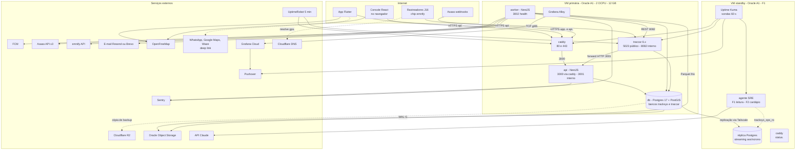
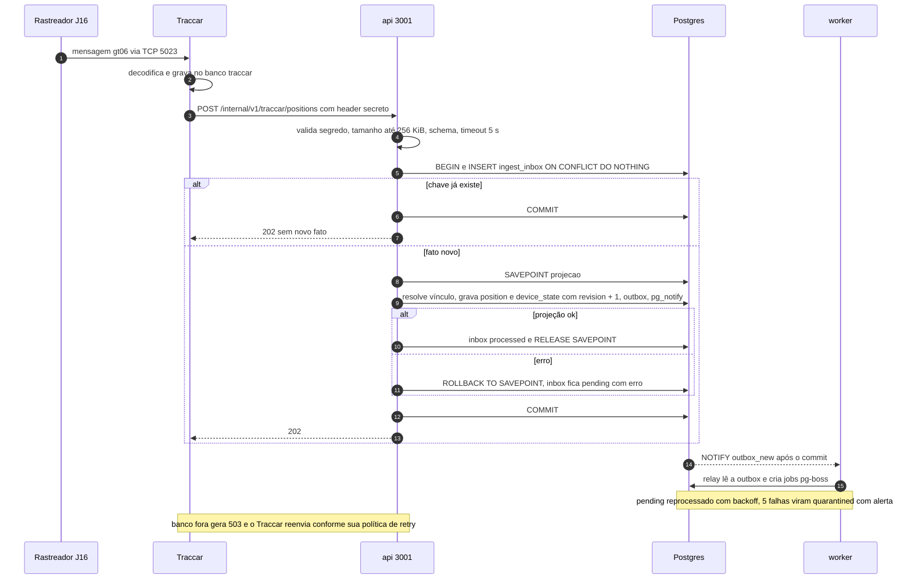
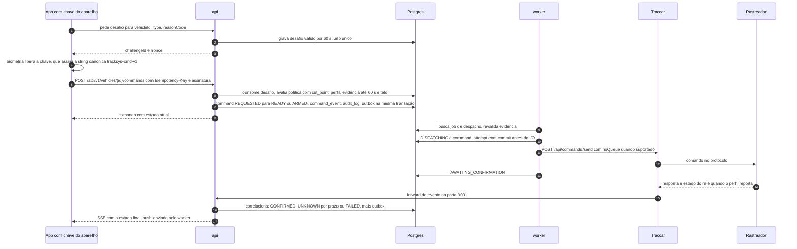

# 03 — Arquitetura

> **Resumo:** A TrackSys é um monólito modular TypeScript em dois processos (`api` e `worker`) sobre um único PostgreSQL 17 + PostGIS, que faz papel de banco, fila e barramento. O Traccar é a borda de protocolos e fala com a TrackSys só por HTTP interno. Tudo cabe numa VM Oracle Always Free de 12 GB; uma segunda VM entra como standby no F1. Este capítulo fixa componentes, fluxos, fronteiras de confiança, orçamento de recursos, estrutura do monorepo e os gatilhos numéricos que autorizam mudar a arquitetura.
> **Fases:** F0, F1, F2  ·  **Status:** Aprovado para execução
> **Muda em relação à v1.1:**
> - RabbitMQ, Redis e Timescale saem: Postgres único é banco, fila (pg-boss) e barramento (outbox + LISTEN/NOTIFY).
> - Dez serviços viram dois processos de um monólito modular; WebSocket vira SSE.
> - IdP OIDC externo vira Better Auth embutido; step-up de comando por chave do aparelho.
> - Infra concreta: 2 VMs Oracle Always Free, orçamento de RAM fechado, só 80/443 e a porta do protocolo expostas.
> - "Evolução condicionada a evidências" vira gatilhos numéricos (seção 14).

## 1. Princípios

1. **Uma fonte de verdade.** Todo estado durável (inbox, posições, estado atual, outbox, jobs, sessões) vive no cluster Postgres e entra no mesmo backup e na mesma réplica.
2. **Poucas peças.** Cinco contêineres na VM primária: `caddy`, `traccar`, `api`, `worker`, `db`. Peça nova só quando um gatilho da seção 14 disparar.
3. **Efeito externo só depois do commit**, sempre executado pelo `worker` (push, comando, SMS, cobrança, e-mail).
4. **O banco garante o isolamento** (INV-07); a aplicação é a segunda linha ([ADR-004](../adr/ADR-004-isolamento-tres-niveis.md)).
5. **Contrato primeiro.** Tipos de API e de eventos nascem em `packages/contracts` ([ADR-008](../adr/ADR-008-contrato-primeiro-zod-openapi-sse.md)).
6. **Falha visível.** Todo processo tem health, toda fila tem idade medida, todo modo degradado tem comportamento definido (seção 9).

## 2. Diagrama de componentes



Tracejado: chamada iniciada no aparelho do usuário, resolução de DNS ou cópia assíncrona. No F0 não há standby: a sonda externa é o UptimeRobot e o RTO é ≤ 2 h. O console é um build estático servido pelo `caddy` em `app.`; não existe processo de servidor do console.

## 3. Componentes: responsabilidade e limites

| Componente | Responsabilidade | Não deve |
|---|---|---|
| `caddy` | TLS automático e HTTP/2 para `api.` e `app.`; proxy `api.` → `api:3000`; serve o build de `apps/console`; redireciona 80 → 443 | Rotear `/internal/*`; tocar no TCP dos rastreadores; ter regra de negócio |
| `traccar` | Sessões TCP; decodificação gt06; gravação no próprio banco `traccar`; forward de posições e eventos para `api:3001`; envio de comandos pedidos via REST | Conhecer operadora ou cliente; cadastrar IMEI desconhecido; expor 8082; ser lido ou escrito por SQL da TrackSys ([ADR-003](../adr/ADR-003-traccar-borda-de-protocolos.md)) |
| `api` | `/api/v1` (console, app, webhooks), autenticação Better Auth, autorização, SSE, `/internal/v1` com projeção síncrona, criação de comandos até READY/ARMED | Chamar serviço externo durante a requisição; consumir fila pg-boss; enviar push; chamar o Traccar |
| `worker` | Relay outbox → pg-boss; motor de alertas e entrega FCM; despachante de comandos; reprocessamento de inbox `pending`; sync Asaas; SMS emnify; e-mail; varredura de sem comunicação; provisionamento de dispositivo no Traccar; retenção (partições, Parquet) | Servir HTTP além do health; aceitar escrita de usuário; repetir bloqueio após UNKNOWN (INV-08) |
| `db` | Cluster único: banco `tracksys` (schemas `app`, `auth`, `pgboss`) e banco `traccar` (papel próprio, sem acesso ao `tracksys`); RLS | Porta pública; ser acessado pela aplicação como superusuário ou dono |
| VM standby | Réplica, Uptime Kuma, página `status.`, agente SRE; alvo de failover com imagens já baixadas | Aceitar escrita antes da promoção; rodar `traccar`, `api` ou `worker` antes do failover |
| Agente SRE | Diagnóstico (F1) e cardápio fechado de ações (F2) | Tudo que [ADR-010](../adr/ADR-010-operacao-assistida-por-ia.md) proíbe (INV-11) |

## 4. Módulos do monólito e donos de tabelas

| Módulo | Processo | Tabelas que escreve | Dono do fluxo |
|---|---|---|---|
| `identity` | api | `auth.*`, `membership`, `platform_support_grant`, `push_token`, `device_key` | [08](08-identidade-e-seguranca.md) |
| `fleet` | api; worker (provisiona no Traccar) | `operator`, `operator_brand`, `tenant`, `vehicle`, `device`, `sim_card`, `device_assignment`, `capability_profile` | [04](04-dominio-e-dados.md) |
| `ingestion` | api (síncrono); worker (`pending`) | `ingest_inbox`, `position`, `device_state` | [05](05-ingestao-e-telemetria.md) |
| `alerts` | worker (avaliação, entrega); api (reconhecimento, vigilância) | `alert`, `alert_delivery`, `watch_mode` | [07](07-alertas-e-tempo-real.md) |
| `commands` | api (pedido); worker (despacho) | `command`, `command_attempt`, `command_event`, `command_policy`, `occurrence` | [06](06-comandos-e-bloqueio.md) |
| `billing` | api (webhook); worker (sync) | `billing_account`, `billing_customer`, `invoice`, `platform_fee` | [12](12-cobranca-e-svas.md) |
| `sva` | api | `partner`, `referral`, `consent` | [12](12-cobranca-e-svas.md) |
| `support` | api | `ticket` | [10](10-apps-e-ux.md) |
| `compliance` | api, worker | `audit_log`, `access_log`, `legal_hold`, `share_link` | [08](08-identidade-e-seguranca.md) |
| `onboarding` | api, worker | `migration_wave`, `migration_item`, `import_job` | [11](11-onboarding-e-migracao.md) |
| `platform` | api, worker | `outbox` | este capítulo |

Regras: (1) módulo escreve só nas suas tabelas; lê as de outro módulo pelo serviço público dele; (2) `audit_log` e `outbox` são gravados por helpers de `packages/db`, chamados dentro da transação do módulo dono da mudança; (3) código de acesso a dados usado pelos dois processos (repositórios Kysely, aplicador de projeção, outbox, auditoria) vive em `packages/db`; adaptadores de serviços externos vivem só em `apps/worker`.

## 5. Ingestão síncrona com fallback

A projeção roda dentro da requisição do Traccar; o 202 sai só depois do commit. Se a projeção falhar, a inbox fica `pending` e o worker reprocessa. Normalização, janela de tempo, compactação e dedupe: [05](05-ingestao-e-telemetria.md).



## 6. Eventos de domínio e barramento

| Evento (outbox) | Produtor | Consumidores |
|---|---|---|
| `telemetry.position.accepted.v1` | `ingestion` (api; worker ao reprocessar `pending`) | F0: nenhum obrigatório. F1: linha do tempo de ocorrência (`commands`). F2: odômetro e revisões (`sva`) |
| `device.state.updated.v1` | `ingestion` | `alerts` (avaliação de regras e encerramento de sem comunicação) |
| `alert.opened.v1` | `alerts` (worker) | `alerts` (entrega FCM); api (SSE para quem tem o veículo no escopo) |
| `alert.closed.v1` | `alerts` (worker) | api (SSE); `alerts` (push de encerramento quando a regra pedir, 07) |
| `command.state.changed.v1` | `commands` (api até READY/ARMED/REJECTED/CANCELLED; worker do DISPATCHING em diante) | `commands` (despacho quando READY); api (SSE ao solicitante); `alerts` (push do resultado ao titular) |
| `billing.payment.updated.v1` | `billing` (api no webhook; worker no sync) | `billing` (status comercial, `platform_fee`); `alerts` (push de fatura). Nunca `commands` (INV-09) |
| `referral.created.v1` | `sva` (api) | `sva` (relatório mensal; aviso ao parceiro no F2) |

Regras do barramento ([ADR-002](../adr/ADR-002-postgres-unico-fila-barramento.md)):
1. O evento é gravado em `app.outbox` na mesma transação da mudança. O payload segue o schema de `packages/contracts` (camelCase, versão no nome do tipo).
2. A transação chama `pg_notify('outbox_new', <id>)`. O relay do worker escuta `outbox_new` e também varre a outbox a cada 5 s (NOTIFY sem ouvinte se perde).
3. O relay lê lotes de até 500 linhas por `id` com `FOR UPDATE SKIP LOCKED`, cria um job por par (evento, consumidor) numa fila própria do consumidor e marca `published_at`.
4. Entrega é pelo menos uma vez. Cada consumidor é idempotente pela chave do efeito (`episode_key`, `delivery_key`, `command_attempt`).
5. Job carrega só ids e escopo (`eventId`, `type`, `operatorId`, `tenantId`, `entityId`); o consumidor relê o estado sob RLS.
6. Replay e reprocessamento de quarentena rodam em modo sem efeito externo (INV-05).

## 7. Tempo real (SSE + LISTEN/NOTIFY)

1. A projeção chama `pg_notify('device_state', '{"d":"<deviceId>","r":<revision>,"o":"<operatorId>","t":"<tenantId>"}')` na mesma transação. Payload com ids e revisão, sem coordenadas, abaixo de 200 bytes (limite do Postgres: 8.000 bytes).
2. Cada processo `api` mantém uma conexão dedicada com `LISTEN device_state`, fora do pool.
3. O `api` guarda as conexões SSE abertas indexadas por `operatorId` e escopo (operadora inteira ou lista de tenants), calculado no connect a partir da membership.
4. Ao receber o NOTIFY, o `api` coalesce notificações do mesmo dispositivo por 250 ms, lê o snapshot de `device_state` com o contexto RLS da conexão e envia `event: vehicle.state`, `id: <revision>`.
5. Revisão é por dispositivo. `Last-Event-ID` sinaliza reconexão, não é cursor global: a reconexão sempre recebe o snapshot de todo o escopo, e o cliente descarta revisão menor ou igual à exibida (INV-04).
6. Caddy faz flush imediato de `text/event-stream`; HTTP/2 elimina o limite de 6 conexões por domínio. O servidor envia comentário de keep-alive a cada 15 s.
7. SSE não passa pelo pg-boss. Contrato dos eventos SSE e regras de revogação de sessão: [07](07-alertas-e-tempo-real.md) e [09](09-api-e-contratos.md).

## 8. Sequência de comando

Política, estados e assimetria bloqueio/desbloqueio: [06](06-comandos-e-bloqueio.md). Chave do aparelho: [ADR-006](../adr/ADR-006-identidade-better-auth-chave-aparelho.md).



## 9. Modos degradados

| Falha | Efeito | Comportamento exigido |
|---|---|---|
| `db` fora | Sem custódia | `/internal/v1` responde 503 e o Traccar reenvia; `/api/v1` responde 503 Problem Details; nenhum comando aceito |
| `worker` fora | Projeção continua; alertas, push e despacho param | Comando fica READY/ARMED até o TTL e expira; atraso de alerta conta como minuto ruim; contêiner reiniciado (REQ-ARQ-005) |
| `api` fora | Forward do Traccar falha | Traccar mantém 7 dias de posições; backfill pela API do Traccar sem efeito externo (INV-05, [05](05-ingestao-e-telemetria.md)) |
| `traccar` fora | Todos os veículos perdem contato | Alerta de plataforma ao fundador; "sem comunicação" por veículo suprimido quando > 50% dos dispositivos ativos perdem contato em 5 min [PREMISSA; regra em [07](07-alertas-e-tempo-real.md)] |
| FCM fora | Push não sai | `alert_delivery` com retentativa e backoff; SSE segue |
| Asaas fora | Sync e webhooks atrasam | Sync periódico reconcilia; nada físico (INV-09) |
| emnify fora ou DEC-01 negada | Sem SMS automático | SMS manual pelo portal ([06](06-comandos-e-bloqueio.md), [Anexo C](../anexos/C-operacional.md)) |
| OpenFreeMap fora | Mapa sem tiles | App mostra posição, endereço em cache e botão de navegação; fallback PMTiles (DEC-11) |
| VM primária fora | Tudo | F0: reconstrução por `infra/scripts/provision.sh` + restore em ≤ 2 h. F1: failover para a standby em ≤ 30 min (REQ-ARQ-016) |

## 10. Fronteiras de confiança e portas

| Fronteira | Quem cruza | Controles obrigatórios |
|---|---|---|
| Internet → `caddy` 443 | App, console, webhooks Asaas | TLS do Caddy, HSTS, sessão Better Auth por requisição, limite de taxa na api ([08](08-identidade-e-seguranca.md)), token de webhook ([12](12-cobranca-e-svas.md)) |
| Internet → `traccar` 5023 | Rastreadores | Protocolo sem TLS [VALIDAR — DEC-02]; IMEI não é segredo; IMEI desconhecido rejeitado (registro automático do Traccar desligado [VALIDAR]) |
| `traccar` → `api` 3001 | Posições e eventos decodificados | Rede Docker; segredo ≥ 32 bytes em header, comparação em tempo constante; tenant resolvido no servidor, nunca lido do payload |
| `api`/`worker` → `db` | Consultas | Papéis sem BYPASSRLS e sem posse; contexto por transação; RLS FORCE |
| `worker` → `traccar` 8082 | Comandos e cadastro | Usuário de serviço dedicado no Traccar; credencial em variável de ambiente |
| `worker` → externos | FCM, Asaas, emnify, e-mail, object storage, API Claude | TLS; credencial por integração; chave Asaas da operadora cifrada ([08](08-identidade-e-seguranca.md)) |
| Humano, CI, agente → VMs | SSH, túnel para 8082, replicação | Tailscale com ACL por tag (`tag:prod`, `tag:standby`, `tag:ci`); CI entra com chave efêmera; agente SRE só por forced-command (ADR-010) |
| VM → backups | WAL-G, Parquet | Credencial S3 restrita ao bucket; cifra no cliente ([13](13-infra-e-operacao.md)) |

| Porta | Serviço | Exposição |
|---|---|---|
| 80/tcp | `caddy` | Pública: só redirecionamento 301 e desafio ACME |
| 443/tcp | `caddy` | Pública: `api.`, `app.` (primária); `status.` (standby) |
| 5023/tcp | `traccar` gt06 | Pública [VALIDAR — DEC-02]; cada protocolo homologado abre só a sua porta |
| 22/tcp | SSH do host | Só interface `tailscale0`; chave Ed25519; sem senha |
| 5432/tcp | `db` | Rede Docker; na primária, também publicada só no IP Tailscale para a réplica |
| 8082/tcp | `traccar` web/API | Só rede Docker; acesso humano por túnel SSH |
| 3000, 3001/tcp | `api` público e interno | Só rede Docker, sem publicação no host |
| 3002/tcp | `worker` health | Só rede Docker |

O Docker publica portas por regras próprias de iptables, por cima do firewall do host. Por isso a security list da OCI é a camada que vale, e o `infra/docker-compose.yml` publica só 80, 443 e 5023, além da 5432 restrita ao IP Tailscale. Spoofing de IMEI pela porta pública não autoriza bloqueio (INV-08); detecção de anomalia em [05](05-ingestao-e-telemetria.md) e [08](08-identidade-e-seguranca.md).

## 11. Orçamento de recursos (VM de 12 GB, 2 OCPU Ampere)

| Contêiner | `mem_limit` | Configuração inicial | CPU |
|---|---|---|---|
| `db` | 5 GB | `shared_buffers=1280MB`, `effective_cache_size=3GB`, `work_mem=16MB`, `maintenance_work_mem=256MB`, `max_connections=100` | Sem limite |
| `traccar` | 1,5 GB | JVM `-Xmx1g` | Sem limite |
| `api` | 1 GB | `NODE_OPTIONS=--max-old-space-size=768` | `cpus: 1.5` |
| `worker` | 1 GB | `--max-old-space-size=512`; DuckDB `memory_limit=256MB`, `threads=1` | `cpus: 1.0` |
| `caddy` | 128 MB | — | `cpus: 0.5` |
| Folga | ~3 GB | 12 GB − 8,6 GB alocados ≈ 3,4 GB: ~1 GB para SO, Docker, Alloy e Tailscale; ~2,4 GB de page cache e picos | — |

CPU: no pior caso (100 msg/s) a ingestão consome ≤ 1 núcleo entre `api` e `db` [PREMISSA; medir com CT-ARQ-012]; o limite de CPU do `worker` impede que retenção, export Parquet e sync Asaas disputem com a ingestão. A standby roda réplica (5 GB), Kuma, `caddy` e agente; após a promoção recebe o mesmo orçamento da primária.

| Conexões ao banco | Pool máximo |
|---|---|
| `api` como `tracksys_app` / `tracksys_ingest` | 20 / 10 |
| `api` pg-boss só envio | 2 |
| `worker` como `tracksys_app` / `tracksys_ingest` | 10 / 4 |
| `worker` pg-boss | 10 |
| LISTEN (1 por processo) | 2 |
| `traccar` | 10 |
| Replicação + WAL-G | 2 |
| Reserva admin e migration | 5 |
| **Total** | **75 de 100** |

Sem PgBouncer no F0–F1. No mês 12 a outbox e os jobs somam ~2,5 milhões de linhas por dia; retenção curta de ambos é obrigatória ([04](04-dominio-e-dados.md)).

## 12. Monorepo e regras de dependência

```text
/
├── AGENTS.md  CLAUDE.md  README.md
├── package.json            # scripts raiz; "packageManager": "pnpm@10.x"
├── pnpm-workspace.yaml     # apps/api, apps/worker, apps/console, packages/*
├── .nvmrc                  # 24
├── biome.json  tsconfig.base.json  .env.example
├── .github/workflows/
├── apps/
│   ├── api/                # @tracksys/api — NestJS 11 (Fastify): /api/v1, /internal/v1, webhooks
│   ├── worker/             # @tracksys/worker — NestJS standalone: pg-boss, alertas, comandos, Asaas, retenção
│   ├── console/            # @tracksys/console — React 19 + Vite
│   └── mobile/             # Flutter (fora do workspace pnpm)
├── packages/
│   ├── contracts/          # @tracksys/contracts — Zod 4, OpenAPI 3.1, clientes TS e Dart gerados
│   ├── db/                 # @tracksys/db — migrations em packages/db/migrations, tipos Kysely, contexto RLS, verificador de catálogo
│   ├── domain/             # @tracksys/domain — lógica pura: normalização, regras de alerta, política de comando, máquina de estados
│   └── testkit/            # @tracksys/testkit — fixtures, capturas J16, fakes de Traccar/Asaas/FCM/emnify
├── infra/
│   ├── docker-compose.yml
│   ├── db/Dockerfile       # FROM postgres:17 + postgresql-17-postgis-3
│   ├── caddy/  traccar/
│   └── scripts/            # provision.sh, deploy.sh, backup, failover
├── docs/spec/  docs/adr/  docs/anexos/  docs/runbooks/
├── tasks/                  # T-NNN
└── tests/acceptance/T-NNN/ # aceite congelado por tarefa
```

| Pacote | Pode depender de | Não pode depender de |
|---|---|---|
| `packages/contracts` | `zod` | Qualquer `@tracksys/*`; IO |
| `packages/domain` | `@tracksys/contracts`, `zod` | `node:*`, `pg`, `kysely`, `@nestjs/*`, `fetch`, `process`; relógio e aleatório entram por parâmetro |
| `packages/db` | `kysely`, `pg`, `@tracksys/contracts`, `@tracksys/domain` | `apps/*`, `@nestjs/*` |
| `packages/testkit` | Todos os `packages/*` | `apps/*`; só como `devDependency` |
| `apps/api`, `apps/worker` | `contracts`, `db`, `domain`; `testkit` em dev | Um ao outro; `apps/console` |
| `apps/console` | `contracts` (cliente TS gerado), `domain` | `db`, `apps/api`, `apps/worker` |
| `apps/mobile` | Cliente Dart gerado em `packages/contracts` | — |

Verificação: pnpm isola `node_modules`, então importar pacote não declarado falha no typecheck; o Biome aplica `noNodejsModules` e `noRestrictedImports` em `packages/domain`; o CI falha se `packages/domain/package.json` declarar dependência fora da tabela.

## 13. Configuração

Toda configuração vem de variáveis de ambiente validadas por Zod no boot (REQ-ARQ-006). Nomes em `SCREAMING_SNAKE_CASE`, prefixo por integração (`TRACCAR_`, `ASAAS_`, `EMNIFY_`, `FCM_`, `S3_`); [12](12-cobranca-e-svas.md) e [13](13-infra-e-operacao.md) acrescentam as suas na mesma regra.

| Variável | Processo | Regra |
|---|---|---|
| `NODE_ENV` | api, worker | `development`, `test` ou `production` |
| `TRACKSYS_DOMAIN` / `TRACKSYS_VERSION` | api, worker | Hostname (ex.: `tracksys.com.br` até DEC-04) / tag da imagem |
| `LOG_LEVEL` | api, worker | `fatal`…`debug`, padrão `info` |
| `DATABASE_URL_APP` / `DATABASE_URL_INGEST` | api, worker | URL Postgres com usuário `tracksys_app` / `tracksys_ingest` |
| `API_PORT` / `INTERNAL_PORT` | api | Inteiros, padrão 3000 / 3001, diferentes |
| `WORKER_HEALTH_PORT` | worker | Inteiro, padrão 3002 |
| `INGEST_SHARED_SECRET` | api | ≥ 32 caracteres |
| `INGEST_SOURCE_INSTANCE` | api, worker | `^traccar-[a-z0-9-]+$`, ex.: `traccar-01` |
| `TRACCAR_API_URL`, `TRACCAR_API_USER`, `TRACCAR_API_PASSWORD` | worker | URL (padrão `http://traccar:8082`); não vazios |
| `BETTER_AUTH_SECRET` / `BETTER_AUTH_URL` | api | ≥ 32 caracteres / `https://api.<TRACKSYS_DOMAIN>` |
| `SENTRY_DSN` | api, worker | URL, opcional |

## 14. Gatilhos objetivos de evolução

| Gatilho ([ADR-002](../adr/ADR-002-postgres-unico-fila-barramento.md)) | Limiar | Medição |
|---|---|---|
| Fila dedicada (RabbitMQ ou NATS) | Ingestão sustentada > **300 msg/s** por 1 h, ou lag da fila > 60 s recorrente | Taxa de POST interno; idade do job mais antigo por fila |
| Redis | p95 de leitura do estado atual > **100 ms** sob carga | Histograma das rotas de estado atual e mapa |
| Compressão/columnar (Timescale ou Citus) | Posições quentes > **150 GB** | Soma de `pg_total_relation_size` das partições de `position` |
| Traccar em múltiplas instâncias (por porta ou operadora) | > **~20.000** dispositivos conectados ou CPU do Traccar > **70%** sustentado | Sessões ativas; CPU do contêiner |

Recorrente = 3 ou mais episódios em 7 dias; sustentado = média de 1 h [PREMISSA]. Gatilhos operacionais complementares: disco do volume > 70%; memória do `db` > 90% do limite por 1 h; CPU da VM > 70% (média de 1 h) em 3 de 7 dias. O volume tem 100 GB (DEC-12), então o gatilho de disco dispara muito antes dos 150 GB quentes e força sair do Always Free (volume pago ou VM maior) dentro da meta de infra ≤ 10% da receita. Disparo de gatilho abre ADR nova; não autoriza mudança direta.

## 15. Por que esta arquitetura serve ao fundador solo

| Aspecto | v1.1 | v2.0 |
|---|---|---|
| Componentes com estado | Postgres/Timescale, RabbitMQ, Redis, IdP, Traccar | Um cluster Postgres (bancos `tracksys` e `traccar`) |
| Processos da aplicação | ~10 serviços | 2 (`api`, `worker`) |
| Backups e restores a ensaiar | Banco, broker, IdP | 1 (WAL-G do cluster) |
| Runbooks de componente | Um por peça | Banco, Traccar e failover da VM; o resto reinicia sem procedimento |
| Infra no F0–F1 | Não estimada | R$ 0 (Always Free) |

Menos peças significa menos runbooks para o fundador e para o plantonista, um único padrão para os agentes de IA repetirem e menos superfície de revisão N0. O custo aceito: o Postgres concentra o risco, compensado por standby, WAL contínuo (RPO ≤ 5 min) e restore ensaiado ([13](13-infra-e-operacao.md)).

## 16. Requisitos

### REQ-ARQ-001 — Dois processos do mesmo artefato
**Fase:** F0 · **Prioridade:** P0 · **Risco:** N1 · **Invariantes:** —
**Regra.** `apps/api` e `apps/worker` DEVEM rodar em processos e contêineres distintos, construídos da mesma tag (`TRACKSYS_VERSION`) e implantados juntos. O `api` NÃO DEVE consumir filas pg-boss (PODE enfileirar). O `worker` NÃO DEVE abrir porta HTTP além de `WORKER_HEALTH_PORT`.
**Aceite.** CT-ARQ-001 — Dado a stack F0 no ar com o `worker` parado, Quando um job de teste `arq.probe` é enfileirado, Então após 30 s ele continua no estado `created`; Quando o `worker` sobe, Então o job conclui em ≤ 10 s; e `docker inspect` mostra a mesma tag nos dois contêineres.

### REQ-ARQ-002 — Rotas internas fora da borda pública
**Fase:** F0 · **Prioridade:** P0 · **Risco:** N0 · **Invariantes:** INV-07
**Regra.** As rotas `/internal/v1` DEVEM existir só no listener `INTERNAL_PORT` (3001), sem porta publicada no host e sem rota no Caddy. O listener público (3000) DEVE responder 404 para `/internal/*`. Requisição interna sem o header secreto ([05](05-ingestao-e-telemetria.md)) DEVE receber 401 sem gravar nada.
**Aceite.** CT-ARQ-002 — Dado a stack F0, Quando `curl -X POST https://api.tracksys.com.br/internal/v1/traccar/positions` roda de fora da VM, Então a resposta é 404; Quando o mesmo POST parte do contêiner `traccar` para `http://api:3001/internal/v1/traccar/positions` sem o header, Então a resposta é 401 em ≤ 100 ms e `ingest_inbox` não ganha linha; com o header e payload válido, Então a resposta é 202.

### REQ-ARQ-003 — Superfície pública mínima
**Fase:** F0 · **Prioridade:** P0 · **Risco:** N0 · **Invariantes:** —
**Regra.** A interface pública de cada VM DEVE aceitar só 80/tcp, 443/tcp e as portas TCP dos protocolos homologados (F0: 5023 [VALIDAR — DEC-02]), na security list da OCI e no firewall do host. SSH DEVE escutar só em `tailscale0`.
**Aceite.** CT-ARQ-003 — Dado a VM primária provisionada por `infra/scripts/provision.sh`, Quando `nmap -Pn -p 1-65535 <IP público>` roda de um host externo, Então só 80, 443 e 5023 aparecem abertas; `ssh ubuntu@<IP público>` expira em 10 s; `ssh ubuntu@<nome Tailscale>` conecta.

### REQ-ARQ-004 — Banco sem porta pública e papéis mínimos
**Fase:** F0 · **Prioridade:** P0 · **Risco:** N0 · **Invariantes:** INV-07
**Regra.** O Postgres NÃO DEVE escutar em interface pública. `api` e `worker` DEVEM conectar como `tracksys_app` e `tracksys_ingest` (NOBYPASSRLS, não donos); `tracksys_owner` só no passo de migration do deploy. O `pg_hba.conf` DEVE exigir `scram-sha-256` e aceitar só a rede Docker e o IP Tailscale da standby (papel de replicação).
**Aceite.** CT-ARQ-004 — Dado a stack no ar, Quando `psql "host=<IP público> port=5432 user=postgres"` roda de fora, Então a conexão expira; Quando o `api` executa `SELECT current_user, rolbypassrls FROM pg_roles WHERE rolname = current_user`, Então o resultado é `tracksys_app | false`; Quando o `api` executa `CREATE TABLE app.x (id int)`, Então recebe SQLSTATE 42501.

### REQ-ARQ-005 — Health e readiness por processo
**Fase:** F0 · **Prioridade:** P0 · **Risco:** N1 · **Invariantes:** —
**Regra.** `api` e `worker` DEVEM expor `GET /health/live` (200 sem checar dependências, ≤ 50 ms) e `GET /health/ready` (200 só se o banco responde `SELECT 1` em ≤ 1 s; no `worker`, também pg-boss iniciado e LISTEN do relay ativo; senão 503 com a lista de checagens falhas). Em `https://api.<domínio>/health/ready` o corpo DEVE ser só `{"status":"ok"}` ou `{"status":"unavailable"}`. Healthcheck do Docker a cada 10 s, 3 falhas; contêiner `unhealthy` DEVE ser reiniciado em ≤ 90 s (mecanismo em [13](13-infra-e-operacao.md)).
**Aceite.** CT-ARQ-005 — Dado a stack no ar, Quando o contêiner `db` é parado, Então em ≤ 5 s `/health/ready` do `api` e do `worker` responde 503 com `checks.db = "fail"` e `/health/live` responde 200; Quando o `db` volta, Então `/health/ready` volta a 200 em ≤ 15 s.

### REQ-ARQ-006 — Configuração por ambiente validada no boot
**Fase:** F0 · **Prioridade:** P0 · **Risco:** N1 · **Invariantes:** —
**Regra.** Cada processo DEVE ler configuração só de variáveis de ambiente, validadas por schema Zod em `apps/api/src/config/env.ts` e `apps/worker/src/config/env.ts` antes de abrir conexões. Falha DEVE encerrar o processo com código 78, citando só nomes de variáveis. `.env.example` DEVE listar todas as variáveis sem valores reais. Com `NODE_ENV=production`, URL de banco com usuário `postgres` ou `tracksys_owner` DEVE ser rejeitada.
**Aceite.** CT-ARQ-006 — Dado `DATABASE_URL_APP` ausente, Quando `node apps/api/dist/main.js` inicia, Então sai com código 78 em ≤ 2 s e o stderr cita `DATABASE_URL_APP`; Dado `INGEST_SHARED_SECRET` com 16 caracteres, Então sai com 78 e o stderr não contém o valor; Dado `NODE_ENV=production` e `DATABASE_URL_APP` com usuário `tracksys_owner`, Então sai com 78.

### REQ-ARQ-007 — Monorepo canônico com dependências verificadas
**Fase:** F0 · **Prioridade:** P0 · **Risco:** N1 · **Invariantes:** —
**Regra.** O repositório DEVE seguir a árvore da seção 12, com pacotes `@tracksys/*` e a matriz de dependência da seção 12. O CI DEVE falhar em qualquer violação.
**Aceite.** CT-ARQ-007 — Dado `packages/domain/src/probe.ts` com `import { readFile } from 'node:fs/promises'`, Quando `pnpm lint` roda, Então falha citando `noNodejsModules`; Dado `apps/worker/src/probe.ts` com `import '@tracksys/api'`, Quando `pnpm -r typecheck` roda, Então falha com TS2307.

### REQ-ARQ-008 — `api` sem I/O externo na requisição
**Fase:** F0 · **Prioridade:** P1 · **Risco:** N1 · **Invariantes:** —
**Regra.** Handlers do `api` DEVEM fazer I/O só com o Postgres. Chamadas a Traccar, Asaas, emnify, FCM, e-mail e API Claude DEVEM virar jobs executados pelo `worker`. Exceção: envio assíncrono de telemetria de observabilidade (Sentry, logs).
**Aceite.** CT-ARQ-008 — Dado o fake de e-mail do `packages/testkit` com latência de 10 s, Quando um usuário pede recuperação de senha, Então a resposta chega em ≤ 500 ms e existe um job de e-mail no estado `created`; e `apps/api/package.json` não declara `firebase-admin`.

### REQ-ARQ-009 — Outbox transacional e relay com varredura
**Fase:** F0 · **Prioridade:** P0 · **Risco:** N1 · **Invariantes:** INV-01, INV-05
**Regra.** Todo evento da seção 6 DEVE ser gravado em `app.outbox` na mesma transação da mudança de estado, com `pg_notify('outbox_new', <id>)`. O relay DEVE seguir as regras 2 a 4 da seção 6 e os consumidores DEVEM ser idempotentes.
**Aceite.** CT-ARQ-009 — Dado uma projeção com falha injetada após o INSERT na outbox, Quando o savepoint é desfeito, Então a outbox não tem a linha e nenhum job é criado; Dado o relay sem conexão LISTEN, Quando 10 eventos são gravados, Então os 10 viram jobs em ≤ 10 s; Dado o mesmo `alert.opened.v1` entregue 2 vezes ao consumidor de push, Então existe 1 `alert_delivery`.

### REQ-ARQ-010 — Job com ids e releitura sob RLS
**Fase:** F0 · **Prioridade:** P0 · **Risco:** N0 · **Invariantes:** INV-07
**Regra.** Payload de job DEVE conter só `eventId`, `type`, `operatorId`, `tenantId` e `entityId`. O consumidor DEVE abrir transação com o contexto RLS desses valores antes de qualquer leitura e NÃO DEVE consultar tabela de cliente sem contexto.
**Aceite.** CT-ARQ-010 — Dado um job com `operatorId` da operadora A e `entityId` de um veículo da operadora B, Quando o consumidor processa, Então a leitura retorna 0 linhas, o job termina `failed` com motivo `not_found_in_scope` e nenhum efeito externo é chamado nos fakes.

### REQ-ARQ-011 — SSE com filtro de escopo
**Fase:** F0 · **Prioridade:** P0 · **Risco:** N1 · **Invariantes:** INV-04, INV-07
**Regra.** O tempo real DEVE seguir a seção 7: NOTIFY `device_state` com ids e revisão, leitura do snapshot com o contexto RLS da conexão, `id` igual à revisão. Do commit da projeção ao frame SSE, p95 ≤ 2 s.
**Aceite.** CT-ARQ-011 — Dado dois clientes SSE, um da operadora A e outro da operadora B, Quando uma posição nova de um veículo de A é projetada com revisão 42, Então o cliente A recebe `vehicle.state` com `id: 42` em ≤ 2 s e o cliente B não recebe nenhum evento em 5 s.

### REQ-ARQ-012 — Limites de recurso e carga de pior caso
**Fase:** F0 · **Prioridade:** P1 · **Risco:** N1 · **Invariantes:** —
**Regra.** `infra/docker-compose.yml` DEVE declarar os limites da seção 11. A stack DEVE suportar 100 msg/s sem perda e sem OOM.
**Aceite.** CT-ARQ-012 — Dado a stack com os limites da seção 11, Quando o simulador do `packages/testkit` envia 100 msg/s (3.000 dispositivos a 30 s) por 15 min, Então o p95 do POST interno fica ≤ 500 ms, nenhum contêiner é encerrado por OOM, nenhuma resposta é 503 e 2 min após o fim não há inbox `pending`.

### REQ-ARQ-013 — Identidade da instância de origem
**Fase:** F0 · **Prioridade:** P1 · **Risco:** N1 · **Invariantes:** INV-01
**Regra.** `INGEST_SOURCE_INSTANCE` identifica o par instância Traccar + banco `traccar`. Ela DEVE mudar quando o banco `traccar` for recriado vazio (ids reiniciam); failover ou restore com o banco replicado mantém o valor. Fora de backfill, a ingestão DEVE pôr em quarentena e alertar quando `source_event_id` regredir mais de 10.000 abaixo do maior id visto para a instância. Presença de `position.id` no forward: [VALIDAR — DEC-02].
**Aceite.** CT-ARQ-013 — Dado a inbox com o fato (`traccar-01`, `position`, `938441`) e o banco `traccar` recriado, Quando chega a posição de id `1` com `INGEST_SOURCE_INSTANCE=traccar-01`, Então ela vai para quarentena e um alerta sai em ≤ 60 s; Quando o deploy usa `traccar-02`, Então a mesma posição é aceita como fato novo.

### REQ-ARQ-014 — Logs estruturados e correlação
**Fase:** F0 · **Prioridade:** P1 · **Risco:** N1 · **Invariantes:** —
**Regra.** `api` e `worker` DEVEM logar JSON em stdout com `ts`, `level`, `service`, `version`, `correlationId` e `msg`. O `correlationId` nasce na borda (header `X-Request-Id` se for UUID, senão gerado; na ingestão, o id da inbox) e segue para outbox, jobs e `audit_log.correlation_id`. Logs NÃO DEVEM conter coordenadas, tokens, senhas, segredos, payload bruto do Traccar ou chave Asaas.
**Aceite.** CT-ARQ-014 — Dado uma posição que abre alerta de ignição ligada, Quando o push é enviado ao fake de FCM, Então as linhas de log desse fluxo no `api` e no `worker` têm o mesmo `correlationId` e nenhuma contém `latitude`, `longitude`, `lat_e7`, `lon_e7` ou o valor de `INGEST_SHARED_SECRET`.

### REQ-ARQ-015 — Gatilhos de evolução medidos
**Fase:** F1 · **Prioridade:** P1 · **Risco:** N1 · **Invariantes:** —
**Regra.** Cada gatilho da seção 14 DEVE ter métrica no Grafana Cloud e aviso ao atingir 80% do limiar. O aviso NÃO DEVE gerar page.
**Aceite.** CT-ARQ-015 — Dado a métrica de ingestão em 250 msg/s sustentada por 1 h no ambiente de teste, Então o Grafana Cloud registra o aviso "ADR-002 fila dedicada: 83% do gatilho" e o Pushover não recebe page.

### REQ-ARQ-016 — Promoção ou restore sem reenvio físico
**Fase:** F1 · **Prioridade:** P0 · **Risco:** N0 · **Invariantes:** INV-05, INV-08
**Regra.** Depois de failover ou restore, o `worker` DEVE subir com despacho de comandos desligado [NOVA DECISÃO PROPOSTA: variável `COMMAND_DISPATCH_ENABLED=false` ligada pelo script de failover só após a reconciliação]. A reconciliação DEVE levar todo comando em DISPATCHING ou AWAITING_CONFIRMATION para UNKNOWN com motivo `failover` e descartar jobs de despacho anteriores à promoção. Nenhum bloqueio é reenviado automaticamente; desbloqueios seguem a política de [06](06-comandos-e-bloqueio.md) após a reconciliação.
**Aceite.** CT-ARQ-016 — Dado um bloqueio em AWAITING_CONFIRMATION na primária, Quando a standby é promovida, Então em ≤ 60 s após o `worker` subir o comando está UNKNOWN com motivo `failover`, `command_event` registra a transição com ator `system` e o fake de Traccar não recebe `POST /api/commands/send` para ele.
