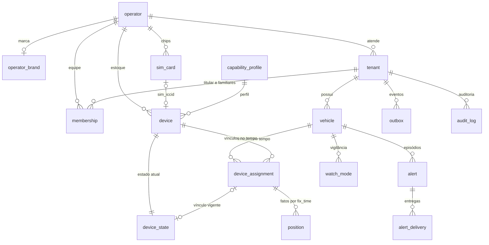

# 04 — Domínio e dados

> **Resumo:** Modelo de dados da TrackSys no schema `app` do PostgreSQL 17: hierarquia plataforma → operadora → cliente, DDL de referência das tabelas do F0, isolamento por RLS forçada com FK composta e contexto por transação, verificador de catálogo no CI, partições diárias de posição, compactação de parado, retenção quente/frio em Parquet e ciclo de vida (transferência, encerramento, anonimização). Todo SQL de bloco `-- F0 ·` foi executado em PostgreSQL 17.11 sobre a migration da [T-001](../../tasks/T-001-fundacao-monorepo-e-isolamento.md), com CAT-01..CAT-06 sem violação.
> **Fases:** F0, F1, F2  ·  **Status:** Aprovado para execução
> **Muda em relação à v1.1:**
> - Isolamento em 3 níveis: `operator_id` + `tenant_id` em toda linha de cliente; contexto com escopo `operator` ou lista de tenants, sem subconsulta por tenant na central.
> - Timescale sai: partição nativa diária por `fix_time`, linha compacta (`lat_e7`, `speed_kmh_x10`), sem partição default, frio em Parquet com DuckDB.
> - Vínculo ganha `is_primary` e `cut_point`; o EXCLUDE por rastreador não leva `tenant_id` (a v1.1 permitia o mesmo rastreador em dois clientes ao mesmo tempo).
> - Verificador de catálogo CAT-01..CAT-06 no CI e lista fechada de funções `SECURITY DEFINER`.

## 1. Hierarquia e convenções

| Nível | Linha no banco | Quem | Contexto RLS | Enxerga |
|---|---|---|---|---|
| Plataforma | nenhuma (papéis de banco; `capability_profile`, `ingest_inbox`) | Versix (`platform_admin`) | nenhum; dados de operadora só com `platform_support_grant` (seção 4.5) | catálogo de perfis, métricas agregadas |
| Operadora | `operator` | Lider (`operator_admin`, `operator_agent`, `installer`, `search_team`) | `scope = 'operator'` + `operator_id` | todos os clientes da própria operadora |
| Cliente | `tenant` | titular PF (`tenant_owner`) e familiares (`tenant_member`) | `scope = 'tenant'` + `operator_id` + `tenant_ids` | só os próprios veículos |

Regras:
1. Toda tabela de cliente tem `operator_id` e `tenant_id` NOT NULL, imutáveis (gatilho `app.tg_immutable_columns`) e FK composta para `tenant`/`vehicle`. Exceções de `tenant_id` anulável só em `nullableTenantId` (seção 5.1).
2. Toda tabela de operadora tem `operator_id` NOT NULL com FK para `app.operator (id)` e `UNIQUE (operator_id, id)` quando é referenciada.
3. Tabela de plataforma não tem `operator_id`; o acesso é por papel de banco (tipo F, seção 4.2).
4. Ids `uuid DEFAULT gen_random_uuid()`; a aplicação PODE gerar UUIDv7 (recomendado em `ingest_inbox` e `alert`). Colunas em snake_case; JSON da API e dos eventos em camelCase, convertido na fronteira.
5. Tempo em `timestamptz`, servidor com `timezone = 'UTC'`. Unidades no nome (INV-12): `_m`, `_s`, `_kmh_x10` (décimos de km/h), `_e7` (graus × 10⁷), `_cents` (`bigint`, centavos de BRL).
6. Enumeração é `text` + `CHECK`, nunca `CREATE TYPE`: ampliar valor é trocar o CHECK numa migration expand (seção 10).
7. A aplicação não apaga linhas: desativação por `status`, `archived_at` ou `valid_to`. Exceções: `push_token` (logout) e expurgos de retenção pelas funções da seção 4.4.
8. Rastreador de bancada fica numa operadora própria ("Versix Bancada"), nunca dentro da operadora real.

Contexto derivado da membership (implementação da requisição em [08](08-identidade-e-seguranca.md)):

| Memberships ativas do usuário na operadora X | Contexto da transação |
|---|---|
| Pelo menos uma com `tenant_id` NULL (equipe) | `{ scope: 'operator', operatorId: X }` |
| Só `tenant_owner`/`tenant_member` | `{ scope: 'tenant', operatorId: X, tenantIds: [tenants dessas memberships] }` |
| Nenhuma | sem acesso; a API responde 404 |

O banco não distingue papéis dentro do escopo: limitar `installer` ou `search_team` a parte da carteira é regra da aplicação ([08](08-identidade-e-seguranca.md)).

## 2. Diagrama ER do núcleo



Fora do diagrama: `ingest_inbox` (plataforma, sem FK), `push_token` e `device_key` (usuário, FK para `auth."user"`), `access_log` (plataforma).

## 3. DDL de referência do F0

Os blocos `-- F0 · 1/9` a `9/9`, nesta ordem e depois da migration da T-001, formam a migration de referência do F0; cada tarefa copia a parte das suas tabelas.

### 3.1 Tabelas da T-001

DDL exata: migration `20261007120000_fundacao_isolamento.sql` no cartão [T-001](../../tasks/T-001-fundacao-monorepo-e-isolamento.md). Resumo:

| Tabela | Tipo RLS | Chaves e restrições | Políticas |
|---|---|---|---|
| `operator` | D (raiz) | PK `id`; `document` com 11 ou 14 dígitos; `status` em `active`, `suspended`, `closed` | `operator_staff_all`, `operator_tenant_read` |
| `operator_brand` | C | PK `operator_id` → `operator`; cores `#RRGGBB`; WhatsApp e telefone E.164; logo `https://` | `operator_brand_staff_all`, `operator_brand_tenant_read` |
| `tenant` | C | `UNIQUE (operator_id, id)`; `kind` em `person`, `company`; `status` em `active`, `suspended_commercial`, `closed` | `tenant_staff_all`, `tenant_self_read` |
| `vehicle` | A | FK `(operator_id, tenant_id)` → `tenant`; `UNIQUE (operator_id, tenant_id, id)`; placa `^[A-Z]{3}[0-9][A-Z0-9][0-9]{2}$`, única por operadora entre não arquivados | `vehicle_isolation` |

[ADOTADO NA v2.0] `tenant.contact_phone` (E.164) e `tenant.contact_email` não existem no F0. Entram no F1 por migration expand (`ADD COLUMN ... NULL`) no cartão do importador ([11](11-onboarding-e-migracao.md) §3.2). Até lá, C03 e `POST /api/v1/tenants` não têm esses campos.

### 3.2 Gatilho de imutabilidade

A T-005 cria o gatilho e o aplica a `tenant` e `vehicle`. Toda tabela nova com colunas de escopo ou de vínculo o aplica. [ADOTADO NA v2.0] T-005 e T-006 correm em paralelo, e ambas usam a função. Por isso, as duas a criam com `CREATE OR REPLACE` e o mesmo corpo, e nenhum `migrate:down` a remove, para que a ordem de merge não importe. A mesma regra vale para as políticas compartilhadas `operator_definer_read` e `tenant_definer_read` (seção 4.4).

```sql
-- F0 · 1/9 auxiliares
CREATE OR REPLACE FUNCTION app.tg_immutable_columns() RETURNS trigger LANGUAGE plpgsql AS $$
DECLARE col text;
BEGIN
  FOREACH col IN ARRAY TG_ARGV LOOP
    IF to_jsonb(NEW) -> col IS DISTINCT FROM to_jsonb(OLD) -> col THEN
      RAISE EXCEPTION 'coluna %.% é imutável', TG_TABLE_NAME, col USING ERRCODE = 'integrity_constraint_violation';
    END IF;
  END LOOP;
  RETURN NEW;
END $$;
CREATE TRIGGER tenant_immutable BEFORE UPDATE ON app.tenant
  FOR EACH ROW EXECUTE FUNCTION app.tg_immutable_columns('operator_id');
CREATE TRIGGER vehicle_immutable BEFORE UPDATE ON app.vehicle
  FOR EACH ROW EXECUTE FUNCTION app.tg_immutable_columns('operator_id', 'tenant_id');
```

### 3.3 Frota

`capability_profile.capabilities` usa três valores por chave: `"yes"`, `"no"` ou `"unknown"` (INV-03), validados por Zod em `packages/contracts`. Perfil muda só por migration revisada como N0 (homologação com `evidence_ref`); perfil homologado não é editado, ganha nova `version`. Bloqueio exige `status = 'homologated'` e `relay = "yes"` (INV-10, [06](06-comandos-e-bloqueio.md)).

```sql
-- F0 · 2/9 frota
-- rls: F + G (plataforma; escrita do perfil por migration)
CREATE TABLE app.capability_profile (
  id uuid PRIMARY KEY DEFAULT gen_random_uuid(),
  model text NOT NULL, firmware_range text NOT NULL DEFAULT '*', protocol text NOT NULL,
  version integer NOT NULL CHECK (version >= 1),
  capabilities jsonb NOT NULL CHECK (jsonb_typeof(capabilities) = 'object' AND capabilities ?& ARRAY[
    'relay', 'relay_state_reported', 'ignition', 'power_cut_alarm', 'sos', 'accelerometer',
    'device_speed_gate', 'secondary_server', 'domain_support', 'sms_position', 'offline_buffer']),
  sms_templates_ref text NULL,
  status text NOT NULL DEFAULT 'draft' CHECK (status IN ('draft', 'homologated', 'suspended')),
  homologated_at timestamptz NULL, evidence_ref text NULL,
  created_at timestamptz NOT NULL DEFAULT now(),
  CONSTRAINT capability_profile_version_key UNIQUE (model, firmware_range, version),
  CONSTRAINT capability_profile_homologation_chk
    CHECK (status <> 'homologated' OR (homologated_at IS NOT NULL AND evidence_ref IS NOT NULL))
);
-- rls: C
CREATE TABLE app.sim_card (
  id uuid PRIMARY KEY DEFAULT gen_random_uuid(),
  operator_id uuid NOT NULL REFERENCES app.operator (id),
  iccid text NOT NULL CHECK (iccid ~ '^[0-9]{18,20}$'),
  provider text NOT NULL DEFAULT 'emnify' CHECK (provider IN ('emnify')),
  msisdn text NULL CHECK (msisdn ~ '^\+[1-9][0-9]{7,14}$'), apn text NULL CHECK (length(apn) <= 100),
  status text NOT NULL DEFAULT 'active' CHECK (status IN ('active', 'suspended', 'deactivated')),
  created_at timestamptz NOT NULL DEFAULT now(), updated_at timestamptz NOT NULL DEFAULT now(),
  CONSTRAINT sim_card_iccid_key UNIQUE (iccid),
  CONSTRAINT sim_card_operator_iccid_key UNIQUE (operator_id, iccid)
);
-- rls: C + G
CREATE TABLE app.device (
  id uuid PRIMARY KEY DEFAULT gen_random_uuid(),
  operator_id uuid NOT NULL REFERENCES app.operator (id),
  imei text NOT NULL CHECK (imei ~ '^[0-9]{15}$'),
  model text NOT NULL, firmware text NULL, protocol text NOT NULL,
  capability_profile_id uuid NULL REFERENCES app.capability_profile (id),
  sim_iccid text NULL,
  status text NOT NULL DEFAULT 'stock' CHECK (status IN ('stock', 'installed', 'maintenance', 'retired')),
  traccar_device_id bigint NULL,
  created_at timestamptz NOT NULL DEFAULT now(), updated_at timestamptz NOT NULL DEFAULT now(),
  CONSTRAINT device_operator_id_key UNIQUE (operator_id, id),
  CONSTRAINT device_sim_fk FOREIGN KEY (operator_id, sim_iccid) REFERENCES app.sim_card (operator_id, iccid)
);
CREATE UNIQUE INDEX device_imei_active_key ON app.device (imei) WHERE status <> 'retired';
CREATE UNIQUE INDEX device_sim_active_key ON app.device (sim_iccid) WHERE status <> 'retired';
-- rls: B
CREATE TABLE app.device_assignment (
  id uuid PRIMARY KEY DEFAULT gen_random_uuid(),
  operator_id uuid NOT NULL, tenant_id uuid NOT NULL, vehicle_id uuid NOT NULL, device_id uuid NOT NULL,
  cut_point text NULL CHECK (cut_point IN ('fuel_pump', 'ignition', 'starter')),
  is_primary boolean NOT NULL DEFAULT true,
  valid_from timestamptz NOT NULL DEFAULT now(), valid_to timestamptz NULL,
  installed_by uuid NULL, notes text NULL CHECK (length(notes) <= 2000),
  created_at timestamptz NOT NULL DEFAULT now(),
  CONSTRAINT device_assignment_period_chk CHECK (valid_to IS NULL OR valid_to > valid_from),
  CONSTRAINT device_assignment_vehicle_fk FOREIGN KEY (operator_id, tenant_id, vehicle_id)
    REFERENCES app.vehicle (operator_id, tenant_id, id),
  CONSTRAINT device_assignment_device_fk FOREIGN KEY (operator_id, device_id) REFERENCES app.device (operator_id, id),
  CONSTRAINT device_assignment_scope_key UNIQUE (operator_id, tenant_id, id),
  CONSTRAINT device_assignment_fact_key UNIQUE (operator_id, tenant_id, id, vehicle_id, device_id),
  CONSTRAINT device_assignment_device_excl
    EXCLUDE USING gist (device_id WITH =, tstzrange(valid_from, valid_to, '[)') WITH &&),
  CONSTRAINT device_assignment_primary_excl
    EXCLUDE USING gist (vehicle_id WITH =, tstzrange(valid_from, valid_to, '[)') WITH &&) WHERE (is_primary)
);
CREATE INDEX device_assignment_vehicle_idx ON app.device_assignment (operator_id, tenant_id, vehicle_id, valid_from DESC);
CREATE FUNCTION app.tg_device_assignment_close() RETURNS trigger LANGUAGE plpgsql AS $$
DECLARE last_fix timestamptz;
BEGIN
  IF OLD.valid_to IS NOT NULL AND (NEW.valid_to, NEW.cut_point) IS DISTINCT FROM (OLD.valid_to, OLD.cut_point) THEN
    RAISE EXCEPTION 'vínculo % já encerrado', OLD.id USING ERRCODE = 'integrity_constraint_violation';
  END IF;
  IF OLD.valid_to IS NULL AND NEW.valid_to IS NOT NULL THEN
    SELECT max(p.fix_time) INTO last_fix FROM app.position p
     WHERE p.assignment_id = NEW.id AND p.fix_time >= NEW.valid_to;
    IF last_fix IS NOT NULL THEN
      RAISE EXCEPTION 'valid_to anterior a posição já gravada (%)', last_fix USING ERRCODE = 'integrity_constraint_violation';
    END IF;
  END IF;
  RETURN NEW;
END $$;
CREATE TRIGGER device_assignment_immutable BEFORE UPDATE ON app.device_assignment FOR EACH ROW
  EXECUTE FUNCTION app.tg_immutable_columns('operator_id', 'tenant_id', 'vehicle_id', 'device_id', 'is_primary', 'valid_from');
CREATE TRIGGER device_assignment_close BEFORE UPDATE ON app.device_assignment FOR EACH ROW
  EXECUTE FUNCTION app.tg_device_assignment_close();
```

Regras de `device_assignment`: `cut_point` NULL = bloqueio indisponível (INV-10); `cut_point` muda só com o vínculo aberto; vínculo encerrado só aceita mudança em `notes`; `device_assignment_fact_key` existe para a FK de 5 colunas de `position` e `device_state`, que garante veículo e rastreador coerentes com o vínculo. `imei` e `iccid` são únicos na plataforma entre registros não aposentados; a API responde conflito sem revelar a outra operadora (REQ-DAD-022). Formatos: IMEI com 15 dígitos, igual ao `uniqueId` do Traccar no gt06 [VALIDAR — DEC-02]; ICCID com 18 a 20 dígitos [VALIDAR — planilha exportada da Lider].

### 3.4 Identidade

`user_id` referencia `auth."user" (id)` do Better Auth, configurado para ids UUID ([08](08-identidade-e-seguranca.md); opção de geração de id da versão fixada [VALIDAR — T-006]). `device_key.public_key` guarda a chave P-256 em DER SPKI: 91 bytes para ponto não comprimido. [ADOTADO NA v2.0] A T-006 cria também, no schema `auth` (fora do `db:check`), `auth.email_token` (convite e redefinição de senha; só o SHA-256 do token é gravado, e o token nasce no worker) e `auth.totp_last_step` (último passo TOTP aceito por usuário). DDL no cartão da [T-006](../../tasks/T-006-autenticacao-e-contexto-rls.md); regras em [08](08-identidade-e-seguranca.md).

```sql
-- F0 · 3/9 identidade
-- rls: C + G
CREATE TABLE app.membership (
  id uuid PRIMARY KEY DEFAULT gen_random_uuid(),
  user_id uuid NOT NULL REFERENCES auth."user" (id), operator_id uuid NOT NULL REFERENCES app.operator (id), tenant_id uuid NULL,
  role text NOT NULL CHECK (role IN ('operator_admin', 'operator_agent', 'installer', 'search_team', 'tenant_owner', 'tenant_member')),
  status text NOT NULL DEFAULT 'active' CHECK (status IN ('invited', 'active', 'revoked')),
  created_at timestamptz NOT NULL DEFAULT now(), updated_at timestamptz NOT NULL DEFAULT now(),
  CONSTRAINT membership_tenant_fk FOREIGN KEY (operator_id, tenant_id) REFERENCES app.tenant (operator_id, id),
  CONSTRAINT membership_role_scope_chk
    CHECK ((tenant_id IS NULL) = (role IN ('operator_admin', 'operator_agent', 'installer', 'search_team'))),
  CONSTRAINT membership_user_scope_role_key UNIQUE NULLS NOT DISTINCT (user_id, operator_id, tenant_id, role)
);
CREATE INDEX membership_user_idx ON app.membership (user_id) WHERE status = 'active';
CREATE TRIGGER membership_immutable BEFORE UPDATE ON app.membership FOR EACH ROW
  EXECUTE FUNCTION app.tg_immutable_columns('user_id', 'operator_id', 'tenant_id', 'role');
-- rls: E + G
CREATE TABLE app.push_token (
  id uuid PRIMARY KEY DEFAULT gen_random_uuid(),
  user_id uuid NOT NULL REFERENCES auth."user" (id),
  platform text NOT NULL CHECK (platform IN ('android', 'ios')), token text NOT NULL CHECK (length(token) BETWEEN 32 AND 4096),
  last_seen_at timestamptz NOT NULL DEFAULT now(), created_at timestamptz NOT NULL DEFAULT now(),
  CONSTRAINT push_token_token_key UNIQUE (token)
);
CREATE INDEX push_token_user_idx ON app.push_token (user_id);
-- rls: E
CREATE TABLE app.device_key (
  id uuid PRIMARY KEY DEFAULT gen_random_uuid(),
  user_id uuid NOT NULL REFERENCES auth."user" (id),
  public_key bytea NOT NULL CHECK (length(public_key) = 91), platform text NOT NULL CHECK (platform IN ('android', 'ios')),
  created_at timestamptz NOT NULL DEFAULT now(), revoked_at timestamptz NULL
);
CREATE INDEX device_key_user_active_idx ON app.device_key (user_id) WHERE revoked_at IS NULL;
```

### 3.5 Ingestão

`position` é append-only, particionada por dia em `fix_time` (seção 7) e sem `UPDATE`/`DELETE` para nenhum papel da aplicação. A PK `(assignment_id, fix_time)` deduplica o mesmo fix reenviado pelo buffer do rastreador com outro id do Traccar: a projeção usa `ON CONFLICT (assignment_id, fix_time) DO NOTHING`. `device_state` é projeção: o gatilho atribui `revision` a cada UPDATE a partir da sequência global `app.device_state_revision_seq` (crescente por dispositivo mesmo após troca de vínculo; quem atualiza não define `revision` e lê o valor com `RETURNING`), `tenant_id`/`vehicle_id`/`assignment_id` seguem o vínculo vigente e ficam NULL com o rastreador sem vínculo, e `aux` guarda o estado auxiliar da projeção ([05](05-ingestao-e-telemetria.md)). A linha nasce na mesma transação que cria o `device` e nunca é apagada. Conversões de unidade e normalização: [05](05-ingestao-e-telemetria.md).

```sql
-- F0 · 4/9 ingestão
-- rls: F
CREATE TABLE app.ingest_inbox (
  id uuid PRIMARY KEY DEFAULT gen_random_uuid(),
  source_instance text NOT NULL CHECK (source_instance ~ '^traccar-[a-z0-9-]+$'),
  kind text NOT NULL CHECK (kind IN ('position', 'event')),
  source_event_id text NOT NULL CHECK (length(source_event_id) BETWEEN 1 AND 128),
  payload jsonb NULL, payload_sha256 bytea NULL CHECK (length(payload_sha256) = 32),
  received_at timestamptz NOT NULL DEFAULT now(),
  status text NOT NULL DEFAULT 'pending' CHECK (status IN ('pending', 'processed', 'quarantined', 'failed')),
  attempts smallint NOT NULL DEFAULT 0, next_attempt_at timestamptz NULL, processed_at timestamptz NULL,
  error text NULL CHECK (length(error) <= 2000),
  CONSTRAINT ingest_inbox_identity_key UNIQUE (source_instance, kind, source_event_id)
);
CREATE INDEX ingest_inbox_pending_idx ON app.ingest_inbox (next_attempt_at) WHERE status = 'pending';
CREATE INDEX ingest_inbox_quarantined_idx ON app.ingest_inbox (received_at) WHERE status = 'quarantined';
CREATE INDEX ingest_inbox_received_at_idx ON app.ingest_inbox (received_at);
-- rls: B · append-only
CREATE TABLE app.position (
  fix_time timestamptz NOT NULL, received_at timestamptz NOT NULL, source_event_id text NOT NULL,
  operator_id uuid NOT NULL, tenant_id uuid NOT NULL, vehicle_id uuid NOT NULL, device_id uuid NOT NULL,
  assignment_id uuid NOT NULL,
  lat_e7 integer NULL CHECK (lat_e7 BETWEEN -900000000 AND 900000000),
  lon_e7 integer NULL CHECK (lon_e7 BETWEEN -1800000000 AND 1800000000), flags integer NOT NULL DEFAULT 0,
  speed_kmh_x10 smallint NULL CHECK (speed_kmh_x10 >= 0), course_deg smallint NULL CHECK (course_deg BETWEEN 0 AND 359),
  altitude_m smallint NULL, satellites smallint NULL CHECK (satellites BETWEEN 0 AND 99),
  ignition boolean NULL, valid boolean NOT NULL,
  extra jsonb NULL CHECK (pg_column_size(extra) <= 1024),
  CONSTRAINT position_pkey PRIMARY KEY (assignment_id, fix_time),
  CONSTRAINT position_assignment_fk FOREIGN KEY (operator_id, tenant_id, assignment_id, vehicle_id, device_id)
    REFERENCES app.device_assignment (operator_id, tenant_id, id, vehicle_id, device_id),
  CONSTRAINT position_coords_chk CHECK ((lat_e7 IS NULL) = (lon_e7 IS NULL) AND (NOT valid OR lat_e7 IS NOT NULL))
) PARTITION BY RANGE (fix_time);
CREATE SEQUENCE app.device_state_revision_seq;
-- rls: B + G
CREATE TABLE app.device_state (
  device_id uuid PRIMARY KEY, operator_id uuid NOT NULL,
  tenant_id uuid NULL, vehicle_id uuid NULL, assignment_id uuid NULL,
  revision bigint NOT NULL DEFAULT nextval('app.device_state_revision_seq'),
  last_contact_at timestamptz NULL, last_fix_at timestamptz NULL,
  lat_e7 integer NULL, lon_e7 integer NULL, speed_kmh_x10 smallint NULL, course_deg smallint NULL, ignition boolean NULL,
  motion text NOT NULL DEFAULT 'unknown' CHECK (motion IN ('moving', 'stopped', 'unknown')),
  relay_state text NOT NULL DEFAULT 'unknown' CHECK (relay_state IN ('blocked', 'unblocked', 'unknown')), relay_observed_at timestamptz NULL,
  power_state text NOT NULL DEFAULT 'unknown' CHECK (power_state IN ('main', 'battery', 'unknown')),
  aux jsonb NOT NULL DEFAULT '{}', updated_at timestamptz NOT NULL DEFAULT now(),
  CONSTRAINT device_state_device_fk FOREIGN KEY (operator_id, device_id) REFERENCES app.device (operator_id, id),
  CONSTRAINT device_state_assignment_fk FOREIGN KEY (operator_id, tenant_id, assignment_id, vehicle_id, device_id)
    REFERENCES app.device_assignment (operator_id, tenant_id, id, vehicle_id, device_id),
  CONSTRAINT device_state_binding_chk CHECK (num_nulls(tenant_id, vehicle_id, assignment_id) IN (0, 3))
) WITH (fillfactor = 70);
CREATE INDEX device_state_scope_idx ON app.device_state (operator_id, tenant_id);
CREATE FUNCTION app.tg_device_state_revision() RETURNS trigger LANGUAGE plpgsql AS $$
BEGIN
  NEW.revision := greatest(nextval('app.device_state_revision_seq'), OLD.revision + 1);  -- INV-04 por construção
  NEW.updated_at := now();
  RETURN NEW;
END $$;
CREATE TRIGGER device_state_revision BEFORE UPDATE ON app.device_state FOR EACH ROW
  EXECUTE FUNCTION app.tg_device_state_revision();
CREATE TRIGGER device_state_immutable BEFORE UPDATE ON app.device_state FOR EACH ROW
  EXECUTE FUNCTION app.tg_immutable_columns('device_id', 'operator_id');
-- rls: A + G
CREATE TABLE app.outbox (
  id bigserial PRIMARY KEY,
  operator_id uuid NOT NULL REFERENCES app.operator (id), tenant_id uuid NULL,
  type text NOT NULL CHECK (type ~ '^[a-z]+(\.[a-z_]+)+\.v[0-9]+$'),
  entity_id uuid NOT NULL, payload jsonb NOT NULL,
  created_at timestamptz NOT NULL DEFAULT now(), published_at timestamptz NULL,
  CONSTRAINT outbox_tenant_fk FOREIGN KEY (operator_id, tenant_id) REFERENCES app.tenant (operator_id, id)
);
CREATE INDEX outbox_unpublished_idx ON app.outbox (id) WHERE published_at IS NULL;
CREATE INDEX outbox_created_at_idx ON app.outbox (created_at);
```

`device_state` não indexa colunas que mudam a cada mensagem: o `fillfactor = 70` mantém as atualizações HOT. `outbox.entity_id` é o id que o job carrega ([03](03-arquitetura.md), seção 6).

### 3.6 Alertas

Catálogo de `type`, severidades, formato de `episode_key`/`delivery_key`, raio da vigilância (100–500 m) e preferências: [07](07-alertas-e-tempo-real.md). No máximo um episódio aberto por `(device_id, type)`.

```sql
-- F0 · 5/9 alertas
-- rls: A
CREATE TABLE app.alert (
  id uuid PRIMARY KEY DEFAULT gen_random_uuid(),
  operator_id uuid NOT NULL, tenant_id uuid NOT NULL, vehicle_id uuid NOT NULL, device_id uuid NULL,
  type text NOT NULL CHECK (type ~ '^[a-z_]{3,40}$'), severity text NOT NULL CHECK (severity IN ('critical', 'warning', 'info')),
  episode_key text NOT NULL CHECK (length(episode_key) <= 200), started_at timestamptz NOT NULL, ended_at timestamptz NULL,
  evidence jsonb NOT NULL DEFAULT '{}', acknowledged_at timestamptz NULL, acknowledged_by uuid NULL,
  created_at timestamptz NOT NULL DEFAULT now(),
  CONSTRAINT alert_episode_key UNIQUE (episode_key),
  CONSTRAINT alert_scope_key UNIQUE (operator_id, tenant_id, id),
  CONSTRAINT alert_vehicle_fk FOREIGN KEY (operator_id, tenant_id, vehicle_id) REFERENCES app.vehicle (operator_id, tenant_id, id),
  CONSTRAINT alert_device_fk FOREIGN KEY (operator_id, device_id) REFERENCES app.device (operator_id, id),
  CONSTRAINT alert_period_chk CHECK (ended_at IS NULL OR ended_at >= started_at)
);
CREATE INDEX alert_timeline_idx ON app.alert (operator_id, tenant_id, started_at DESC);
CREATE UNIQUE INDEX alert_open_key ON app.alert (device_id, type) WHERE ended_at IS NULL;
CREATE TRIGGER alert_immutable BEFORE UPDATE ON app.alert FOR EACH ROW EXECUTE FUNCTION
  app.tg_immutable_columns('operator_id', 'tenant_id', 'vehicle_id', 'device_id', 'type', 'episode_key', 'started_at');
-- rls: B
CREATE TABLE app.alert_delivery (
  id uuid PRIMARY KEY DEFAULT gen_random_uuid(),
  operator_id uuid NOT NULL, tenant_id uuid NOT NULL, alert_id uuid NOT NULL,
  channel text NOT NULL DEFAULT 'push' CHECK (channel IN ('push')), user_id uuid NOT NULL REFERENCES auth."user" (id),
  delivery_key text NOT NULL CHECK (length(delivery_key) <= 200),
  status text NOT NULL DEFAULT 'pending' CHECK (status IN ('pending', 'sent', 'failed', 'expired', 'suppressed', 'no_token')),
  attempts smallint NOT NULL DEFAULT 0, sent_at timestamptz NULL, error text NULL CHECK (length(error) <= 2000), created_at timestamptz NOT NULL DEFAULT now(),
  CONSTRAINT alert_delivery_key UNIQUE (delivery_key),
  CONSTRAINT alert_delivery_alert_fk FOREIGN KEY (operator_id, tenant_id, alert_id) REFERENCES app.alert (operator_id, tenant_id, id)
);
CREATE INDEX alert_delivery_alert_idx ON app.alert_delivery (alert_id);
-- rls: A
CREATE TABLE app.watch_mode (
  id uuid PRIMARY KEY DEFAULT gen_random_uuid(),
  operator_id uuid NOT NULL, tenant_id uuid NOT NULL, vehicle_id uuid NOT NULL,
  anchor_lat_e7 integer NOT NULL CHECK (anchor_lat_e7 BETWEEN -900000000 AND 900000000),
  anchor_lon_e7 integer NOT NULL CHECK (anchor_lon_e7 BETWEEN -1800000000 AND 1800000000),
  radius_m integer NOT NULL DEFAULT 150 CHECK (radius_m BETWEEN 100 AND 500),
  activated_by uuid NOT NULL, activated_at timestamptz NOT NULL DEFAULT now(), deactivated_at timestamptz NULL,
  CONSTRAINT watch_mode_vehicle_fk FOREIGN KEY (operator_id, tenant_id, vehicle_id) REFERENCES app.vehicle (operator_id, tenant_id, id)
);
CREATE UNIQUE INDEX watch_mode_active_key ON app.watch_mode (vehicle_id) WHERE deactivated_at IS NULL;
CREATE TRIGGER watch_mode_immutable BEFORE UPDATE ON app.watch_mode FOR EACH ROW EXECUTE FUNCTION   -- T-011; desativar só muda deactivated_at
  app.tg_immutable_columns('operator_id', 'tenant_id', 'vehicle_id', 'anchor_lat_e7', 'anchor_lon_e7', 'radius_m', 'activated_by', 'activated_at');
-- rls: A
CREATE TABLE app.alert_preference (
  id uuid PRIMARY KEY DEFAULT gen_random_uuid(),
  operator_id uuid NOT NULL, tenant_id uuid NOT NULL, user_id uuid NOT NULL REFERENCES auth."user" (id), vehicle_id uuid NOT NULL,
  type text NOT NULL CHECK (type ~ '^[a-z_]{3,40}$'), enabled boolean NOT NULL, params jsonb NULL,
  updated_at timestamptz NOT NULL DEFAULT now(),
  CONSTRAINT alert_preference_user_vehicle_type_key UNIQUE (user_id, vehicle_id, type),
  CONSTRAINT alert_preference_vehicle_fk FOREIGN KEY (operator_id, tenant_id, vehicle_id) REFERENCES app.vehicle (operator_id, tenant_id, id)
);
CREATE TRIGGER alert_preference_immutable BEFORE UPDATE ON app.alert_preference FOR EACH ROW EXECUTE FUNCTION
  app.tg_immutable_columns('operator_id', 'tenant_id', 'user_id', 'vehicle_id', 'type');
```

### 3.7 Conformidade

`audit_log` (5 anos) e `access_log` (Marco Civil, art. 15: 6 meses) são append-only (CAT-06). `access_log` é particionada por mês em `at`; a porta de origem chega no header que o Caddy injeta ([13](13-infra-e-operacao.md)). O que gera linha em cada uma: [08](08-identidade-e-seguranca.md).

```sql
-- F0 · 6/9 conformidade
-- rls: A · append-only
CREATE TABLE app.audit_log (
  id uuid PRIMARY KEY DEFAULT gen_random_uuid(),
  operator_id uuid NOT NULL REFERENCES app.operator (id), tenant_id uuid NULL,
  actor_type text NOT NULL CHECK (actor_type IN ('user', 'support', 'system', 'ai_agent')), actor_id text NULL,
  action text NOT NULL CHECK (action ~ '^[a-z_]+(\.[a-z_]+)+$'), target_type text NOT NULL, target_id text NULL,
  reason text NULL CHECK (length(reason) <= 500),
  result text NOT NULL CHECK (result IN ('success', 'denied', 'error')),
  ip inet NULL, at timestamptz NOT NULL DEFAULT now(), correlation_id uuid NULL,
  CONSTRAINT audit_log_tenant_fk FOREIGN KEY (operator_id, tenant_id) REFERENCES app.tenant (operator_id, id)
);
CREATE INDEX audit_log_operator_at_idx ON app.audit_log (operator_id, at DESC);
CREATE INDEX audit_log_target_idx ON app.audit_log (target_type, target_id);
-- rls: F · append-only
CREATE TABLE app.access_log (
  id uuid NOT NULL DEFAULT gen_random_uuid(), user_id uuid NULL, ip inet NOT NULL,
  source_port integer NOT NULL CHECK (source_port BETWEEN 0 AND 65535), user_agent text NULL CHECK (length(user_agent) <= 512),
  at timestamptz NOT NULL DEFAULT now(),
  CONSTRAINT access_log_pkey PRIMARY KEY (id, at)
) PARTITION BY RANGE (at);
-- rls: A · idempotência das rotas ([09](09-api-e-contratos.md) §4); tenant_id NULL em operação de nível operadora (nullableTenantId)
CREATE TABLE app.idempotency_record (
  id uuid PRIMARY KEY DEFAULT gen_random_uuid(),
  operator_id uuid NOT NULL REFERENCES app.operator (id), tenant_id uuid NULL,
  user_id uuid NOT NULL REFERENCES auth."user" (id),
  operation text NOT NULL CHECK (operation ~ '^[a-z_-]+(\.[a-z_-]+)+$'),   -- operationId, ex.: device-assignments.create
  key text NOT NULL CHECK (key ~ '^[A-Za-z0-9_-]{16,64}$'),
  intent_sha256 bytea NOT NULL CHECK (length(intent_sha256) = 32),
  response_status smallint NULL, resource_type text NULL, resource_id uuid NULL, problem jsonb NULL,
  created_at timestamptz NOT NULL DEFAULT now(), expires_at timestamptz NOT NULL,   -- created_at + 24 h
  CONSTRAINT idempotency_record_tenant_fk FOREIGN KEY (operator_id, tenant_id) REFERENCES app.tenant (operator_id, id),
  CONSTRAINT idempotency_record_scope_key UNIQUE (user_id, operation, key)
);
```

[ADOTADO NA v2.0] Tarefa que cria cada objeto, conforme os cartões do F0:

| Tarefa | Tabelas | Gatilhos e funções `SECURITY DEFINER` | Políticas tipo G |
|---|---|---|---|
| T-005 | `capability_profile`, `sim_card`, `device`, `device_assignment`, `ingest_inbox`, `position`, `device_state`, `outbox` | `tg_immutable_columns` (com `CREATE OR REPLACE`), `tenant_immutable`, `vehicle_immutable` e os gatilhos das seções 3.3 e 3.5; `resolve_device_for_ingest`, `list_operator_ids`, `outbox_claim`, `list_silent_devices`, `ensure_partitions`, `device_ingest_probe` ([11 §10](11-onboarding-e-migracao.md)) | `operator_definer_read` (com guarda de existência), `device_definer_read`, `device_state_definer_read`, `ingest_inbox_definer_read`, `outbox_owner_all`, `capability_profile_owner_all` |
| T-006 | `membership`, `audit_log`, `access_log` (partições até 2026-12), `idempotency_record`; `auth.*` | `tg_immutable_columns` (com `CREATE OR REPLACE`), `membership_immutable`; `memberships_for_user`; CAT-07, se ainda não existir | `membership_definer_read`; `operator_definer_read` e `tenant_definer_read` com guarda de existência |
| T-008 | — | — (índice `position_vehicle_fix_idx`, seção 7.3) | — |
| T-011 | `alert`, `watch_mode` | `alert_immutable`, `watch_mode_immutable` | — |
| T-012 | `alert_delivery`, `push_token`, `alert_preference` | `alert_preference_immutable`; `claim_push_token` | `push_token_owner_all` |
| T-027 (F1) | — | `retention_purge` [ADOTADO NA v2.0: adiado do F0, [02](02-escopo-e-fases.md) §2.3] | `idempotency_record_owner_all` e as de DELETE dos tipos que ela expurga |
| T-017 (F1 de comandos) | `device_key` | — | — |

O perfil J16 `draft` vem das capturas da T-002. Se a T-006 for mergeada antes da T-005, `memberships_for_user` é a primeira função `SECURITY DEFINER` em `main` e a T-006 entrega a CAT-07 junto; a T-005 então só acrescenta as suas entradas em `securityDefiner`.

## 4. Modelo RLS

Decisão: [ADR-004](../adr/ADR-004-isolamento-tres-niveis.md). O banco garante o isolamento mesmo com erro da aplicação (INV-07).

### 4.1 Contexto por transação

Funções criadas pela T-001 (texto exato no cartão). Sem contexto, devolvem NULL ou `{}` e nenhuma política passa: falham fechado.

```sql
-- T-001 (exato; não reexecutar)
CREATE FUNCTION app.current_operator_id() RETURNS uuid LANGUAGE sql STABLE
  AS $$ SELECT nullif(current_setting('app.operator_id', true), '')::uuid $$;
CREATE FUNCTION app.current_scope() RETURNS text LANGUAGE sql STABLE
  AS $$ SELECT CASE current_setting('app.scope', true) WHEN 'operator' THEN 'operator' WHEN 'tenant' THEN 'tenant' ELSE NULL END $$;
CREATE FUNCTION app.current_tenant_ids() RETURNS uuid[] LANGUAGE sql STABLE
  AS $$ SELECT coalesce(nullif(current_setting('app.tenant_ids', true), '')::uuid[], '{}'::uuid[]) $$;
```

1. Todo acesso passa por `withContext(pool, context, fn)` de `packages/db`: `BEGIN` → `SELECT set_config('app.operator_id', $1, true), set_config('app.scope', $2, true), set_config('app.tenant_ids', $3, true)` → `fn` → `COMMIT`/`ROLLBACK`. `$3` é `'{uuid,uuid}'` no escopo `tenant` e `''` no escopo `operator`.
2. `SET` de sessão é proibido: com pool, o contexto vazaria para a próxima transação. O terceiro argumento `true` torna o valor local à transação e ao savepoint.
3. `tenant_ids` malformado aborta a transação (SQLSTATE 22P02); `tenantIds` tem de 1 a 1.000 itens, validados por Zod antes de abrir conexão.
4. A ingestão define o contexto depois de resolver o rastreador, dentro do savepoint da projeção: `scope = 'operator'` com o `operator_id` devolvido por `app.resolve_device_for_ingest` (as tabelas tipo B só aceitam escrita nesse escopo). Em seguida trava `device_state` com `FOR UPDATE`, confere `device.traccar_device_id` com o `deviceId` do envelope (divergência → quarentena `device_identity_mismatch`) e lê o vínculo vigente no `fix_time` sob RLS ([05](05-ingestao-e-telemetria.md)).

### 4.2 Tipos de tabela e políticas

| Tipo | Regra | Tabelas F0 |
|---|---|---|
| A — cliente | Política padrão em USING e WITH CHECK: `operator_id = app.current_operator_id() AND (app.current_scope() = 'operator' OR tenant_id = ANY (app.current_tenant_ids()))` | `vehicle`, `alert`, `watch_mode`, `alert_preference`, `outbox`, `audit_log`, `idempotency_record` |
| B — cliente lê, operadora escreve | `<t>_staff_all` (escopo `operator`) + `<t>_tenant_read` (FOR SELECT, escopo `tenant` com `tenant_id` na lista) | `device_assignment`, `position`, `device_state`, `alert_delivery` |
| C — operadora | `<t>_staff_all` no escopo `operator`; leitura do cliente só onde listado | `operator_brand`, `tenant` (leitura do próprio), `sim_card`, `device`, `membership` |
| D — raiz | `id = app.current_operator_id()` (T-001) | `operator` |
| E — usuário | Visível se o dono do registro tem membership ativa no escopo do contexto | `push_token`, `device_key` |
| F — plataforma | Política por papel de banco (`TO <papel>`), sem contexto | `capability_profile`, `ingest_inbox`, `access_log` |
| G — função definidora | `<t>_definer_read` ou `<t>_owner_all` `TO tracksys_owner`, só nas tabelas lidas por função da seção 4.4 (e escrita de perfil por migration) | `operator`, `tenant`, `membership`, `device`, `device_state`, `outbox`, `push_token`, `capability_profile` |

Cada `CREATE TABLE` do schema `app` leva, na linha anterior, o comentário `-- rls: <tipo>` (ex.: `-- rls: B`), como no DDL da seção 3. `membership` acrescenta `membership_tenant_manage`: o cliente cria e revoga só `tenant_member` dos próprios tenants.

[ADOTADO NA v2.0] `device` (tipo C) não é legível no escopo `tenant`. Por isso, o titular recebe `model`, `imeiLast4` e `profileStatus` como `null` e a API usa os limiares de presença padrão do J16 [VALIDAR — DEC-02]. No F1, um perfil diferente do J16 exige expor os limiares ao titular por função `SECURITY DEFINER` ou visão dedicada, com revisão N0 e entrada na CAT-07.

```sql
-- F0 · 7/9 RLS
DO $$
DECLARE t text;
BEGIN
  FOREACH t IN ARRAY ARRAY['capability_profile', 'sim_card', 'device', 'device_assignment', 'membership', 'push_token',
    'device_key', 'ingest_inbox', 'position', 'device_state', 'outbox', 'alert', 'alert_delivery', 'watch_mode',
    'alert_preference', 'audit_log', 'access_log', 'idempotency_record'] LOOP
    EXECUTE format('ALTER TABLE app.%I ENABLE ROW LEVEL SECURITY, FORCE ROW LEVEL SECURITY', t);
  END LOOP;
  FOREACH t IN ARRAY ARRAY['alert', 'watch_mode', 'alert_preference', 'outbox', 'audit_log', 'idempotency_record'] LOOP   -- tipo A
    EXECUTE format($p$CREATE POLICY %1$s_isolation ON app.%1$I FOR ALL
      USING (operator_id = app.current_operator_id() AND (app.current_scope() = 'operator' OR tenant_id = ANY (app.current_tenant_ids())))
      WITH CHECK (operator_id = app.current_operator_id() AND (app.current_scope() = 'operator' OR tenant_id = ANY (app.current_tenant_ids())))$p$, t);
  END LOOP;
  FOREACH t IN ARRAY ARRAY['device_assignment', 'position', 'device_state', 'alert_delivery'] LOOP   -- tipo B
    EXECUTE format($p$CREATE POLICY %1$s_staff_all ON app.%1$I FOR ALL
      USING (operator_id = app.current_operator_id() AND app.current_scope() = 'operator')
      WITH CHECK (operator_id = app.current_operator_id() AND app.current_scope() = 'operator')$p$, t);
    EXECUTE format($p$CREATE POLICY %1$s_tenant_read ON app.%1$I FOR SELECT
      USING (operator_id = app.current_operator_id() AND app.current_scope() = 'tenant' AND tenant_id = ANY (app.current_tenant_ids()))$p$, t);
  END LOOP;
  FOREACH t IN ARRAY ARRAY['sim_card', 'device', 'membership'] LOOP                     -- tipo C
    EXECUTE format($p$CREATE POLICY %1$s_staff_all ON app.%1$I FOR ALL
      USING (operator_id = app.current_operator_id() AND app.current_scope() = 'operator')
      WITH CHECK (operator_id = app.current_operator_id() AND app.current_scope() = 'operator')$p$, t);
  END LOOP;
  FOREACH t IN ARRAY ARRAY['push_token', 'device_key'] LOOP                             -- tipo E
    EXECUTE format($p$CREATE POLICY %1$s_member ON app.%1$I FOR ALL
      USING (EXISTS (SELECT 1 FROM app.membership m WHERE m.user_id = %1$I.user_id AND m.status = 'active'
        AND m.operator_id = app.current_operator_id() AND (app.current_scope() = 'operator' OR m.tenant_id = ANY (app.current_tenant_ids()))))
      WITH CHECK (EXISTS (SELECT 1 FROM app.membership m WHERE m.user_id = %1$I.user_id AND m.status = 'active'
        AND m.operator_id = app.current_operator_id() AND (app.current_scope() = 'operator' OR m.tenant_id = ANY (app.current_tenant_ids()))))$p$, t);
  END LOOP;
  FOREACH t IN ARRAY ARRAY['operator', 'tenant', 'membership', 'device', 'device_state'] LOOP   -- tipo G (operator e tenant: com guarda de existência nos cartões, seção 3.2)
    EXECUTE format('CREATE POLICY %1$s_definer_read ON app.%1$I FOR SELECT TO tracksys_owner USING (true)', t);
  END LOOP;
  FOREACH t IN ARRAY ARRAY['outbox', 'push_token', 'capability_profile'] LOOP          -- tipo G e escrita do perfil por migration
    EXECUTE format('CREATE POLICY %1$s_owner_all ON app.%1$I FOR ALL TO tracksys_owner USING (true) WITH CHECK (true)', t);
  END LOOP;
END $$;
CREATE POLICY membership_tenant_read ON app.membership FOR SELECT
  USING (operator_id = app.current_operator_id() AND app.current_scope() = 'tenant' AND tenant_id = ANY (app.current_tenant_ids()));
CREATE POLICY membership_tenant_manage ON app.membership FOR ALL
  USING (operator_id = app.current_operator_id() AND app.current_scope() = 'tenant'
         AND tenant_id = ANY (app.current_tenant_ids()) AND role = 'tenant_member')
  WITH CHECK (operator_id = app.current_operator_id() AND app.current_scope() = 'tenant'
              AND tenant_id = ANY (app.current_tenant_ids()) AND role = 'tenant_member');
CREATE POLICY capability_profile_read ON app.capability_profile FOR SELECT TO tracksys_app, tracksys_ingest USING (true);
CREATE POLICY ingest_inbox_ingest_all ON app.ingest_inbox FOR ALL TO tracksys_ingest USING (true) WITH CHECK (true);
CREATE POLICY access_log_app_insert ON app.access_log FOR INSERT TO tracksys_app WITH CHECK (true);
```

### 4.3 Papéis de banco e privilégios

| Papel | Uso | Atributos | Não pode |
|---|---|---|---|
| `tracksys_owner` | Dono do banco e do schema; migrations; dono das funções da seção 4.4 | LOGIN; sem SUPERUSER | Ser usado por `api`/`worker` (REQ-ARQ-006) |
| `tracksys_app` | `api` e `worker`: tudo exceto ingestão | NOSUPERUSER, NOBYPASSRLS; dono de nada (CAT-05) | DELETE (salvo `push_token`); DDL; ler `ingest_inbox` |
| `tracksys_ingest` | Rotas `/internal/v1` e reprocessamento de `pending` | NOSUPERUSER, NOBYPASSRLS | Ler `device` sem contexto; tocar em tabelas fora da matriz |
| `tracksys_ops_ro` (F1) | Agente SRE na réplica: só agregados | NOSUPERUSER, NOBYPASSRLS; membro de `pg_monitor` | USAGE no schema `app`; ler telemetria |

Papel novo nasce por script de superusuário em `infra/db/initdb` e no deploy ([13](13-infra-e-operacao.md)), nunca por migration (`tracksys_owner` não tem CREATEROLE). `tracksys_ops_ro` recebe só EXECUTE em funções `SECURITY DEFINER` de agregados num schema `ops` (lista em [13](13-infra-e-operacao.md)).

```sql
-- F0 · 8/9 privilégios
GRANT USAGE ON SCHEMA app TO tracksys_ingest;
GRANT EXECUTE ON FUNCTION app.current_operator_id(), app.current_scope(), app.current_tenant_ids() TO tracksys_ingest;
GRANT SELECT ON app.capability_profile TO tracksys_app, tracksys_ingest;
GRANT SELECT, INSERT, UPDATE ON app.sim_card, app.device, app.device_assignment, app.membership, app.alert,
  app.alert_delivery, app.watch_mode, app.alert_preference, app.device_key, app.device_state, app.idempotency_record TO tracksys_app;
GRANT SELECT, INSERT, UPDATE, DELETE ON app.push_token TO tracksys_app;
GRANT SELECT ON app.position TO tracksys_app;
GRANT SELECT, INSERT ON app.outbox, app.audit_log TO tracksys_app;
GRANT INSERT ON app.access_log TO tracksys_app;
GRANT SELECT ON app.device, app.device_assignment TO tracksys_ingest;
GRANT SELECT, INSERT ON app.position, app.outbox TO tracksys_ingest;
GRANT SELECT, INSERT, UPDATE ON app.device_state TO tracksys_ingest;
GRANT SELECT, INSERT, UPDATE, DELETE ON app.ingest_inbox TO tracksys_ingest;
GRANT USAGE ON SEQUENCE app.outbox_id_seq, app.device_state_revision_seq TO tracksys_app, tracksys_ingest;
```

### 4.4 Funções `SECURITY DEFINER` (lista fechada)

São os únicos caminhos que atravessam operadoras. Cada uma: dono `tracksys_owner`, `SET search_path = pg_catalog, pg_temp`, nomes qualificados, `REVOKE ALL ... FROM PUBLIC`, `GRANT EXECUTE` só ao papel listado e devolve o mínimo. Como `FORCE ROW LEVEL SECURITY` vale também para o dono, cada tabela lida por elas tem a política tipo G. Função nova exige revisão N0 e entrada nesta tabela.

| Função | Papel | Devolve | Por que existe | Fase |
|---|---|---|---|---|
| `app.resolve_device_for_ingest(source_instance text, unique_id text)` | `tracksys_ingest` | 0 ou 1 linha `(device_id, operator_id)` de rastreador não aposentado | O contexto RLS exige `operator_id`, que só se descobre lendo `device`; a ingestão não ganha leitura global de rastreadores (não enumera a frota de ninguém) e só resolve um IMEI que já recebeu; `source_instance` já está na assinatura para o Traccar particionado (ADR-002) | F0 |
| `app.memberships_for_user(p_user_id uuid)` | `tracksys_app` | memberships ativas de operadora ativa e cliente não encerrado | Montar o contexto da requisição antes de existir contexto ([08](08-identidade-e-seguranca.md)) | F0 |
| `app.list_operator_ids(p_include_closed boolean)` | `tracksys_app` | ids de operadora | Jobs que percorrem operadoras, cada uma em transação com o próprio contexto (sem comunicação, relatório mensal, retenção) | F0 |
| `app.outbox_claim(p_limit integer)` | `tracksys_app` | até 500 `(id, type, operator_id, tenant_id, entity_id)` e marca `published_at` | Relay da outbox; sem payload. Chamar e criar os jobs pg-boss na mesma transação | F0 |
| `app.list_silent_devices(p_now timestamptz)` | `tracksys_app` | rastreadores com vínculo e sem contato há > 180 s: ids, `revision`, `last_contact_at`, `motion`, `ignition`; sem coordenadas | Laço de sem comunicação a cada 15 s ([07](07-alertas-e-tempo-real.md)); cada candidato é tratado depois com o próprio contexto | F0 |
| `app.claim_push_token(p_user_id uuid, p_platform text, p_token text)` | `tracksys_app` | id do token | Mesmo aparelho usado por usuários de operadoras diferentes: tira o token do usuário anterior. Recusa usuário fora do escopo do contexto | F0 |
| `app.ensure_partitions(p_days_ahead integer)` | `tracksys_app` | partições criadas | DDL exige dono; o worker não recebe credencial de dono | F0 |
| `app.retention_purge(p_kind text, p_batch integer)` | `tracksys_app` | linhas ou partições removidas | Expurgo sem DELETE para a aplicação; tipos fixos (`outbox`, `access_log`, `push_token`, `idempotency_record`; F2: `alert`, `alert_delivery`, `watch_mode`) | F1 (T-027) [ADOTADO NA v2.0: adiado do F0, [02](02-escopo-e-fases.md) §2.3] |
| `app.active_support_grant(p_operator_id uuid, p_user_id uuid)` | `tracksys_app` | id do grant vigente ou NULL | Seção 4.5 | F1 |
| `app.drop_position_partition(p_day date)` | `tracksys_app` | 1 se removeu, 0 se recusou | Seção 8.2; confere idade e exportação antes do DROP | F1 |

[ADOTADO NA v2.0] Divisão entre os cartões: a T-005 cria `resolve_device_for_ingest`, `list_operator_ids`, `outbox_claim`, `list_silent_devices` e `ensure_partitions` (e a sonda `device_ingest_probe` de [11 §10](11-onboarding-e-migracao.md), fora deste bloco); a T-006 cria `memberships_for_user`, porque ela lê `membership`, que nasce na T-006; a T-012 cria `claim_push_token`; a T-027 cria `retention_purge`, no F1. Cada cartão copia do bloco abaixo só as suas funções, com o REVOKE e o GRANT delas.

```sql
-- F0 · 9/9 funções definidoras
CREATE FUNCTION app.resolve_device_for_ingest(source_instance text, unique_id text)
  RETURNS TABLE (device_id uuid, operator_id uuid)
  LANGUAGE sql STABLE SECURITY DEFINER SET search_path = pg_catalog, pg_temp
AS $$
  SELECT d.id, d.operator_id FROM app.device d
   WHERE d.imei = resolve_device_for_ingest.unique_id AND d.status <> 'retired'
     AND resolve_device_for_ingest.source_instance ~ '^traccar-[a-z0-9-]+$'
$$;
CREATE FUNCTION app.memberships_for_user(p_user_id uuid)
  RETURNS TABLE (membership_id uuid, operator_id uuid, tenant_id uuid, role text)
  LANGUAGE sql STABLE SECURITY DEFINER SET search_path = pg_catalog, pg_temp
AS $$
  SELECT m.id, m.operator_id, m.tenant_id, m.role FROM app.membership m
    JOIN app.operator o ON o.id = m.operator_id AND o.status = 'active'
    LEFT JOIN app.tenant t ON t.operator_id = m.operator_id AND t.id = m.tenant_id
   WHERE m.user_id = p_user_id AND m.status = 'active' AND (m.tenant_id IS NULL OR t.status <> 'closed')
$$;
CREATE FUNCTION app.list_operator_ids(p_include_closed boolean DEFAULT false) RETURNS SETOF uuid
  LANGUAGE sql STABLE SECURITY DEFINER SET search_path = pg_catalog, pg_temp
AS $$ SELECT o.id FROM app.operator o WHERE p_include_closed OR o.status <> 'closed' ORDER BY o.id $$;
CREATE FUNCTION app.outbox_claim(p_limit integer DEFAULT 500)
  RETURNS TABLE (id bigint, type text, operator_id uuid, tenant_id uuid, entity_id uuid)
  LANGUAGE sql VOLATILE SECURITY DEFINER SET search_path = pg_catalog, pg_temp
AS $$
  UPDATE app.outbox o SET published_at = now()
   WHERE o.id IN (SELECT i.id FROM app.outbox i WHERE i.published_at IS NULL
                   ORDER BY i.id LIMIT least(greatest(p_limit, 1), 500) FOR UPDATE SKIP LOCKED)
  RETURNING o.id, o.type, o.operator_id, o.tenant_id, o.entity_id
$$;
CREATE FUNCTION app.list_silent_devices(p_now timestamptz)
  RETURNS TABLE (device_id uuid, operator_id uuid, tenant_id uuid, vehicle_id uuid, revision bigint,
                 last_contact_at timestamptz, motion text, ignition boolean)
  LANGUAGE sql STABLE SECURITY DEFINER SET search_path = pg_catalog, pg_temp
AS $$
  SELECT s.device_id, s.operator_id, s.tenant_id, s.vehicle_id, s.revision, s.last_contact_at, s.motion, s.ignition
    FROM app.device_state s WHERE s.assignment_id IS NOT NULL AND s.last_contact_at < p_now - interval '180 seconds'
$$;
CREATE FUNCTION app.ensure_partitions(p_days_ahead integer DEFAULT 7) RETURNS integer
  LANGUAGE plpgsql VOLATILE SECURITY DEFINER SET search_path = pg_catalog, pg_temp SET timezone = 'UTC'
AS $$
DECLARE d date; part text; created integer := 0;
BEGIN
  PERFORM pg_advisory_xact_lock(hashtext('app.ensure_partitions'));
  FOR d IN SELECT g::date FROM generate_series(current_date - 31, current_date + least(greatest(p_days_ahead, 1), 14), interval '1 day') g LOOP
    part := 'position_p' || to_char(d, 'YYYYMMDD');
    IF to_regclass('app.' || part) IS NULL THEN
      EXECUTE format('CREATE TABLE app.%I PARTITION OF app.position FOR VALUES FROM (%L) TO (%L)', part, d::timestamptz, (d + 1)::timestamptz);
      EXECUTE format('ALTER TABLE app.%I ENABLE ROW LEVEL SECURITY, FORCE ROW LEVEL SECURITY', part);
      created := created + 1;
    END IF;
  END LOOP;
  IF to_regclass('app.access_log') IS NOT NULL THEN   -- access_log nasce na T-006; a T-005 pode chegar antes
    FOR d IN SELECT g::date FROM generate_series(date_trunc('month', current_date), date_trunc('month', current_date) + interval '1 month', interval '1 month') g LOOP
      part := 'access_log_p' || to_char(d, 'YYYYMM');
      IF to_regclass('app.' || part) IS NULL THEN
        EXECUTE format('CREATE TABLE app.%I PARTITION OF app.access_log FOR VALUES FROM (%L) TO (%L)', part, d::timestamptz, (d + interval '1 month')::timestamptz);
        EXECUTE format('ALTER TABLE app.%I ENABLE ROW LEVEL SECURITY, FORCE ROW LEVEL SECURITY', part);
        created := created + 1;
      END IF;
    END LOOP;
  END IF;
  RETURN created;
END $$;
REVOKE ALL ON FUNCTION app.resolve_device_for_ingest(text, text), app.memberships_for_user(uuid),
  app.list_operator_ids(boolean), app.outbox_claim(integer), app.list_silent_devices(timestamptz),
  app.ensure_partitions(integer) FROM PUBLIC;
GRANT EXECUTE ON FUNCTION app.resolve_device_for_ingest(text, text) TO tracksys_ingest;
GRANT EXECUTE ON FUNCTION app.memberships_for_user(uuid), app.list_operator_ids(boolean), app.outbox_claim(integer),
  app.list_silent_devices(timestamptz), app.ensure_partitions(integer) TO tracksys_app;
SELECT app.ensure_partitions();
```

`app.claim_push_token` (T-012) e `app.retention_purge` (T-027, F1) seguem o mesmo cabeçalho, REVOKE e GRANT a `tracksys_app`:
- `claim_push_token`: se `p_user_id` não tem membership ativa no escopo do contexto corrente, erro 42501; senão apaga o token igual de outro usuário e faz `INSERT ... ON CONFLICT (token) DO UPDATE SET last_seen_at = now(), platform = EXCLUDED.platform`, devolvendo o id.
- `retention_purge('outbox', n)`: apaga até `least(n, 50000)` linhas publicadas com `created_at < now() - interval '3 days'`; `'push_token'`: apaga tokens com `last_seen_at < now() - interval '60 days'` ([07](07-alertas-e-tempo-real.md)); `'access_log'`: `DROP TABLE` das partições `access_log_pAAAAMM` cujo mês terminou há 6 meses ou mais; `'idempotency_record'`: apaga até `least(n, 50000)` linhas com `expires_at < now()` ([09](09-api-e-contratos.md) §4; exige a política tipo G `idempotency_record_owner_all`, criada junto com a função); outro tipo: erro 22023. Devolve a quantidade removida.


[ADOTADO NA v2.0: regra de catálogo CAT-07 — o conjunto de funções `SECURITY DEFINER` do schema `app` é igual à chave `securityDefiner` de `packages/db/catalog-allowlist.json`, e cada uma tem `search_path` fixo e não é executável por PUBLIC. Assinatura = `'app.' || proname || '(' || oidvectortypes(proargtypes) || ')'` (ex.: `app.claim_push_token(uuid, text, text)`); dono = `tracksys_owner`; qual papel executa cada função é provado por teste de aceite (SQLSTATE 42501), não pela allowlist. Materializa o item 9 do [ADR-004](../adr/ADR-004-isolamento-tres-niveis.md).]

### 4.5 Acesso de suporte da plataforma (F1)

`platform_support_grant` (tipo C + G) é criado pelo `operator_admin` no console: `granted_to` (usuário Versix), `reason` (≥ 10 caracteres), `expires_at` ≤ criação + 72 h [PREMISSA], revogável (`revoked_at`). Fluxo:
1. O `platform_admin` pede acesso à operadora X; a API chama `app.active_support_grant(X, user_id)`. NULL → 404.
2. Cada requisição grava 1 linha em `audit_log` (`actor_type = 'support'`, `action = 'support.read'`, alvo = rota) numa transação própria.
3. A leitura roda em `withContext({ scope: 'operator', operatorId: X })` com `SET TRANSACTION READ ONLY`: escrita de suporte é recusada pelo banco (SQLSTATE 25006). Correções são feitas pela equipe da operadora.
4. Grant vencido ou revogado corta o acesso na requisição seguinte.

## 5. Verificador de catálogo e testes de isolamento

### 5.1 Regras CAT (`pnpm db:check`, CI em todo PR)

| Regra | Violação |
|---|---|
| CAT-01 | Tabela do schema `app` (inclusive partição) sem `relrowsecurity` e `relforcerowsecurity`, fora de `rlsExempt` em `packages/db/catalog-allowlist.json` |
| CAT-02 | Tabela com RLS sem nenhuma política (partições herdam as do pai) |
| CAT-03 | Tabela do schema `app` sem `operator_id` NOT NULL, exceto `app.operator` e as listadas em `withoutOperatorId` com justificativa; ou com `tenant_id` anulável fora de `nullableTenantId` (partições seguem o pai) |
| CAT-04 | FK de tabela do schema `app` (exceto FK para `app.operator`) para tabela que tem `operator_id` e/ou `tenant_id` que não liga, **na mesma posição** de `conkey`/`confkey`, `operator_id → operator_id` e `tenant_id → tenant_id`; FK para `app.tenant` liga `operator_id → operator_id` e `tenant_id → id`. FK com colunas trocadas é violação |
| CAT-05 | `tracksys_app` superusuário ou com BYPASSRLS; membro, direto ou herdado (`pg_has_role(..., 'MEMBER')`), de papel superusuário, com BYPASSRLS ou dono de objeto do schema `app`; ou dono de tabela, função ou do próprio schema `app` |
| CAT-06 | `tracksys_app` com UPDATE (inclusive só em uma coluna, `has_any_column_privilege`), DELETE ou TRUNCATE em tabela da chave `appendOnly` |

Consultas de referência e formato das violações: [T-001](../../tasks/T-001-fundacao-monorepo-e-isolamento.md), seção 4. A allowlist é validada por Zod `z.strictObject`: chave desconhecida é erro. Chaves da T-001: `rlsExempt`, `nullableTenantId`, `withoutOperatorId` e `appendOnly`; a chave `securityDefiner` entra com a CAT-07 (T-005 ou T-006, a que chegar primeiro), que estende o schema Zod no mesmo PR. Allowlist com todas as tabelas do DDL da seção 3 (fim do F0, mais `device_key`, que a T-017 cria no F1); exceção nova = revisão N0, justificativa ≥ 10 caracteres:

```json
{
  "rlsExempt": {},
  "nullableTenantId": {
    "membership": "tenant_id NULL identifica a equipe da operadora (operator_admin, operator_agent, installer, search_team)",
    "device_state": "rastreador sem vínculo vigente (estoque, bancada, manutenção) fica visível só no escopo operator",
    "outbox": "evento de nível operadora sem cliente; o consumidor relê o estado sob RLS",
    "audit_log": "ação administrativa de nível operadora sem cliente alvo",
    "idempotency_record": "operação de nível operadora (ex.: convite de equipe) não tem cliente"
  },
  "withoutOperatorId": {
    "capability_profile": "catálogo de modelos de rastreador compartilhado entre operadoras; escrita só por migration do dono",
    "ingest_inbox": "custódia bruta antes de resolver o dono; acesso só de tracksys_ingest e da sonda definidora",
    "access_log": "registro de acesso da plataforma (Marco Civil), sem dono operadora; o app só insere",
    "push_token": "token FCM do usuário; escopo pela membership ativa na política push_token_member (tipo E)",
    "device_key": "chave do aparelho pertence ao usuário; isolamento por user_id na política device_key_member (tipo E)"
  },
  "appendOnly": ["audit_log", "command_event", "access_log", "position"],
  "securityDefiner": { "<assinatura de cada função da seção 4.4 criada no F0>": "<justificativa ≥ 10 caracteres>" }
}
```

Quem acrescenta cada entrada de `withoutOperatorId`, no mesmo PR que cria a tabela: T-005 (`capability_profile`, `ingest_inbox`), T-006 (`access_log`), T-012 (`push_token`) e T-017 (`device_key`). [ADOTADO NA v2.0] Conferência da CAT-04 nova sobre o DDL da seção 3: toda FK para tabela com escopo liga `operator_id` e `tenant_id` na mesma posição (`device_sim_fk`, `*_vehicle_fk`, `*_device_fk`, `*_assignment_fk`, `alert_delivery_alert_fk`) e toda FK para `app.tenant` liga `(operator_id, tenant_id) → (operator_id, id)` (`membership_tenant_fk`, `outbox_tenant_fk`, `audit_log_tenant_fk`, `idempotency_record_tenant_fk`). Ficam fora da regra, por não terem escopo no destino: FK para `app.operator`, para `auth."user"` e `device.capability_profile_id → app.capability_profile`. Nenhuma exceção é necessária no F0. [ADOTADO NA v2.0: T-013] `appendOnly` aceita nome qualificado (`"ops.audit_log"`); sem ponto continua valendo `app.<t>`. A partir da T-013, a CAT-06 vale para `tracksys_app`, `tracksys_ops_audit` e `tracksys_ops_ro` (os que existirem); o schema `ops` fica fora de CAT-01 a CAT-04 e não leva entrada em `withoutOperatorId` ([13 §4.4](13-infra-e-operacao.md)).

### 5.2 Testes de isolamento

Implementados na T-001 (`tests/acceptance/T-001/`) para `vehicle`, `tenant`, `operator` e `operator_brand`, com semeadura de 2 operadoras × 2 clientes (A1, A2 em A; B1, B2 em B). Cada tarefa que cria tabela de cliente ou de operadora repete ISO-01 a ISO-05 para ela nos seus testes congelados.

| ID | Dado / Quando | Então |
|---|---|---|
| ISO-01 | Contexto `tenant` de A1 lê `vehicle` | Só o veículo de A1 (ISO-01b: `tenantIds` de outra operadora → 0 linhas) |
| ISO-02 | Escopo `operator` da operadora A | Todos os veículos dos clientes de A e nenhum de B |
| ISO-03 | `tracksys_app` sem contexto | 0 linhas em toda tabela do schema `app` |
| ISO-04 | Contexto de A insere linha com `operator_id` de B | SQLSTATE 42501 no WITH CHECK (ISO-04b: A1 insere para A2 → 42501) |
| ISO-05 | Contexto de A insere veículo apontando para cliente de B | SQLSTATE 23503 (FK composta) |
| ISO-06 | Meta-teste: tabelas `app.tmp_*` (ex.: `tmp_append_only`) que violam cada regra, criadas e desfeitas na mesma transação, com a allowlist estendida só no teste | O verificador aponta CAT-01 a CAT-06; tudo desfeito com ROLLBACK, sem colidir com tabela real (ex.: `app.audit_log` da T-006) |
| ISO-07 | Cliente atualiza o próprio `tenant` | 0 linhas alteradas |
| ISO-08 | `tracksys_app` executa DELETE em `vehicle` | SQLSTATE 42501 |
| ISO-09 | Contexto com operadora inexistente | 0 linhas |

## 6. Tabelas do F1 em diante (resumo)

DDL completa no cartão da tarefa que as cria, seguindo as seções 3 e 4. Tabela sem `operator_id` NOT NULL (`partner`, com `operator_id` NULL no escopo `platform`; `platform_cost`) entra em `withoutOperatorId` no PR que a cria (CAT-03), e toda FK nova segue a CAT-04 da seção 5.1.

| Tabela | Fase | Tipo | Colunas essenciais e chaves | Dono |
|---|---|---|---|---|
| `command_policy` | F1 | C + leitura do cliente | `operator_id`, `version` (UNIQUE com `operator_id`), `max_moving_cut_kmh` CHECK 0–40, `evidence_max_age_s` (60), `armed_ttl_s` (300), `occurrence_armed_ttl_s` (1800), `allow_app_block` | [06](06-comandos-e-bloqueio.md) |
| `command` / `command_attempt` | F1 | A / B | `state`, `state_version`, `idempotency_key` UNIQUE por `(operator_id, tenant_id)`, `policy_snapshot`, `evidence_snapshot`, `expires_at`; tentativa com `channel` `gprs`/`sms` | [06](06-comandos-e-bloqueio.md) |
| `command_event` | F1 | B, append-only | `from_state`, `to_state`, `at`, `actor`, `detail` | [06](06-comandos-e-bloqueio.md) |
| `occurrence`, `share_link`, `ticket` | F1 | A | ocorrência com `police_report_number`; link com `token_sha256` UNIQUE, `expires_at`, `revoked_at`; ticket com `vehicle_id`/`alert_id` opcionais | [06](06-comandos-e-bloqueio.md), [08](08-identidade-e-seguranca.md), [10](10-apps-e-ux.md) |
| `platform_support_grant` | F1 | C + G | seção 4.5 | [08](08-identidade-e-seguranca.md) |
| `legal_hold` | F1 | B | `vehicle_id`, `period_from`, `period_to`, `reason`, `authority_ref`, `released_at` | [08](08-identidade-e-seguranca.md) |
| `billing_account`, `platform_fee`, `operator_price` | F1 | C | conta Asaas com `api_key_ref` (segredo fora do banco); tarifa `period` `YYYY-MM` UNIQUE com `operator_id`, `amount_cents`; preço `plan`, `price_cents`, `setup_fee_cents`, `valid_from` (REQ-NEG-001) | [12](12-cobranca-e-svas.md) |
| `billing_customer`, `invoice` | F1 | B | `provider_customer_id`; `provider_payment_id` UNIQUE, `value_cents`, `due_date`, `status`, `pix_payload` | [12](12-cobranca-e-svas.md) |
| `partner` | F1 | especial | `scope` `platform`/`operator`, `operator_id` NULL se `platform`; leitura: `operator_id IS NULL OR operator_id = app.current_operator_id()`; escrita só da própria operadora | [12](12-cobranca-e-svas.md) |
| `referral`, `consent` | F1 | A | indicação com `split_rule_snapshot`, `converted_value_cents`; consentimento por `purpose` e `partner_id`, `text_version`, `revoked_at` | [12](12-cobranca-e-svas.md) |
| `geofence` | F1 | A | até 10 por veículo; círculo 100–5.000 m ou polígono de 3–100 vértices (PostGIS, SRID 4326); gatilho `enter`/`exit`/`both` | [07](07-alertas-e-tempo-real.md) |
| `migration_wave`, `migration_item`, `import_job` | F1 | C | lote ≤ 20, SMS enviado, 1º contato, rollback; importação com mapeamento, prévia e erros | [11](11-onboarding-e-migracao.md) |
| `retention_export` | F1 | C + G | `period` (1º dia do mês), `object_key`, `row_count`, `checksums` (somas e contagem por dia), `sha256`, `status` `exporting`/`verified`/`failed`; UNIQUE `(operator_id, period)` | este capítulo |
| `platform_cost` | F1 | F | custo mensal em centavos por categoria (REQ-NEG-003) | [01](01-visao-e-negocio.md) |
| Colunas novas | F1/F2 | — | `tenant.closed_at`, `tenant.anonymized_at` (F1); `operator.contract_signed_on` (F2, REQ-NEG-005); política `device_tenant_read` (F1: cliente lê o rastreador do próprio vínculo aberto) | — |

## 7. Particionamento, compactação e índices

### 7.1 Partições

1. `position`: `RANGE (fix_time)`, uma partição por dia UTC, nome `position_pAAAAMMDD`. `access_log`: uma por mês, `access_log_pAAAAMM`.
2. `app.ensure_partitions()` mantém `position` de hoje − 31 dias a hoje + 7 dias e `access_log` do mês corrente e do seguinte; sem `app.access_log` (antes da T-006), pula esse laço por `to_regclass`. Roda no boot do `worker` e diariamente às 00:17 UTC; é idempotente (advisory lock) e liga RLS forçada em cada partição (CAT-01).
3. Sem partição DEFAULT: ela aceitaria em silêncio fix fora da janela e bloquearia a criação de partições futuras.
4. A ingestão confere a janela **[received_at − 30 dias, received_at + 120 s]** antes do INSERT; fora dela, quarentena ([05](05-ingestao-e-telemetria.md)). Partição ausente gera SQLSTATE 23514, a projeção falha, a inbox fica `pending` e, após 5 falhas, `quarantined` com alerta.
5. O worker alerta o fundador quando a última partição de `position` cobre menos de hoje + 3 dias.

### 7.2 Compactação de parado

Regra de gravação aplicada pela projeção ([05](05-ingestao-e-telemetria.md), §9, que guarda a última posição gravada em `device_state.aux.lastStored`):

| Mensagem | Grava em `position` |
|---|---|
| Fix válido em movimento (`motion = 'moving'` pela regra de [05](05-ingestao-e-telemetria.md) §4.2: ≥ 5 km/h, com 120 s de histerese para parar) | Sempre |
| Fix válido com velocidade NULL | Sempre: desconhecido não é parado (INV-03) |
| Fix válido parado | Só se: deslocamento > 50 m da última posição **gravada** (haversine); ou ≥ 30 min desde ela (flag `KEEPALIVE_30MIN`); ou ignição mudou; ou há alarme |
| Fix atrasado (`LATE`, INV-02) | Sempre, sem alterar a localização de `device_state` |
| Heartbeat ou fix inválido | Não (salvo perfil com `store_invalid_fix`) |

O que não é gravado só atualiza `device_state` (contato, status, nova `revision`). Efeito com a premissa de carga: as linhas paradas caem de 1 a cada 300 s para 1 a cada 1.800 s, e o total de 3.000 veículos vai de ~1,47 M para ~0,82 M linhas/dia (691 mil em movimento + 132 mil paradas).

### 7.3 Índices por consulta prevista

| Consulta | Índice |
|---|---|
| Histórico de um veículo num dia BRT: vínculos primários do período, depois posições de cada vínculo | `device_assignment_primary_excl` (gist, `vehicle_id` + faixa) e `position_pkey` (`assignment_id`, `fix_time`), no máximo 2 partições |
| Vínculo vigente do rastreador no `fix_time` (ingestão) | `device_assignment_device_excl` (gist, `device_id` + faixa com `@>`) |
| Dedupe de posição e última posição gravada (compactação) | `position_pkey` |
| Resolver IMEI | `device_imei_active_key` |
| Mapa ao vivo da operadora ou do cliente | `device_state_scope_idx` |
| Episódio aberto por `(device_id, type)` / linha do tempo de alertas | `alert_open_key` (único parcial) / `alert_timeline_idx` |
| Reprocessar inbox / expurgo da inbox | `ingest_inbox_pending_idx` / `ingest_inbox_received_at_idx` |
| Relay da outbox / expurgo | `outbox_unpublished_idx` / `outbox_created_at_idx` |
| Memberships do usuário | `membership_user_idx` |
| Histórico paginado da API: `p.vehicle_id = $1` e keyset por `(fix_time, assignment_id)` (T-008, [09](09-api-e-contratos.md)) | `position_vehicle_fix_idx` (`vehicle_id`, `fix_time`), criado pela T-008 [ADOTADO NA v2.0] |

Consulta canônica de histórico (limites constantes no período podam as partições já no planejamento):

```sql
SELECT p.fix_time, p.lat_e7, p.lon_e7, p.speed_kmh_x10, p.ignition, p.valid
  FROM app.device_assignment a
  JOIN app.position p ON p.assignment_id = a.id AND p.fix_time >= $2 AND p.fix_time < $3
   AND p.fix_time >= a.valid_from AND (a.valid_to IS NULL OR p.fix_time < a.valid_to)
 WHERE a.vehicle_id = $1 AND a.is_primary
   AND tstzrange(a.valid_from, a.valid_to, '[)') && tstzrange($2, $3, '[)')
 ORDER BY p.fix_time;   -- dia BRT: $2 = 03:00Z do dia, $3 = 03:00Z do dia seguinte
```

Índice novo exige a consulta que o justifica no PR. Lock de linha da projeção: `device_state` do rastreador com `FOR UPDATE` antes de resolver o vínculo; quem abre ou fecha vínculo trava a mesma linha primeiro (seção 9.1).

## 8. Retenção e armazenamento

### 8.1 Prazos

| Dado | Retenção | Mecanismo | Desde |
|---|---|---|---|
| `position` quente | 90 dias (partição do dia d sai em d + 91) | Exportação mensal verificada + `app.drop_position_partition` diário | F1 (1º ciclo completo até 31/01/2027) |
| `position` frio (Parquet) | até o último dia do mês completar 12 meses | Job diário apaga o arquivo do mês; legal hold preserva a faixa | F2 (1º expurgo em 31/10/2027) |
| `ingest_inbox.payload` | 7 dias | Job diário 03:07 UTC: `UPDATE ... SET payload = NULL` em lotes de 10.000 | F1 (T-027) [ADOTADO NA v2.0: adiado do F0; até lá o payload fica além de 7 dias] |
| `ingest_inbox` (identidade e `payload_sha256`) | 90 dias | Mesmo job: DELETE em lotes; nunca apaga `pending`. O hash fica com a identidade para conferir reentrega sem o payload ([05](05-ingestao-e-telemetria.md) §14) [ADOTADO NA v2.0] | F1 (T-027) |
| `outbox` publicada | 3 dias | `app.retention_purge('outbox')`; não publicada nunca sai | F1 (T-027) |
| `push_token` sem uso | 60 dias | `app.retention_purge('push_token')` | F1 (T-027) |
| `idempotency_record` vencido | 24 h (`expires_at`) | `app.retention_purge('idempotency_record')` de hora em hora ([09](09-api-e-contratos.md) §4) | F1 (T-027) |
| Jobs pg-boss concluídos | 2 dias | Configuração de retenção do pg-boss 10 [VALIDAR nome da opção] | F1 (T-027) |
| `access_log` | 6 meses | `app.retention_purge('access_log')` apaga a partição do mês | F1 (T-027) |
| `alert`, `alert_delivery`, `watch_mode` | 12 meses [PREMISSA] | `app.retention_purge` (tipos do F2) | F2 |
| `audit_log`, `command*`, `invoice`, `platform_fee`, `referral`, `consent` | 5 anos | Expurgo anual (F3) | — |
| Banco do Traccar | 7 dias | Configuração do Traccar (seção 8.5) | F0 |
| Cliente encerrado | anonimizado após 12 meses | Seção 9.2 (DEC-15) | F1 |

### 8.2 Quente → frio ([ADR-009](../adr/ADR-009-retencao-quente-frio.md))

**Exportação** (job `retention.export`, dia 5 de M+2 às 06:00 UTC; out/2026 sai em 05/12/2026, depois da janela de 30 dias de atraso):
1. `app.list_operator_ids(true)`; para cada operadora com linhas em M, em `withContext` de escopo `operator`: grava `retention_export` (`exporting`) e lê `position` de M ordenada por `tenant_id, vehicle_id, fix_time`.
2. DuckDB (`@duckdb/node-api`, `memory_limit=256MB`, `threads=1`) grava Parquet ZSTD em disco local; o worker calcula o SHA-256 e envia `cold/positions/operator_id=<uuid>/year=AAAA/month=MM/positions.parquet` e `manifest.json` (linhas, SHA-256, menor e maior `fix_time`, contagem por dia) ao bucket privado ([13](13-infra-e-operacao.md)).
3. Verifica: baixa o objeto; SHA-256 igual; DuckDB sobre o arquivo devolve `count(*)`, `sum(lat_e7)`, `sum(lon_e7)` e `sum(epoch(fix_time))` iguais aos do Postgres no mesmo contexto. Grava `verified` com as somas e a contagem por dia em `checksums`.
4. Falha marca `failed` e alerta o fundador; reexecutar sobrescreve o objeto da operadora e mês.

**Expurgo quente** (job `retention.drop`, diário às 04:13 UTC): para cada partição do dia d com hoje ≥ d + 91 dias, chama `app.drop_position_partition(d)`. A função recusa (devolve 0 e o job alerta) se d + 91 dias > hoje, se alguma operadora com linhas em d não tem `retention_export` `verified` do mês, ou se a contagem atual de d por operadora difere da exportada (reprocessamento de quarentena depois da exportação: o mês é reexportado). Senão faz DETACH e DROP. A partição de 01/10/2026 sai em 31/12/2026; a de 31/10/2026, em 30/01/2027.

### 8.3 Consulta fria

Período > 90 dias vira relatório assíncrono ([10](10-apps-e-ux.md)). O worker confere o veículo sob RLS no contexto do pedido, monta o prefixo `cold/positions/operator_id=<uuid>/` só com o `operator_id` do job (nunca com entrada do usuário), baixa os meses necessários para disco temporário e consulta com DuckDB filtrando `tenant_id`, `vehicle_id` e período. Arquivo de outra operadora nunca é baixado (INV-07). Resultado com hash e link temporário: [08](08-identidade-e-seguranca.md).

### 8.4 Legal hold

1. Hold ativo (`released_at IS NULL`) sobre (veículo, período) impede a anonimização do cliente e o expurgo frio da faixa.
2. No expurgo frio de um mês com hold, o DuckDB regrava antes `cold/holds/<legal_hold_id>/positions.parquet` acrescentando só as linhas do veículo no período, confere a contagem e então apaga o arquivo do mês.
3. Hold liberado: os arquivos dele são apagados em até 30 dias.
4. Hold não bloqueia quente → frio: o dado continua no Parquet.

### 8.5 Banco do Traccar

O Traccar guarda a própria cópia no banco `traccar` (mesmo cluster, papel próprio, ADR-003). Configurar a limpeza de posições e eventos com mais de 7 dias (chave de histórico da versão fixada, ex.: `database.historyDays` [VALIDAR — T-002]). A TrackSys não executa SQL nesse banco; mede o tamanho pelo catálogo (`pg_database_size('traccar')`).

### 8.6 Conta de armazenamento (mês 12: 3.000 veículos)

Premissas do briefing: 30 s em movimento, 300 s parado, 8% do tempo em movimento → ~1,47 M mensagens/dia; compactação → ~0,82 M posições/dia (seção 7.2). Tamanhos medidos em PostgreSQL 17 com o DDL deste capítulo: linha de `position` = 230 B (heap 167 B + PK 60 B); `ingest_inbox` = 1.467 B com payload de 902 B e 219 B sem payload.

| Item | Conta | Tamanho |
|---|---|---|
| `position` quente | 0,82 M × 91 dias × 230 B | 17 GB |
| `ingest_inbox` com payload | 1,47 M × 7 dias × 1.467 B | 15 GB |
| `ingest_inbox` só identidade | 1,47 M × 83 dias × 219 B | 27 GB |
| `outbox` (3 dias) + pg-boss (2 dias) | ~2,5 M linhas/dia ([03](03-arquitetura.md)) × ~500 B [PREMISSA] | ~3 GB |
| Banco do Traccar (7 dias) | 1,47 M × 7 × ~500 B [PREMISSA] | ~5 GB |
| Demais tabelas | `device_state`, `alert`, `audit_log`, cadastro | < 1 GB |
| **Total no volume** | | **~68 GB** |
| Parquet frio (object storage) | 0,82 M × ~365 dias × ~20 B [PREMISSA, medir no 1º export] | ~6 GB |

O orçamento do briefing (~100 B por linha, 27–40 GB/ano) continua válido para posições quentes + frias: ~23 GB. A linha quente real tem 230 B, não 100 B, porque carrega 5 uuids de isolamento e vínculo; a economia vem do frio. O maior item é a identidade da inbox por 90 dias. Com o volume de 100 GB (DEC-12) e ~12 GB de sistema, imagens e WAL [PREMISSA], o gatilho de disco de 70% ([03](03-arquitetura.md), seção 14) dispara perto de 2.550 veículos. [AVALIADO E NÃO ADOTADO (manter 90 dias até medir o disco, REQ-DAD-024): reter a identidade de dedupe da inbox por 14 dias (2 × a retenção do Traccar, que limita qualquer reentrega ou backfill) em vez de 90; economiza ~24 GB no mês 12 e leva o gatilho de disco para ~4.000 veículos. Decidir antes de 1.500 veículos ativos.]

## 9. Ciclo de vida: transferência e encerramento

### 9.1 Transferência sem mover histórico (INV-06)

Veículo vendido do cliente X para o cliente Y (mesma operadora), rastreador R permanece. Uma transação no escopo `operator`:
1. `SELECT ... FROM app.device_state WHERE device_id = R FOR UPDATE` (mesma ordem de lock da projeção).
2. Corte `T = greatest(now(), last_fix_at + 1 s)`. Corte retroativo é proibido: moveria fatos já gravados (o gatilho de encerramento recusa).
3. `valid_to = T` em todos os vínculos abertos de V1.
4. `V1.archived_at = T`; depois INSERT de V1' em Y copiando `plate`, `kind`, `make`, `model`, `color`, `year` (nessa ordem, pela unicidade de placa).
5. INSERT dos vínculos de V1' com `valid_from = T`, mesmo `cut_point` e `is_primary` (mesma instalação física).
6. `device_state` de R: `tenant_id = Y`, `vehicle_id = V1'`, `assignment_id` novo, telemetria NULL, `aux = '{}'`, `motion`/`relay_state`/`power_state` = `'unknown'` (o gatilho sobe a `revision`). Sem isso, Y veria a última posição de X. A linha não é apagada.
7. Alertas abertos de V1 encerrados em T; vigilância de V1 desativada; no F1, links de V1 revogados e comandos pendentes `CANCELLED` ([06](06-comandos-e-bloqueio.md)).
8. `audit_log` `vehicle.transfer` com motivo e outbox `device.state.updated.v1`.

X continua vendo o histórico de V1 (arquivado) até o próprio encerramento; Y vê só fatos com `fix_time ≥ T`. Fix tardio do vínculo encerrado é aceito no vínculo antigo se chegar até 24 h após `valid_to`; depois disso vai para quarentena com motivo `closed_assignment_late` [PREMISSA: 24 h], porque relógio errado do rastreador entregaria a posição do novo dono ao antigo ([05](05-ingestao-e-telemetria.md)). [ADOTADO NA v2.0] A quarentena `closed_assignment_late` é aplicada pelo aplicador da T-005; a rota `vehicles.transfer` (passos 1–6 e 8) é da T-007; o passo 7 (alertas e vigilância) é da T-011.

| Variação | Passos |
|---|---|
| Rastreador vai para outro veículo | 1–3, vínculo novo com `cut_point` informado pelo instalador (não copia), 6, 8 |
| Troca de rastreador no mesmo veículo | Encerra R1 (1–3; `device_state` de R1 com vínculo NULL; R1 → `maintenance` ou `stock`); abre R2 com `cut_point` informado de novo (INV-10) |
| Cliente muda de operadora | Nada é transferido: tenant novo na operadora destino; rastreador `retired` na origem e cadastrado no destino (índice parcial libera o IMEI); histórico fica na origem (INV-07) |

### 9.2 Encerramento, tombstone e anonimização (DEC-15)

No encerramento (T0), uma transação: `tenant.status = 'closed'` e `closed_at = T0`; vínculos abertos encerrados em T0 (rastreadores → `stock` ou `maintenance`, `device_state` sem vínculo); veículos arquivados; memberships `revoked`; `device_key` revogadas; tokens de push apagados quando o usuário não tem outra membership ativa; vigilância desativada; alertas encerrados. Nenhum comando é criado (INV-09).

Em T0 + 12 meses, o job mensal `retention.anonymize` (desligado até DEC-15; sem decisão, nenhuma anonimização automática roda — [02](02-escopo-e-fases.md)):
1. Pula o cliente com legal hold ativo em qualquer veículo.
2. Tombstone: a linha fica (FKs e agregados financeiros seguem válidos); `tenant.display_name = 'Cliente encerrado ' || left(id::text, 8)`, `document = NULL`, `anonymized_at = now()`.
3. `vehicle`: `plate`, `make`, `model`, `color`, `year`, `nickname` = NULL.
4. `alert.evidence = '{}'` e notas de `ticket` substituídas por `[removido]` nas linhas que ainda existirem.
5. Mantém por obrigação legal (5 anos), apontando para o tombstone: `invoice`, `platform_fee`, `referral`, `consent`, `audit_log`, `command`, `command_event`.
6. Usuário sem nenhuma membership ativa é anonimizado pelo módulo de identidade ([08](08-identidade-e-seguranca.md)).

## 10. Migrations expand/contract

1. Arquivo `packages/db/migrations/AAAAMMDDHHMMSS_slug.sql` com `-- migrate:up` e `-- migrate:down` (dbmate, SQL puro). Migration aplicada em `main` nunca é editada.
2. Começa com `SET LOCAL lock_timeout = '5s'; SET LOCAL statement_timeout = '60s';`. Migration com `CONCURRENTLY` usa `-- migrate:up transaction:false` e `SET lock_timeout` de sessão.
3. Compatibilidade N/N+1: o deploy aplica as migrations antes de subir o código novo, e o rollback de código não desfaz migration. Toda migration funciona com o código da versão anterior.
4. Mudanças em dois deploys:

| Mudança | Expand (deploy 1) | Contract (deploy ≥ 2) |
|---|---|---|
| Coluna obrigatória nova | `ADD COLUMN` NULL ou com DEFAULT constante; código grava | Backfill; `CHECK (col IS NOT NULL) NOT VALID`; `VALIDATE`; `SET NOT NULL` |
| Renomear ou trocar tipo | Coluna nova + gravação dupla + backfill | Leitura só da nova; DROP da antiga |
| Valor novo em CHECK | DROP + ADD do CHECK ampliado `NOT VALID`; `VALIDATE` | — |
| Remover valor de CHECK | Código para de gravar | CHECK restrito depois de zerar as linhas |
| Índice em tabela grande | `CREATE INDEX ON ONLY` no pai + `CONCURRENTLY` por partição + `ATTACH PARTITION` | — |
| Tabela nova | RLS forçada, políticas do tipo, grants, FK composta, gatilho de imutabilidade, `-- rls: X`, CAT verde | — |

5. Backfill: tabela com menos de 100 mil linhas pode ir na migration; para atravessar operadoras o dono faz `ALTER TABLE ... NO FORCE ROW LEVEL SECURITY` e `FORCE` de novo na mesma transação (revisão N0). Tabela maior: job do worker em lotes de 10.000 por operadora, com contexto.
6. Proibido em `position`, `ingest_inbox`, `outbox`, `audit_log` e `access_log`: DEFAULT volátil em `ADD COLUMN`, `ALTER COLUMN TYPE`, índice sem `CONCURRENTLY`, constraint sem `NOT VALID`. [ADOTADO NA v2.0] Exceção única: `position_vehicle_fix_idx` (T-008) é criado direto no pai porque entra antes do 1º veículo real do piloto (22/10/2026), com `position` só com dados de bancada. Índice posterior segue a linha "Índice em tabela grande".
7. O down reverte o up; quando o up é contract e apaga dado, o down recria a estrutura vazia e diz isso em comentário.
8. Depois das migrations: `pnpm db:check` e regeneração dos tipos Kysely. A montagem do Kysely (`withDb`, `kysely-codegen`) e do pg-boss (schema `pgboss` por migration, `migrate: false` em runtime) é da T-004; T-005 e T-006 só usam e não recriam nenhum dos dois.

## 11. Requisitos

A T-001 cumpre REQ-DAD-002, REQ-DAD-003 e REQ-DAD-005 e a parte de REQ-DAD-001 e REQ-DAD-004 que cabe a `operator`, `operator_brand`, `tenant` e `vehicle`; gatilho de imutabilidade e papel de ingestão entram na T-005. Os CTs abaixo usam as operadoras A (Lider) e B, os clientes A1, A2 e B1, os veículos V1 (de A1) e V2 (de A2) e os rastreadores R1 (IMEI 359339000000001, instalado em V1) e R3 (IMEI 359339000000003, estoque de A).

### REQ-DAD-001 — Colunas de escopo obrigatórias e imutáveis
**Fase:** F0 · **Prioridade:** P0 · **Risco:** N0 · **Invariantes:** INV-06, INV-07
**Regra.** Toda tabela de cliente DEVE ter `operator_id` e `tenant_id` NOT NULL (exceção só em `nullableTenantId`), FK composta e o gatilho `app.tg_immutable_columns` nas colunas de escopo e de vínculo. Toda tabela de operadora DEVE ter `operator_id` NOT NULL com FK para `app.operator (id)`. UPDATE de coluna de escopo DEVE falhar.
**Aceite.** CT-DAD-001 — Dado V1 sem vínculo, Quando o contexto `operator` de A executa `UPDATE app.vehicle SET tenant_id = '<A2>' WHERE id = '<V1>'`, Então o banco responde SQLSTATE 23000 com `coluna vehicle.tenant_id é imutável` e V1 continua em A1.

### REQ-DAD-002 — Contexto RLS por transação, fechado por padrão
**Fase:** F0 · **Prioridade:** P0 · **Risco:** N0 · **Invariantes:** INV-07
**Regra.** Acesso a tabela do schema `app` DEVE ocorrer dentro de `withContext`, com `set_config(..., true)`. Código NÃO DEVE usar `SET` de sessão nem consultar tabela de cliente sem contexto. Sem contexto, nenhuma linha é visível.
**Aceite.** CT-DAD-002 — Dado `tracksys_app` sem contexto, Quando conta linhas de `device`, `device_assignment`, `position`, `device_state`, `membership` e `outbox` com dados de A e B presentes, Então todas retornam 0; Dado `app.tenant_ids = 'abc'` no escopo `tenant`, Quando lê `vehicle`, Então recebe SQLSTATE 22P02 e a transação aborta.

### REQ-DAD-003 — Políticas por tipo de tabela
**Fase:** F0 · **Prioridade:** P0 · **Risco:** N0 · **Invariantes:** INV-07
**Regra.** Cada tabela do schema `app` DEVE usar um dos tipos A–G da seção 4.2, declarado em `-- rls: X` na migration. Tabela tipo B NÃO DEVE aceitar escrita no escopo `tenant`.
**Aceite.** CT-DAD-003 — Dado o contexto `tenant` de A1, Quando insere em `device_assignment` um vínculo de V1 com R3, Então recebe SQLSTATE 42501; Quando conta `device_state`, Então vê 1 linha (R1) e A2 vê 0; Quando cria membership `tenant_member` em A1, Então grava; com `role = 'operator_agent'` ou `'tenant_owner'`, Então recebe 42501.

### REQ-DAD-004 — Papéis de banco e privilégios mínimos
**Fase:** F0 · **Prioridade:** P0 · **Risco:** N0 · **Invariantes:** INV-07, INV-11
**Regra.** Os papéis e privilégios DEVEM seguir a seção 4.3. `tracksys_app` NÃO DEVE ter DELETE fora de `push_token`; `tracksys_ingest` NÃO DEVE ler `vehicle`; `tracksys_ops_ro` NÃO DEVE ter USAGE no schema `app`.
**Aceite.** CT-DAD-004 — Dado o schema do F0, Quando `tracksys_app` executa `DELETE FROM app.vehicle`, Então recebe 42501; Quando `tracksys_ingest` sem contexto lê `app.device`, Então 0 linhas, e lendo `app.vehicle`, Então 42501; Quando `tracksys_ops_ro` lê `app.position`, Então 42501 (`permission denied for schema app`).

### REQ-DAD-005 — Verificador de catálogo no CI
**Fase:** F0 · **Prioridade:** P0 · **Risco:** N0 · **Invariantes:** INV-07
**Regra.** O CI DEVE rodar `pnpm db:check` (CAT-01 a CAT-06) depois das migrations em todo PR e falhar com qualquer violação. Exceção só pela allowlist, com justificativa ≥ 10 caracteres e revisão N0.
**Aceite.** CT-DAD-005 — Dado o schema migrado do F0 com a allowlist da seção 5.1, Quando `pnpm db:check` roda, Então imprime `Catálogo OK` e sai com 0; Dado o meta-teste ISO-06, Então as violações `CAT-01 app.tmp_sem_rls` a `CAT-06 app.tmp_append_only` são reportadas.

### REQ-DAD-006 — Funções `SECURITY DEFINER` em lista fechada
**Fase:** F0 · **Prioridade:** P0 · **Risco:** N0 · **Invariantes:** INV-07
**Regra.** O schema `app` DEVE ter só as funções `SECURITY DEFINER` da seção 4.4, cada uma com `search_path` fixo, sem EXECUTE para PUBLIC e com EXECUTE só para o papel listado.
**Aceite.** CT-DAD-006 — Dado R1 `installed` em A e o IMEI 359339000000002 só como `retired`, Quando `tracksys_ingest` chama `app.resolve_device_for_ingest('traccar-01', '359339000000001')`, Então recebe 1 linha `(R1, A)`; com `'359339000000002'`, `'999999999999999'` ou instância `'xx'`, Então 0 linhas; Quando `tracksys_app` chama a mesma função, Então recebe 42501.

### REQ-DAD-007 — Vínculo temporal sem sobreposição
**Fase:** F0 · **Prioridade:** P0 · **Risco:** N1 · **Invariantes:** INV-06, INV-10
**Regra.** `device_assignment` DEVE impedir dois vínculos do mesmo rastreador e dois primários do mesmo veículo no mesmo instante, encerrar uma única vez e NÃO DEVE aceitar `valid_to` anterior a posição já gravada. Vínculo encerrado só muda `notes`.
**Aceite.** CT-DAD-007 — Dado R1 em V1 desde 2026-10-01T12:00Z, Quando R1 é vinculado a V2 com `valid_from` 2026-10-02T12:00Z, Então SQLSTATE 23P01; Quando R3 é vinculado a V1 como primário, Então 23P01, e com `is_primary = false`, Então grava; Dado posição de R1 em 2026-10-05T10:00Z, Quando `valid_to = 2026-10-05T09:00Z`, Então 23000; com `2026-10-05T10:00:01Z`, Então encerra, e um 2º encerramento ou mudança de `cut_point` recebe 23000.

### REQ-DAD-008 — Posição compacta, particionada e append-only
**Fase:** F0 · **Prioridade:** P0 · **Risco:** N1 · **Invariantes:** INV-03, INV-06, INV-12
**Regra.** `position` DEVE seguir a seção 3.5: coordenadas em graus × 10⁷, velocidade em décimos de km/h, desconhecido como NULL, PK `(assignment_id, fix_time)` e FK de 5 colunas para o vínculo. Nenhum papel da aplicação DEVE ter UPDATE ou DELETE nela.
**Aceite.** CT-DAD-008 — Dado o vínculo D1 (V1, R1), Quando `tracksys_ingest` no contexto de A insere `lat_e7 = -235505200`, `lon_e7 = -466333100`, `speed_kmh_x10 = NULL`, `ignition = NULL`, `valid = true`, Então grava com velocidade e ignição NULL; com `lat_e7 = 910000000`, Então 23514; com `vehicle_id = V2` e `assignment_id = D1`, Então 23503; com `operator_id` de B, Então 42501; o mesmo `(D1, fix_time)` com `ON CONFLICT DO NOTHING` deixa 1 linha.

### REQ-DAD-009 — Partições diárias antecipadas, sem default
**Fase:** F0 · **Prioridade:** P0 · **Risco:** N1 · **Invariantes:** INV-02
**Regra.** O worker DEVE chamar `app.ensure_partitions()` no boot e às 00:17 UTC; `position` NÃO DEVE ter partição DEFAULT; toda partição DEVE ter RLS forçada; horizonte menor que hoje + 3 dias DEVE alertar.
**Aceite.** CT-DAD-009 — Dado o banco em data D (UTC) recém-migrado, Quando `app.ensure_partitions()` roda 2 vezes, Então existem exatamente 39 partições de `position` (D − 31 a D + 7) e as de `access_log` do mês de D e do seguinte (a T-006 cria de antemão as de 2026-10 a 2026-12), todas com `relrowsecurity` e `relforcerowsecurity`, e a 2ª chamada retorna 0; Quando um INSERT direto em `position` usa `fix_time` = D + 23 dias, Então recebe SQLSTATE 23514. Sem `app.access_log` (T-006 ainda não mergeada), a função pula as partições de `access_log` (`to_regclass`); a parte de `access_log` deste CT é verificada no aceite da T-006.

### REQ-DAD-010 — Compactação de parado
**Fase:** F0 · **Prioridade:** P1 · **Risco:** N1 · **Invariantes:** INV-02, INV-03
**Regra.** A projeção DEVE gravar posição só pelas condições da seção 7.2; as demais atualizam só `device_state`.
**Aceite.** CT-DAD-010 — Dado V1 parado com última posição gravada às 10:00:00Z, ignição `false`, Quando chegam fixes válidos às 10:05, 10:10, 10:15, 10:20 e 10:25 com velocidade 0 e deslocamento ≤ 20 m, Então nenhum vai para `position` e `device_state.last_contact_at` = 10:25:00Z; Quando chega o fix de 10:30, Então grava com flag `KEEPALIVE_30MIN`; um fix às 10:32 a 80 m grava; um fix válido com velocidade NULL grava; um fix de 09:58 recebido às 10:33 grava com flag `LATE` sem mudar a localização de `device_state`.

### REQ-DAD-011 — `device_state` com revisão monotônica e reset no vínculo
**Fase:** F0 · **Prioridade:** P0 · **Risco:** N1 · **Invariantes:** INV-02, INV-03, INV-04, INV-06
**Regra.** Todo UPDATE de `device_state` DEVE receber nova `revision` do gatilho `device_state_revision` (sequência global). A projeção DEVE atualizar a localização só se `assignment_id` for o do vínculo da posição e o fix for mais novo ([05](05-ingestao-e-telemetria.md) §8). Abrir ou encerrar vínculo DEVE zerar a telemetria para NULL/`'unknown'` sem apagar a linha. Quem religa é a rota de vínculo da T-007, na mesma transação que abre ou encerra o vínculo; a ingestão (T-005) não religa: vínculo vigente diferente de `device_state.assignment_id` deixa a inbox `pending` com erro `device_state_binding_mismatch`.
**Aceite.** CT-DAD-011 — Dado `device_state` de R1 com `revision = 42`, Quando um UPDATE tenta gravar `revision = 42` ou `0`, Então a linha fica com `revision > 42`; Dado R1 reinstalado de V1 (A1) em V2 (A2) às 2026-11-05T15:00Z, Então `device_state` de R1 tem `tenant_id = A2`, coordenadas, velocidade e ignição NULL, `motion`, `relay_state` e `power_state` = `'unknown'`, `revision > 42`, e o contexto `tenant` de A1 não vê a linha.

### REQ-DAD-012 — Índices por consulta prevista
**Fase:** F0 · **Prioridade:** P1 · **Risco:** N1 · **Invariantes:** —
**Regra.** Os índices DEVEM ser os da seção 7.3; índice novo DEVE citar a consulta no PR; colunas de `device_state` que mudam a cada mensagem NÃO DEVEM ser indexadas. Os índices nascem com a consulta, na T-005 e na T-008; o teste de desempenho CT-DAD-012 é da T-028, no F1 [ADOTADO NA v2.0].
**Aceite.** CT-DAD-012 — Dado 30 dias de dados sintéticos de 300 veículos (~2,5 M posições), Quando o histórico de V1 de 1 dia BRT é lido no contexto `tenant` de A1, Então o `EXPLAIN` da consulta canônica da seção 7.3 mostra varredura do índice `*_pkey` (Index ou Bitmap Index Scan) em no máximo 2 partições de `position` e planejamento + execução levam ≤ 100 ms (medido: < 10 ms com 39 partições).

### REQ-DAD-013 — Retenção da inbox, outbox e filas
**Fase:** F1 · **Prioridade:** P1 · **Risco:** N1 · **Invariantes:** INV-01 · [ADOTADO NA v2.0: adiado do F0 para a T-027; até lá o payload da inbox fica além de 7 dias]
**Regra.** Os jobs DEVEM aplicar os prazos da seção 8.1: payload da inbox 7 dias, identidade e `payload_sha256` 90 dias, outbox publicada 3 dias, jobs concluídos 2 dias. Inbox `pending` e outbox não publicada NÃO DEVEM ser removidas.
**Aceite.** CT-DAD-013 — Dado a inbox com linhas `processed` de 2026-12-01 e 2026-09-01 e uma `pending` de 2026-09-01, Quando o job roda em 2026-12-09T03:07Z, Então a de 2026-12-01 fica com `payload` NULL, `payload_sha256` intacto e a chave mantida, a `processed` de 2026-09-01 some e a `pending` continua; e a reentrega da chave de 2026-12-01 não gera fato novo.

### REQ-DAD-014 — Exportação quente → frio verificada
**Fase:** F1 · **Prioridade:** P0 · **Risco:** N1 · **Invariantes:** INV-07
**Regra.** Os jobs DEVEM seguir a seção 8.2: um arquivo por operadora e mês, verificação por SHA-256, contagem e somas, e DROP de partição só por `app.drop_position_partition`. O primeiro ciclo completo DEVE ocorrer até 31/01/2027.
**Aceite.** CT-DAD-014 — Dado out/2026 com 1.000.000 de posições de A e 10 de B, Quando a exportação roda em 05/12/2026 06:00 UTC, Então existem `cold/positions/operator_id=<A>/year=2026/month=10/positions.parquet` e o de B, com manifestos, e `retention_export` `verified` com 1000000 e 10 linhas; Quando o expurgo roda de 31/12/2026 a 30/01/2027, Então cada partição de out/2026 sai em d + 91 dias e `app.drop_position_partition('2026-11-15')` em 30/01/2027 devolve 0; Dado o objeto de B corrompido, Então B fica `failed`, nenhuma partição de out/2026 é removida e o fundador recebe 1 alerta.

### REQ-DAD-015 — Legal hold sobre a retenção
**Fase:** F1 · **Prioridade:** P0 · **Risco:** N1 · **Invariantes:** INV-06
**Regra.** Hold ativo DEVE impedir a anonimização do cliente e o expurgo frio da faixa (veículo, período) pela seção 8.4.
**Aceite.** CT-DAD-015 — Dado o hold H1 ativo em V1 de 2026-10-10 a 2026-10-12, Quando o expurgo frio de out/2026 roda em 31/10/2027, Então o arquivo do mês é apagado e `cold/holds/H1/positions.parquet` contém só as linhas de V1 com `fix_time` em [2026-10-10, 2026-10-12), com contagem igual à origem; Quando H1 é liberado em 10/11/2027, Então o arquivo some até 10/12/2027; Dado A1 encerrado com H1 ativo, Então a anonimização pula A1.

### REQ-DAD-016 — Consulta fria sob demanda
**Fase:** F1 · **Prioridade:** P1 · **Risco:** N1 · **Invariantes:** INV-07
**Regra.** Relatório de período > 90 dias DEVE seguir a seção 8.3, com caminho montado só a partir do `operator_id` do job e veículo conferido sob RLS.
**Aceite.** CT-DAD-016 — Dado pedido de A1 para V1 de 01/11/2026 a 30/11/2026 feito em 15/04/2027, Quando o job roda, Então baixa só `cold/positions/operator_id=<A>/year=2026/month=11/positions.parquet`, o CSV contém só linhas de V1 e o job termina em ≤ 5 min; Dado um job forjado com `operatorId` de A e `vehicleId` de B, Então falha com `not_found_in_scope` sem baixar arquivo.

### REQ-DAD-017 — Retenção do banco do Traccar
**Fase:** F0 · **Prioridade:** P1 · **Risco:** N1 · **Invariantes:** —
**Regra.** O Traccar DEVE apagar posições e eventos com mais de 7 dias; a TrackSys NÃO DEVE executar SQL no banco `traccar`.
**Aceite.** CT-DAD-017 — Dado o J16 de bancada transmitindo desde D, Quando chega D + 8 dias, Então `GET /api/positions` do Traccar para o rastreador com `from` = D e `to` = D + 1 dia retorna lista vazia [VALIDAR — T-002], e o código de `apps/` não contém conexão ao banco `traccar`.

### REQ-DAD-018 — Transferência sem mover histórico
**Fase:** F0 · **Prioridade:** P0 · **Risco:** N1 · **Invariantes:** INV-06, INV-07
**Regra.** Transferência de veículo ou rastreador DEVE seguir a seção 9.1 numa única transação, com corte não retroativo e veículo novo para o novo titular. Fix de vínculo encerrado recebido mais de 24 h após `valid_to` DEVE ir para quarentena.
**Aceite.** CT-DAD-018 — Dado V1 (placa ABC1D23) de A1 com R1 e 1.000 posições até 2026-11-05T14:59Z, Quando a transferência para A2 roda às 15:00Z, Então existe V1' de A2 com placa ABC1D23, V1 está arquivado, as 1.000 posições continuam com `tenant_id = A1` e `vehicle_id = V1`, A2 vê 0 posições anteriores a 15:00Z, um fix de 15:01Z grava em V1', um fix de 14:58Z recebido às 15:05Z grava em V1, e o mesmo fix recebido em 07/11/2026 vai para quarentena com `closed_assignment_late`.

### REQ-DAD-019 — Encerramento, tombstone e anonimização
**Fase:** F1 · **Prioridade:** P1 · **Risco:** N1 · **Invariantes:** INV-06, INV-09
**Regra.** Encerramento e anonimização DEVEM seguir a seção 9.2; a anonimização automática DEVE ficar desligada até DEC-15.
**Aceite.** CT-DAD-019 — Dado A1 encerrado em 01/12/2026 sem hold e anonimização ligada, Quando o job roda em 02/12/2027, Então `tenant` A1 tem `display_name` `Cliente encerrado ` + 8 caracteres do id e `document` NULL, V1 tem placa NULL, as faturas de A1 mantêm `value_cents` e nenhum comando foi criado; com hold ativo em V1, Então nada muda; com a anonimização desligada, Então nada muda e o job registra `skipped`.

### REQ-DAD-020 — Migrations expand/contract
**Fase:** F0 · **Prioridade:** P0 · **Risco:** N0 · **Invariantes:** INV-07
**Regra.** Toda migration DEVE seguir a seção 10 e ser compatível com o código da versão anterior.
**Aceite.** CT-DAD-020 — Dado o PR com uma migration nova, Quando o CI roda `up`, `rollback` e `up` de novo num banco limpo, Então os três passos saem com 0 e `pnpm db:check` não aponta violação; e a suíte `tests/acceptance` do commit base passa contra o schema novo.

### REQ-DAD-021 — Linter de migrations
**Fase:** F0 · **Prioridade:** P1 · **Risco:** N1 · **Invariantes:** —
**Regra.** `pnpm db:lint` DEVE falhar quando uma migration nova não tiver `-- migrate:up`/`-- migrate:down` ou `lock_timeout`, violar a regra 6 da seção 10, ou quando migration existente em `main` for alterada; o CI o roda antes de `db:migrate`. [ADOTADO NA v2.0: antecipado do F1 para o F0 pela T-019; o `pnpm verify` roda `db:lint` antes de `db:migrate`.]
**Aceite.** CT-DAD-021 — Dado a migration nova `CREATE INDEX position_vehicle_idx ON app.position (vehicle_id);`, Quando `pnpm db:lint` roda, Então sai com 1 citando a regra 6 e o arquivo; Dado um espaço alterado em `20261007120000_fundacao_isolamento.sql`, Então sai com 1 citando a regra 1.

### REQ-DAD-022 — Unicidade de IMEI e ICCID sem revelar a outra operadora
**Fase:** F0 · **Prioridade:** P1 · **Risco:** N1 · **Invariantes:** INV-07
**Regra.** IMEI e ICCID DEVEM ser únicos na plataforma entre registros não aposentados. O conflito DEVE responder 409 Problem Details sem nome, id ou existência de outra operadora no corpo.
**Aceite.** CT-DAD-022 — Dado R1 (IMEI 359339000000001) `installed` em A, Quando B cadastra o mesmo IMEI, Então recebe 409 `device-already-registered` sem `operatorId` nem nome de A, e B grava `audit_log` com `result = 'denied'`; Dado o IMEI 359339000000002 `retired` em A, Quando B o cadastra, Então grava.

### REQ-DAD-023 — Acesso de suporte da plataforma
**Fase:** F1 · **Prioridade:** P0 · **Risco:** N0 · **Invariantes:** INV-07, INV-11
**Regra.** O `platform_admin` DEVE acessar dados de uma operadora só com grant vigente, em transação somente leitura e com auditoria por requisição (seção 4.5).
**Aceite.** CT-DAD-023 — Dado o grant G1 de A para o suporte S com `expires_at` 2026-11-10T18:00Z, Quando S lista veículos de A às 17:00Z, Então vê os veículos e `audit_log` ganha 1 linha `support.read`; Quando S tenta alterar um veículo, Então SQLSTATE 25006; às 18:01Z, Então 404; para a operadora B sem grant, Então 404.

### REQ-DAD-024 — Conta de armazenamento medida
**Fase:** F1 · **Prioridade:** P1 · **Risco:** N1 · **Invariantes:** —
**Regra.** O worker DEVE publicar por dia o tamanho de `position`, `ingest_inbox`, `outbox`, schema `pgboss` e banco `traccar`, e os bytes por linha de `position`. Linha acima de 250 B ou Parquet acima de 40 B por linha DEVEM abrir revisão da seção 8.6.
**Aceite.** CT-DAD-024 — Dado 1.000.000 de posições sintéticas com todos os campos preenchidos, Quando `pg_total_relation_size` das partições é dividido pelo número de linhas, Então o resultado é ≤ 250 B (medido: 230 B); Dado o 1º export mensal, Então `tamanho do objeto / row_count` é registrado em `retention_export.checksums.bytes_per_row`.
