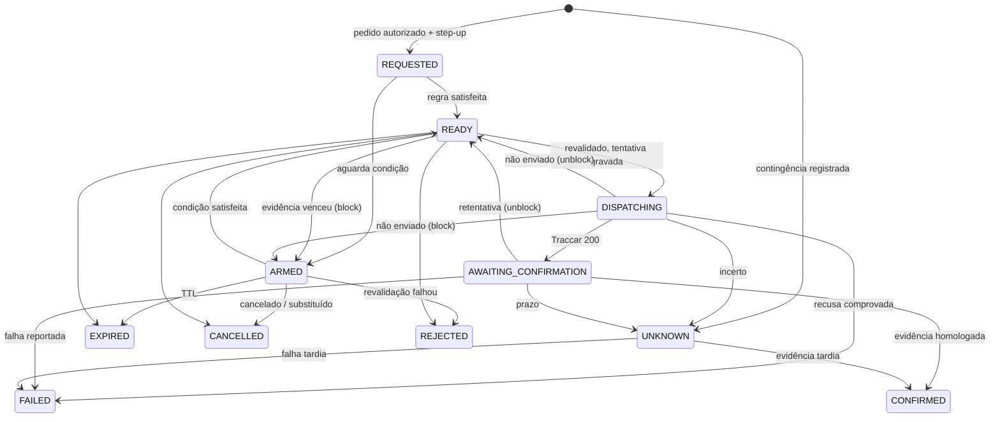

# 06 — Comandos e bloqueio

> **Resumo:** Define quando a TrackSys pode bloquear e desbloquear um veículo, quem pode pedir, como o pedido vira comando no rastreador e como o resultado é provado. A política depende do ponto de corte instalado (`cut_point`), de um perfil de hardware homologado e de evidência de telemetria com até 60 s. Bloqueio é estrito: sem repetição automática e sem SMS. Desbloqueio é a direção segura: retentativa e SMS. Nada roda em veículo real antes do gate G-CMD.
> **Fases:** F0 (bancada), F1  ·  **Status:** Aprovado para execução
> **Muda em relação à v1.1:**
> - Corte em movimento deixa de ser proibido: vira política por `cut_point` × operadora, com teto de 40 km/h da plataforma (DEC-07) e evidência ≤ 60 s.
> - ARMED ganha TTL (5 min; 30 min em ocorrência), reavaliação contínua e cancelamento.
> - Assimetria explícita: desbloqueio com retentativa GPRS e SMS (DEC-01); bloqueio nunca repete.
> - Step-up pela chave do aparelho (ADR-006); homologação de bancada com 20 ciclos e gate G-CMD.
> - Contingência por SMS manual registrada depois; inadimplência e IA sem caminho para comando.

## 1. Princípios

| INV | Texto | Consequência no código |
|---|---|---|
| INV-08 | **Comando físico só com evidência:** telemetria ausente, antiga, inválida, replay, falha de cache ou erro nunca autorizam bloqueio; estado desconhecido nunca autoriza repetir bloqueio automaticamente | Avaliador puro aceita só evidência ao vivo ≤ 60 s (§3.1); UNKNOWN encerra a tentativa de bloqueio |
| INV-09 | **Comercial não aciona físico:** inadimplência, suspensão comercial ou cancelamento nunca disparam bloqueio | `commands` não lê `invoice`, `billing_*` nem `tenant.status` para decidir; `billing` não importa `commands` (ADR-011) |
| INV-10 | **Bloqueio exige instalação registrada e perfil homologado:** sem `cut_point` no vínculo ativo e `capability_profile` homologado com relé, o bloqueio fica indisponível | §2; perfil só ganha `relay = "yes"` após a bancada (§13) |
| INV-11 | **IA sem poder físico nem financeiro:** agentes de IA nunca despacham comandos físicos, nunca alteram cobrança/split e só leem dados no escopo de quem os aciona | Rotas da §14 recusam ator `ai_agent` e `support`; o cardápio do agente SRE não tem ação física (ADR-010) |

1. Pedido (`command`), tentativa de transporte (`command_attempt`) e efeito físico observado (`device_state.relay_state`) são registros separados.
2. HTTP 200/202 do Traccar, socket aceito e DLR de SMS não são confirmação física.
3. Prazo local não revoga o que já saiu: CANCELLED e EXPIRED só existem antes de DISPATCHING.
4. Toda decisão grava a política e a evidência usadas (`policy_snapshot`, `evidence_snapshot`).
5. Código: avaliador, máquina de estados e textos em `packages/domain/src/commands/{evidence,policy,state-machine,texts}.ts` (puros, relógio por parâmetro); pedido em `apps/api/src/commands/`; despacho, correlação, laço ARMED, retentativa e reconciliação em `apps/worker/src/commands/`; adaptadores em `apps/worker/src/integrations/{traccar,emnify}/`; contratos em `packages/contracts/src/commands/`; fakes em `packages/testkit/src/fakes/{traccar,emnify}.ts`.

## 2. Disponibilidade

**Bloqueio** do veículo V está disponível se, e somente se, todas valem (no pedido e de novo antes do despacho):
1. `COMMAND_DISPATCH_ENABLED=true` ([03](03-arquitetura.md), REQ-ARQ-016) e V dentro de `COMMAND_BLOCK_SCOPE` [ADOTADO NA v2.0: variável `COMMAND_BLOCK_SCOPE` = `none` (padrão) | `pilot:<vehicle_id>[,…]` | `all`, alterada só por deploy com revisão N0: `none` até a bancada, `pilot:` no teste supervisionado do G-CMD, `all` após o G-CMD].
2. Vínculo primário aberto de V (senão `NO_PRIMARY_DEVICE`) com `cut_point` NOT NULL (senão `CUT_POINT_MISSING`).
3. Rastreador com `capability_profile.status = 'homologated'`, `capabilities.relay = "yes"` e seção `commands` completa (§13.4). Exceção única: a bancada [ADOTADO NA v2.0: `COMMAND_BENCH_OPERATOR_ID` aceita perfil `draft` com `relay = "yes"` e seção `commands` completa, exceto `homologation_ref`, só para rastreadores dessa operadora, que não tem cliente real].
4. Termo de ciência aceito pelo titular na versão exigida (§12).
5. `tenant.status ≠ 'closed'`. `suspended_commercial` não muda nada (INV-09).
6. Concorrência permitida pela §4.3.

**Desbloqueio** exige só permissão, step-up, rastreador no vínculo aberto, perfil com `relay = "yes"` (`homologated` **ou** `suspended`) e itens 5 e 6. Suspender perfil, remover `cut_point`, mudar o escopo ou revogar o termo nunca impede desbloqueio.

## 3. Política de bloqueio

### 3.1 Evidência válida

E = `evidence_max_age_s` da política vigente (≤ 60 s); t = `now()` do banco na avaliação. Um fix é evidência se:
1. chegou com `processingMode = 'live'` (replay, backfill e reprocessamento nunca contam — INV-05);
2. `valid = true`, coordenadas presentes, sem flag `JUMP_SUSPECT` ([05](05-ingestao-e-telemetria.md) §4.1);
3. pertence ao vínculo do comando (`assignment_id`);
4. `fix_time ∈ [t − E, t + 120 s]`; para o fix mais recente, também `received_at ≥ t − E`;
5. `speed_kmh_x10` NOT NULL. Velocidade NULL não é zero (INV-03).

**IGN_OFF** vale se o perfil tem `ignition = "yes"`, `device_state.ignition = false` observado (`aux.statusAt`) em `[t − E, t]`, `device_state.motion ≠ 'moving'` e nenhum fix válido em E tem velocidade > 0. A checagem de movimento protege contra fio de ignição adulterado (ligação direta).

**Fontes.** No pedido, o `api` usa `device_state` (último fix; `aux.fixReceivedAt` [alinhar com 05]) e as linhas de `position` do vínculo em E. Com o comando ARMED, o worker acumula em `evidence_snapshot.fixes` (até 5, os mais recentes) cada `location` e `previousLocation` dos `device.state.updated.v1` ao vivo do rastreador, porque a compactação de parado ([04](04-dominio-e-dados.md) §7.2) não grava todo fix parado.

### 3.2 Regra por `cut_point`

| `cut_point` | Efeito físico | READY quando | Senão |
|---|---|---|---|
| `starter` | Impede a próxima partida; motor ligado segue funcionando | Presença `online` ([07](07-alertas-e-tempo-real.md) §11): contato ≤ `stopped_interval_s` + 60 s (J16: 360 s). Velocidade não importa | ARMED `awaiting_contact` |
| `ignition` | Desliga a ignição | (a) 2 fixes em E com velocidade 0 e `fix_time` distintos; ou (b) IGN_OFF | ARMED `awaiting_stop` |
| `fuel_pump` | Corta o combustível; o motor apaga em segundos | (a) fix mais recente em E e **todos** os fixes em E com velocidade ≤ `max_moving_cut_kmh`; ou (b) IGN_OFF. Com `max_moving_cut_kmh = 0`, (a) vira a regra (a) de `ignition` | ARMED `awaiting_speed` (fix acima do teto) ou `awaiting_evidence` (sem fix) |
| NULL | — | Indisponível (INV-10) | 422 `CUT_POINT_MISSING` |

"Velocidade 0" = `speed_kmh_x10 ≤ commands.stopped_speed_max_kmh_x10` do perfil, padrão 0 [VALIDAR — DEC-02: ruído do J16 parado, cenário S01 de [05](05-ingestao-e-telemetria.md)]. Desbloqueio, `position_request` e `set_interval` vão direto a READY.

### 3.3 Política da operadora (`command_policy`)

1. Versionada: cada mudança é INSERT de nova `version` pelo `operator_admin`, com step-up de console. A aplicação não tem UPDATE nem DELETE. Vigente = maior `version`.
2. Limites da plataforma (CHECK no banco): `max_moving_cut_kmh` 0–40 (DEC-07); `evidence_max_age_s` 15–60; `armed_ttl_s` 60–300; `occurrence_armed_ttl_s` 300–1.800. A operadora só pode ficar mais estrita.
3. A versão 1 nasce com a operadora: `max_moving_cut_kmh = 0`, `allow_app_block = false`, demais no máximo. Lider: versão com 40 km/h e `allow_app_block = true` após DEC-07 (GC-1 de [02](02-escopo-e-fases.md)).
4. O comando grava a versão usada em `policy_snapshot`; reavaliações (ARMED e despacho) usam a versão vigente e a gravam no `command_event`. `expires_at` não muda.

### 3.4 Trava no dispositivo e posição sob demanda

1. Perfil com `device_speed_gate = "yes"`: o bloqueio usa o tipo com trava de velocidade do próprio rastreador (`commands.block_type_gated`), limite `max_moving_cut_kmh` (`fuel_pump`) ou 0 (`ignition`). A regra da §3.2 continua no servidor. [VALIDAR — DEC-02; padrão `"unknown"` = não usar.]
2. Perfil com `commands.position_request_type` definido: `ignition` e `fuel_pump` entram ARMED `awaiting_on_demand_fix`; o worker cria comando filho `position_request` (sem step-up, `parent_command_id`) a cada 30 s, até 5; só conta fix com `fix_time ≥ started_at` da tentativa do filho − 5 s. Padrão até o spike: `null`, e vale a evidência ≤ E [VALIDAR — DEC-02].

### 3.5 ARMED

1. `expires_at = created_at + armed_ttl_s` (300 s), ou `+ occurrence_armed_ttl_s` (1.800 s) com ocorrência `open` no veículo na criação. Não muda depois.
2. Reavaliação a cada `device.state.updated.v1` ao vivo do rastreador e pelo job `commands.armed.tick` a cada 15 s (`singletonKey` = id do comando). Condição satisfeita → READY. `now() ≥ expires_at` → EXPIRED; nada foi enviado.
3. Visível a solicitante, titular e central com motivo e contagem regressiva; cancelável (§4.1).

## 4. Quem pode pedir

### 4.1 Papéis

| Papel | Bloquear / desbloquear | Cancelar (só ARMED/READY sem tentativa) | Registrar contingência | Step-up |
|---|---|---|---|---|
| `operator_admin`, `operator_agent` | Sim | Qualquer comando da operadora | Sim | Console: TOTP ≤ 5 min + `reason` ≥ 10 caracteres |
| `search_team` | Só com ocorrência `open` no veículo | Os próprios | Não | App: chave do aparelho |
| `installer` | Só `reason_code = 'installation_test'`, em vínculo aberto por ele (`installed_by`) há ≤ 2 h [ADOTADO NA v2.0: janela de 2 h substitui a ordem de instalação até existir OS formal] | Os próprios | Não | App |
| `tenant_owner` | Se `allow_app_block` | Os pedidos de usuários do próprio cliente | Não | App |
| `tenant_member` | Se `allow_app_block` e o titular permitiu [ADOTADO NA v2.0: `membership.can_command boolean NOT NULL DEFAULT false`, alterável só pelo `tenant_owner`] | Os próprios | Não | App |
| `platform_admin`, suporte com grant, agente de IA, visitante de link | Nunca | Nunca | Nunca | — |

1. A autorização é recalculada no pedido e na transação que leva à 1ª tentativa (membership ativa, papel, ocorrência, janela do instalador). Falha → REJECTED `authorization_revoked`. Retentativas de desbloqueio não reavaliam autorização.
2. Comando pedido pela equipe da operadora só é cancelado pela equipe da operadora.

### 4.2 Step-up (detalhe em [08](08-identidade-e-seguranca.md))

| Canal | Prova | Validade |
|---|---|---|
| App | Desafio vinculado a usuário, `device_key`, veículo, `type` e `reason_code`; assinatura ECDSA P-256/SHA-256 (DER em base64url) de `tracksys-cmd-v1|{challenge_id}|{nonce}|{vehicle_id}|{type}|{reason_code}` com a chave liberada por biometria (ADR-006) | 60 s, uso único, consumido na transação que cria o comando |
| Console | TOTP verificado na sessão há ≤ 5 min + `reason` ≥ 10 caracteres | Por pedido |

Step-up vale para bloquear, desbloquear, registrar contingência e criar versão de `command_policy`. Cancelar exige sessão e permissão. Falha → 403, nenhuma linha em `command`, `audit_log` com `result = 'denied'`.

### 4.3 Idempotência e concorrência

1. `Idempotency-Key` (UUID) obrigatório, único por `(operator_id, tenant_id)`. Mesma chave + mesmo `request_sha256` (SHA-256 do JSON canônico do corpo sem `stepUp`) → 200 com o comando existente, sem consumir desafio. Mesma chave + corpo diferente → 422 `IDEMPOTENCY_KEY_REUSED`. A idempotência é checada antes do desafio. Regra geral em [09](09-api-e-contratos.md).
2. No máximo 1 `block`/`unblock` ativo (REQUESTED, ARMED, READY, DISPATCHING, AWAITING_CONFIRMATION) por rastreador, garantido por índice único parcial (§6):

| Ativo | Novo `block` | Novo `unblock` |
|---|---|---|
| `block` REQUESTED/ARMED/READY | 409 `COMMAND_ALREADY_ACTIVE` + `activeCommandId` | Mesma transação: o block vai a CANCELLED `superseded_by_unblock`; o unblock é criado |
| `block` DISPATCHING/AWAITING_CONFIRMATION | 409 `COMMAND_ALREADY_ACTIVE` | 409 `COMMAND_IN_FLIGHT`, `Retry-After` = segundos até o prazo de confirmação (≤ 60 s) |
| `unblock` ativo | 409 `COMMAND_IN_FLIGHT` | 409 `COMMAND_ALREADY_ACTIVE` |

3. Toda transição: `UPDATE app.command SET state = $novo, state_version = $v + 1 … WHERE id = $id AND state_version = $v`. 0 linhas = perdeu a corrida: relê e não faz I/O. Cancelar usa `If-Match: "<state_version>"` (412 se divergente).
4. A transação de DISPATCHING toma `pg_advisory_xact_lock(hashtextextended('cmd:' || device_id, 0))`. Lock em memória ou Redis não prova exclusão.

## 5. Máquina de estados



| De → Para | Guarda | Efeito | Quem |
|---|---|---|---|
| — → REQUESTED | §2, §4.1, §4.2 | INSERT `command` (`state_version = 1`), `command_event`, `audit_log` `command.request` | api |
| — → UNKNOWN | Contingência (§10) | INSERT com `requested_via = 'contingency'` | api |
| REQUESTED → READY / ARMED | Avaliador da §3 | Job `commands.dispatch` ou `commands.armed.tick` (+ filho `position_request`) | api |
| ARMED → READY | Condição satisfeita | Job `commands.dispatch` | worker |
| ARMED/READY → EXPIRED | `now() ≥ expires_at`, sem tentativa | Push ao solicitante | worker |
| ARMED/READY → CANCELLED | Cancelamento autorizado, sem tentativa; `superseded_by_unblock`; `occurrence_closed` | — | api / worker |
| ARMED/READY → REJECTED | Revalidação falhou: autorização, perfil, `cut_point`, termo, escopo | Push com motivo | worker |
| READY → ARMED | `block`: evidência deixou de valer (ex.: job atrasado) | Volta ao laço | worker |
| READY → DISPATCHING | Revalidação completa; lock do rastreador; < 5 tentativas GPRS no comando | INSERT `command_attempt` `pending`; **commit antes do I/O** | worker |
| DISPATCHING → AWAITING_CONFIRMATION | Traccar 200; ou `unblock` com resultado incerto | Job de prazo em `confirm_timeout_s` | worker |
| DISPATCHING → ARMED | `block`, resultado `device_offline`/`not_sent`, antes de `expires_at` e < 5 tentativas | Exige fix novo posterior à tentativa | worker |
| DISPATCHING → READY | `unblock`, `device_offline`/`not_sent`, < 5 tentativas GPRS | Próxima tentativa 60 s após a anterior | worker |
| DISPATCHING → FAILED | Recusa comprovada (§7); `block` offline após `expires_at` ou na 5ª tentativa; `unblock` sem nenhuma entrega possível (§9) | Push | worker |
| DISPATCHING → UNKNOWN | Resultado incerto (timeout, 5xx, conexão caída após envio) fora de `unblock`; 202 em qualquer tipo; reinício (§8.4); `unblock` esgotado com entrega possível (§9) | Alerta `command_unknown` | worker |
| AWAITING_CONFIRMATION → CONFIRMED / FAILED | §8.1 / padrão de falha | Push do resultado | worker |
| AWAITING_CONFIRMATION → UNKNOWN | Prazo sem confirmação; `unblock` esgotado (§9) | Alerta `command_unknown` | worker |
| AWAITING_CONFIRMATION → READY | `unblock`, 60 s sem confirmação, < 5 tentativas GPRS | Nova tentativa | worker |
| UNKNOWN → CONFIRMED / FAILED | Evidência ao vivo tardia correlacionada (§8.3) | Fecha o alerta | worker (`system:reconcile`) |

UNKNOWN nunca volta a DISPATCHING. Novo bloqueio depois de UNKNOWN só por novo pedido humano com step-up.

## 6. Modelo de dados

Tipos RLS ([04](04-dominio-e-dados.md) §4.2): `command` e `occurrence` A; `command_attempt` B; `command_event` B append-only; `command_policy` C + `command_policy_tenant_read`; políticas criadas pelo padrão do bloco `DO` de [04](04-dominio-e-dados.md) §4.2. `command_policy` entra em `appendOnly` na allowlist do catálogo (CAT-06).

```sql
-- F1 · comandos
CREATE TABLE app.command_policy (
  id uuid PRIMARY KEY DEFAULT gen_random_uuid(), operator_id uuid NOT NULL REFERENCES app.operator (id), version integer NOT NULL CHECK (version >= 1),
  max_moving_cut_kmh smallint NOT NULL DEFAULT 0 CHECK (max_moving_cut_kmh BETWEEN 0 AND 40),
  evidence_max_age_s smallint NOT NULL DEFAULT 60 CHECK (evidence_max_age_s BETWEEN 15 AND 60),
  armed_ttl_s smallint NOT NULL DEFAULT 300 CHECK (armed_ttl_s BETWEEN 60 AND 300),
  occurrence_armed_ttl_s smallint NOT NULL DEFAULT 1800 CHECK (occurrence_armed_ttl_s BETWEEN 300 AND 1800),
  allow_app_block boolean NOT NULL DEFAULT false, created_by uuid NOT NULL REFERENCES auth."user" (id), created_at timestamptz NOT NULL DEFAULT now(),
  CONSTRAINT command_policy_version_key UNIQUE (operator_id, version));
CREATE TABLE app.occurrence (
  id uuid PRIMARY KEY DEFAULT gen_random_uuid(), operator_id uuid NOT NULL, tenant_id uuid NOT NULL, vehicle_id uuid NOT NULL,
  opened_by uuid NOT NULL REFERENCES auth."user" (id), opened_at timestamptz NOT NULL DEFAULT now(),
  police_report_number text NULL CHECK (length(police_report_number) <= 40),
  status text NOT NULL DEFAULT 'open' CHECK (status IN ('open', 'recovered', 'closed')), closed_at timestamptz NULL,
  CONSTRAINT occurrence_scope_key UNIQUE (operator_id, tenant_id, id),
  CONSTRAINT occurrence_vehicle_fk FOREIGN KEY (operator_id, tenant_id, vehicle_id) REFERENCES app.vehicle (operator_id, tenant_id, id),
  CONSTRAINT occurrence_closed_chk CHECK ((status = 'open') = (closed_at IS NULL)));
CREATE UNIQUE INDEX occurrence_open_key ON app.occurrence (vehicle_id) WHERE status = 'open';
CREATE TABLE app.command (
  id uuid PRIMARY KEY DEFAULT gen_random_uuid(),
  operator_id uuid NOT NULL, tenant_id uuid NOT NULL, vehicle_id uuid NOT NULL, device_id uuid NOT NULL, assignment_id uuid NOT NULL,
  type text NOT NULL CHECK (type IN ('block', 'unblock', 'position_request', 'set_interval')),
  state text NOT NULL CHECK (state IN ('REQUESTED', 'ARMED', 'READY', 'DISPATCHING', 'AWAITING_CONFIRMATION',
    'CONFIRMED', 'UNKNOWN', 'FAILED', 'REJECTED', 'CANCELLED', 'EXPIRED')),
  state_version integer NOT NULL DEFAULT 1, state_reason text NULL CHECK (state_reason ~ '^[a-z_]{3,40}$'),
  requested_by uuid NOT NULL REFERENCES auth."user" (id), requested_via text NOT NULL CHECK (requested_via IN ('app', 'console', 'contingency')),
  reason_code text NOT NULL CHECK (reason_code IN ('theft_suspected', 'preventive', 'customer_request', 'installation_test',
    'recovered', 'pre_dispatch_fix', 'occurrence_interval', 'other')),
  reason text NULL CHECK (length(reason) <= 500), idempotency_key uuid NULL, request_sha256 bytea NULL CHECK (length(request_sha256) = 32),
  parent_command_id uuid NULL, occurrence_id uuid NULL, policy_snapshot jsonb NOT NULL, evidence_snapshot jsonb NOT NULL DEFAULT '{}',
  expires_at timestamptz NOT NULL, created_at timestamptz NOT NULL DEFAULT now(), updated_at timestamptz NOT NULL DEFAULT now(),
  CONSTRAINT command_scope_key UNIQUE (operator_id, tenant_id, id),
  CONSTRAINT command_idempotency_key UNIQUE (operator_id, tenant_id, idempotency_key),
  CONSTRAINT command_key_chk CHECK ((idempotency_key IS NULL) = (parent_command_id IS NOT NULL)),
  CONSTRAINT command_assignment_fk FOREIGN KEY (operator_id, tenant_id, assignment_id, vehicle_id, device_id)
    REFERENCES app.device_assignment (operator_id, tenant_id, id, vehicle_id, device_id),
  CONSTRAINT command_parent_fk FOREIGN KEY (operator_id, tenant_id, parent_command_id) REFERENCES app.command (operator_id, tenant_id, id),
  CONSTRAINT command_occurrence_fk FOREIGN KEY (operator_id, tenant_id, occurrence_id) REFERENCES app.occurrence (operator_id, tenant_id, id));
CREATE UNIQUE INDEX command_active_relay_key ON app.command (device_id)
  WHERE type IN ('block', 'unblock') AND state IN ('REQUESTED', 'ARMED', 'READY', 'DISPATCHING', 'AWAITING_CONFIRMATION');
CREATE INDEX command_vehicle_idx ON app.command (operator_id, tenant_id, vehicle_id, created_at DESC);
CREATE INDEX command_open_idx ON app.command (state, expires_at) WHERE state IN ('ARMED', 'READY', 'DISPATCHING', 'AWAITING_CONFIRMATION');
CREATE TABLE app.command_attempt (
  id uuid PRIMARY KEY DEFAULT gen_random_uuid(), operator_id uuid NOT NULL, tenant_id uuid NOT NULL, command_id uuid NOT NULL,
  seq smallint NOT NULL CHECK (seq BETWEEN 1 AND 10), channel text NOT NULL CHECK (channel IN ('gprs', 'sms')),
  started_at timestamptz NOT NULL DEFAULT now(), finished_at timestamptz NULL,
  result text NOT NULL DEFAULT 'pending' CHECK (result IN ('pending', 'sent', 'queued', 'not_sent', 'device_offline', 'rejected',
    'timeout', 'error', 'unknown', 'sms_accepted', 'sms_rejected', 'outside_platform')),
  provider_ref text NULL CHECK (length(provider_ref) <= 128), raw_response text NULL CHECK (length(raw_response) <= 4000),
  CONSTRAINT command_attempt_seq_key UNIQUE (command_id, seq),
  CONSTRAINT command_attempt_command_fk FOREIGN KEY (operator_id, tenant_id, command_id) REFERENCES app.command (operator_id, tenant_id, id));
CREATE UNIQUE INDEX command_attempt_inflight_key ON app.command_attempt (command_id, channel) WHERE finished_at IS NULL;
CREATE TABLE app.command_event (
  id uuid PRIMARY KEY DEFAULT gen_random_uuid(), operator_id uuid NOT NULL, tenant_id uuid NOT NULL, command_id uuid NOT NULL,
  from_state text NULL, to_state text NOT NULL, at timestamptz NOT NULL DEFAULT now(),
  actor text NOT NULL CHECK (actor ~ '^(user:[0-9a-f-]{36}|system:(api|worker|reconcile|failover))$'), detail jsonb NOT NULL DEFAULT '{}',
  CONSTRAINT command_event_command_fk FOREIGN KEY (operator_id, tenant_id, command_id) REFERENCES app.command (operator_id, tenant_id, id));
CREATE INDEX command_event_command_idx ON app.command_event (command_id, at);
CREATE FUNCTION app.tg_command_state() RETURNS trigger LANGUAGE plpgsql AS $$
DECLARE pair text;
BEGIN
  IF TG_OP = 'INSERT' THEN
    IF NEW.state_version <> 1 OR NOT (NEW.state = 'REQUESTED' OR (NEW.state = 'UNKNOWN' AND NEW.requested_via = 'contingency')) THEN
      RAISE EXCEPTION 'comando nasce REQUESTED (UNKNOWN só em contingência), state_version 1' USING ERRCODE = 'check_violation';
    END IF;
    RETURN NEW;
  END IF;
  NEW.updated_at := now();
  IF NEW.state = OLD.state AND NEW.state_version = OLD.state_version THEN RETURN NEW; END IF;
  pair := OLD.state || '>' || NEW.state;
  IF NEW.state = OLD.state OR NEW.state_version <> OLD.state_version + 1
     OR NOT pair = ANY (ARRAY['REQUESTED>READY', 'REQUESTED>ARMED', 'ARMED>READY', 'ARMED>EXPIRED', 'ARMED>CANCELLED',
       'ARMED>REJECTED', 'READY>ARMED', 'READY>DISPATCHING', 'READY>EXPIRED', 'READY>CANCELLED', 'READY>REJECTED',
       'DISPATCHING>AWAITING_CONFIRMATION', 'DISPATCHING>ARMED', 'DISPATCHING>READY', 'DISPATCHING>FAILED', 'DISPATCHING>UNKNOWN',
       'AWAITING_CONFIRMATION>CONFIRMED', 'AWAITING_CONFIRMATION>FAILED', 'AWAITING_CONFIRMATION>UNKNOWN',
       'AWAITING_CONFIRMATION>READY', 'UNKNOWN>CONFIRMED', 'UNKNOWN>FAILED'])
     OR (pair IN ('READY>ARMED', 'DISPATCHING>ARMED') AND NEW.type <> 'block')
     OR (pair IN ('DISPATCHING>READY', 'AWAITING_CONFIRMATION>READY') AND NEW.type <> 'unblock')
     OR (NEW.state IN ('CANCELLED', 'EXPIRED') AND EXISTS (SELECT 1 FROM app.command_attempt a WHERE a.command_id = NEW.id)) THEN
    RAISE EXCEPTION 'transição de comando inválida: % (%, v% → v%)', pair, NEW.type, OLD.state_version, NEW.state_version
      USING ERRCODE = 'check_violation';
  END IF;
  RETURN NEW;
END $$;
CREATE TRIGGER command_state BEFORE INSERT OR UPDATE ON app.command FOR EACH ROW EXECUTE FUNCTION app.tg_command_state();
CREATE TRIGGER command_immutable BEFORE UPDATE ON app.command FOR EACH ROW EXECUTE FUNCTION app.tg_immutable_columns(
  'operator_id', 'tenant_id', 'vehicle_id', 'device_id', 'assignment_id', 'type', 'requested_by', 'requested_via',
  'reason_code', 'idempotency_key', 'request_sha256', 'parent_command_id', 'occurrence_id', 'expires_at', 'created_at');
GRANT SELECT, INSERT ON app.command_policy, app.command_event TO tracksys_app;
GRANT SELECT, INSERT, UPDATE ON app.command, app.command_attempt, app.occurrence TO tracksys_app;
```

`command_attempt` com `finished_at` preenchido não muda mais (gatilho `command_attempt_finished`, padrão de [04](04-dominio-e-dados.md) §3.3). `evidence_snapshot` guarda `evaluatedAt`, `rule` (ex.: `fuel_pump.moving_under_ceiling`), `decision`, `cutPoint`, `ceilingKmh`, `evidenceMaxAgeS`, `profile` (`j16-gt06/2`), `ignOff`, `onDemandFix` e `fixes[]` com `sourceEventId`, `fixTime`, `receivedAt` e `speedKmh`.

## 7. Despacho via Traccar

1. Job `commands.dispatch` (`singletonKey` = id). Transação no escopo `operator`: `SELECT … FOR UPDATE`; estado ≠ READY → sai; lock do rastreador (§4.3); revalida §2, §4.1 e §3 com t = `now()`.
2. Falhou a evidência → READY → ARMED (ou EXPIRED). Falhou outro item → REJECTED. Passou → DISPATCHING + `command_attempt` (`pending`, `seq` seguinte) + `command_event` + outbox → **COMMIT**.
3. Só então a chamada (timeout 10 s = `commands.send_timeout_s`):

```http
POST {TRACCAR_API_URL}/api/commands/send
Authorization: Basic <TRACCAR_API_USER:TRACCAR_API_PASSWORD>
Content-Type: application/json

{ "deviceId": 17, "type": "engineStop", "attributes": { "noQueue": true } }
```

`deviceId` = `device.traccar_device_id`; `type` = `commands.block_type` / `unblock_type` / `position_request_type` do perfil. [VALIDAR — DEC-02: tipos `engineStop`/`engineResume` no codificador gt06 da versão fixada, texto que chega ao J16 e nome e posição de `noQueue`.] Perfil sem `no_queue = "yes"` não é homologável: comando enfileirado executaria no futuro sem evidência.

4. Segunda transação grava `result`, `finished_at`, `raw_response` (truncado, sem credenciais) e a transição:

| Resposta | `result` | `block` | `unblock` |
|---|---|---|---|
| 200 | `sent` | AWAITING_CONFIRMATION | AWAITING_CONFIRMATION |
| 202 (enfileirado) | `queued` | UNKNOWN `queued_by_traccar` + remoção da fila [VALIDAR — DEC-02: rota de fila do Traccar] + aviso ao fundador | Idem |
| 4xx que casa `commands.offline_error_pattern` | `device_offline` | ARMED; após `expires_at` ou na 5ª tentativa, FAILED `device_offline` | READY (retentativa) |
| Conexão recusada ou DNS (requisição não saiu) | `not_sent` | Idem `device_offline` | Idem |
| Outro 4xx | `rejected` | FAILED `traccar_rejected` | FAILED `traccar_rejected` |
| 5xx, timeout, conexão caída após envio | `timeout` / `error` | UNKNOWN `transport_unknown` | AWAITING_CONFIRMATION (pode ter saído) |

## 8. Confirmação, UNKNOWN e reconciliação

### 8.1 Confirmação

`confirm_timeout_s` = 60 s [PREMISSA; medir no S07 e fixar no perfil]. Conta a partir do `started_at` da tentativa.

| `commands.confirmation` | CONFIRMED quando, dentro do prazo |
|---|---|
| `ack_and_relay_state` (exige `relay_state_reported = "yes"`) | `commandResult` ao vivo casando `ack_patterns.<type>.success` **e** `device_state.relay_state` esperado (`blocked`/`unblocked`) com `relay_observed_at ≥ started_at` |
| `ack_only` | `commandResult` ao vivo casando `ack_patterns.<type>.success` |
| ausente | Perfil não homologável (INV-10) |

1. `commandResult` chega por `/internal/v1/traccar/events`; a projeção emite `device.state.updated.v1` com `cause = "event"` e `commandResult: { result, eventTime, sourceEventId }` [alinhar com 05]. O consumidor `commands.correlate` o atribui à última tentativa GPRS do comando de relé ativo do rastreador com `started_at ≤ eventTime`.
2. `ack_patterns` são regex JS aplicadas ao texto com `trim` e minúsculas, capturadas no S07. Texto que não casa nada → `command_event` de evidência, sem transição.
3. `failure` casado → FAILED `ack_failure`. Relé observado contrário ao esperado após `started_at` → UNKNOWN `contradictory_evidence`.
4. `position_request`: CONFIRMED com fix ao vivo de `fix_time ≥ started_at − 5 s`. `set_interval`: regra de `ack_only`.

### 8.2 UNKNOWN

1. Encerra a tentativa de bloqueio: nenhum job cria nova tentativa para o comando (INV-08). A UI avisa que o pedido anterior pode ter sido executado.
2. Abre alerta `command_unknown` (`critical`, `episode_key = command_unknown:{commandId}`): push ao solicitante e ao titular; fila da central ([07](07-alertas-e-tempo-real.md) §9) [alinhar com 07: incluir no catálogo].
3. Estado do relé observado e sua idade aparecem separados do estado do comando.

### 8.3 Evidência tardia

1. `commandResult` ou relé observados depois do prazo vão para a última tentativa do mesmo tipo com `started_at ≤` instante do fato, desde que nenhuma tentativa do tipo oposto tenha começado depois; senão `command_event` com `detail.unattributed = true`, sem transição.
2. Comando UNKNOWN cuja evidência tardia satisfaz a §8.1 (sem o prazo) → CONFIRMED; padrão de falha → FAILED. Ator `system:reconcile`.
3. Evidência com `processingMode ≠ 'live'` só anota `command_event` (INV-05).

### 8.4 Reconciliação após reinício

Job `commands.reconcile` no boot do worker, antes de consumir as filas de comando, e a cada 1 min:

| Encontrado | Ação |
|---|---|
| READY | Reenfileira `commands.dispatch` (`singletonKey`); a revalidação decide |
| ARMED | Reagenda o tick; vencido → EXPIRED |
| DISPATCHING com tentativa `pending` | Tentativa → `unknown`. `block`, `position_request`, `set_interval` → UNKNOWN `worker_restart`, sem chamar o Traccar. `unblock` → segue a §9 |
| AWAITING_CONFIRMATION no prazo | Reagenda o job de prazo |
| AWAITING_CONFIRMATION vencido | Aplica §8.1 à evidência gravada; senão UNKNOWN `worker_restart` (`block`) ou §9 (`unblock`) |
| Failover ou restore | REQ-ARQ-016: despacho desligado; todo DISPATCHING/AWAITING_CONFIRMATION → UNKNOWN `failover`, também `unblock`; o alerta oferece "Reenviar desbloqueio", que é novo pedido com step-up |

## 9. Desbloqueio assimétrico

Desbloquear é a direção segura: duplicata é inofensiva, então há retentativa e SMS. t = segundos desde a 1ª tentativa, enquanto não houver CONFIRMED:

| t | Ação |
|---|---|
| 0 | GPRS 1 |
| 60 | GPRS 2 |
| 120 | GPRS 3 + 1 SMS pela API emnify (DEC-01) |
| 180 / 240 | GPRS 4 / GPRS 5 |
| 300 | UNKNOWN `unblock_unconfirmed` se alguma tentativa pode ter chegado (`sent`, `timeout`, `error`, `unknown`, `sms_accepted`); FAILED `not_delivered` se todas foram `device_offline`/`not_sent` e o SMS faltou ou foi `sms_rejected`. Ambos abrem alerta |

1. Confirmação de qualquer tentativa (§8.1) confirma o comando; tentativas futuras não começam.
2. SMS exige DEC-01 (`EMNIFY_SMS_ENABLED=true`), `sim_card` ativo do rastreador, `commands.sms.unblock_template_ref` no perfil e senha SMS do dispositivo no cofre ([08](08-identidade-e-seguranca.md)); nunca em log. Endpoint e validade de 10 min do SMS [VALIDAR — DEC-01]. DLR positivo = `sms_accepted`, não confirmação.
3. Sem DEC-01: aos 120 s a central recebe na fila "Enviar SMS de desbloqueio pelo portal", com o texto pronto ([Anexo C](../anexos/C-operacional.md)); depois registra a contingência (§10).
4. Bloqueio nunca usa SMS automático nem retentativa.
5. Pedido de bloqueio até 24 h depois de um desbloqueio por SMS não confirmado mostra o aviso "um SMS de desbloqueio enviado às {hora} ainda pode chegar e desfazer este bloqueio" [PREMISSA: 24 h].

## 10. Contingência por SMS manual

Com a plataforma fora ou o GPRS falhando, a central envia o SMS pelo portal emnify/Meta Telecom seguindo o runbook ([Anexo C](../anexos/C-operacional.md)), com a mesma regra de `cut_point` da §3.2. Até 72 h depois, `operator_agent` ou `operator_admin` registra em `POST /api/v1/vehicles/{vehicleId}/commands/contingency` (`type`, `reasonCode`, `sentAt`, `reason`; nunca o texto do SMS, que contém a senha). Efeito: `command` nasce UNKNOWN com `requested_via = 'contingency'`, `state_reason = 'contingency'`, `expires_at = created_at` e a política vigente no snapshot; `command_attempt` `sms`/`outside_platform` com `started_at = sentAt`; `audit_log` `command.contingency`. A §8.3 pode levar a CONFIRMED. Nenhuma chamada ao Traccar.

## 11. Ocorrência (efeitos em comandos)

`occurrence` é aberta pelo `tenant_owner` ("Fui roubado") ou pela central; no máximo 1 `open` por veículo. Enquanto `open`: TTL de ARMED de 1.800 s para pedidos novos; `search_team` pode pedir; perfil com `commands.set_interval_type` recebe `set_interval` (intervalo do perfil para ocorrência) na abertura e volta ao normal no fechamento, com `idempotency_key` = UUID v5 (namespace URL do RFC 9562) de `{occurrence_id}:{open|close}` e `requested_by` = quem abriu ou fechou [VALIDAR — DEC-02]. No fechamento (`recovered` ou `closed`), comandos ARMED/READY pedidos pelo `search_team` vão a CANCELLED `occurrence_closed`. BO, linha do tempo, compartilhamento e pacote de evidências: [10](10-apps-e-ux.md) e [08](08-identidade-e-seguranca.md).

## 12. Termo de ciência do bloqueio

1. O bloqueio (app e central) exige `consent` ativo do cliente com `purpose = 'block_terms'` e `text_version = 'block-terms-v{N}/{kmh}kmh'` (ex.: `block-terms-v1/40kmh`), gravado pelo serviço público de `sva` ([12](12-cobranca-e-svas.md)). Aceite válido: `v{N}` igual à versão vigente do texto e `{kmh}` ≥ `max_moving_cut_kmh` vigente.
2. Quem aceita: `tenant_owner`, no app, vendo o texto do [Anexo B](../anexos/B-juridico.md) com operadora, `cut_point` de cada veículo, teto e TTL. Nova versão do texto ou teto maior exige novo aceite; teto menor não.
3. Revogado ou ausente: bloqueio indisponível (422 `COMMAND_TERMS_NOT_ACCEPTED`); desbloqueio continua.
4. [DECISÃO DO FUNDADOR PENDENTE: titular sem app pode ter o aceite registrado pela central com anexo (termo assinado ou print do WhatsApp) e `audit_log` `command.block_terms.recorded`, até o portal web do cliente.]

## 13. Homologação do perfil e G-CMD

### 13.1 Montagem de bancada

1. **Alimentação:** fonte 12 V DC ≥ 3 A (ou bateria automotiva 12 V) com fusível de 5 A no positivo. **Rastreador:** J16 do lote da Lider (IMEI e firmware anotados), chip emnify ativo, antena GPS com céu aberto.
2. **Relé:** automotivo 12 V, 5 pinos, 30/40 A, bobina pela saída de bloqueio do J16 (fio e polaridade do manual) [VALIDAR — DEC-02]. **Carga:** lâmpada 12 V 5 W (ou LED 12 V com resistor) no contato NF (87a): acesa = desbloqueado, apagada = bloqueado. **Ignição:** chave entre +12 V e o fio de ignição do J16.
3. **Sem cobertura:** caixa blindada do S08 ([05](05-ingestao-e-telemetria.md) §15). **Registro:** vídeo contínuo da lâmpada com relógio UTC com segundos na imagem; TrackSys, Traccar e celular com NTP.
4. Antes dos ciclos, o S07 do spike preenche a seção `commands` (padrões de `commandResult`, erro de offline, `noQueue`) com chamadas diretas à API do Traccar. Os ciclos rodam na produção, na operadora de bancada (`COMMAND_BENCH_OPERATOR_ID`), com veículo `kind = 'other'` e vínculo `cut_point = 'fuel_pump'`.

### 13.2 Procedimento: 20 ciclos (1 ciclo = bloqueio + desbloqueio)

| Ciclos | Condição | Esperado |
|---|---|---|
| 1–10 | Sinal bom, ignição desligada | CONFIRMED nos dois sentidos; pedido → CONFIRMED ≤ 30 s [PREMISSA] |
| 11–12 | Rastreador na caixa antes do pedido | ARMED → EXPIRED; ao sair da caixa, a lâmpada não muda (sem fila) |
| 13–14 | Caixa logo após DISPATCHING | UNKNOWN em 60 s; nenhum reenvio; evidência tardia anexada se houver |
| 15 | Cortar os 12 V por 60 s com bloqueio confirmado | Registrar `relay_persists_power_cycle` |
| 16 | Matar o worker em AWAITING_CONFIRMATION | UNKNOWN `worker_restart` ou CONFIRMED pela evidência; 0 reenvio |
| 17 | Mesmo pedido 3 vezes com a mesma `Idempotency-Key` | 1 comando, 1 chamada ao Traccar |
| 18 | `cut_point = 'ignition'`, ignição ligada, parado | READY só após 2 fixes a 0 km/h em 60 s |
| 19 | Desbloqueio com o rastreador na caixa por 150 s | Retentativas a cada 60 s; SMS aos 120 s (DEC-01) ou fila da central; CONFIRMED ≤ 60 s após sair |
| 20 | Reiniciar o rastreador em AWAITING_CONFIRMATION | UNKNOWN ou CONFIRMED com evidência; nunca falsa confirmação |

### 13.3 Evidências

`packages/testkit/fixtures/j16/homologation/<AAAA-MM-DD>/cycles.csv` com `cycle, command_id, type, requested_at, dispatching_at, traccar_status, command_result_at, relay_observed_at, lamp_changed_at, final_state, lamp_state, pass`; `manifest.json` com IMEI mascarado, firmware, versão e digest do Traccar, SHA-256 dos vídeos (bucket privado) e dos `commandResult` capturados. `pnpm --filter @tracksys/testkit homologation:check <dir>` aplica os critérios.

### 13.4 Critérios e seção `commands` do perfil

Reprova com qualquer: falsa confirmação (CONFIRMED com a lâmpada no estado oposto); atuação sem comando ou depois de CANCELLED, EXPIRED, REJECTED ou FAILED; execução de comando enfileirado; reenvio de bloqueio após UNKNOWN; ciclos 1–10 com menos de 10/10 CONFIRMED. Falhou um ciclo, repetem-se os 20. Aprovado, uma migration (revisão N0, só o fundador aprova) cria nova `version` do perfil com `status = 'homologated'`, `relay = "yes"`, `evidence_ref` = caminho do `manifest.json` + SHA-256 e a seção abaixo completa. O schema Zod `CapabilityProfileSchema` recusa `relay = "yes"` com campo obrigatório nulo ou `no_queue ≠ "yes"`, e `status = 'homologated'` sem `homologation_ref`.

```json
"commands": { "version": 1, "block_type": "engineStop", "unblock_type": "engineResume", "block_type_gated": null,
  "position_request_type": null, "set_interval_type": null, "no_queue": "yes", "send_timeout_s": 10, "confirm_timeout_s": 60,
  "confirmation": "ack_and_relay_state", "offline_error_pattern": "<regex do S07>", "stopped_speed_max_kmh_x10": 0,
  "ack_patterns": { "block": { "success": "<regex>", "failure": "<regex>" }, "unblock": { "success": "<regex>", "failure": "<regex>" } },
  "relay_persists_power_cycle": "yes", "sms": { "unblock_template_ref": "j16/unblock-v1", "block_template_ref": "j16/block-v1" },
  "homologation_ref": "packages/testkit/fixtures/j16/homologation/2026-11-18/manifest.json" }
```

Obrigatórios: tipos de bloqueio e desbloqueio, `no_queue`, `confirmation`, `offline_error_pattern`, os 4 `ack_patterns`, `relay_persists_power_cycle` (`yes` ou `no`; com `no`, a UI avisa que desligar a bateria do veículo pode desfazer o bloqueio); `homologation_ref` só no `homologated`. `sms.block_template_ref` serve só à contingência manual.

### 13.5 G-CMD

Checklist GC-1 a GC-6 em [02](02-escopo-e-fases.md) §4.3. Sequência: bancada aprovada → perfil `homologated` → `COMMAND_BLOCK_SCOPE=pilot:<veículo do teste>` → teste supervisionado (GC-6) → `docs/runbooks/gates/G-CMD.md` aprovado → `COMMAND_BLOCK_SCOPE=all`.

## 14. Contratos

| Rota | Quem | Corpo → resposta |
|---|---|---|
| `GET /api/v1/vehicles/{vehicleId}/command-availability` | §4.1 | → `{ block: { available, code?, cutPoint, ceilingKmh, effectText }, unblock: { available, code? }, activeCommandId, relay: { state, observedAt } }` |
| `POST /api/v1/vehicles/{vehicleId}/command-challenges` | App | `{ type, reasonCode }` → 201 `{ challengeId, nonce, expiresAt }` |
| `POST /api/v1/vehicles/{vehicleId}/commands` | §4.1 | `Idempotency-Key`; `{ type, reasonCode, reason?, stepUp }` → 201/200 `Command` + `ETag: "<stateVersion>"` |
| `GET /api/v1/commands/{commandId}` | Escopo RLS | → `Command` + `events[]` + `attempts[]` (`rawResponse` só para a equipe da operadora) |
| `GET /api/v1/vehicles/{vehicleId}/commands?cursor=&limit=` | Escopo RLS | Lista paginada |
| `POST /api/v1/commands/{commandId}/cancel` | §4.1 | `If-Match` → 200; 409 `COMMAND_NOT_CANCELLABLE`; 412 |
| `POST /api/v1/vehicles/{vehicleId}/commands/contingency` | Central | `Idempotency-Key`; `{ type, reasonCode, sentAt, reason }` → 201; 422 `CONTINGENCY_TOO_OLD` |
| `POST /api/v1/command-policies` | `operator_admin` | Campos da §3.3 → 201 nova `version` |
| `POST /api/v1/tenants/{tenantId}/block-terms` | `tenant_owner` | `{ textVersion }` → 201 |

```jsonc
// pedido
{ "type": "block", "reasonCode": "theft_suspected", "reason": null,
  "stepUp": { "kind": "device_key", "challengeId": "0192a1b2-0021-7c3d-8e4f-5a6b7c8d9e21", "deviceKeyId": "0192a1b2-0022-7c3d-8e4f-5a6b7c8d9e22", "signature": "MEUCIQ…" } }
// 201
{ "id": "0192a1b2-0023-7c3d-8e4f-5a6b7c8d9e23", "vehicleId": "0192a1b2-0000-7000-8000-0000000000f1", "type": "block",
  "state": "ARMED", "stateVersion": 2, "stateReason": "awaiting_speed", "cutPoint": "fuel_pump", "ceilingKmh": 40,
  "expiresAt": "2026-11-20T14:05:00Z", "requestedVia": "app", "createdAt": "2026-11-20T14:00:00Z",
  "evidence": { "evaluatedAt": "2026-11-20T14:00:00Z", "lastFixAt": "2026-11-20T13:59:51Z", "speedKmh": 52.0 } }
```

Console envia `stepUp: { "kind": "console_totp" }`. Outros códigos: 503 `COMMAND_DISPATCH_DISABLED` (só `block`; `unblock` aceito espera em READY), `NO_PRIMARY_DEVICE` (sem vínculo primário aberto; HTTP 422 `COMMAND_NOT_ALLOWED` com `reason = no_primary_device`), `CUT_POINT_MISSING`, `PROFILE_NOT_HOMOLOGATED`, `COMMAND_RELAY_UNSUPPORTED`, `COMMAND_BLOCK_SCOPE_DISABLED`, `COMMAND_APP_BLOCK_DISABLED`, `COMMAND_FORBIDDEN`, `STEP_UP_REQUIRED`, `STEP_UP_CHALLENGE_EXPIRED`, `STEP_UP_CHALLENGE_USED`, `STEP_UP_SIGNATURE_INVALID`, `COMMAND_REASON_REQUIRED`. Os `code` HTTP são os de [09 §3](09-api-e-contratos.md); os demais nomes `COMMAND_*` e `STEP_UP_*` desta seção e dos CTs são motivos do domínio (T-016), que a T-018 mapeia para eles (ex.: `COMMAND_RELAY_UNSUPPORTED` → 422 `COMMAND_NOT_ALLOWED` com `reason = relay_unsupported`; `STEP_UP_CHALLENGE_EXPIRED` → 403 `STEP_UP_INVALID` com `reason = challenge_expired`). Evento `command.state.changed.v1`: `{ commandId, vehicleId, deviceId, type, fromState, toState, stateVersion, stateReason, at, requestedVia, processingMode }`; consumidores em [03](03-arquitetura.md) §6. SSE `command.state` ao solicitante: [09](09-api-e-contratos.md).

## 15. Auditoria e UX mínima

1. `command_event` em toda transição e evidência; append-only; 5 anos. `audit_log`: `command.request` (`success`/`denied`), `command.cancel`, `command.contingency`, `command_policy.create`, `command.block_terms.accept`, com `correlation_id`.
2. Textos de efeito em `packages/domain/src/commands/texts.ts` (T-016, F1), mostrados na confirmação antes do step-up. No F0 o arquivo ainda não existe: o cadastro de vínculo (T-007) mostra só o nome do ponto de corte e não escreve texto de segurança próprio.

| `cut_point` | Texto obrigatório |
|---|---|
| `starter` | "Bloqueio de partida: o veículo não dará nova partida. Se estiver ligado, continua funcionando até ser desligado." |
| `ignition` | "Corte de ignição: desliga o motor. Só é enviado com o veículo parado; em movimento, o pedido aguarda até {ttl} min." |
| `fuel_pump` | "Corte de combustível: o motor apaga em alguns segundos, inclusive em movimento até {teto} km/h. Acima disso, o pedido aguarda até {ttl} min." (teto 0: "Só é enviado com o veículo parado.") |

3. Rótulos distintos: ARMED "Aguardando condição segura — {motivo}. Expira às {hora}" + Cancelar; READY/DISPATCHING "Enviando ao rastreador"; AWAITING_CONFIRMATION "Aguardando confirmação do rastreador"; CONFIRMED "Bloqueio confirmado às {hora}"; UNKNOWN "Não foi possível confirmar. O veículo pode ou não estar bloqueado" + "Falar com a central"; FAILED "O rastreador não executou"; REJECTED "Recusado: {motivo}"; EXPIRED "Expirou sem condição segura. Nada foi enviado". UNKNOWN nunca aparece como bloqueado. O relé observado mostra a idade ("há 3 h"). Telas: [10](10-apps-e-ux.md).

## 16. Requisitos

### REQ-CMD-001 — Disponibilidade do bloqueio
**Fase:** F1 · **Prioridade:** P0 · **Risco:** N0 · **Invariantes:** INV-10, INV-03
**Regra.** `api` e `worker` DEVEM aplicar a §2 no pedido e antes do despacho. Bloqueio indisponível NÃO DEVE gerar linha em `command` nem chamada ao Traccar. Desbloqueio DEVE depender só das condições próprias da §2.
**Aceite.** CT-CMD-001 — Dado V1 com vínculo de `cut_point` NULL, Quando o `tenant_owner` pede `block` com step-up válido, Então 422 `CUT_POINT_MISSING`, 0 linhas em `command`, 1 `audit_log` `denied` e 0 requisições no fake de Traccar; Dado perfil `draft` fora da operadora de bancada, Então 422 `PROFILE_NOT_HOMOLOGATED`; Dado perfil `homologated` com `relay = "unknown"`, Então 422 `COMMAND_RELAY_UNSUPPORTED`; Dado `COMMAND_BLOCK_SCOPE=none`, Então 422 `COMMAND_BLOCK_SCOPE_DISABLED`; Dado perfil `suspended` com `relay = "yes"`, Quando pede `unblock`, Então 201.

### REQ-CMD-002 — Avaliação por `cut_point`
**Fase:** F1 · **Prioridade:** P0 · **Risco:** N0 · **Invariantes:** INV-08, INV-03
**Regra.** `evaluateBlock` de `packages/domain` DEVE implementar a §3.1–3.2 e ser o único avaliador usado por `api` e `worker`, devolvendo READY ou ARMED com `state_reason` e a evidência usada.
**Aceite.** CT-CMD-002 — Dado E = 60 s, teto 40 km/h e t = 14:00:00Z: `starter` com contato às 13:55:30Z e último fix a 80 km/h → READY; `fuel_pump` com fixes às 13:59:20Z (38 km/h) e 13:59:50Z (35 km/h) → READY; com 45 km/h às 13:59:20Z e 35 km/h às 13:59:50Z → ARMED `awaiting_speed`; `ignition` com 1 fix a 0 km/h às 13:59:50Z e ignição desconhecida → ARMED `awaiting_stop`; com 2 fixes a 0 km/h às 13:59:20Z e 13:59:50Z → READY; com ignição `false` às 13:59:40Z e `motion = 'moving'` → ARMED.

### REQ-CMD-003 — Evidência inválida nunca autoriza
**Fase:** F1 · **Prioridade:** P0 · **Risco:** N0 · **Invariantes:** INV-08, INV-03, INV-05
**Regra.** Fix fora da §3.1 NÃO DEVE contar como evidência; velocidade NULL NÃO DEVE valer 0.
**Aceite.** CT-CMD-003 — Dado `fuel_pump`, teto 40 km/h, t = 14:00:00Z e sem IGN_OFF: fix único às 13:58:59Z a 10 km/h → ARMED `awaiting_evidence`; fix às 13:59:50Z com `valid = false` → ARMED; com `speed_kmh_x10` NULL → ARMED; com `processingMode = 'backfill'` → ignorado; com flag `JUMP_SUSPECT` → ignorado; com `fix_time` 13:59:50Z e `received_at` 13:58:30Z → ARMED; rastreador sem nenhum fix → ARMED e EXPIRED às 14:05:00Z. Propriedade P-CMD-1 (fast-check, 1.000 execuções): conjunto de fixes em que cada um viola um item da §3.1, sem IGN_OFF, nunca produz READY para `ignition` e `fuel_pump`.

### REQ-CMD-004 — `command_policy` versionada
**Fase:** F1 · **Prioridade:** P0 · **Risco:** N0 · **Invariantes:** INV-08
**Regra.** A política DEVE seguir a §3.3; mudança DEVE ser nova `version`; o comando DEVE gravar a versão usada.
**Aceite.** CT-CMD-004 — Dado a operadora A com v1, Quando o `operator_admin` insere v2 com `max_moving_cut_kmh = 41`, Então SQLSTATE 23514; com 40, Então grava e o próximo pedido tem `policy_snapshot.version = 2`; Quando `tracksys_app` faz UPDATE em `command_policy`, Então 42501; Dado `fuel_pump` ARMED criado sob v2 (40 km/h) e v3 (20 km/h) criada depois, Quando chegam fixes a 30 km/h, Então continua ARMED `awaiting_speed`.

### REQ-CMD-005 — Trava no dispositivo e posição sob demanda
**Fase:** F1 · **Prioridade:** P1 · **Risco:** N0 · **Invariantes:** INV-08
**Regra.** Com as capacidades da §3.4, o worker DEVE usar o comando com trava e a posição sob demanda como ali descrito; sem elas, DEVE valer a evidência ≤ E.
**Aceite.** CT-CMD-005 — Dado perfil com `position_request_type = "positionSingle"` e `fuel_pump`, Quando o pedido é criado às 14:00:00Z, Então ARMED `awaiting_on_demand_fix` e 1 filho `position_request`; Quando chega fix ao vivo a 25 km/h com `fix_time` 3 s após o `started_at` do filho, Então o pai vai a READY; com `fix_time` 10 s antes, Então continua ARMED; sem resposta, Então filhos em 0, 30, 60, 90 e 120 s e nenhum 6º.

### REQ-CMD-006 — ARMED com TTL, visível e cancelável
**Fase:** F1 · **Prioridade:** P0 · **Risco:** N0 · **Invariantes:** INV-08
**Regra.** ARMED DEVE seguir a §3.5; vencido, NADA DEVE ser enviado.
**Aceite.** CT-CMD-006 — Dado `ignition`, veículo a 30 km/h e política padrão, Quando o pedido é criado às 14:00:00Z, Então ARMED com `expires_at` 14:05:00Z; sem condição, Então às 14:05:15Z o estado é EXPIRED, o fake de Traccar recebeu 0 requisições e houve push; com ocorrência `open`, Então `expires_at` 14:30:00Z; Dado fixes a 0 km/h às 14:02:00Z e 14:02:30Z, Então READY em ≤ 2 s após o 2º; Quando o solicitante cancela às 14:01:00Z com `If-Match: "2"`, Então CANCELLED e 0 requisições.

### REQ-CMD-007 — Autorização por papel
**Fase:** F1 · **Prioridade:** P0 · **Risco:** N0 · **Invariantes:** INV-07, INV-11
**Regra.** Pedido e cancelamento DEVEM seguir a §4.1; a autorização DEVE ser revalidada antes da 1ª tentativa.
**Aceite.** CT-CMD-007 — Dado `tenant_member` sem `can_command`, Então 403 `COMMAND_FORBIDDEN`; com `can_command` e `allow_app_block = false`, Então 403 `COMMAND_APP_BLOCK_DISABLED`; `installer` em vínculo aberto por ele há 2 h 01 min → 403; `search_team` sem ocorrência `open` → 403, com ocorrência → 201; `platform_admin` com grant de suporte → 403; `tenant_owner` cancelando comando da central → 403; Dado READY de `operator_agent` revogado antes do despacho, Então REJECTED `authorization_revoked` e 0 requisições ao Traccar.

### REQ-CMD-008 — Step-up e idempotência
**Fase:** F1 · **Prioridade:** P0 · **Risco:** N0 · **Invariantes:** INV-01
**Regra.** O pedido DEVE seguir a §4.2 e a §4.3 item 1.
**Aceite.** CT-CMD-008 — Dado desafio emitido às 14:00:00Z, Quando usado às 14:01:01Z, Então 403 `STEP_UP_CHALLENGE_EXPIRED`; usado 2 vezes com chaves de idempotência diferentes → a 2ª recebe 403 `STEP_UP_CHALLENGE_USED`; assinatura feita para V2 enviada para V1 → 403 `STEP_UP_SIGNATURE_INVALID`; console com TOTP verificado há 5 min 01 s → 403 `STEP_UP_REQUIRED`; nos 403, 0 linhas em `command`. Dado o mesmo pedido 3 vezes com a mesma `Idempotency-Key`, Então respostas 201, 200 e 200 com o mesmo `id` e 1 desafio consumido; mesma chave com `type` diferente → 422 `IDEMPOTENCY_KEY_REUSED`.

### REQ-CMD-009 — Máquina de estados garantida no banco
**Fase:** F1 · **Prioridade:** P0 · **Risco:** N0 · **Invariantes:** INV-08
**Regra.** Transições DEVEM ser as da §5, com `state_version` + 1 e UPDATE condicional; o gatilho da §6 DEVE recusar as demais.
**Aceite.** CT-CMD-009 — Dado `block` REQUESTED v1, Quando UPDATE para CONFIRMED, Então SQLSTATE 23514; para READY com `state_version = 3` → 23514; Dado UNKNOWN, Quando UPDATE para DISPATCHING → 23514; Dado `unblock` READY com 1 tentativa, Quando UPDATE para CANCELLED → 23514; Dado 2 UPDATE condicionais concorrentes com `state_version = 2`, Então exatamente 1 altera 1 linha. Propriedade P-CMD-2: sequências aleatórias de 1–40 eventos nunca geram par fora da §5 nem tentativa de `block` após tentativa `sent`, `timeout`, `error`, `queued` ou `unknown`.

### REQ-CMD-010 — Um comando de relé ativo por rastreador
**Fase:** F1 · **Prioridade:** P0 · **Risco:** N0 · **Invariantes:** INV-08
**Regra.** Pedidos concorrentes DEVEM seguir a tabela da §4.3.
**Aceite.** CT-CMD-010 — Dado 2 pedidos `block` simultâneos com chaves diferentes para V1, Então exatamente 1 é 201, o outro 409 `COMMAND_ALREADY_ACTIVE` com `activeCommandId` do primeiro, e o fake recebe ≤ 1 requisição; Dado `block` ARMED, Quando chega `unblock`, Então o block fica CANCELLED `superseded_by_unblock` e o unblock READY na mesma transação; Dado `block` AWAITING_CONFIRMATION com prazo em 40 s, Quando chega `unblock`, Então 409 `COMMAND_IN_FLIGHT` com `Retry-After: 40`.

### REQ-CMD-011 — Tentativa gravada antes do I/O, despacho sem fila
**Fase:** F1 · **Prioridade:** P0 · **Risco:** N0 · **Invariantes:** INV-08, INV-05
**Regra.** O despacho DEVE seguir a §7: revalidação, tentativa commitada antes da chamada, `noQueue` e o mapeamento de respostas.
**Aceite.** CT-CMD-011 — Dado `block` READY, Quando o fake de Traccar recebe a requisição, Então já existe `command_attempt` commitada `pending`, o comando está DISPATCHING e o corpo tem `"type": "engineStop"` e `"attributes": {"noQueue": true}`; resposta 200 → AWAITING_CONFIRMATION; 400 casando `offline_error_pattern` às 14:00:10Z com `expires_at` 14:05:00Z → ARMED, e a próxima tentativa só sai após fix ao vivo posterior; 202 → UNKNOWN `queued_by_traccar`; sem resposta em 10 s → UNKNOWN `transport_unknown`; Dado o job de despacho executado 90 s após READY sem fix novo → ARMED `awaiting_evidence` e 0 requisições; evento `replay` que satisfaria a regra → ignorado.

### REQ-CMD-012 — Confirmação só por evidência homologada
**Fase:** F1 · **Prioridade:** P0 · **Risco:** N0 · **Invariantes:** INV-03, INV-08
**Regra.** CONFIRMED DEVE exigir a regra da §8.1 do perfil; resposta HTTP NÃO DEVE confirmar.
**Aceite.** CT-CMD-012 — Dado perfil `ack_and_relay_state` e tentativa às 14:00:00Z: `commandResult` de sucesso às 14:00:04Z e `relay_state = 'blocked'` às 14:00:09Z → CONFIRMED; só o `commandResult` até 14:01:00Z → UNKNOWN `confirmation_timeout`; sucesso e `relay_state = 'unblocked'` às 14:00:09Z → UNKNOWN `contradictory_evidence`; `commandResult` de falha → FAILED `ack_failure`; texto sem padrão → `command_event` de evidência e estado inalterado; Dado perfil `ack_only` e sucesso às 14:00:04Z → CONFIRMED; HTTP 200 sem `commandResult` → nunca CONFIRMED.

### REQ-CMD-013 — UNKNOWN sem repetição; evidência tardia anexada
**Fase:** F1 · **Prioridade:** P0 · **Risco:** N0 · **Invariantes:** INV-08, INV-05
**Regra.** UNKNOWN DEVE seguir a §8.2; evidência tardia DEVE seguir a §8.3.
**Aceite.** CT-CMD-013 — Dado `block` UNKNOWN às 14:01:00Z, Então em 10 min o fake recebe 0 requisições para ele, há alerta `command_unknown` aberto e push ao solicitante; Quando chegam ao vivo às 14:03:00Z o `commandResult` de sucesso atrasado e, após reinício do rastreador, `relay_state = 'blocked'`, Então CONFIRMED com ator `system:reconcile` e alerta fechado; com `processingMode = 'backfill'`, Então só `command_event`; Dado `commandResult` de bloqueio às 14:04:00Z com um `unblock` iniciado às 14:03:30Z, Então `detail.unattributed = true` e nenhum estado muda.

### REQ-CMD-014 — Reconciliação após reinício do worker
**Fase:** F1 · **Prioridade:** P0 · **Risco:** N0 · **Invariantes:** INV-08
**Regra.** O worker DEVE executar a §8.4 antes de consumir filas de comando.
**Aceite.** CT-CMD-014 — Dado `block` DISPATCHING com tentativa `pending` e o worker morto antes da chamada, Quando o worker sobe, Então o comando vai a UNKNOWN `worker_restart` antes de qualquer job de comando e o fake recebe 0 requisições; Dado `unblock` no mesmo cenário, Então a tentativa vira `unknown` e a seguinte sai 60 ± 5 s após a anterior; Dado ARMED vencido durante a parada → EXPIRED; Dado READY → 1 despacho após revalidação.

### REQ-CMD-015 — Desbloqueio assimétrico
**Fase:** F1 · **Prioridade:** P0 · **Risco:** N0 · **Invariantes:** INV-08
**Regra.** Desbloqueio DEVE seguir a §9; bloqueio NÃO DEVE ter tentativa `sms` automática nem retentativa.
**Aceite.** CT-CMD-015 — Dado chip sem cobertura (fake responde offline) e DEC-01 ativa, Quando `unblock` começa às 14:00:00Z, Então GPRS em 0, 60, 120, 180 e 240 s (± 5 s), 1 SMS no fake de emnify aos 120 s, e às 14:05:00Z UNKNOWN `unblock_unconfirmed` com alerta; com o SMS recusado → FAILED `not_delivered`; Dado cobertura de volta às 14:03:20Z, Então a tentativa de 14:04:00Z recebe 200, ack e `relay_state = 'unblocked'` → CONFIRMED e nenhuma tentativa depois; Dado 2 acks de tentativas diferentes → 1 CONFIRMED, sem erro.

### REQ-CMD-016 — Contingência registrada
**Fase:** F1 · **Prioridade:** P1 · **Risco:** N0 · **Invariantes:** INV-08
**Regra.** A contingência DEVE ser registrada como na §10, sem chamada ao Traccar.
**Aceite.** CT-CMD-016 — Dado SMS de bloqueio enviado pelo portal às 02:10:00Z, Quando o `operator_agent` registra às 03:00Z com TOTP e motivo, Então `command` UNKNOWN com `requested_via = 'contingency'`, `command_attempt` `sms`/`outside_platform` com `started_at` 02:10:00Z, `audit_log` `command.contingency` e 0 requisições ao Traccar; `tenant_owner` → 403; `sentAt` de 4 dias antes → 422 `CONTINGENCY_TOO_OLD`.

### REQ-CMD-017 — Comercial e IA sem poder físico
**Fase:** F1 · **Prioridade:** P0 · **Risco:** N0 · **Invariantes:** INV-09, INV-11
**Regra.** Nenhum caminho de cobrança ou de agente de IA DEVE criar, cancelar ou despachar comando.
**Aceite.** CT-CMD-017 — Dado A1 com fatura vencida há 30 dias e `tenant.status = 'suspended_commercial'`, Quando todos os jobs do worker rodam por 24 h simuladas, Então 0 linhas novas em `command`; Quando o `tenant_owner` de A1 pede `unblock`, Então 201; Dado ator `ai_agent` ou sessão de suporte, Quando chama qualquer rota da §14, Então 403 e 0 linhas; `pnpm check:boundaries` falha se `apps/*/src/billing/**` importar `commands` ou o inverso.

### REQ-CMD-018 — Homologação de perfil em bancada
**Fase:** F0 (bancada), F1 · **Prioridade:** P0 · **Risco:** N0 · **Invariantes:** INV-10
**Regra.** `relay = "yes"` e `status = 'homologated'` DEVEM exigir a §13 inteira.
**Aceite.** CT-CMD-018 — Dado migration com perfil `homologated`, `relay = "yes"` e `commands.no_queue = "unknown"`, Então o teste de perfis com `CapabilityProfileSchema` falha no CI; Dado `cycles.csv` com 20 ciclos e 1 CONFIRMED com `lamp_state` oposto, Então `homologation:check` sai com código 1; Dado 20 ciclos aprovados, Então sai com 0 e o SHA-256 do `manifest.json` confere com `evidence_ref`.

### REQ-CMD-019 — Termo de ciência
**Fase:** F1 · **Prioridade:** P0 · **Risco:** N0 · **Invariantes:** INV-10
**Regra.** O bloqueio DEVE exigir o aceite da §12.
**Aceite.** CT-CMD-019 — Dado A1 sem `consent` `block_terms`, Quando a central pede `block`, Então 422 `COMMAND_TERMS_NOT_ACCEPTED`; Dado aceite `block-terms-v1/20kmh` e política nova com 40 km/h → 422 até novo aceite; política nova com 10 km/h → disponível; aceite revogado → `block` 422 e `unblock` 201.

### REQ-CMD-020 — Auditoria
**Fase:** F1 · **Prioridade:** P0 · **Risco:** N0 · **Invariantes:** INV-06
**Regra.** Criação e toda transição DEVEM gerar `command_event` na mesma transação; toda transição DEVE gerar `command.state.changed.v1` na outbox; ações humanas DEVEM gerar `audit_log` (§15).
**Aceite.** CT-CMD-020 — Dado REQUESTED → READY → DISPATCHING → AWAITING_CONFIRMATION → CONFIRMED, Então 5 `command_event` (o 1º, de criação, com `from_state` NULL), número igual a `state_version`, 4 `command.state.changed.v1` e 1 `audit_log` `command.request` `success`; UPDATE ou DELETE em `command_event` → 42501.

### REQ-CMD-021 — UX mínima obrigatória
**Fase:** F1 · **Prioridade:** P0 · **Risco:** N0 · **Invariantes:** INV-03
**Regra.** App e console DEVEM mostrar o texto de efeito e os rótulos da §15 a partir de `texts.ts`.
**Aceite.** CT-CMD-021 — Dado `fuel_pump` e teto 40 → o texto contém "inclusive em movimento até 40 km/h"; teto 0 → "Só é enviado com o veículo parado."; `starter` → "não dará nova partida"; Dado UNKNOWN → "Não foi possível confirmar" e nenhum rótulo contém "bloqueado"; Dado relé observado há 3 h → "há 3 h".

### REQ-CMD-022 — Ocorrência e comandos
**Fase:** F1 · **Prioridade:** P1 · **Risco:** N0 · **Invariantes:** INV-08
**Regra.** Ocorrência DEVE produzir os efeitos da §11.
**Aceite.** CT-CMD-022 — Dado ocorrência `open` em V1, Então novo `block` tem `expires_at = created_at + 1.800 s` e o `search_team` pode pedir; Quando fecha como `recovered`, Então ARMED do `search_team` vão a CANCELLED `occurrence_closed`; 2ª ocorrência `open` em V1 → SQLSTATE 23505.

## 17. Suíte CT-CMD

Testes N0 congelados em `tests/acceptance/T-NNN/` antes da implementação; Postgres real, fakes de Traccar e emnify com injeção de falha. P-CMD-1 e P-CMD-2 em `packages/domain/test/commands.property.test.ts`; P-CMD-3 (1.000 execuções com timeouts, 202, offline e perdas aleatórias no fake): CONFIRMED só quando o relé do fake está no estado esperado. A suíte inteira roda no CI e na bancada antes do G-CMD (GC-2).

| Cenário obrigatório | CT |
|---|---|
| Desconectar antes / durante / depois do despacho | CT-CMD-003 e 006 / CT-CMD-011 / CT-CMD-012 e 013 |
| Resposta perdida; atraso de transporte | CT-CMD-011 (timeout); CT-CMD-011 (job atrasado) e 013 (ack tardio) |
| Pedido duplicado (mesma `Idempotency-Key`); duas solicitações concorrentes | CT-CMD-008; CT-CMD-010 e 009 |
| Reinício do worker; reinício do equipamento | CT-CMD-014; CT-CMD-013 e ciclos 15 e 20 da bancada |
| Telemetria antiga, ausente ou inválida; velocidade acima do teto | CT-CMD-003; CT-CMD-002 e 004 |
| `cut_point` ausente; perfil não homologado | CT-CMD-001; CT-CMD-001 e 018 |
| Permissão revogada; desafio reutilizado ou expirado | CT-CMD-007; CT-CMD-008 |
| Cliente inadimplente; chip sem cobertura no desbloqueio | CT-CMD-017; CT-CMD-015 |

Fatias propostas para os cartões do F1: (A) migration da §6 + RLS + gatilhos (009, 020); (B) avaliador, máquina de estados e textos (002, 003, 021, P-CMD-1/2); (C) rotas do `api` (001, 004, 007, 008, 010, 019); (D) despacho, confirmação e reconciliação (005, 006, 011–014, P-CMD-3); (E) desbloqueio, SMS e contingência (015, 016); (F) kit de bancada (018); ocorrência (022) com o modo ocorrência de [10](10-apps-e-ux.md).
