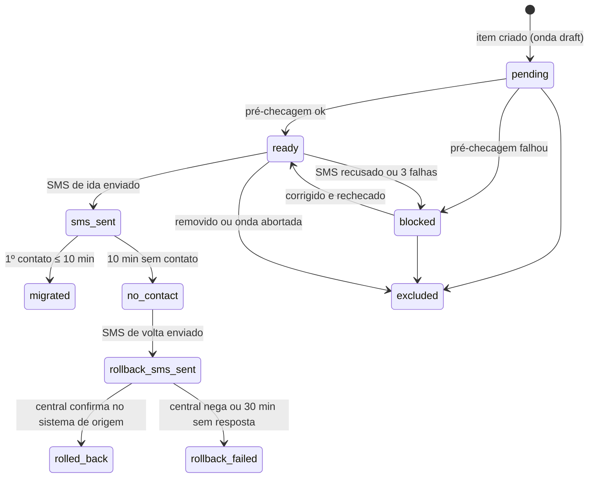

# 11 — Onboarding e migração

> **Resumo:** Define como uma operadora entra na TrackSys em até 14 dias e como os rastreadores saem da plataforma anterior sem visita ao veículo: checklist com dono e prazo, importador de planilha com validação por linha e commit idempotente, ondas de até 20 veículos por SMS com 1º contato em 10 min e rollback automático, modelos de SMS do J16, apontamento por domínio com plano B, o passo a passo da Lider (do Piloto Zero às ondas do F1) e os riscos. O histórico do tracker-net não migra.
> **Fases:** F0, F1, F2  ·  **Status:** Aprovado para execução
> **Muda em relação à v1.1:**
> - Migração vira funcionalidade do produto (importador + ondas), com estados, métricas e rollback.
> - Rastreadores apontados por domínio `gps.<domínio>`, com plano B por IP reservado.
> - Rollback por SMS testado em 1 veículo antes do piloto (G0-8) e automático nas ondas do F1.
> - Onboarding de operadora com meta de ≤ 14 dias medida (REQ-NEG-005) e checklist com dono.

**Nesta página**

- [1. Onde fica o código](#1-onde-fica-o-código)
- [2. Checklist de onboarding (meta ≤ 14 dias, F2)](#2-checklist-de-onboarding-meta--14-dias-f2)
- [3. Importador de planilha (F1)](#3-importador-de-planilha-f1)
- [4. Ondas de migração](#4-ondas-de-migração)
- [5. Modelos de SMS e senha do dispositivo](#5-modelos-de-sms-e-senha-do-dispositivo)
- [6. Domínio `gps.<domínio>` e plano B](#6-domínio-gpsdomínio-e-plano-b)
- [7. Migração da Lider passo a passo](#7-migração-da-lider-passo-a-passo)
- [8. Histórico do tracker-net](#8-histórico-do-tracker-net)
- [9. Riscos](#9-riscos)
- [10. Modelo de dados (tipo C, F1)](#10-modelo-de-dados-tipo-c-f1)
- [11. Contratos [alinhar com 09]](#11-contratos-alinhar-com-09)
- [12. Requisitos](#12-requisitos)

## 1. Onde fica o código

| Peça | Caminho |
|---|---|
| Lógica pura: linha, mapeamento, chave de linha, dinheiro, estados de onda e item, disjuntor, modelos de SMS | `packages/domain/src/onboarding/{import-row,column-mapping,row-key,money,wave-state,circuit-breaker,sms-templates}.ts` |
| Upload, leitura de XLSX/CSV (`exceljs`), validação, rotas | `apps/api/src/onboarding/` |
| Commit da importação, laço da onda, envio de SMS | `apps/worker/src/onboarding/{import-commit.job,wave-tick.job}.ts`; adaptador emnify em `apps/worker/src/integrations/emnify/` ([06](06-comandos-e-bloqueio.md)) |
| Contratos | `packages/contracts/src/onboarding/` |
| Fixtures e fakes | `packages/testkit/fixtures/onboarding/{tracker-net-exemplo.xlsx,generico.csv,windows-1252.csv}`; `packages/testkit/src/fakes/emnify.ts` |
| Runbooks | `docs/runbooks/onboarding/{checklist-operadora,migracao-piloto,onda-manual,lider}.md` |
| Consulta do G1-2 | `infra/scripts/gates/g1-migracao.sql` |

## 2. Checklist de onboarding (meta ≤ 14 dias, F2)

D0 = `operator.contract_signed_on`. O `onboarding_days` termina no 1º fix válido de veículo real da operadora (REQ-NEG-005), no passo 10. O checklist de cada operadora é uma cópia de `docs/runbooks/onboarding/checklist-operadora.md` em `docs/runbooks/onboarding/operadoras/<slug>.md`, com data e responsável por passo.

| # | Passo | Dono | Prazo | Pronto quando |
|---|---|---|---|---|
| 1 | Contrato e adesão assinados; `contract_signed_on` gravado | Fundador + operadora | D0 | Contrato assinado |
| 2 | Operadora criada; `operator_admin` convidado; `command_policy` v1 ([06 §3.3](06-comandos-e-bloqueio.md#33-política-da-operadora-command_policy)) | Fundador | D0–D1 | Admin entra no console |
| 3 | Marca: logo, cor, WhatsApp e telefone da central | Operadora envia; fundador confere a prévia | D1–D3 | Prévia aprovada (contraste de [10 §4](10-apps-e-ux.md#4-marca-dinâmica)) |
| 4 | Usuários: atendentes, plantonista, instaladores, busca | Operadora | D2–D4 | ≥ 1 `operator_agent` ativo com TOTP |
| 5 | Conta Asaas vinculada e split de R$ 3,90 testado | Operadora + fundador | D1–D5 | Cobrança de teste com split ([12](12-cobranca-e-svas.md)) |
| 6 | Planilha exportada da plataforma de origem | Operadora | D1–D3 | Arquivo entregue |
| 7 | Importação: mapeamento, prévia, correções, commit (§3) | Operadora executa (`operator_admin`); fundador acompanha | D3–D6 | `import_job` `committed`, 0 erro pendente |
| 8 | Hardware: modelos da planilha × perfis; modelo novo → spike de rastreamento ([05 §15](05-ingestao-e-telemetria.md#15-spike-do-j16-t-002-o-que-capturar)) e modelos de SMS (§5) | Fundador | D1–D8 | Todos os modelos com perfil e modelos de SMS `validated`; bloqueio só após a bancada de [06 §13](06-comandos-e-bloqueio.md#13-homologação-do-perfil-e-g-cmd) |
| 9 | Dados de migração: senha SMS, servidor atual (alvo de rollback), acesso ao portal do chip ou DEC-01 | Operadora | D3–D5 | 1 item de onda passa na pré-checagem (§4.3) |
| 10 | Piloto: 1–3 veículos da própria operadora migrados; rollback testado em 1 | Fundador + operadora | D6–D8 | 1º fix válido (fecha `onboarding_days`) |
| 11 | Treinamento do plantonista (1 h) com o runbook de 1 página ([Anexo C](../anexos/C-operacional.md)) | Fundador | D8–D10 | Ensaio: localizar 1 veículo por SMS |
| 12 | Avisos aos clientes e 1ª onda | Operadora (avisos), fundador (onda) | D10–D14 | 1ª onda `completed` |
| 13 | Go-live: ondas em ritmo, acompanhamento diário por 7 dias | Ambos | D14–D21 | Taxa de sucesso por onda ≥ 90% [PREMISSA] |

O passo 8 é o caminho crítico com modelo novo: se não fechar até D8, o piloto usa só os modelos já homologados. A Lider é o caso especial do F0–F1 (§7) e não conta para a meta.

## 3. Importador de planilha (F1)

### 3.1 Fluxo

Estados de `import_job`: `uploaded` → `mapped` → `validated` (validação síncrona, ≤ 10 s; novo mapeamento volta a `mapped`) → `committing` → `committed`, ou `failed` após 5 falhas de infraestrutura no job; `uploaded`, `mapped` e `validated` → `cancelled`.

1. **Upload** (`operator_admin`): `.xlsx` ou `.csv`, ≤ 5 MiB (413 `IMPORT_FILE_TOO_LARGE`), ≤ 5.000 linhas de dados (422 `IMPORT_TOO_MANY_ROWS`), ≤ 40 colunas, célula ≤ 500 caracteres. XLSX: 1ª planilha visível (ou `sheet` informado), valor calculado das fórmulas; `.xls`/`.xlsm` → 415 `IMPORT_FORMAT_UNSUPPORTED`; conteúdo descompactado > 50 MiB → 413 `IMPORT_FILE_TOO_LARGE`. CSV: UTF-8 (com ou sem BOM); se o UTF-8 for inválido, Windows-1252; separador = o mais frequente entre `;`, `,` e TAB na 1ª linha; aspas RFC 4180. 1ª linha não vazia = cabeçalho. O `api` grava `raw = {headers, rows}` (texto aparado) e o SHA-256 do arquivo; o arquivo não é guardado. Mesmo SHA-256 com job ativo → 409 `IMPORT_ALREADY_ACTIVE` com `importId`. Nova planilha da mesma origem cancela o job anterior não commitado.
2. **Mapeamento:** o `api` sugere (§3.2); o usuário confirma ou ajusta; `options.defaultDeviceModel` (padrão `J16`) vale para linhas sem modelo.
3. **Validação e prévia:** linha a linha (§3.3), com 3 consultas em lote (`= ANY($1)`) por documento, placa e IMEI/ICCID. A prévia mostra contagens e linhas filtráveis por `ok`, `warning`, `error`. Correção é na planilha, com novo upload.
4. **Commit** (`If-Match: "<version>"`) → 202 e job `onboarding.import.commit` (`singletonKey` = id): lotes de 100 linhas, 1 transação por lote no escopo `operator`, 1 savepoint por linha; linhas com erro são puladas. Repetir o job não duplica nada (§3.4).
5. **Relatório:** `errors.csv` com `;`, UTF-8 com BOM, colunas `linha;campo;codigo;mensagem;valor_original`. Valor que começa com `=`, `+`, `-` ou `@` sai prefixado com `'` (injeção de fórmula).
6. **Expurgo:** job diário `onboarding.import.purge` grava `raw = NULL`, `rows = NULL` e `purged_at` 30 dias após `committed`, `cancelled` ou `failed`; `summary` fica.

### 3.2 Campos

Cabeçalhos comparados após aparar, minúsculas, sem acento (NFD) e espaços colapsados. O preset `tracker-net` fixa o mapeamento quando a planilha real da Lider chegar [VALIDAR — planilha da Lider].

| Campo | Obrig. | Cabeçalhos reconhecidos | Validação e normalização | Destino |
|---|---|---|---|---|
| `customerName` | Sim | nome, cliente, nome do cliente, razao social | 2–200 caracteres | `tenant.display_name` |
| `customerDocument` | Sim | cpf, cnpj, cpf/cnpj, documento | Só dígitos; 11 = CPF com DV (`person`); 14 = CNPJ com DV (`company`) | `tenant.document`, `tenant.kind` |
| `customerPhone` | Não | telefone, celular, whatsapp, fone | Só dígitos; 10–11 → prefixo +55; 12–13 iniciando em 55 → `+`; E.164 | `tenant.contact_phone` coluna nova do F1, criada com o importador: não existe no F0 nem em `POST /api/v1/tenants` |
| `customerEmail` | Não | email, e-mail | Minúsculas; `^[^@\s]+@[^@\s]+\.[^@\s]+$`; ≤ 254 | `tenant.contact_email` e convite do titular |
| `plate` | Sim | placa | Maiúsculas, sem hífen e espaço; regex de [04 §3.1](04-dominio-e-dados.md#31-tabelas-da-t-001) | `vehicle.plate` |
| `vehicleKind` | Não | tipo, tipo de veiculo, categoria | carro, automovel, auto, passeio → `car`; moto, motocicleta, motoneta → `motorcycle`; caminhao → `truck`; vazio ou outro → `other` | `vehicle.kind` |
| `make`, `model`, `color` | Não | marca, fabricante / modelo / cor | ≤ 60 / ≤ 60 / ≤ 30 caracteres | `vehicle.*` |
| `imei` | Sim | imei, id do rastreador, serial, numero do rastreador | Só dígitos; 15 dígitos; Luhn conferido (falha = aviso) | `device.imei` |
| `deviceModel` | Não | modelo do rastreador, equipamento | Casa `capability_profile.model`; vazio → `defaultDeviceModel` | `device.model`, `capability_profile_id` |
| `iccid` | Não | iccid, chip, sim, simcard, numero do chip | Só dígitos (remove `F` final); 18–20 dígitos | `sim_card.iccid`, `device.sim_iccid` |
| `msisdn` | Não | linha, numero da linha, msisdn | Só dígitos; 12–15 dígitos → `+{dígitos}`; 10–11 → +55 [VALIDAR — formato do MSISDN emnify] | `sim_card.msisdn` |
| `cutPoint` | Não | bloqueio, ponto de corte, tipo de bloqueio, corte | bomba, combustivel, bomba de combustivel → `fuel_pump`; ignicao, pos-chave, pos chave → `ignition`; partida, arranque, motor de arranque → `starter`; vazio, nao, sem, nenhum → NULL | `device_assignment.cut_point` |
| `plan` | Não | plano | ≤ 60 caracteres | Cobrança ([12](12-cobranca-e-svas.md)) |
| `amount` | Não | valor, mensalidade, valor mensal | "R$ 49,90", "49,90", "49.90", "49,9" → 4.990 centavos; 100–100.000 centavos (INV-12) | Cobrança |
| `dueDay` | Não | vencimento, dia de vencimento, dia venc | Inteiro 1–31; data dd/mm/aaaa → dia | Cobrança |

### 3.3 Códigos por linha

Erro descarta a linha; aviso importa a linha com o campo afetado vazio.

| Tipo | Códigos e quando |
|---|---|
| Erro de formato | `REQUIRED_MISSING` (obrigatório vazio); `DOCUMENT_INVALID` (tamanho ou DV); `PLATE_INVALID`; `IMEI_INVALID` (≠ 15 dígitos); `ICCID_INVALID` (fora de 18–20); `CUT_POINT_UNKNOWN`; `DEVICE_MODEL_UNKNOWN` (sem perfil) |
| Erro de consistência | `DUPLICATE_IN_FILE` (mesmo IMEI, ICCID ou placa em 2+ linhas, todas marcadas); `IMEI_UNAVAILABLE`, `ICCID_UNAVAILABLE` (cadastrado fora da operadora; a mensagem "IMEI indisponível para cadastro" não revela onde, REQ-DAD-022); `PLATE_OTHER_CUSTOMER` (placa ativa com outro documento, INV-06); `DEVICE_ASSIGNED_ELSEWHERE` (vínculo aberto em outro veículo); `VEHICLE_HAS_OTHER_DEVICE` (veículo com outro rastreador primário) |
| Aviso | `IMEI_CHECK_DIGIT` (Luhn falhou; há equipamento com identificador próprio); `PHONE_INVALID` (descartado), `PHONE_LANDLINE` (sem WhatsApp); `EMAIL_INVALID`, `EMAIL_MISSING` (titular sem e-mail: convite por código de ativação, [08 §2](08-identidade-e-seguranca.md#2-autenticação-better-auth)); `CUT_POINT_EMPTY` ("Sem ponto de corte: bloqueio indisponível até a central registrar", INV-10); `VEHICLE_KIND_DEFAULTED`; `AMOUNT_INVALID`, `DUE_DAY_INVALID` (cobrança descartada); `NAME_MISMATCH` (mesmo documento, nomes diferentes; vale a 1ª linha) |

### 3.4 Commit idempotente por linha

`rowKey` = SHA-256 hex de `documento|placa|imei` normalizados. Em cada savepoint, no escopo `operator`:

1. **Cliente:** busca `tenant` por `(operator_id, document)`; não existe → cria `active`.
2. **Veículo:** busca por `(operator_id, plate)` não arquivado; existe em outro cliente → `PLATE_OTHER_CUSTOMER`; não existe → cria.
3. **Chip:** com ICCID, busca `sim_card` na operadora; não existe → cria (`emnify`, `msisdn` se houver); violação de unicidade → `ICCID_UNAVAILABLE`.
4. **Rastreador:** busca `device` por IMEI na operadora (não aposentado); não existe → cria `stock` com perfil do modelo; unicidade violada → `IMEI_UNAVAILABLE`. O módulo `fleet` provisiona no Traccar ([03 §4](03-arquitetura.md#4-módulos-do-monólito-e-donos-de-tabelas)).
5. **Vínculo:** aberto no mesmo veículo → nada (`cut_point` diferente vira `conflict`); aberto em outro veículo → `DEVICE_ASSIGNED_ELSEWHERE`; sem vínculo → cria primário com `valid_from = now()`, `cut_point` da linha, `installed_by` NULL, `notes = 'importado: {source} {AAAA-MM-DD}'`, e `device.status = 'installed'`.
6. **Titular:** a importação não cria usuário; o convite (`POST /api/v1/invitations`, papel `tenant_owner`, e-mail de contato, [08 §2](08-identidade-e-seguranca.md#2-autenticação-better-auth)) sai quando o veículo é migrado (§7, M2). Titular com `EMAIL_MISSING` recebe o código de ativação gerado na C03 (§7, M2b).
7. **Cobrança:** plano, valor e vencimento em `rows[i].billing` para o módulo `billing` consumir ao vincular a conta Asaas [alinhar com 12].
8. **Resultado:** `created`, `unchanged` (tudo igual), `updated` (só com `updateExisting`), `conflict` (diferenças listadas, nada alterado) ou `error`. `updateExisting = true` altera só telefone, e-mail, marca, modelo, cor e o `cut_point` do vínculo aberto. Nunca move veículo, rastreador ou histórico entre clientes (INV-06).
9. **Auditoria:** `audit_log` `import.commit` (1 por job, com contagens) e `import.update_existing` por entidade alterada.

## 4. Ondas de migração

### 4.1 Liberação, modo e janela

1. Ondas existem só para operadoras em `MIGRATION_WAVES_OPERATORS` (ids separados por vírgula; padrão vazio), alterada por deploy com revisão N1. A Lider entra após G0 aprovado, DEC-10 resolvida e G-CMD aprovado: sem G-CMD, o cliente migrado perde o bloqueio remoto, que é paridade.
2. `mode = 'api'` exige `EMNIFY_SMS_ENABLED=true` (DEC-01, [06 §9](06-comandos-e-bloqueio.md#9-desbloqueio-assimétrico)); sem a flag, só `manual`.
3. Início de segunda a sexta, exceto feriados nacionais (lista em `packages/domain/src/calendar/holidays-br.ts`), 09:00–16:00 BRT [PREMISSA], para 1º contato, rollback e confirmação no sistema de origem caberem no expediente da central. Fora disso: 422 `WAVE_OUTSIDE_WINDOW`. Feriados de 2026: 12/10, 02/11, 20/11 e 25/12.
4. Criar, iniciar, pausar e abortar: `operator_admin`. Registrar SMS manual e resultado de rollback: `operator_admin` e `operator_agent`. O fundador acompanha; o grant de suporte da Versix é só leitura ([08 §5](08-identidade-e-seguranca.md#5-acesso-de-suporte-da-versix)).

### 4.2 Estados



Onda: `draft` → `running` ⇄ `paused` → `completed`; `draft`, `running` e `paused` → `aborted`. Abortar exclui os itens ainda não enviados; itens já enviados seguem até estado final (o rollback nunca é abandonado). Transições: função pura de `wave-state.ts` + `UPDATE … WHERE id = $id AND status = $anterior` (0 linhas = perdeu a corrida, relê).

### 4.3 Pré-checagem (item → `ready`)

| # | Checagem | `status_reason` se falhar |
|---|---|---|
| 1 | Rastreador com vínculo primário aberto (as primeiras posições já têm dono) | `no_open_assignment` |
| 2 | `device.traccar_device_id` preenchido | `traccar_not_provisioned` |
| 3 | `sim_card` do rastreador `active`, com `msisdn` (manual) ou resolvível na emnify (api) [VALIDAR — DEC-01] | `sim_not_ready` |
| 4 | Perfil com `sms_templates_ref` e modelos `set_password`, `set_server_*` e `rollback` `validated` (§5) | `sms_templates_missing` |
| 5 | Modo api: segredo `sms_password` da operadora no cofre | `sms_password_missing` |
| 6 | `target_host` é domínio → `capabilities.domain_support = "yes"` | `domain_unsupported` |
| 7 | `device_state.last_contact_at` NULL ou anterior a agora − 24 h; senão item `excluded` | `already_reporting` |
| 8 | Nenhum outro item ativo do rastreador (índice único, §10) | `device_in_other_wave` |

Onda só inicia com ≥ 1 item `ready` e nenhum `pending` (422 `WAVE_NOT_READY`); itens `blocked` ficam de fora até rechecagem.

### 4.4 Laço da onda

Job `onboarding.wave.tick` a cada 30 s por onda `running` (`singletonKey` = id da onda):

1. **`ready`:** modo api → antes do `set_server_*`, SMS `set_password` com a senha da operadora (§5 item 4), confirmado por `query_params` com a senha nova; só então SMS `set_server_*` (§5), um por vez, 3 s entre envios [PREMISSA]. 2xx da emnify → `sms_sent` com `sms_sent_at`, `sms_provider_ref`; 4xx → `blocked` `sms_rejected`; 5xx ou timeout → próximo tick, até 3 tentativas, depois `blocked` `sms_failed`. Repetir o SMS de ida é inofensivo (mesma configuração). Modo manual → a central vê "Enviar SMS" com o texto e registra `POST …/manual-sms {kind: "migrate", sentAt}`.
2. **`sms_sent`:** `device_state.last_contact_at ≥ sms_sent_at` → `migrated` com `first_contact_at`.
3. **10 min sem contato** (`contact_timeout_s` = 600): `no_contact`; modo api envia o rollback no mesmo tick → `rollback_sms_sent`; manual → tarefa "Enviar SMS de rollback" e registro `{kind: "rollback"}`.
4. **`rollback_sms_sent`:** a central confere o veículo no sistema de origem e registra `back_on_source` → `rolled_back`; `not_back`, ou 30 min sem registro → `rollback_failed` e `ticket` automático "Rastreador sem servidor: verificar no local" ([10 §11](10-apps-e-ux.md#11-atendimento-ticket-módulo-support)).
5. Contato com a TrackSys após `no_contact` grava `late_contact_at`; o estado não muda.
6. **Disjuntor:** com ≥ 5 itens decididos (`migrated` ou `no_contact` e seguintes), falhas / decididos ≥ 30% → onda `paused` (`circuit_open`); nenhum SMS novo; itens enviados seguem o ciclo; aviso no console e e-mail ao `operator_admin` e ao fundador.
7. Onda `completed` quando todos os itens estão em `migrated`, `rolled_back`, `rollback_failed` ou `excluded`. Item `migrated` sem `password_rotated_at` (rotação confirmada) não conclui a onda.
8. Restore e standby desligam `EMNIFY_SMS_ENABLED` ([13](13-infra-e-operacao.md)); com a flag desligada o tick não envia SMS e o console mostra "Envio automático desligado" (INV-05).

### 4.5 Métricas

`migration_items_total{status}` (transições), `migration_first_contact_seconds` (histograma de `sms_sent_at` → `first_contact_at`), `migration_waves_paused_total{reason}`, `import_rows_total{status}`. O painel `/migracao` ([10](10-apps-e-ux.md) C15) mostra, por onda, itens por estado, taxa de sucesso (`migrated` / decididos), p50 e p95 do 1º contato e rollbacks; no total, veículos importados × migrados × exceções (consulta do G1-2). Metas: sucesso ≥ 90% por onda e p95 do 1º contato ≤ 5 min [PREMISSA; medir no piloto].

### 4.6 Procedimento manual do piloto (F0, T-014)

Sem tabelas de onda (são F1). Uma linha por envio em `docs/runbooks/gates/G0.md`: veículo pelo IMEI mascarado (`***0017`), tipo (`migrar` ou `rollback`), hora do SMS, hora do 1º contato ou da confirmação do rollback, resultado e duração. Placa, nome e CPF ficam fora do repositório, porque agentes leem o repositório (REQ-QLD-016): o titular aparece por código (`T01`…`T10`) e a correspondência com placa e nome fica no cofre do fundador T-014, T-015.

1. **Antes:** termo de participação assinado (G0-9); cliente, veículo, rastreador, chip e vínculo com `cut_point` no console ([10](10-apps-e-ux.md) C03–C06); `traccar_device_id` preenchido pelo subcomando `pilot provision` da T-014 ([02 §2.3](02-escopo-e-fases.md#23-cartões-de-tarefa-do-f0)); DEC-04 resolvida e `gps.` resolvendo para a VM com sonda TCP verde; alvo de rollback anotado (§7 passo 2).
2. Enviar `set_password` (senha da operadora, §5 item 4), confirmar com `query_params` e anotar a hora; só então enviar `set_server_domain` pelo portal emnify/Meta Telecom (ou API, com DEC-01) e anotar a hora.
3. Acompanhar C05: "Último contato" sai de "nunca" para "agora" em ≤ 10 min → migrado.
4. Sem contato em 10 min: enviar `rollback`; a Lider confirma o veículo no tracker-net em ≤ 10 min (G0-8).

## 5. Modelos de SMS e senha do dispositivo

Hipóteses da família GT06, todas [VALIDAR — DEC-02, cenário S11 de [05 §15](05-ingestao-e-telemetria.md#15-spike-do-j16-t-002-o-que-capturar)]:

| Uso | Chave | Texto (hipótese) | Resposta esperada |
|---|---|---|---|
| Consultar servidor atual | `query_server` | `SERVER#` | Servidor e porta atuais (alvo do rollback) |
| Consultar parâmetros (testa a senha) | `query_params` | `PARAM#` | IMEI, APN, intervalos |
| Trocar a senha do dispositivo (antes de apontar) | `set_password` | `PASSWORD,{old},{new}#` [VALIDAR — DEC-02, S11] | Confirmação |
| Apontar por domínio | `set_server_domain` | `SERVER,1,{host},{port},0#` | Confirmação |
| Apontar por IP (plano B) | `set_server_ip` | `SERVER,0,{host},{port},0#` | Confirmação |
| Rollback | `rollback` | `set_server_*` com `{rollbackHost}` e `{rollbackPort}` | Confirmação |
| Posição por SMS (contingência) | `position` | `WHERE#` | Coordenadas ou link de mapa |
| Reiniciar | `reset` | `RESET#` | Confirmação |

1. Modelos em `sms-templates.ts` sob a chave `sms_templates_ref` do perfil (ex.: `j16/v1`), com `status: 'draft' | 'validated'` e `evidenceRef` (prints das respostas do S11 em `packages/testkit/fixtures/j16/sms/`). Onda e procedimento manual só usam `validated`.
2. Se o firmware exigir senha, o modelo leva `{password}` na posição que o S11 provar [VALIDAR — DEC-02].
3. Texto renderizado ≤ 160 caracteres GSM-7; o teste unitário renderiza cada modelo com host de 40 caracteres. O renderizador recusa host com mais de 60 caracteres (`SMS_HOST_TOO_LONG`), o que dá folga para senha e porta dentro dos 160; por isso host de 61 caracteres falha no CT-ONB-015 T-014.
4. **Senha:** segredo por operadora em `app.operator_secret` com `kind = 'sms_password'` (cifra de [08 §8](08-identidade-e-seguranca.md#8-segredos) item 4). A senha da operadora DEVE ser diferente da de fábrica e da usada na SmartGPS e é trocada por SMS `set_password` [VALIDAR — DEC-02, S11] na mesma onda, antes do `set_server_domain`; `migration_item.password_rotated_at` registra a rotação confirmada. Nova rotação a cada saída de pessoa com acesso à senha. Substituída só na memória do worker no envio; nunca em banco, log, Sentry, resposta de API ou tela. `migration_item` guarda o modelo com `{password}` e o SHA-256 do texto enviado.
5. **Modo manual:** o console mostra o texto com `{senha}` literal; quem envia digita a senha que a operadora já conhece.

## 6. Domínio `gps.<domínio>` e plano B

1. Rastreadores apontam para `gps.{TRACKSYS_DOMAIN}` na porta do protocolo (gt06: 5023 [VALIDAR — DEC-02]), num domínio da Versix que não muda com a marca do app ([02 §9](02-escopo-e-fases.md#9-dependências-críticas-dec-por-fase), proposta).
2. DNS: registro A com TTL 60 s e sem proxy da Cloudflare (TCP direto na VM). O failover troca o A para a standby ([13](13-infra-e-operacao.md)).
3. O S11 mede: (a) o J16 aceita domínio; (b) quando resolve o DNS — com o J16 conectado, trocar o A para um IP de teste e medir em quanto tempo ele reconecta sem reinício, por até 30 min. (a) vira `capabilities.domain_support`; (b) vai para a evidência do perfil e para o RTO de [13](13-infra-e-operacao.md).
4. **Plano B** (sem domínio, ou DNS resolvido só no boot): apontar para IP público reservado da Oracle, que o failover move para a standby [VALIDAR — DEC-12: IP reservado na conta Always Free]. Sem IP reservado, o failover exige SMS para todos os rastreadores (~300 na Lider, 15 ondas): último recurso. Adotar o plano B exige revisar o [ADR-005](../adr/ADR-005-infra-oracle-always-free.md).
5. **Servidor secundário** (se DEC-02 confirmar): secundário = standby, failover sem SMS; no piloto, permite tracker-net primário e TrackSys secundário ([02 §2.1](02-escopo-e-fases.md#21-conteúdo)).

## 7. Migração da Lider passo a passo

| # | Quando | Passo | Dono | Pronto quando |
|---|---|---|---|---|
| 1 | 07–13/10 | Spike S11 em bancada: modelos de SMS, domínio, DNS, servidor secundário, senha | Fundador | Modelos `validated`; `domain_support` definido |
| 2 | até 13/10 (pedidos saem em 09/10; 12/10 é feriado) | Senha SMS dos J16 e acesso ao portal emnify/Meta Telecom; `query_server` em 1 J16 da Lider → IP e porta da SmartGPS (alvo de rollback) | Lider + fundador | Alvo em `docs/runbooks/onboarding/lider.md` |
| 3 | até 17/10 | DEC-10: contrato Lider × SmartGPS (aviso prévio, fidelidade, exportação, histórico) | Lider | Decisão registrada em [15](15-decisoes-riscos-premissas.md) |
| 4 | até 17/10 | Exportar os cadastros do tracker-net em planilha [VALIDAR formato] | Lider | Arquivo com a contagem real de veículos |
| 5 | 14–20/10 | Escolher 5–10 veículos (frota, funcionários, voluntários); termos; cadastro manual no console | Lider + fundador | Vínculos com `cut_point`; rastreadores no Traccar |
| 6 | 22/10 | 1 veículo da frota: migrar → confirmar → rollback → confirmar no tracker-net em ≤ 10 min → migrar de novo (G0-8) | Fundador + Lider | Registro em `G0.md` |
| 7 | 28/10 a 29/10 12:00 BRT | Restante do piloto pelo procedimento da §4.6 | Fundador | Veículos transmitindo |
| 8 | 31/10 | G0 ([02 §2.5](02-escopo-e-fases.md#25-gate-g0-31102026)) | Fundador | Aprovado |
| 9 | 01–15/11 | Importar a planilha completa (veículos do piloto saem `unchanged` ou `conflict`, sem duplicar); corrigir com a Lider | Fundador + Lider | `committed`, 0 erro pendente |
| 10 | Após o G-CMD (meta 16–30/11) | Ondas: 1 de 20 por dia nos 2 primeiros dias; depois até 3 por dia | Lider (avisos), fundador (ondas) | ~300 veículos em ~7 dias úteis, até 15/12 |
| 11 | Cada onda | Mensagens M1 (véspera) e M2 ou M2b, se não houver e-mail (após `migrated`) | Lider | Enviadas |
| 12 | até 31/12 | Exceções resolvidas ou registradas com motivo (G1-2) | Lider + fundador | 100% em estado final; exceções ≤ 5% |
| 13 | Após o G1 | Aviso à SmartGPS conforme contrato; acesso ao histórico negociado (§8) | Lider | — |

**Ordem das ondas:** (1) voluntários e funcionários; (2) clientes com 1 veículo, e-mail e celular válidos; (3) clientes com 2–3 veículos, todos na mesma onda; (4) clientes sem smartphone compatível, com contato por telefone; titular sem e-mail entra na onda do seu veículo com código de ativação (M2b).

**Convivência:** até migrar, o veículo segue no tracker-net e no app antigo; a cobrança da Lider segue no Asaas sem mudança; depois de migrar, o veículo para de atualizar no app antigo. Clientes falam com a Lider pelo WhatsApp; a Lider fala com o fundador (F1) ou com o agente de suporte (F2).

**Mensagens** (o console monta `https://wa.me/{tenant.contact_phone}?text=…` por cliente; a Lider envia do próprio WhatsApp Business; nenhuma biblioteca não oficial):

- **M1 (véspera):** "Olá, {primeiroNome}! Aqui é a {operadora}. Amanhã ({data}), entre {horaInicio} e {horaFim}, vamos passar o rastreador do seu {veiculo} (placa {placa}) para o nosso novo aplicativo. Você não precisa levar o veículo a lugar nenhum. Durante a troca, o rastreamento pode ficar até 20 minutos sem atualizar. Dúvidas? Responda esta mensagem."
- **M2 (após `migrated`):** "Pronto, {primeiroNome}! O rastreador do seu {veiculo} (placa {placa}) já está no novo app da {operadora}. 1) Baixe o app TrackSys: https://app.{dominio}/baixar 2) Abra o e-mail que enviamos para {email} e crie sua senha pelo link (vale 72 horas) 3) Entre no app com esse e-mail. No app você vê o veículo ao vivo, o histórico do dia, recebe alertas e fala com a gente. O app antigo deixa de mostrar este veículo. Precisa de ajuda? Responda aqui."
- **M2b (titular sem e-mail):** "Pronto, {primeiroNome}! O rastreador do seu {veiculo} (placa {placa}) já está no novo app da {operadora}. 1) Baixe o app TrackSys: https://app.{dominio}/baixar 2) Abra o app, escolha \"Primeiro acesso\" e informe o código {codigo} e o seu CPF (o código vale 72 horas e só funciona uma vez) 3) Crie sua senha. Depois você pode entrar com CPF e senha. Precisa de ajuda? Responda aqui."
- **M3 (rollback):** "Olá, {primeiroNome}. A troca do rastreador do seu {veiculo} não foi concluída hoje. Ele continua no aplicativo antigo, funcionando normalmente. Vamos tentar de novo em outra data e avisamos antes."
- **M4 (sem smartphone compatível):** "Olá, {primeiroNome}. O novo app precisa de Android 8 ou iPhone com iOS 15 ou mais novo. Se preferir, um familiar pode receber os alertas: é só nos mandar o e-mail dele."

"Enviar boas-vindas" chama `POST /api/v1/invitations` (convite por e-mail, 72 h, [08 §2](08-identidade-e-seguranca.md#2-autenticação-better-auth)) e abre o link `wa.me` com M2; titular sem e-mail recebe o código de ativação de 8 caracteres (gerado na C03, uso único, 72 h) e o `wa.me` abre com M2b. O token do convite nunca passa pelo WhatsApp. Versões mínimas do app em [10 §12](10-apps-e-ux.md#12-distribuição).

## 8. Histórico do tracker-net

1. Não migra para `position`: não há `source_event_id` de origem confiável e a proveniência é outra (INV-01, INV-06).
2. A Lider negocia com a SmartGPS (DEC-10) exportação em CSV dos últimos 12 meses por veículo **ou** acesso de leitura ao tracker-net por 12 meses após a migração do último veículo [PREMISSA: 12 meses = retenção praticada pela Lider].
3. Pedido de autoridade sobre período anterior à migração: a Lider responde com o tracker-net ou o arquivo exportado, fora da TrackSys ([Anexo B](../anexos/B-juridico.md)).
4. App e console mostram, para dias anteriores ao 1º vínculo, "Histórico disponível a partir de {data}" ([10](10-apps-e-ux.md) A04).

## 9. Riscos

| Risco | Detecção | Prevenção | Resposta |
|---|---|---|---|
| SMS não entregue | Falha de entrega na emnify [VALIDAR — DEC-01]; sem 1º contato em 10 min | Chip ativo na pré-checagem; janela diurna | Rollback automático; se o SMS de ida não chegou, o rastreador segue na SmartGPS e o rollback é inócuo; nova onda |
| Senha alterada | Sem 1º contato; resposta de senha errada no portal [VALIDAR — DEC-02] (a senha de fábrica ou da SmartGPS só vale até o `set_password`) | `query_params` com a senha em 1 rastreador por onda antes de iniciar (manual) ou em todos, se a resposta for legível pela API [VALIDAR — DEC-01] | Item `blocked` `sms_password_rejected`; Lider obtém a senha com o instalador ou a SmartGPS |
| Chip suspenso | `sim_card.status`; sem atividade em 24 h na emnify [VALIDAR — DEC-01] | Pré-checagem 3 | Reativar com a Meta Telecom; rechecar |
| J16 sem domínio | S11 | Plano B (§6) | IP reservado; ADR-005 revisado |
| DNS resolvido só no boot | S11 item 3(b) | Registrar no perfil | IP reservado no failover ou `reset` por SMS |
| Cliente sem smartphone compatível | M2 sem login em 7 dias | Onda (4) por último | Familiar como `tenant_member`; central acompanha; portal web no F2 |
| Rastreador desligado ou sem cobertura | Sem 1º contato | Lider confere contato recente no tracker-net antes da onda | Rollback; nova onda |
| SmartGPS restringe exportação ou encerra antes | DEC-10 | Contrato lido antes de anunciar a troca | Cadastro manual; ondas mantidas; histórico pela §8 |
| IMEI errado na planilha | 1º contato nunca chega; quarentena `unknown_device` (REQ-ONB-019) | Conferir IMEI com `query_params` | Corrigir no console; nova onda |
| `rollback_failed` | Central registra `not_back` | Disjuntor de 30% | Ticket; visita do instalador; exceção no G1-2 |

## 10. Modelo de dados (tipo C, F1)

```sql
-- F1 · onboarding (rls: C; políticas pelo padrão de 04 §4.2; tg_immutable_columns em operator_id, wave_id, device_id)
CREATE TABLE app.import_job (
  id uuid PRIMARY KEY DEFAULT gen_random_uuid(), operator_id uuid NOT NULL REFERENCES app.operator (id),
  source text NOT NULL CHECK (source IN ('tracker-net', 'generic')),
  file_name text NOT NULL CHECK (length(file_name) BETWEEN 1 AND 200), file_sha256 bytea NOT NULL CHECK (length(file_sha256) = 32),
  status text NOT NULL DEFAULT 'uploaded' CHECK (status IN ('uploaded', 'mapped', 'validated', 'committing', 'committed', 'failed', 'cancelled')),
  version integer NOT NULL DEFAULT 1, raw jsonb NULL, mapping jsonb NULL,
  options jsonb NOT NULL DEFAULT '{"updateExisting": false, "defaultDeviceModel": "J16"}',
  row_count integer NULL CHECK (row_count BETWEEN 1 AND 5000), summary jsonb NULL, rows jsonb NULL,
  created_by uuid NOT NULL REFERENCES auth."user" (id), created_at timestamptz NOT NULL DEFAULT now(),
  updated_at timestamptz NOT NULL DEFAULT now(), finished_at timestamptz NULL, purged_at timestamptz NULL,
  CONSTRAINT import_job_operator_id_key UNIQUE (operator_id, id));
CREATE UNIQUE INDEX import_job_active_file_key ON app.import_job (operator_id, file_sha256)
  WHERE status IN ('uploaded', 'mapped', 'validated', 'committing');
CREATE TABLE app.migration_wave (
  id uuid PRIMARY KEY DEFAULT gen_random_uuid(), operator_id uuid NOT NULL REFERENCES app.operator (id),
  name text NOT NULL CHECK (length(name) BETWEEN 1 AND 80), mode text NOT NULL CHECK (mode IN ('api', 'manual')),
  target_host text NOT NULL CHECK (target_host ~ '^[a-z0-9.-]{3,63}$'), target_port integer NOT NULL CHECK (target_port BETWEEN 1 AND 65535),
  rollback_host text NOT NULL CHECK (rollback_host ~ '^[a-z0-9.-]{3,63}$'), rollback_port integer NOT NULL CHECK (rollback_port BETWEEN 1 AND 65535),
  contact_timeout_s integer NOT NULL DEFAULT 600 CHECK (contact_timeout_s BETWEEN 300 AND 1800),
  status text NOT NULL DEFAULT 'draft' CHECK (status IN ('draft', 'running', 'paused', 'completed', 'aborted')),
  status_reason text NULL CHECK (status_reason ~ '^[a-z_]{3,40}$'), version integer NOT NULL DEFAULT 1, created_by uuid NOT NULL REFERENCES auth."user" (id),
  created_at timestamptz NOT NULL DEFAULT now(), started_at timestamptz NULL, finished_at timestamptz NULL,
  CONSTRAINT migration_wave_operator_id_key UNIQUE (operator_id, id));
CREATE TABLE app.migration_item (
  id uuid PRIMARY KEY DEFAULT gen_random_uuid(), operator_id uuid NOT NULL, wave_id uuid NOT NULL, device_id uuid NOT NULL,
  status text NOT NULL DEFAULT 'pending' CHECK (status IN ('pending', 'blocked', 'ready', 'sms_sent', 'migrated', 'no_contact',
    'rollback_sms_sent', 'rolled_back', 'rollback_failed', 'excluded')),
  status_reason text NULL CHECK (status_reason ~ '^[a-z_]{3,40}$'), precheck jsonb NOT NULL DEFAULT '{}',
  sms_attempts smallint NOT NULL DEFAULT 0 CHECK (sms_attempts BETWEEN 0 AND 3), sms_channel text NULL CHECK (sms_channel IN ('emnify_api', 'manual')),
  sms_template text NULL CHECK (length(sms_template) <= 200), sms_sha256 bytea NULL CHECK (length(sms_sha256) = 32),  -- modelo com {password}, nunca a senha
  sms_provider_ref text NULL CHECK (length(sms_provider_ref) <= 128), sms_sent_at timestamptz NULL, first_contact_at timestamptz NULL, late_contact_at timestamptz NULL,
  password_rotated_at timestamptz NULL,  -- rotação da senha SMS confirmada (§5 item 4)
  rollback_sms_sent_at timestamptz NULL, rollback_result_by uuid NULL REFERENCES auth."user" (id), rollback_result_at timestamptz NULL,
  created_at timestamptz NOT NULL DEFAULT now(), updated_at timestamptz NOT NULL DEFAULT now(),
  CONSTRAINT migration_item_wave_fk FOREIGN KEY (operator_id, wave_id) REFERENCES app.migration_wave (operator_id, id),
  CONSTRAINT migration_item_device_fk FOREIGN KEY (operator_id, device_id) REFERENCES app.device (operator_id, id),
  CONSTRAINT migration_item_wave_device_key UNIQUE (wave_id, device_id));
CREATE UNIQUE INDEX migration_item_device_active_key ON app.migration_item (device_id)
  WHERE status IN ('pending', 'blocked', 'ready', 'sms_sent', 'no_contact', 'rollback_sms_sent');
CREATE FUNCTION app.tg_migration_item_limit() RETURNS trigger LANGUAGE plpgsql AS $$
BEGIN  -- o FOR UPDATE na onda serializa inserções concorrentes: a contagem de 20 é exata
  PERFORM 1 FROM app.migration_wave w WHERE w.id = NEW.wave_id AND w.status = 'draft' FOR UPDATE;
  IF NOT FOUND THEN RAISE EXCEPTION 'item só entra em onda draft' USING ERRCODE = 'check_violation'; END IF;
  IF (SELECT count(*) FROM app.migration_item i WHERE i.wave_id = NEW.wave_id) >= 20 THEN
    RAISE EXCEPTION 'onda limitada a 20 itens' USING ERRCODE = 'check_violation';
  END IF;
  RETURN NEW;
END $$;
CREATE TRIGGER migration_item_limit BEFORE INSERT ON app.migration_item FOR EACH ROW EXECUTE FUNCTION app.tg_migration_item_limit();
GRANT SELECT, INSERT, UPDATE ON app.import_job, app.migration_wave, app.migration_item TO tracksys_app;
```

**Sonda de quarentena por rastreador** (F0, para o aviso "Comunicando sem vínculo" de [10](10-apps-e-ux.md) C05) nova função na lista fechada de [04 §4.4](04-dominio-e-dados.md#44-funções-security-definer-lista-fechada), revisão N0, criada pela T-005 (REQ-ONB-019); aviso de C05 na T-007; caminho do IMEI no `payload` da inbox: alinhar com [05](05-ingestao-e-telemetria.md):

```sql
CREATE FUNCTION app.device_ingest_probe(p_device_id uuid)
  RETURNS TABLE (last_quarantined_at timestamptz, last_error text, quarantined_24h integer)
  LANGUAGE sql STABLE SECURITY DEFINER SET search_path = pg_catalog, pg_temp
AS $$
  SELECT max(i.received_at), (array_agg(i.error ORDER BY i.received_at DESC))[1], count(*)::integer
    FROM app.device d
    JOIN app.ingest_inbox i ON i.status = 'quarantined' AND i.received_at > now() - interval '24 hours'
     AND i.payload #>> '{device,uniqueId}' = d.imei
   WHERE d.id = p_device_id AND app.current_scope() = 'operator' AND d.operator_id = app.current_operator_id()
$$;
CREATE INDEX ingest_inbox_quarantine_uid_idx ON app.ingest_inbox ((payload #>> '{device,uniqueId}'), received_at)
  WHERE status = 'quarantined';
-- ingest_inbox tem RLS FORCE e só a política de tracksys_ingest: a função (dono tracksys_owner) precisa da política G
CREATE POLICY ingest_inbox_definer_read ON app.ingest_inbox FOR SELECT TO tracksys_owner USING (true);
REVOKE ALL ON FUNCTION app.device_ingest_probe(uuid) FROM PUBLIC;
GRANT EXECUTE ON FUNCTION app.device_ingest_probe(uuid) TO tracksys_app;
```

Rastreador de outra operadora ou escopo `tenant` → 1 linha com `quarantined_24h = 0` e o resto NULL (nada vaza). C05 mostra "Comunicando sem vínculo" quando `quarantined_24h > 0` e `last_error` ∈ {`no_assignment`, `unknown_device`, `device_identity_mismatch`}.

## 11. Contratos [alinhar com 09]

| Rota | Corpo → resposta |
|---|---|
| `POST /api/v1/imports` | multipart `file`, `source`, `sheet?` → 201 `{importId, status, headers, suggestedMapping, rowCount}`; 409 `IMPORT_ALREADY_ACTIVE`; 413; 415 |
| `PUT /api/v1/imports/{importId}/mapping` | `{mapping: {campo: índiceDaColuna}, options}` → 200 `validated` + `summary` |
| `GET /api/v1/imports/{importId}?rows=ok\|warning\|error&cursor=` | → job, `summary` e linhas (prévia) com `row`, `status`, `errors[]`, `warnings[]`, `values` |
| `GET /api/v1/imports/{importId}/errors.csv` | → CSV da §3.1 item 5 |
| `POST /api/v1/imports/{importId}/commit` | `If-Match` → 202 `committing`; 409 se não `validated` |
| `POST /api/v1/imports/{importId}/cancel` | → 200 `cancelled` |
| `POST /api/v1/migration-waves` | `{name, mode, deviceIds (1–20), targetHost, targetPort, rollbackHost, rollbackPort}` → 201 `draft` com pré-checagem; 422 `WAVE_TOO_LARGE`; 403 `MIGRATION_DISABLED_FOR_OPERATOR` |
| `POST /api/v1/migration-waves/{waveId}/precheck` | → 200 itens rechecados |
| `POST /api/v1/migration-waves/{waveId}/{start\|pause\|resume\|abort}` | `If-Match` → 200; 422 `WAVE_NOT_READY`, `WAVE_OUTSIDE_WINDOW`, `WAVE_MODE_API_DISABLED` |
| `POST /api/v1/migration-items/{itemId}/manual-sms` | `{kind: "migrate" \| "rollback", sentAt}` → 200 |
| `POST /api/v1/migration-items/{itemId}/rollback-result` | `{result: "back_on_source" \| "not_back", note?}` → 200 |
| `GET /api/v1/migration-waves/{waveId}` | → onda, itens (com placa e cliente do vínculo aberto) e métricas |

## 12. Requisitos

### REQ-ONB-001 — Checklist de onboarding com dono e prazo
**Fase:** F2 · **Prioridade:** P1 · **Risco:** N2 · **Invariantes:** —
**Regra.** Toda operadora nova DEVE ter o checklist da §2 em `docs/runbooks/onboarding/operadoras/<slug>.md` com data e dono por passo; o console de plataforma ([10](10-apps-e-ux.md) C20) DEVE mostrar `onboarding_days` e alertar no 10º dia sem 1º fix válido (REQ-NEG-005).
**Aceite.** CT-ONB-001 — Dado a operadora C com D0 = 05/03/2027 e sem fix válido, Quando chega 15/03/2027, Então C20 mostra "10 dias" com destaque e o fundador recebe o aviso; Dado o 1º fix válido em 12/03/2027, Então C20 mostra `onboarding_days = 7` e "dentro da meta".

### REQ-ONB-002 — Upload: formatos e limites
**Fase:** F1 · **Prioridade:** P0 · **Risco:** N1 · **Invariantes:** —
**Regra.** O `api` DEVE aceitar só XLSX e CSV dentro dos limites da §3.1 item 1, detectar codificação e separador e não guardar o arquivo.
**Aceite.** CT-ONB-002 — Dado `windows-1252.csv` com separador `;` e o nome "João Conceição", Quando enviado, Então 201 e `headers`/valores com acentos corretos; Dado `.xlsm`, Então 415 `IMPORT_FORMAT_UNSUPPORTED`; Dado 5.001 linhas, Então 422 `IMPORT_TOO_MANY_ROWS`; Dado o mesmo arquivo reenviado com job `validated`, Então 409 `IMPORT_ALREADY_ACTIVE` com o mesmo `importId`.

### REQ-ONB-003 — Mapeamento de colunas
**Fase:** F1 · **Prioridade:** P1 · **Risco:** N1 · **Invariantes:** —
**Regra.** `suggestMapping` DEVE casar cabeçalhos normalizados com os sinônimos da §3.2; o usuário DEVE poder trocar qualquer coluna antes da validação.
**Aceite.** CT-ONB-003 — Dado cabeçalhos `Nome do Cliente;CPF/CNPJ;Celular;Placa;IMEI;Nº do Chip;Tipo de Bloqueio`, Então a sugestão mapeia `customerName=0`, `customerDocument=1`, `customerPhone=2`, `plate=3`, `imei=4`, `cutPoint=6` e deixa a coluna 5 sem campo (não reconhecida).

### REQ-ONB-004 — Validação e normalização por linha
**Fase:** F1 · **Prioridade:** P0 · **Risco:** N1 · **Invariantes:** INV-03, INV-10, INV-12
**Regra.** `normalizeImportRow` DEVE aplicar a §3.2 e emitir os códigos da §3.3; `cut_point` vazio DEVE virar NULL com aviso, nunca um padrão.
**Aceite.** CT-ONB-004 — Dado a linha `Maria Silva;529.982.247-25;(86) 99999-0001;tst-1a23;carro;860000000000017;;R$ 49,90;10`, Então `document = '52998224725'`, `kind = 'person'`, telefone `+5586999990001`, placa `TST1A23`, `vehicleKind = 'car'`, `cut_point = NULL` com `CUT_POINT_EMPTY`, `amount = 4990`, `dueDay = 10`; Dado CPF `52998224724`, Então `DOCUMENT_INVALID`; Dado IMEI `860000000000001`, Então aviso `IMEI_CHECK_DIGIT` e linha válida; Dado `Tipo de Bloqueio = "relé"`, Então `CUT_POINT_UNKNOWN`.

### REQ-ONB-005 — Prévia e relatório de erros
**Fase:** F1 · **Prioridade:** P0 · **Risco:** N1 · **Invariantes:** —
**Regra.** A prévia DEVE mostrar contagens por status e as linhas filtráveis; `errors.csv` DEVE seguir a §3.1 item 5, com proteção contra fórmula.
**Aceite.** CT-ONB-005 — Dado 300 linhas com 3 erros e 12 avisos, Então `summary = {ok: 285, warning: 12, error: 3}`; Dado nome `=HYPERLINK("x")` numa linha com erro, Então `errors.csv` traz `'=HYPERLINK("x")` em `valor_original` e começa com o BOM UTF-8.

### REQ-ONB-006 — Commit idempotente por linha
**Fase:** F1 · **Prioridade:** P0 · **Risco:** N1 · **Invariantes:** INV-06, INV-07
**Regra.** O commit DEVE seguir a §3.4: reaproveitar entidades pelas chaves naturais, nunca duplicar e nunca mover veículo ou rastreador entre clientes.
**Aceite.** CT-ONB-006 — Dado 2 linhas do CPF 52998224725 com placas TST1A23 e TST2B34, Quando o commit roda, Então 1 `tenant`, 2 `vehicle`, 2 `device`, 2 `device_assignment`; Quando o mesmo conteúdo é importado de novo (outro arquivo), Então as 2 linhas saem `unchanged` e nenhuma linha nova existe; Dado o job morto após o 1º lote de 100 e reiniciado, Então as contagens finais são iguais às de uma execução sem falha; Dado TST1A23 já ativa com o CPF 11144477735, Então `PLATE_OTHER_CUSTOMER` e nada muda.

### REQ-ONB-007 — Isolamento do importador
**Fase:** F1 · **Prioridade:** P0 · **Risco:** N0 · **Invariantes:** INV-07
**Regra.** Importação DEVE rodar só no escopo `operator` da própria operadora; conflito com outra operadora NÃO DEVE revelar existência nem dono.
**Aceite.** CT-ONB-007 — Dado o IMEI 860000000000025 cadastrado na Beta, Quando a Alfa importa uma linha com ele, Então `IMEI_UNAVAILABLE` com a mensagem "IMEI indisponível para cadastro" (sem nome da Beta) e 0 linhas novas; Dado `agente.alfa` (não admin), Quando chama `POST /api/v1/imports`, Então 403; Dado `admin.beta`, Quando lê o `importId` da Alfa, Então 404.

### REQ-ONB-008 — Migração manual do piloto
**Fase:** F0 · **Prioridade:** P0 · **Risco:** N1 · **Invariantes:** INV-06
**Regra.** Nenhum SMS de migração DEVE ser enviado a veículo real sem os pré-requisitos da §4.6 item 1; o resultado DEVE ser registrado em `G0.md`.
**Aceite.** CT-ONB-008 — Dado V1 cadastrado com vínculo e `traccar_device_id`, Quando o SMS `set_server_domain` é enviado às 13:00:00Z e o 1º heartbeat chega às 13:03:20Z, Então C05 mostra "Último contato: agora" até 13:03:30Z, a 1ª `position` de V1 tem o `tenant_id` de A1 e `G0.md` registra "migrado, 3 min 20 s"; Dado veículo sem termo assinado, Então o checklist do runbook barra o envio.

### REQ-ONB-009 — Rollback testado antes do piloto
**Fase:** F0 · **Prioridade:** P0 · **Risco:** N1 · **Invariantes:** —
**Regra.** O rollback por SMS DEVE ser executado em 1 veículo da frota da Lider antes dos demais (G0-8) e o veículo DEVE voltar ao tracker-net em ≤ 10 min.
**Aceite.** CT-ONB-009 — Dado o veículo migrado em 22/10/2026, Quando o SMS `rollback` com o alvo da SmartGPS é enviado às 14:00 BRT, Então a Lider confirma o veículo transmitindo no tracker-net até 14:10 BRT e o veículo é migrado de novo no mesmo dia; ambos os horários ficam em `G0.md`.

### REQ-ONB-010 — Criação de onda e pré-checagem
**Fase:** F1 · **Prioridade:** P0 · **Risco:** N1 · **Invariantes:** INV-07
**Regra.** Onda DEVE ter de 1 a 20 itens, garantidos pelo banco, e cada item DEVE passar pela §4.3 antes de `ready`.
**Aceite.** CT-ONB-010 — Dado `deviceIds` com 21 ids, Então 422 `WAVE_TOO_LARGE`; Dado onda `draft` com 20 itens, Quando um INSERT direto adiciona o 21º, Então SQLSTATE 23514; Dado rastreador sem `traccar_device_id`, Então item `blocked` `traccar_not_provisioned`; Dado rastreador com contato há 2 h, Então item `excluded` `already_reporting`; Dado o mesmo rastreador em 2 ondas ativas, Então 23505.

### REQ-ONB-011 — Envio de SMS e segredo da senha
**Fase:** F1 · **Prioridade:** P0 · **Risco:** N0 · **Invariantes:** INV-05
**Regra.** O worker DEVE enviar SMS só com onda `running`, item `ready` ou `no_contact` e `EMNIFY_SMS_ENABLED=true`; a senha NÃO DEVE ser persistida, logada nem devolvida.
**Aceite.** CT-ONB-011 — Dado onda `running` com 3 itens `ready` em modo api e senha `123456` no cofre, Quando o tick roda, Então o fake da emnify recebe 3 SMS com intervalo ≥ 3 s, o banco guarda `sms_template` com `{password}` e o SHA-256, e a busca por `123456` em `migration_item`, logs e eventos do Sentry do teste retorna 0; Dado `EMNIFY_SMS_ENABLED=false`, Então 0 SMS e o console mostra "Envio automático desligado".

### REQ-ONB-012 — 1º contato em 10 min e rollback automático
**Fase:** F1 · **Prioridade:** P0 · **Risco:** N1 · **Invariantes:** INV-05
**Regra.** O laço DEVE seguir a §4.4 itens 2–5.
**Aceite.** CT-ONB-012 — Dado item `sms_sent` às 13:00:00Z, Quando `last_contact_at` vira 13:04:10Z, Então `migrated` com `first_contact_at = 13:04:10Z`; Dado nenhum contato, Quando o tick roda às 13:10:20Z, Então `no_contact` e, no mesmo tick, SMS `rollback` com `rollback_host`/`rollback_port` e `rollback_sms_sent`; Quando a central registra `back_on_source`, Então `rolled_back`; Dado nenhum registro até 13:40:20Z, Então `rollback_failed` e 1 `ticket` aberto.

### REQ-ONB-013 — Disjuntor da onda
**Fase:** F1 · **Prioridade:** P1 · **Risco:** N1 · **Invariantes:** —
**Regra.** A onda DEVE pausar com falhas / decididos ≥ 30% após ≥ 5 decididos, sem novo SMS de ida.
**Aceite.** CT-ONB-013 — Dado onda de 20 itens com 3 `migrated` e 2 `no_contact` (40%), Quando o tick roda, Então a onda fica `paused` (`circuit_open`), os 15 itens `ready` não recebem SMS e os 2 `no_contact` recebem o rollback; com 4 `migrated` e 1 `no_contact` (20%), Então segue `running`.

### REQ-ONB-014 — Liberação por operadora e janela
**Fase:** F1 · **Prioridade:** P0 · **Risco:** N1 · **Invariantes:** —
**Regra.** Criar e iniciar ondas DEVE exigir a operadora em `MIGRATION_WAVES_OPERATORS` e início na janela da §4.1 item 3.
**Aceite.** CT-ONB-014 — Dado `MIGRATION_WAVES_OPERATORS` vazio, Quando `admin.alfa` cria onda, Então 403 `MIGRATION_DISABLED_FOR_OPERATOR`; Dado a Alfa listada, Quando inicia numa sexta às 16:30 BRT, Então 422 `WAVE_OUTSIDE_WINDOW`; numa terça às 10:00 BRT, Então 200 `running`.

### REQ-ONB-015 — Modelos de SMS versionados por perfil
**Fase:** F0 · **Prioridade:** P0 · **Risco:** N1 · **Invariantes:** —
**Regra.** Modelos DEVEM seguir a §5 itens 1–3; modelo `draft` NÃO DEVE ser usado em onda nem no piloto.
**Aceite.** CT-ONB-015 — Dado `j16/v1` `draft`, Quando uma onda é pré-checada, Então itens `blocked` `sms_templates_missing`; Dado `j16/v1` `validated` com host `gps.tracksys.com.br` e porta 5023, Então `set_server_domain` renderiza ≤ 160 caracteres GSM-7; Dado host de 61 caracteres, Então o renderizador recusa com `SMS_HOST_TOO_LONG` (limite de 60, §5 item 3).

### REQ-ONB-016 — Domínio e plano B
**Fase:** F0 · **Prioridade:** P0 · **Risco:** N1 · **Invariantes:** —
**Regra.** Rastreadores DEVEM apontar para `gps.{TRACKSYS_DOMAIN}` quando `domain_support = "yes"`; senão, para o IP do plano B (§6), com o ADR-005 revisado antes da 1ª onda.
**Aceite.** CT-ONB-016 — Dado o registro A de `gps.` com TTL 60 s e sem proxy, Quando `dig +noall +answer gps.{dominio}` roda, Então TTL ≤ 60 e o IP é o da VM primária; Dado perfil `domain_support = "no"` e onda com `target_host` domínio, Então itens `blocked` `domain_unsupported`; com `target_host` IP, Então `ready`.

### REQ-ONB-017 — Métricas de migração
**Fase:** F1 · **Prioridade:** P1 · **Risco:** N2 · **Invariantes:** —
**Regra.** O worker DEVE emitir as métricas da §4.5 e o painel `/migracao` DEVE mostrar os indicadores por onda e totais.
**Aceite.** CT-ONB-017 — Dado onda com 18 `migrated` (1º contato de 60 s a 400 s) e 2 `rolled_back`, Então o painel mostra sucesso 90%, p95 do 1º contato ≤ 400 s e 2 rollbacks, e `migration_items_total{status="migrated"}` soma 18.

### REQ-ONB-018 — Avisos aos clientes
**Fase:** F1 · **Prioridade:** P1 · **Risco:** N2 · **Invariantes:** —
**Regra.** O console DEVE montar M1–M4 da §7 com os dados do cliente e abrir o link `wa.me` para o telefone do titular; a Lider envia pelo próprio WhatsApp.
**Aceite.** CT-ONB-018 — Dado item `migrated` de TST1A23, titular "Maria Silva", telefone +5586999990001 e e-mail maria@exemplo.com, Quando o atendente clica "Enviar boas-vindas", Então sai 1 `POST /api/v1/invitations` (`tenant_owner`, maria@exemplo.com) e abre `https://wa.me/5586999990001?text=…` com M2 contendo "placa TST1A23" e "maria@exemplo.com" e sem nenhum token; Dado titular sem telefone, Então o botão fica desativado com "Cliente sem celular cadastrado".

### REQ-ONB-019 — Rastreador comunicando sem vínculo
**Fase:** F0 · **Prioridade:** P1 · **Risco:** N0 · **Invariantes:** INV-07
**Regra.** `app.device_ingest_probe` DEVE devolver só agregados da quarentena de rastreador da operadora do contexto, no escopo `operator`.
**Aceite.** CT-ONB-019 — Dado o IMEI 860000000000033 da Alfa sem vínculo e 4 mensagens em quarentena `no_assignment` na última hora, Quando `admin.alfa` abre C05, Então "Comunicando sem vínculo" e `quarantined_24h = 4`; Quando o contexto da Beta chama a função com o id desse rastreador, Então `quarantined_24h = 0` e `last_error` NULL; com escopo `tenant`, Então o mesmo.

### REQ-ONB-020 — Histórico anterior à migração
**Fase:** F1 · **Prioridade:** P1 · **Risco:** N2 · **Invariantes:** INV-06
**Regra.** Posições do tracker-net NÃO DEVEM ser carregadas em `position`; app e console DEVEM indicar a data a partir da qual há histórico.
**Aceite.** CT-ONB-020 — Dado V1 com 1º vínculo em 22/10/2026 às 13:03Z, Quando `dono.a1` abre o histórico de 21/10/2026, Então "Histórico disponível a partir de 22/10/2026" e 0 requisições de posições; `SELECT count(*) FROM app.position WHERE vehicle_id = V1 AND fix_time < '2026-10-22T13:03Z'` retorna 0.

### REQ-ONB-021 — Janela de ondas só em dia útil sem feriado
**Fase:** F1 · **Prioridade:** P1 · **Risco:** N1 · **Invariantes:** —
**Regra.** Criar e iniciar onda DEVE recusar feriado nacional, sábado e domingo, usando `packages/domain/src/calendar/holidays-br.ts`, além da faixa 09:00–16:00 BRT da §4.1 item 3.
**Aceite.** CT-ONB-021 — Dado `MIGRATION_WAVES_OPERATORS` com a Alfa, Quando `admin.alfa` inicia uma onda em 20/11/2026 (sexta, feriado nacional) às 10:00 BRT, Então 422 `WAVE_OUTSIDE_WINDOW`; Dado 23/11/2026 (segunda) às 10:00 BRT, Então 200.

### REQ-ONB-022 — Rotação da senha SMS na onda
**Fase:** F1 · **Prioridade:** P0 · **Risco:** N0 · **Invariantes:** INV-10, INV-11
**Regra.** O worker DEVE enviar `set_password` antes de `set_server_domain` em cada item e gravar `password_rotated_at` só depois de `query_params` confirmar a senha nova; item sem rotação confirmada NÃO DEVE concluir a onda. A senha nova NÃO DEVE ser igual à de fábrica nem à da SmartGPS e NÃO DEVE ser persistida nem logada.
**Aceite.** CT-ONB-022 — Dado onda `running` com 2 itens `ready` em modo api, Quando o tick roda, Então o fake da emnify recebe `set_password` antes de `set_server_domain` em cada item; Dado `query_params` com a senha nova sem resposta, Então o item fica `blocked` `sms_password_rejected` e `password_rotated_at` permanece NULL; Dado 1 item `migrated` sem `password_rotated_at`, Então a onda não passa a `completed`.
