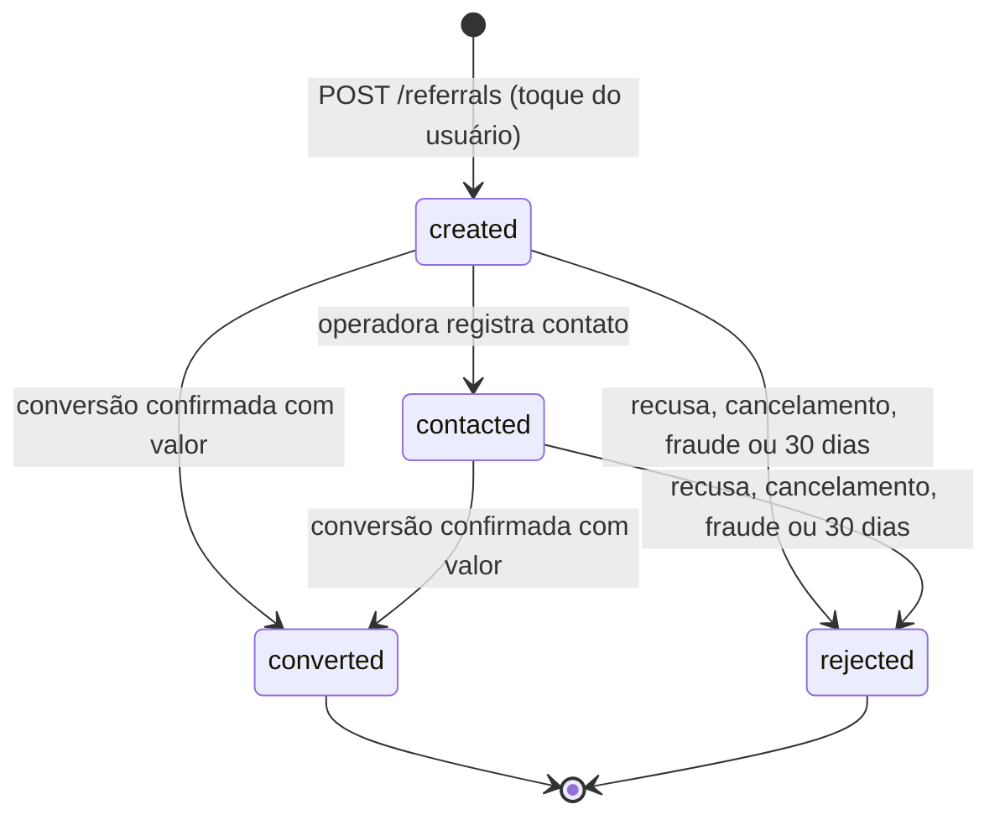

# 12 — Cobrança e SVAs

> **Resumo:** A TrackSys integra a conta Asaas da própria operadora em vez de migrar a cobrança. Ela sincroniza clientes, assinaturas e cobranças, recebe webhooks autenticados e idempotentes e reconcilia todo dia. Também mostra o PIX no app e marca inadimplência como `suspended_commercial`, sem efeito físico. Por split, retém R$ 3,90 por veículo para a carteira da Versix, com fechamento mensal em `platform_fee`. A segunda parte define os serviços de valor agregado (SVA) por fase e o motor de indicações: parceiros, consentimento por parceiro e finalidade, estados, antifraude, repartição e relatório mensal.
> **Fases:** F1, F2, F3  ·  **Status:** Aprovado para execução
> **Muda em relação à v1.1:**
> - A v1.1 excluía faturamento. A cobrança vira paridade com o tracker-net, integrada ao Asaas da operadora ([ADR-011](../adr/ADR-011-integrar-em-vez-de-construir.md)).
> - Entram split de R$ 3,90 por veículo, fechamento mensal com crédito entre períodos e inadimplência sem bloqueio (INV-09).
> - SVA por indicação vira linha de receita, com consentimento por parceiro e transparência. M1 e M5 da v1.1 são reaproveitados para revisões e custos PF no F2.
> - Colisão deixa de ser "detecção" e vira "alerta de possível impacto", só com hardware homologado e sem socorro automático.

## 1. Princípios

1. **Integrar, não migrar.** A cobrança continua na conta Asaas da operadora. A TrackSys lê clientes, assinaturas e cobranças. No Asaas, ela só escreve três coisas: o registro do webhook, o split da Versix e, sob demanda, o cadastro de cliente. Ela nunca cria, altera valor, cancela nem estorna cobrança.
2. **A Versix não cobra o cliente final** ([01 §5](01-visao-e-negocio.md)). O split é o meio de a operadora pagar a tarifa. A conta oficial é o fechamento mensal (§10.2).
3. **Comercial não aciona físico (INV-09).** `billing` não importa `commands` e `commands` não importa `billing` (`pnpm check:boundaries`, [06](06-comandos-e-bloqueio.md)).
4. **IA sem poder financeiro (INV-11).** Nenhuma rota que escreve em cobrança, split, tarifa, parceiro, indicação ou consentimento tem `aiTool: true`. Sessão de suporte é READ ONLY ([08 §12](08-identidade-e-seguranca.md)).
5. **Dinheiro em centavos (INV-12).** No banco, `bigint` com sufixo `_cents`; na API, `valueCents` inteiro. A conversão para reais existe só em `apps/worker/src/billing/asaas/money.ts`.
6. **Indicação só por ação humana (INV-05).** Nenhum job, consumidor de evento, replay, importação ou agente cria `referral`.

## 2. Onde fica o código

| Parte | Caminho |
|---|---|
| Regras puras: mapeamento de status, split, fechamento, inadimplência, dinheiro, repartição, estados da indicação, odômetro | `packages/domain/src/billing/`, `packages/domain/src/sva/` |
| Schemas e rotas | `packages/contracts/src/routes/billing.ts`, `routes/sva.ts`; eventos `events/billing.payment.updated.v1.ts` e `events/referral.created.v1.ts` |
| Textos de consentimento | `packages/contracts/src/consent/texts/<id>-v<N>.md` e `consent/manifest.json` (SHA-256 de cada texto publicado) |
| Webhook e rotas HTTP | `apps/api/src/billing/`, `apps/api/src/sva/` |
| Jobs e cliente Asaas | `apps/worker/src/billing/` (cliente em `billing/asaas/asaas-client.ts`), `apps/worker/src/sva/` |
| Migrations | `packages/db/migrations/*_billing_*.sql`, `*_sva_*.sql` |
| Fakes | `packages/testkit/src/fakes/asaas/`: servidor HTTP que grava requisições, responde por roteiro e dispara webhooks com token. `fakes/partner/` no F2 |

## 3. Dados (acréscimos a [04 §6](04-dominio-e-dados.md))

| Tabela | Tipo RLS | Acrescenta ao modelo canônico |
|---|---|---|
| `billing_account` | C + G | `environment` (`sandbox`, `production`); `status` em `pending_verification`, `active`, `error`, `disabled`; `webhook_secret_ref` = SHA-256 hex (64 caracteres) do token; `provider_webhook_id`; `suspend_after_days` smallint, padrão 15, faixa 0–90, 0 = sem suspensão automática [PREMISSA]; `split_enabled` (padrão `false`); `nfse_enabled` (padrão `false`); `notify_push` (padrão `true`); `last_error`, `verified_at`, `updated_at`. `api_key_ref` aponta para `app.operator_secret` ([08 §8](08-identidade-e-seguranca.md)) |
| `billing_customer` | B | `UNIQUE (operator_id, provider_customer_id)`; `linked_by` (`sync`, `operator`); `auto_suspended_at` NULL |
| `billing_subscription` | B | Nova (DDL abaixo) |
| `invoice` | B | Unicidade **por operadora**: `(operator_id, provider_payment_id)`, porque a mesma conta Asaas pode estar ligada à operadora de bancada. `billing_subscription_id` NULL; `competency` `YYYY-MM` (mês de `due_date`); `status` em `pending`, `overdue`, `paid`, `refunded`, `chargeback`, `cancelled`; `provider_status`; `billing_type`; `provider_event_at`; `invoice_url`; `bank_slip_url`; `pix_expires_at`; `split_cents` (padrão 0); `split_status` em `none`, `requested`, `confirmed`, `failed`, `reversed`, `not_applicable`; `split_confirmed_at`; `paid_outside_provider`; `nfse_url`; `reminded_due_soon_at`, `reminded_overdue_at`, `notified_paid_at`; `updated_at` |
| `billing_event` | C | Nova (DDL abaixo) |
| `platform_fee` | C | `UNIQUE (operator_id, period)`; `price_cents`; `fee_policy` (`charge`, `waive`); `active_vehicles_suspended`; `billable_vehicles`; `split_received_cents`; `waived_split_cents`; `referral_credit_cents`; `credit_in_cents`; `adjustment_cents`; `balance_cents`; `credit_out_cents`; `cutoff_at`; `detail` jsonb (por `tenantId`: veículos, cobráveis, dispensado); `versix_charge_ref`; `status` em `closed`, `invoiced`, `paid` |
| `operator_price` | C | `suspended_fee_policy` (`charge`, `waive`): resultado da DEC-06. Padrão `charge` até a decisão [PREMISSA] |
| `partner` | especial ([04 §6](04-dominio-e-dados.md)) | `terms` jsonb validado por Zod: `termsVersion`, `feeModel` (`fixed`/`percent`), `feeFixedCents`, `feeBps`, `operatorShareBps`; `benefit_text` (≤ 140 caracteres); `service_codes` text[]. F2: `webhook_url`, `webhook_secret_ref` |
| `operator_partner` (F2) | C | Nova: `operator_id`, `partner_id`, `enabled`, `updated_at`. Liga parceiro nacional ao app da operadora |
| `referral` | A + gatilho | `code` (8 caracteres, base32 Crockford); `location_source` (`vehicle`, `phone`); `location_fix_at`; `contacted_at`, `converted_at`, `rejected_at`; `reject_reason` (`expired`, `partner_declined`, `customer_cancelled`, `fraud`, `other`); `fee_cents`, `operator_share_cents`, `versix_share_cents` (gravados na conversão); `transitioned_by` |
| `consent` | A + gatilho | `purpose` em `block_terms`, `sva_referral`, `sva_partner_share`, `sva_maintenance`, `impact_alert`; índice único parcial `(tenant_id, user_id, purpose, coalesce(partner_id, '00000000-0000-0000-0000-000000000000'))` com `revoked_at IS NULL` |

Gatilhos (revisão N0):
- `app.tg_referral_guard`: no escopo `tenant`, só aceita INSERT com `status = 'created'`. UPDATE só no escopo `operator`, só nas transições da §15.2 e sem mudar `split_rule_snapshot`.
- `app.tg_consent_guard`: UPDATE só muda `revoked_at`, de NULL para não NULL.

```sql
-- rls: B · proposta para 04
CREATE TABLE app.billing_subscription (
  id uuid PRIMARY KEY DEFAULT gen_random_uuid(),
  operator_id uuid NOT NULL, tenant_id uuid NOT NULL,
  provider_subscription_id text NOT NULL CHECK (length(provider_subscription_id) BETWEEN 1 AND 100),
  vehicle_id uuid NULL,                         -- NULL = cobre os veículos do cliente sem assinatura própria
  covers_tracking boolean NOT NULL,             -- sync grava (cycle = 'MONTHLY'); a operadora pode trocar
  value_cents bigint NOT NULL CHECK (value_cents >= 0),
  cycle text NOT NULL,                          -- valor do Asaas [VALIDAR — S-A3]
  status text NOT NULL CHECK (status IN ('active', 'inactive', 'deleted')),
  synced_at timestamptz NOT NULL DEFAULT now(),
  CONSTRAINT billing_subscription_tenant_fk FOREIGN KEY (operator_id, tenant_id) REFERENCES app.tenant (operator_id, id),
  CONSTRAINT billing_subscription_vehicle_fk FOREIGN KEY (operator_id, tenant_id, vehicle_id)
    REFERENCES app.vehicle (operator_id, tenant_id, id),
  CONSTRAINT billing_subscription_provider_key UNIQUE (operator_id, provider_subscription_id)
);
-- rls: C · proposta para 04 · payload some em 90 dias; a linha fica 5 anos
CREATE TABLE app.billing_event (
  id uuid PRIMARY KEY DEFAULT gen_random_uuid(),
  operator_id uuid NOT NULL REFERENCES app.operator (id),
  source text NOT NULL CHECK (source IN ('webhook', 'sync')),
  provider_event_id text NOT NULL CHECK (length(provider_event_id) BETWEEN 1 AND 120),
  event_type text NOT NULL CHECK (event_type ~ '^[A-Z_]{3,64}$'),
  provider_payment_id text NULL,
  event_at timestamptz NOT NULL,
  payload jsonb NULL,
  status text NOT NULL DEFAULT 'pending'
    CHECK (status IN ('pending', 'processed', 'ignored', 'unlinked', 'failed')),
  error text NULL,
  received_at timestamptz NOT NULL DEFAULT now(), processed_at timestamptz NULL,
  CONSTRAINT billing_event_dedupe_key UNIQUE (operator_id, source, provider_event_id)
);
-- proposta para a lista fechada de 04 §4.4 (tracksys_app): o webhook não tem contexto antes de autenticar
CREATE FUNCTION app.billing_webhook_token_hash(p_operator_id uuid) RETURNS bytea
  LANGUAGE sql STABLE SECURITY DEFINER SET search_path = pg_catalog, pg_temp
AS $$ SELECT decode(b.webhook_secret_ref, 'hex') FROM app.billing_account b
       WHERE b.operator_id = p_operator_id AND b.status IN ('pending_verification', 'active') $$;
```

`billing_account` ganha a política tipo G `billing_account_definer_read`. A retenção acrescenta dois tipos a `app.retention_purge` ([04 §4.4](04-dominio-e-dados.md)): `billing_event_payload` (zera `payload` com mais de 90 dias) e `referral_location` (zera `location_*` de indicação com mais de 90 dias). As linhas de `invoice`, `platform_fee`, `referral` e `consent` ficam 5 anos.

**Atenção a nomes.** No Asaas, "payment" é a cobrança e "invoice" é a nota fiscal (NFS-e). Na TrackSys, `invoice` é a cobrança (payment do Asaas).

## 4. Vínculo da conta Asaas (F1)

1. O `operator_admin` usa Console › Cobrança e envia `PUT /api/v1/billing/account` com `{environment, apiKey, suspendAfterDays, notifyPush, nfseEnabled}`. A `api` cifra a chave ([REQ-SEG-020](08-identidade-e-seguranca.md)), grava `status = 'pending_verification'` e `audit_log` `billing.credentials_update`, e enfileira `billing.account.verify`. A resposta é 200 com `apiKeyLast4`, sem a chave.
2. O worker chama `GET /v3/wallets` [VALIDAR — S-A1] e grava `wallet_id`. Erros: 401 → `status = 'error'`, `last_error = 'invalid_api_key'`; `wallet_id` igual a `ASAAS_VERSIX_WALLET_ID` → `error` `versix_wallet`.
3. O worker gera o token: 32 bytes aleatórios em base64url, 43 caracteres. Cria ou atualiza o webhook (`POST /v3/webhooks` ou `PUT /v3/webhooks/{provider_webhook_id}`) com:
   - `url = https://api.<TRACKSYS_DOMAIN>/api/v1/webhooks/asaas/<operatorId>`;
   - `authToken` = o token;
   - `sendType = "SEQUENTIALLY"`;
   - os eventos da §6 [VALIDAR — S-A2, S-A3].

   Na mesma transação, grava o SHA-256 em `webhook_secret_ref` e muda `status` para `active`. O token nunca é persistido nem logado. Trocar a chave (novo PUT) gera token novo.
4. Enfileira `billing.customers.sync`.
5. `split_enabled` muda só por CLI do fundador, com `audit_log` (`actor_type = 'system'`, motivo obrigatório): `pnpm --filter @tracksys/worker cli billing:split --operator <id> --enable --reason "<texto>"`. Sem a conta Asaas da Versix (DEC-14), o split fica desligado e o fechamento fatura 100% (§10.2).

| Variável | Processo | Regra |
|---|---|---|
| `ASAAS_API_URL_PRODUCTION` / `ASAAS_API_URL_SANDBOX` | worker | URL. Padrões `https://api.asaas.com/v3` e `https://api-sandbox.asaas.com/v3` [VALIDAR — S-A1] |
| `ASAAS_VERSIX_WALLET_ID` / `ASAAS_VERSIX_WALLET_ID_SANDBOX` | worker | uuid da carteira da Versix |
| `ASAAS_HTTP_TIMEOUT_MS` | worker | Padrão 10000 |
| `BILLING_SPLIT_KILL_SWITCH` | worker | `true` desliga todo split da plataforma. Padrão `false` |

**Cliente HTTP.**
- Header de autenticação `access_token` e `User-Agent: TrackSys/<TRACKSYS_VERSION>` [VALIDAR — S-A1].
- Uma chamada por vez por operadora (semáforo em memória: um processo `worker` no F1).
- 5 tentativas com espera de 30 s, 2 min, 10 min, 30 min e 1 h. Em 429, respeita `Retry-After`.
- Um 401 em qualquer job marca a conta como `error` e suspende os jobs dessa operadora até um novo PUT.

## 5. Sincronização (F1)

| Job (fila pg-boss) | Quando (UTC) | Faz |
|---|---|---|
| `billing.account.verify` | Após o PUT; diário às 05:03 | Valida a chave e o `wallet_id`; garante o webhook ativo |
| `billing.customers.sync` | Após verificar; diário às 05:13 | Lista clientes. Liga por documento: dígitos de `cpfCnpj` iguais aos de `tenant.document` na operadora, com exatamente 1 tenant. 0 tenants → `no_match`; 2 ou mais → `ambiguous`. Os dois casos vão para `GET /api/v1/billing/unlinked-customers`. Vínculo manual: `POST /api/v1/billing/customers/link` `{tenantId, providerCustomerId}` |
| `billing.subscriptions.sync` | Diário às 05:18 | Assinaturas dos clientes ligados → `billing_subscription`. A operadora ajusta `coversTracking` e `vehicleId` em `PATCH /api/v1/billing/subscriptions/{id}` |
| `billing.reconcile` | Diário às 05:23; `POST /api/v1/billing/reconcile` (202) | §7 |
| `billing.split.apply` | `invoice` elegível criada ou alterada (chave única `invoiceId`) | §10.1 |
| `billing.pix.refresh` | Cobrança pendente nova; leitura com PIX vencido (chave única `invoiceId`) | §9 |
| `billing.payment.refresh` | Evento `stale` no webhook (chave única `invoiceId`) | §6, passo 5 |
| `billing.delinquency` | Diário às 09:07; após cada `billing.payment.updated.v1` | §8 |
| `billing.reminders` | Diário às 15:00 (12:00 BRT) | §8 |
| `billing.close_period` | Dia 1 às 06:00 | §10.2 |

Cadastro de cliente no Asaas (P2): `POST /api/v1/tenants/{tenantId}/billing-customer` enfileira `POST /v3/customers` com `externalReference = tenantId`. A TrackSys não cria nem edita assinatura nem cobrança.

## 6. Webhook (F1)

1. **Hook `onRequest`, antes de ler o corpo.**
   - `operatorId` deve ser uuid e o header `asaas-access-token` deve existir [VALIDAR — S-A2]. Senão, 401 `WEBHOOK_UNAUTHORIZED`.
   - O SHA-256 do header é comparado com `app.billing_webhook_token_hash(operatorId)` por `timingSafeEqual`. NULL ou diferente → 401 (operadora inexistente também recebe 401).
   - Limite de 600 req/min por operadora ([08 §9](08-identidade-e-seguranca.md)).
2. Corpo ≤ 256 KiB, validado por Zod tolerante (campos extras são ignorados): `{id, event, dateCreated?, payment?}`. O `payload` guarda só `id`, `customer`, `subscription`, `value`, `netValue`, `status`, `dueDate`, `paymentDate`, `confirmedDate`, `billingType`, `invoiceUrl`, `bankSlipUrl`, `deleted` e `split`.
3. Transação `withContext({ scope: 'operator', operatorId })` com `statement_timeout` de 5 s: `INSERT billing_event ... ON CONFLICT (operator_id, source, provider_event_id) DO NOTHING`. Em conflito: COMMIT e 200 `{"result":"duplicate"}`.
4. Os casos abaixo respondem 200 `ignored`:
   - evento fora da lista ou sem `payment` → `status = 'ignored'`;
   - cliente sem `billing_customer` → `unlinked`. A `invoice` nasce no sync depois do vínculo.
5. `applyPaymentSnapshot` (`packages/domain/src/billing/`) aplica a mudança. `event_at` = `dateCreated` do evento, lido em America/Sao_Paulo quando vier sem fuso [VALIDAR — S-A2]; ausente → `received_at`.
   - `event_at ≤ invoice.provider_event_at` → `ignored` com `error = 'stale'` e job `billing.payment.refresh` (`GET /v3/payments/{id}`, aplicado como evento `sync`, chave única `invoiceId`). A dúvida de ordem se resolve pela API em ≤ 1 min.
   - Senão: upsert da `invoice` pela tabela abaixo, `provider_event_at = event_at` e, se o status mudou, outbox `billing.payment.updated.v1` com `{eventId, operatorId, tenantId, invoiceId, status, previousStatus, dueDate, source, replay}`.
6. COMMIT → 200 `processed`. Erro inesperado → ROLLBACK e 500. O Asaas reenvia [VALIDAR — S-A7] e a §7 cobre o que se perder. Nada aqui lê ou escreve comando (INV-09).

| `payment.status` do Asaas [VALIDAR — S-A3] | `invoice.status` | Split |
|---|---|---|
| `PENDING`, `AWAITING_RISK_ANALYSIS` | `pending` | Pode aplicar |
| `OVERDUE`, `DUNNING_REQUESTED` | `overdue` | Pode aplicar |
| `CONFIRMED` | `paid` | Continua `requested` (dinheiro ainda não liquidado) |
| `RECEIVED`, `DUNNING_RECEIVED` | `paid` | `confirmed` se `split_cents > 0`; `split_confirmed_at` = data do pagamento |
| `RECEIVED_IN_CASH` | `paid`, `paid_outside_provider = true` | `not_applicable` |
| `REFUNDED`, `REFUND_REQUESTED`, `REFUND_IN_PROGRESS` | `refunded` | `reversed` se estava `confirmed` |
| `CHARGEBACK_REQUESTED`, `CHARGEBACK_DISPUTE`, `AWAITING_CHARGEBACK_REVERSAL` | `chargeback` | `reversed` se estava `confirmed` |
| `deleted = true` | `cancelled` | `not_applicable` |
| Outro valor | Sem mudança; evento `failed` com `unknown_status` | — |

Eventos assinados [VALIDAR — S-A3]: `PAYMENT_CREATED`, `PAYMENT_UPDATED`, `PAYMENT_CONFIRMED`, `PAYMENT_RECEIVED`, `PAYMENT_OVERDUE`, `PAYMENT_DELETED`, `PAYMENT_RESTORED`, `PAYMENT_REFUNDED`, `PAYMENT_RECEIVED_IN_CASH_UNDONE`, `PAYMENT_CHARGEBACK_REQUESTED`, `PAYMENT_CHARGEBACK_DISPUTE`, `PAYMENT_AWAITING_CHARGEBACK_REVERSAL`, `PAYMENT_SPLIT_CANCELLED`. Os eventos de split cancelado marcam `split_status = 'failed'`.

## 7. Reconciliação diária

1. Para cada operadora com conta `active`, o job percorre as cobranças em páginas de 100 [VALIDAR — S-A3, nomes dos filtros]: as de vencimento em [hoje − 60 dias, hoje + 45 dias] e todas as `OVERDUE`.
2. Cada cobrança vira um evento sintético com:
   - `source = 'sync'`;
   - `provider_event_id = 'sync:<paymentId>:<16 primeiros hex de SHA-256(status|value|dueDate|paymentDate|deleted)>'`;
   - `event_at = now()`.

   O evento passa pelo mesmo `applyPaymentSnapshot`. Estado igual gera o mesmo id e é deduplicado.
3. Uma `invoice` não paga dentro da janela que não veio na listagem é consultada por `GET /v3/payments/{id}`. Se a resposta for 404, vira `cancelled`.
4. Mudança vinda do sync é divergência: aparece em `GET /api/v1/billing/divergences?date=YYYY-MM-DD` e gera evento com `replay: true`, que não dispara push (INV-05).
5. Saúde do webhook: o job chama `GET /v3/webhooks/{provider_webhook_id}`. Com `interrupted = true` ou `enabled = false`, reativa por PUT e alerta o fundador (Pushover) e o `operator_admin` (e-mail) [VALIDAR — S-A7]. Mais de 5 divergências no dia também geram alerta ao fundador.

## 8. Inadimplência e status comercial

**Regra.** `inadimplente(t, hoje)` vale quando:
- `suspend_after_days > 0`; e
- existe `invoice` de `t` com `status = 'overdue'` e `due_date ≤ hoje (BRT) − suspend_after_days`.

`hoje` é a data em America/Sao_Paulo.

| Situação | Ação do `billing.delinquency` (via serviço público de `fleet`) |
|---|---|
| Inadimplente e `tenant.status = 'active'` | Muda para `suspended_commercial`. Grava `billing_customer.auto_suspended_at` e `audit_log` `tenant.commercial_suspend` (`actor_type = 'system'`). Envia 1 push ao `tenant_owner`: "Há uma fatura em aberto. Toque para pagar." |
| Não inadimplente, `suspended_commercial` e `auto_suspended_at` preenchido | Muda para `active`, limpa `auto_suspended_at` e grava `audit_log` `tenant.commercial_reactivate` |
| Suspensão manual da central (`auto_suspended_at` NULL) | Nunca é desfeita pelo job |
| `tenant.status = 'closed'` | Nunca é alterado |

**Efeitos de `suspended_commercial` (INV-09).** Mapa, histórico, alertas de segurança e push, modo vigilância, ocorrência, links temporários, bloqueio e desbloqueio (pela política de [06](06-comandos-e-bloqueio.md)) e botão de parceiro continuam iguais. Mudam três coisas:
- o app do `tenant_owner` mostra o banner "Pagamento pendente" com o botão "Pagar com PIX" para a fatura aberta mais antiga;
- o console mostra o selo "Suspenso (comercial)";
- a tarifa da Versix segue a DEC-06 (§10.2).

`tenant_member` não vê faturas nem o banner ([08 §3](08-identidade-e-seguranca.md)).

**Lembretes (P2).**
- `billing.reminders` envia "Sua fatura vence em 3 dias" (D−3) e "Sua fatura venceu. Toque para pagar com PIX." (D+1). O push "Pagamento confirmado" sai quando o webhook muda o status para `paid` com `replay: false`.
- Push sem valor nem nome, canal Android `billing` (importância padrão), só ao `tenant_owner`. Usa o serviço de push de [07 §7](07-alertas-e-tempo-real.md).
- A deduplicação é por UPDATE condicional nas colunas `reminded_*`/`notified_paid_at` (`... WHERE reminded_due_soon_at IS NULL RETURNING id`).
- `notify_push = false` desliga os três.

## 9. PIX no app (F1)

1. Cobrança elegível: `status` em `pending` ou `overdue`, conta `active`. O worker chama `GET /v3/payments/{id}/pixQrCode` [VALIDAR — S-A6] e grava `pix_payload` (copia-e-cola EMV) e `pix_expires_at`. A imagem base64 do Asaas é descartada: o app desenha o QR a partir do payload (`qr_flutter`, correção de erro M).
2. `GET /api/v1/invoices/{id}` responde `pixStatus`:
   - `available`: payload presente e validade > agora + 10 min;
   - `refreshing`: enfileira `billing.pix.refresh` com chave única, e o app consulta a cada 3 s por até 30 s;
   - `unavailable`: cobrança paga, cancelada ou recusada pelo Asaas, com `pixUnavailableReason`, por exemplo `no_pix_key`. O app mostra o botão `invoiceUrl`.
3. A TrackSys nunca gera BR Code. A requisição do app nunca chama o Asaas ([REQ-ARQ-008](03-arquitetura.md)).
4. `splitCents` e `splitStatus` só aparecem no escopo `operator`.

```json
{ "id": "0192a1b2-0000-7000-8000-00000000c001", "tenantId": "0192a1b2-0000-7000-8000-0000000000a1",
  "valueCents": 4990, "dueDate": "2026-11-10", "competency": "2026-11", "status": "pending",
  "billingType": "boleto", "invoiceUrl": "https://www.asaas.com/i/000000000001",
  "pixStatus": "available", "pixPayload": "00020101021226820014br.gov.bcb.pix...6304A1B2",
  "pixExpiresAt": "2026-11-12T02:59:59Z", "paidAt": null }
```

## 10. Split e fechamento mensal

### 10.1 Split por cobrança

**Elegibilidade.** Todos os itens precisam valer:
- `split_enabled = true`, `BILLING_SPLIT_KILL_SWITCH = false` e `wallet_id` da operadora diferente da carteira da Versix;
- a cobrança vem de `billing_subscription` com `covers_tracking = true`;
- `status` em `pending` ou `overdue`, `competency ≥ 2026-11` ([REQ-NEG-002](01-visao-e-negocio.md));
- nenhuma outra `invoice` da mesma assinatura e competência tem split `requested` ou `confirmed`.

Cobrança avulsa (instalação, multa) e cobrança fora dessas condições ficam `not_applicable`.

**Quantidade de veículos `N`.** A regra de veículo ativo é a de [REQ-NEG-002](01-visao-e-negocio.md), avaliada no momento do job:
- assinatura com `vehicle_id`: `N` = 1 se o veículo tem vínculo primário ativo na competência; senão 0;
- assinatura sem `vehicle_id`: `N` = veículos ativos do cliente menos os que têm assinatura própria ativa com `covers_tracking`.

**Valor.** `split_cents = N × price_cents` do plano `base` vigente na competência ([REQ-NEG-001](01-visao-e-negocio.md)). Com `N = 0`, fica `not_applicable`. Com `split_cents ≥ value_cents`, fica `failed` com `value_too_low`.

**Envio** [VALIDAR — S-A4]:

```json
PUT /v3/payments/pay_000010
{ "split": [ { "walletId": "<ASAAS_VERSIX_WALLET_ID>", "fixedValue": 3.9, "externalReference": "tracksys:<invoiceId>" } ] }
```

Antes do PUT, o job relê a cobrança. Se ela já tem split para a carteira da Versix, só grava o estado e não envia de novo. Sucesso grava `split_status = 'requested'`. O split é uma estimativa; a conta oficial é o fechamento.

**Plano B (S-A4).** Se o Asaas não aceitar split em cobrança existente, o job aplica o mesmo cálculo no split da assinatura (`PUT /v3/subscriptions/{id}`) sempre que `N` mudar. Se nenhum dos dois funcionar, `split_enabled` fica `false`.

### 10.2 Fechamento mensal (`platform_fee`)

`billing.close_period` roda no dia 1 de P+1 às 06:00 UTC, antes do relatório de [REQ-NEG-004](01-visao-e-negocio.md) (09:00 UTC). Uma transação por operadora, no escopo `operator`. Períodos anteriores a 2026-11 não geram linha. Período fechado não é recalculado: rodar de novo devolve a linha existente.

| Termo | Cálculo |
|---|---|
| `active_vehicles` / `active_vehicles_suspended` | [REQ-NEG-002](01-visao-e-negocio.md). Suspenso = cliente `suspended_commercial` em `cutoff_at` |
| `fee_policy` | `operator_price.suspended_fee_policy` vigente em P (DEC-06) |
| `billable_vehicles` | `active_vehicles − (fee_policy = 'waive' ? active_vehicles_suspended : 0)` |
| `amount_cents` | `billable_vehicles × price_cents` |
| `split_received_cents` | Σ `split_cents` das `invoice` com `split_confirmed_at` em (`cutoff_at` anterior, `cutoff_at`], menos Σ dos splits que viraram `reversed` na mesma janela. Exclui os do item seguinte |
| `waived_split_cents` | Splits confirmados na janela de cobranças cuja competência C teve o cliente dispensado: em `platform_fee(C).detail` se C < P, ou neste fechamento se C = P. É receita da Versix e não abate saldo |
| `referral_credit_cents` | Parte da operadora nas indicações convertidas em P (§15.4) |
| `credit_in_cents` | `credit_out_cents` do período anterior |
| `adjustment_cents` | Ajuste manual pela CLI `billing:adjust`, com motivo e `audit_log`. Nunca por IA (INV-11) |
| `balance_cents` | `amount_cents − split_received_cents − referral_credit_cents − credit_in_cents + adjustment_cents` |
| Liquidação | `balance_cents > 0` → `settled_via = 'invoice'`, `credit_out_cents = 0`, a Versix cobra `balance_cents` com vencimento no dia 10 de P+1. `balance_cents ≤ 0` → `settled_via = 'split'`, `credit_out_cents = −balance_cents` |

A cobrança da Versix à operadora sai da conta Asaas da Versix. No F1, o fundador a emite à mão e registra `versix_charge_ref` (`billing:fee-charge`) e o pagamento (`billing:fee-paid`). No F2, sai pela API [PREMISSA]. A adesão segue a mesma conta ([Anexo A](../anexos/A-comercial.md)).

## 11. NFS-e opcional (F1, P2)

`nfse_enabled = false` (padrão; a Lider é MEI): a TrackSys não chama as rotas fiscais do Asaas. `true`: a operadora configura a emissão automática no próprio Asaas; a TrackSys só lê o link da nota quando o Asaas o informar e o mostra em `invoice.nfse_url` [VALIDAR — S-A8]. A TrackSys nunca emite nota.

## 12. Spike Asaas (1º dia da tarefa de cobrança, sandbox)

| ID | Verificar | Padrão seguro até validar |
|---|---|---|
| S-A1 | URLs, header `access_token`, `User-Agent` obrigatório, `GET /v3/wallets` | Bloqueia a tarefa |
| S-A2 | Nome do header do token, formato de `id` e `dateCreated` do evento | Sem header → 401; sem `dateCreated` → `received_at` |
| S-A3 | Nomes exatos de eventos, status, `cycle` e filtros de listagem | Valor desconhecido → `ignored`/`failed` + reconciliação |
| S-A4 | Split em cobrança existente via PUT; split em assinatura; split em conta MEI | `split_enabled = false`; fechamento fatura 100% |
| S-A5 | Desfazimento do split em estorno e chargeback; campo de status do split | `refunded`/`chargeback` após `confirmed` → `reversed` |
| S-A6 | `pixQrCode`: validade; cobrança `BOLETO` com PIX | PIX `unavailable` → `invoiceUrl` |
| S-A7 | Reenvio, ordem e interrupção da fila de webhooks | Reconciliação diária + verificação da fila |
| S-A8 | Limites de taxa; eventos e link de NFS-e | 1 chamada por vez por operadora; sem link de nota |

## 13. SVA: catálogo por fase

| SVA | Fase | Parceiro | Acionamento | Integração | Receita | Plano |
|---|---|---|---|---|---|---|
| Guincho | F1 | Local da Lider (`scope = 'operator'`) | Botão "Chamar guincho" | Deep link WhatsApp/telefone com código, placa e localização | Valor por indicação convertida, acordado com o parceiro. Pode ser R$ 0 no F1, só para medir volume [PREMISSA] | Base |
| Assistência 24h (guincho, pane seca, pneu, bateria, chaveiro) | F2 | Nacional (Versix) ou local | Botão "Assistência 24h" | Webhook assinado + portal do parceiro; plano B: WhatsApp/telefone | Idem | Base |
| Revisões com oficinas | F2 | Oficinas locais ou nacionais | Lembrete por km/tempo → "Agendar com oficina" | WhatsApp/portal | Idem | Candidato a superior (DEC-09) |
| Gestão de custos PF | F2 | — | Tela "Custos" | — | Plano superior (DEC-09) | Candidato a superior |
| Alerta de possível impacto | F3 | — (contatos de emergência e central) | Automático, só com hardware homologado | Push + fila da central | — | A definir |

A operadora liga e desliga cada SVA no próprio app: parceiro local por `partner.status`; nacional por `operator_partner.enabled` (F2). A ordem dos parceiros na tela é por categoria e nome (F1) ou distância (F2). Ela nunca depende da remuneração.

## 14. Parceiros e repartição

| Parceiro | Quem fecha | Quem paga a indicação | Parte da operadora | Situação |
|---|---|---|---|---|
| Nacional (`scope = 'platform'`) | Versix | Parceiro → Versix | Proposta 20–30% (`operatorShareBps` 2000–3000) | DEC-05. Parceiro nacional não sai de `draft` antes dela |
| Local (`scope = 'operator'`) | Operadora | Parceiro → Versix | Proposta 50% (`operatorShareBps` 5000) | [NOVA DECISÃO PROPOSTA: ampliar a DEC-05 para cobrir a divisão de parceiro local, proposta 50%; [01 §5](01-visao-e-negocio.md) registra a alternativa de 70–80% para a operadora] |

**Conta da repartição** (inteiros, `packages/domain/src/sva/fee.ts`):
- `fee_cents = feeModel = 'fixed' ? feeFixedCents : floor(converted_value_cents × feeBps / 10000)`;
- `operator_share_cents = floor(fee_cents × operatorShareBps / 10000)`;
- `versix_share_cents = fee_cents − operator_share_cents`.

`split_rule_snapshot` copia `partner.terms` na criação da indicação. Mudar os termos não altera indicações existentes. O `operator_admin` cadastra parceiro local por `POST`/`PATCH /api/v1/partners` (permissão `partner.manage`). Parceiro `platform` só nasce por migration revisada (N0) no F2.

## 15. Motor de indicações

### 15.1 Botão do parceiro (F1)

1. O app carrega `GET /api/v1/partners?vehicleId=` e guarda os contatos por 24 h no aparelho, para funcionar sem rede.
2. Com consentimento ativo e atual, o toque envia `POST /api/v1/referrals` com `Idempotency-Key` (UUID gerado no toque) e `{vehicleId, partnerId, service, location: {source: "vehicle"}}`. A resposta é 201 `{id, code, status, whatsappUrl, telUrl}` e o app abre `whatsappUrl`, ou `telUrl` se o parceiro não tem WhatsApp.
3. Sem consentimento, o app mostra o texto (§16) e dois botões. "Aceitar e chamar" grava o consentimento e segue o passo 2. "Chamar sem registrar" abre o contato com a mensagem sem código e não grava nada.
4. Falha de rede, 429 ou 5xx: o app abre o contato com a mensagem sem código. **Nenhuma regra desta seção impede o contato com o parceiro.**
5. Mensagem, em texto pré-preenchido do WhatsApp: `Olá, sou cliente da {operadora} (indicação TrackSys {code}). Preciso de {serviço} para o {modelo} {cor}, placa {placa}. Localização: https://maps.google.com/?q={lat},{lon} (posição de {HH:mm}).`
   - A localização vem do último fix válido de `device_state`.
   - Sem fix nas últimas 24 h, ou por escolha do usuário, usa a do celular (`location_source = 'phone'`).
   - O horário da posição aparece sempre.
6. Outbox `referral.created.v1` com `{referralId, operatorId, tenantId, partnerId, service, createdAt}`, sem localização.

### 15.2 Estados



`POST /api/v1/referrals/{id}/transitions` com `{to, convertedValueCents?, reason?}` e permissão `referral.manage` (`operator_admin`, `operator_agent`). Regras:
- no F1, a conversão é manual pela operadora. No F2, também pelo portal ou API do parceiro;
- `converted` exige `convertedValueCents` inteiro entre 0 e 1.000.000 (R$ 10.000,00) [PREMISSA] e grava `fee_cents` e as partes;
- `rejected` exige `reason`;
- estados finais não mudam: correção só como `adjustment_cents` no fechamento;
- `audit_log` `referral.contact|convert|reject`;
- `sva.referrals.expire` (diário às 06:37 UTC) rejeita com `expired` as indicações `created`/`contacted` com mais de 30 dias [PREMISSA].

### 15.3 Antifraude

1. **Dedupe.** O mesmo (`partner_id`, `vehicle_id`) em 24 h devolve a indicação existente: 200 com `deduplicated: true`, sem linha nova.
2. **Limite.** Até 3 indicações novas por usuário por dia BRT [PREMISSA]. Acima disso: 429 `RATE_LIMITED` com `reason = 'referral_daily_limit'`, e o app abre o contato mesmo assim.
3. **Escopo.** Só para veículo no escopo RLS do usuário e parceiro ativo e visível à operadora.
4. **Quem converte.** Nunca o cliente nem agente de IA.
5. **Revisão no relatório.** O relatório marca para revisão: mais de 2 conversões do mesmo veículo no mês, e conversão menos de 5 min após a criação [PREMISSA].

### 15.4 Relatório mensal e repasse

`GET /api/v1/referrals/report?period=YYYY-MM` (`?format=csv`) traz uma linha por parceiro com:
- criadas, por `created_at` no mês BRT;
- contatadas, por `contacted_at`, e convertidas, por `converted_at`, no mês;
- rejeitadas, por motivo, por `rejected_at` no mês;
- Σ `converted_value_cents`, Σ `fee_cents`, Σ parte da operadora, Σ parte da Versix e as marcas de revisão.

A operadora vê só a própria; o `platform_admin` vê o consolidado ([REQ-NEG-004](01-visao-e-negocio.md)). No F1, o fundador cobra o parceiro pelo relatório, à mão. No F2, pela conta Asaas da Versix [PREMISSA]. [NOVA DECISÃO PROPOSTA: a parte da operadora vira `referral_credit_cents` no fechamento do mesmo período (§10.2); o saldo credor acima de R$ 100,00 é transferido por PIX pelo fundador até o dia 10; inadimplência do parceiro é risco da Versix no F1–F2.]

## 16. Consentimento e transparência

| `purpose` | `partner_id` | Quem aceita | Texto | Fase | Sem aceite |
|---|---|---|---|---|---|
| `block_terms` | NULL | `tenant_owner` | `block-terms-v{N}/{kmh}kmh` ([06 §12](06-comandos-e-bloqueio.md)) | F1 | Bloqueio indisponível |
| `sva_referral` | Obrigatório | Usuário que chama | `sva-referral-v{N}` | F1 | "Chamar sem registrar" |
| `sva_partner_share` | Obrigatório | Usuário | `sva-partner-share-v{N}`: envio automático de dados ao parceiro por API | F2 | Só WhatsApp/telefone |
| `sva_maintenance` | NULL | `tenant_owner` | `sva-maintenance-v{N}`: km para lembretes e oferta de oficinas | F2 | Sem lembretes |
| `impact_alert` | NULL | `tenant_owner` | `impact-alert-v{N}`: alerta de possível impacto e contatos | F3 | Recurso desligado |

1. **Gravar e revogar.** `POST /api/v1/me/consents` com `{tenantId, purpose, partnerId?, textVersion}` → 201 (`block_terms` entra pela rota de [06](06-comandos-e-bloqueio.md), que usa este serviço). `DELETE /api/v1/me/consents/{consentId}` → 204 com `revoked_at`. Um novo aceite é uma linha nova.
2. **Validade.** Consentimento válido = linha ativa com `text_version` igual à versão publicada vigente. Versão anterior responde `consent.status = "outdated"`.
3. **Textos imutáveis.** Texto publicado não muda. `pnpm contracts:check` falha se um arquivo listado em `consent/manifest.json` mudar de SHA-256. Mudança de texto = arquivo novo `-v{N+1}`. Revisão jurídica: DEC-08 ([Anexo B](../anexos/B-juridico.md)).
4. **Revogar não apaga.** Revogar não apaga indicações anteriores: são registro financeiro de 5 anos, com localização zerada após 90 dias (§3).
5. **Transparência (CDC, dever de informação).**
   - Todo parceiro remunerado sai em `GET /api/v1/partners` com `paidReferral: true` e `disclosure`: "A {operadora} e a Versix podem receber remuneração deste parceiro pela indicação."
   - O card mostra o selo "Indicação remunerada" e `benefit_text`.
   - O texto de consentimento repete a frase de `disclosure`.

Texto `sva-referral-v1` (modelo; revisão em DEC-08):

> Ao tocar em "Aceitar e chamar", você autoriza a {operadora} e a Versix Solutions (plataforma TrackSys) a registrar esta indicação ao parceiro {parceiro}: data e hora, veículo (placa, modelo e cor), serviço pedido e a localização enviada. Usamos esses dados para encaminhar o pedido, confirmar o atendimento com o parceiro e apurar a remuneração da indicação. A {operadora} e a Versix podem receber remuneração deste parceiro pela indicação. Você pode revogar em Perfil › Privacidade; indicações já registradas ficam guardadas por 5 anos por obrigação legal. Você também pode chamar o parceiro sem registrar a indicação.

## 17. SVAs do F2 e do F3

**Assistência 24h (F2).** Com `sva_partner_share` e `partner.webhook_url`, o job `sva.partner.notify` consome `referral.created.v1` e envia `POST` ao parceiro.
- Corpo: `{referralId, code, service, vehicle{plate, model, color}, location{latitude, longitude, fixTime}, customer{firstName, phone}}`, sem CPF.
- Header `X-TrackSys-Signature: t=<unix>,v1=<hex HMAC-SHA256(segredo, t + "." + corpo)>`. O parceiro rejeita `t` com mais de 300 s.
- Entrega única por `referralId` (coluna `partner_notified_at`).
- Sem consentimento ou sem webhook, vale o fluxo da §15.1.
- O portal do parceiro (`/api/v1/partner/*`) registra contato e conversão. Identidade do parceiro: [08](08-identidade-e-seguranca.md).

**Revisões (F2; reaproveita M1 da v1.1, p. 27).**
- `sva.odometer.daily` (04:43 UTC) recalcula `vehicle_daily_distance` (`vehicle_id`, dia BRT, `distance_m`, `gap_distance_m`) dos dias d−1 a d−3 e dos dias com fix `LATE`. A conta é idempotente: sobrescreve por (veículo, dia).
  - Distância: soma haversine entre fixes válidos consecutivos do vínculo primário.
  - Trecho com velocidade implícita > 250 km/h é descartado.
  - Trecho com Δt > 600 s conta em linha reta e soma em `gap_distance_m`.
  - Cobertura < 90% → o app mostra "estimado" (INV-03).
- Odômetro = `offset_m` + Σ `distance_m`. A calibração do usuário (leitura do painel) vale a partir do início do dia BRT da calibração: `offset_m = leitura − Σ distance_m dos dias anteriores`.
- Plano por veículo: `interval_m` e/ou `interval_days`. Vence quando `odômetro ≥ km do último serviço + interval_m` ou quando `hoje ≥ data do último serviço + interval_days`.
- Um episódio por (veículo, plano, ciclo). Só o registro de serviço (data, leitura, responsável) inicia novo ciclo. Salto negativo ou recalibração nunca conclui ciclo.
- "Agendar com oficina" usa a §15.1. Lembrete vencido nunca cria indicação sozinho (INV-05).

**Gestão de custos PF (F2; reaproveita M5, p. 28).**
- `vehicle_expense` (tipo A): `category` (`fuel`, `ipva`, `insurance`, `licensing`, `maintenance`, `parking`, `toll`, `fine`, `other`), `amount_cents`, `spent_on`, `odometer_m`, `liters_ml`.
- Custo por km do mês = Σ `amount_cents` / (Σ `distance_m` / 1000), arredondado para o centavo.
- Estimativa de combustível = km / consumo (km/L) × preço por litro + pedágios. É exibida separada da despesa comprovada.

**Alerta de possível impacto (F3).**
- Só existe com perfil `homologated`, `accelerometer = "yes"` ([04 §3.3](04-dominio-e-dados.md)), alarme de impacto homologado [VALIDAR — nome do alarme no Traccar] e `impact_alert` aceito.
- Fluxo:
  1. Alerta `possible_impact` (critical).
  2. Push "Possível impacto detectado. Está tudo bem?". O app mostra "Estou bem" / "Preciso de ajuda" e uma contagem de 30 s a partir do envio.
  3. "Preciso de ajuda", ou nenhuma resposta em 30 s: push aos membros marcados como contato de emergência e item crítico na fila da central.
  4. "Estou bem" encerra o episódio.
- A TrackSys nunca aciona socorro, nunca liga para 190/192 e nunca usa "acidente detectado" nem "socorro a caminho" (lint de strings no app).

## 18. Requisitos — Cobrança

Fixture de [08 §13](08-identidade-e-seguranca.md): operadoras Alfa (Lider) e Beta; clientes A1 (CPF 111.444.777-35) e A2 (CPF 529.982.247-25) da Alfa e B1 da Beta; usuários `admin.alfa`, `agente.alfa`, `dono.a1` e `admin.beta`; veículos V1 (TST1A23, de A1) e V3 (TST3C45, de A1); carteira Versix `7f1c0000-0000-4000-8000-00000000c0de`; preço `base` de 390 centavos.

### REQ-COB-001 — Asaas da operadora como fonte da cobrança
**Fase:** F1 · **Prioridade:** P0 · **Risco:** N0 · **Invariantes:** INV-12
**Regra.** A TrackSys DEVE ler clientes, assinaturas e cobranças da conta Asaas da operadora. Ela NÃO DEVE criar, alterar valor, cancelar nem estornar cobrança. No Asaas, ela só PODE escrever webhook, split e cadastro de cliente (§1, §5).
**Aceite.** CT-COB-001 — Dado a Alfa com conta `active` e 160 clientes, 160 assinaturas e 160 cobranças pendentes no fake, Quando rodam `billing.customers.sync`, `billing.subscriptions.sync` e `billing.reconcile`, Então `invoice` tem 160 linhas e o fake registra 0 `POST /v3/payments`, 0 `DELETE` e 0 `PUT /v3/payments/*` com campo diferente de `split`.

### REQ-COB-002 — Vínculo da conta verificado
**Fase:** F1 · **Prioridade:** P0 · **Risco:** N0 · **Invariantes:** INV-07, INV-11
**Regra.** O vínculo DEVE cifrar a chave ([REQ-SEG-020](08-identidade-e-seguranca.md)), validar a conta, gravar `wallet_id` e registrar o webhook com token novo, persistindo só o SHA-256 (§4). A conta da Versix NÃO DEVE ser aceita como conta de operadora.
**Aceite.** CT-COB-002 — Dado `admin.alfa`, Quando envia `PUT /api/v1/billing/account` com `{"environment":"sandbox","apiKey":"$aact_teste_0001"}` e o fake devolve a carteira `11111111-1111-4111-8111-000000000001`, Então em ≤ 60 s `status = 'active'` e o fake recebeu 1 `POST /v3/webhooks` com `url = https://api.tracksys.com.br/api/v1/webhooks/asaas/<id da Alfa>`, `sendType = "SEQUENTIALLY"` e `authToken` de 43 caracteres cujo SHA-256 é igual a `webhook_secret_ref`; com o fake respondendo 401, Então `status = 'error'`, `last_error = 'invalid_api_key'` e 0 webhooks; com a carteira `7f1c0000-0000-4000-8000-00000000c0de`, Então `error` com `versix_wallet`.

### REQ-COB-003 — Webhook autenticado e idempotente
**Fase:** F1 · **Prioridade:** P0 · **Risco:** N0 · **Invariantes:** INV-01, INV-09
**Regra.** O webhook DEVE autenticar antes de ler o corpo ([REQ-SEG-022](08-identidade-e-seguranca.md)), deduplicar por `(operator_id, source, provider_event_id)`, aplicar o efeito só no Postgres e responder 200 após o COMMIT (§6).
**Aceite.** CT-COB-003 — Dado o evento `PAYMENT_RECEIVED` `evt_000001` da cobrança `pay_000001` de A1 (R$ 49,90), Quando o mesmo POST chega 10 vezes com o token da Alfa, Então a 1ª resposta é 200 `processed`, as outras 9 são 200 `duplicate`, há 1 linha em `billing_event`, `invoice.status = 'paid'`, 1 `billing.payment.updated.v1` na outbox, p95 ≤ 500 ms e o fake do Traccar recebe 0 chamadas; com o evento `CUSTOMER_UPDATED`, Então 200 `ignored`.

### REQ-COB-004 — Mapeamento de status sem regressão
**Fase:** F1 · **Prioridade:** P0 · **Risco:** N0 · **Invariantes:** INV-03, INV-12
**Regra.** O status DEVE seguir a tabela da §6. Evento com `event_at ≤ provider_event_at` NÃO DEVE alterar a `invoice`. Status desconhecido NÃO DEVE virar `paid` nem `overdue`.
**Aceite.** CT-COB-004 — Dado `pay_000002` em `pending`, Quando chega `PAYMENT_RECEIVED` com `dateCreated` 10/11/2026 16:00:00Z e depois `PAYMENT_OVERDUE` com `dateCreated` 10/11/2026 15:00:00Z, Então `invoice.status` termina `paid` e o 2º evento fica `ignored` com `stale`; Quando chega um status `NEW_STATUS_X`, Então a `invoice` não muda e o evento fica `failed` com `unknown_status`.

### REQ-COB-005 — Vínculo de clientes por documento
**Fase:** F1 · **Prioridade:** P1 · **Risco:** N1 · **Invariantes:** INV-07
**Regra.** O sync DEVE ligar cliente Asaas a tenant só quando os dígitos do documento casam com exatamente 1 tenant da operadora. Os demais casos DEVEM ir para a lista de não ligados, com `no_match` ou `ambiguous`. O sync NÃO DEVE criar tenant.
**Aceite.** CT-COB-005 — Dado A1, A2 e os clientes Asaas `cus_000001` (`cpfCnpj = "11144477735"`) e `cus_000002` (`"98765432100"`), Quando `billing.customers.sync` roda duas vezes, Então `billing_customer` tem só A1 ↔ `cus_000001`, `GET /api/v1/billing/unlinked-customers` lista `cus_000002` com `no_match`, A2 fica sem vínculo e a 2ª execução não muda nenhuma linha.

### REQ-COB-006 — Reconciliação diária
**Fase:** F1 · **Prioridade:** P0 · **Risco:** N0 · **Invariantes:** INV-05
**Regra.** `billing.reconcile` DEVE corrigir pela API do Asaas o que o webhook perdeu, registrar a divergência, emitir eventos com `replay: true` (sem push) e reativar a fila de webhooks interrompida (§7).
**Aceite.** CT-COB-006 — Dado `pay_000003` de A1 `pending` no banco e `RECEIVED` no fake sem webhook enviado, e a fila de webhooks do fake com `interrupted = true`, Quando o job roda às 05:23 UTC, Então a `invoice` vira `paid` com `billing_event.source = 'sync'`, `GET /api/v1/billing/divergences` lista `pay_000003`, o fake de FCM recebe 0 mensagens, o fake do Asaas recebe 1 `PUT /v3/webhooks/{id}` com `interrupted = false` e o fundador recebe 1 alerta.

### REQ-COB-007 — Inadimplência sem efeito físico
**Fase:** F1 · **Prioridade:** P0 · **Risco:** N0 · **Invariantes:** INV-09
**Regra.** Cliente inadimplente (§8) DEVE virar `suspended_commercial` e voltar a `active` quando deixar de estar inadimplente, se a suspensão foi automática. Inadimplência NÃO DEVE criar, armar nem impedir comando.
**Aceite.** CT-COB-007 — Dado `suspend_after_days = 15` e a fatura de A1 de R$ 49,90 com vencimento em 01/11/2026 e `overdue`, Quando o job roda em 15/11/2026 09:07 UTC, Então A1 segue `active`; em 16/11/2026 09:07 UTC, Então A1 vira `suspended_commercial`, com `auto_suspended_at` preenchido, `audit_log` `tenant.commercial_suspend` com `actor_type = 'system'` e 0 linhas novas em `command`; Quando o webhook `PAYMENT_RECEIVED` chega às 14:00:00 UTC, Então A1 está `active` às 14:01:00 UTC; Dado A2 suspenso pela central, Quando todas as faturas de A2 ficam pagas, Então A2 continua `suspended_commercial`.

### REQ-COB-008 — Aviso de pagamento sem degradar a segurança
**Fase:** F1 · **Prioridade:** P1 · **Risco:** N1 · **Invariantes:** INV-09
**Regra.** Com `suspended_commercial`, o app do `tenant_owner` DEVE mostrar o banner com PIX. Mapa, alertas, push de segurança, vigilância, ocorrência e desbloqueio NÃO DEVEM mudar.
**Aceite.** CT-COB-008 — Dado A1 `suspended_commercial` e V1 em movimento, Quando o J16 de V1 reporta `powerCut`, Então `dono.a1` recebe o push `power_cut` com p95 ≤ 30 s, `GET /api/v1/vehicles/<V1>` traz o estado ao vivo, o app mostra "Pagamento pendente" com "Pagar com PIX", e `unblock` pedido por `dono.a1` responde 202; o push "Há uma fatura em aberto" chega 1 vez, só na transição.

### REQ-COB-009 — PIX no app com dados do Asaas
**Fase:** F1 · **Prioridade:** P1 · **Risco:** N1 · **Invariantes:** INV-07, INV-12
**Regra.** O payload e a validade do PIX DEVEM vir do Asaas pelo worker. O app DEVE desenhar o QR a partir do payload e oferecer copia-e-cola. A requisição do app NÃO DEVE chamar o Asaas. A TrackSys NÃO DEVE gerar BR Code (§9).
**Aceite.** CT-COB-009 — Dado a fatura de A1 de R$ 49,90 `pending`, com vencimento em 10/11/2026, e o fake devolvendo `payload = "00020101021226820014br.gov.bcb.pix0136teste6304A1B2"` e `expirationDate` 11/11/2026 23:59:59 BRT, Quando `dono.a1` chama `GET /api/v1/invoices/{id}`, Então 200 com `valueCents = 4990`, `pixStatus = "available"`, o mesmo `pixPayload`, `pixExpiresAt = "2026-11-12T02:59:59Z"` e sem `splitCents`; depois da validade, Então `pixStatus = "refreshing"`, duas leituras criam 1 job e há 0 chamadas ao Asaas na requisição; para a fatura de B1, Então 404.

### REQ-COB-010 — Split de R$ 3,90 por veículo em cobrança de rastreamento
**Fase:** F1 · **Prioridade:** P0 · **Risco:** N0 · **Invariantes:** INV-11, INV-12
**Regra.** Cada cobrança elegível (§10.1) DEVE receber um único split de `N × price_cents` para a carteira da Versix. Cobrança avulsa e cobrança sem veículo ativo NÃO DEVEM receber split. O job DEVE ser idempotente por `invoice`.
**Aceite.** CT-COB-010 — Dado A1 com V1 ativo, assinatura `sub_000001` (`covers_tracking = true`, sem `vehicle_id`) e a cobrança `pay_000010` de R$ 49,90 com competência 2026-11, Quando `billing.split.apply` roda, Então o fake recebe `PUT /v3/payments/pay_000010` com corpo `{"split":[{"walletId":"7f1c0000-0000-4000-8000-00000000c0de","fixedValue":3.9,"externalReference":"tracksys:<invoiceId>"}]}`, `split_cents = 390` e `split_status = 'requested'`; com V1 e V3 ativos e cobrança de R$ 99,80, Então `fixedValue = 7.8` e `split_cents = 780`; para a avulsa `pay_000011` de R$ 150,00, Então `not_applicable` e 0 PUT; na 2ª execução, Então 0 PUT novos.

### REQ-COB-011 — Fechamento mensal da tarifa
**Fase:** F1 · **Prioridade:** P0 · **Risco:** N0 · **Invariantes:** INV-06, INV-12
**Regra.** `billing.close_period` DEVE gravar 1 `platform_fee` por operadora e período, com os termos da §10.2. Período fechado NÃO DEVE ser recalculado.
**Aceite.** CT-COB-011 — Dado a Alfa em 2026-11 com 300 veículos ativos, 12 de clientes `suspended_commercial`, splits confirmados na janela somando 105.300 centavos e sem crédito nem indicação, Quando o job roda em 01/12/2026 06:00 UTC com `charge`, Então `amount_cents = 117000`, `billable_vehicles = 300`, `split_received_cents = 105300`, `balance_cents = 11700` e `settled_via = 'invoice'`; com `waive`, Então `billable_vehicles = 288`, `amount_cents = 112320` e `balance_cents = 7020`; Quando o job roda de novo, Então continua 1 linha com os mesmos valores.

### REQ-COB-012 — Crédito, estorno e split tardio entre períodos
**Fase:** F1 · **Prioridade:** P1 · **Risco:** N0 · **Invariantes:** INV-11, INV-12
**Regra.** Split confirmado depois do fechamento da sua competência DEVE entrar na janela seguinte: abate saldo se a tarifa foi cobrada; vira `waived_split_cents` se o cliente foi dispensado. Split estornado DEVE ser descontado na janela em que virou `reversed`. Saldo negativo DEVE virar `credit_out_cents`. Ajuste só PODE vir da CLI humana.
**Aceite.** CT-COB-012 — Dado 2026-11 fechado com `charge`, Quando em 05/12/2026 é confirmado um split de 390 de competência 2026-11 de A1 e 2026-12 fecha com `amount_cents = 117000` e mais 117.000 de splits, Então `split_received_cents = 117390`, `balance_cents = -390`, `settled_via = 'split'`, `credit_out_cents = 390`, e 2027-01 nasce com `credit_in_cents = 390`; Dado `waive` com A1 dispensado em 2026-11, Então os 390 vão para `waived_split_cents` e não abatem saldo; Quando um split de 390 confirmado vira `reversed` em 2026-12, Então `split_received_cents` de 2026-12 cai 390.

### REQ-COB-013 — Dinheiro em centavos na fronteira do Asaas
**Fase:** F1 · **Prioridade:** P0 · **Risco:** N0 · **Invariantes:** INV-12
**Regra.** `money.ts` DEVE converter reais em centavos por `Math.round(v × 100)` e rejeitar valores com mais de 2 casas (`|v × 100 − round| > 1e−6`). Centavos DEVEM virar reais só ao montar o corpo para o Asaas. Valor rejeitado DEVE marcar o evento como `failed` sem alterar a `invoice`.
**Aceite.** CT-COB-013 — Dado `money.ts`, Então `reaisToCents(49.9) = 4990`, `reaisToCents(0.29) = 29`, `reaisToCents(19.99) = 1999`, `centsToReais(390) = 3.9` e `reaisToCents(49.905)` lança `MONEY_NOT_CENTS`; e com fast-check em 10.000 inteiros de 0 a 10¹¹, `reaisToCents(centsToReais(c)) = c`; Quando chega webhook com `value: 49.905`, Então o evento fica `failed` com `invalid_money` e a `invoice` não muda.

### REQ-COB-014 — Lembretes de fatura por push
**Fase:** F1 · **Prioridade:** P2 · **Risco:** N1 · **Invariantes:** INV-05
**Regra.** Lembretes D−3 e D+1 e o aviso de pagamento confirmado DEVEM sair no máximo 1 vez por fatura, só ao `tenant_owner`, sem valor. Evento com `replay: true` NÃO DEVE gerar push (§8).
**Aceite.** CT-COB-014 — Dado a fatura de A1 com vencimento em 10/11/2026, Quando `billing.reminders` roda em 07/11/2026 15:00 UTC e de novo 5 min depois, Então `dono.a1` recebe 1 push "Sua fatura vence em 3 dias" sem "R$" no texto; em 11/11/2026 15:00 UTC com a fatura `overdue`, Então 1 push "Sua fatura venceu"; com `notify_push = false`, Então 0 push; e a mudança para `paid` vinda da reconciliação gera 0 push.

### REQ-COB-015 — NFS-e opcional por operadora
**Fase:** F1 · **Prioridade:** P2 · **Risco:** N1 · **Invariantes:** —
**Regra.** Com `nfse_enabled = false`, a TrackSys NÃO DEVE chamar rotas fiscais do Asaas. Com `true`, ela só DEVE exibir o link informado pelo Asaas. A TrackSys nunca emite nota (§11).
**Aceite.** CT-COB-015 — Dado a Alfa com `nfse_enabled = false`, Quando sync e reconciliação rodam, Então o fake registra 0 chamadas a `/v3/invoices`; Dado `true` e o fake informando o link `https://www.asaas.com/nfse/000001` para `pay_000001`, Então `GET /api/v1/invoices/{id}` devolve `nfseUrl` igual a esse link.

### REQ-COB-016 — Isolamento e fronteiras da cobrança
**Fase:** F1 · **Prioridade:** P0 · **Risco:** N0 · **Invariantes:** INV-07, INV-09, INV-11
**Regra.** Cliente DEVE ver só as próprias faturas, sem split; a operadora DEVE ver só a própria tarifa. Rota de escrita de cobrança, tarifa, parceiro, indicação ou consentimento NÃO DEVE ter `aiTool: true`. Suporte com grant NÃO DEVE escrever.
**Aceite.** CT-COB-016 — Dado `dono.a1`, Quando chama `GET /api/v1/invoices`, Então só vêm faturas de A1; para uma fatura de A2 ou de B1, Então 404; `admin.beta` em `GET /api/v1/platform-fees` vê só a Beta; `platform_admin` com grant da Alfa em `PUT /api/v1/billing/account` recebe 403; o teste do registro de rotas falha se uma rota não GET sob `/billing`, `/invoices`, `/platform-fees`, `/partners`, `/referrals` ou `/me/consents` tiver `aiTool: true`; e `pnpm check:boundaries` falha se `apps/*/src/billing/**` importar `commands`.

## 19. Requisitos — SVA

Parceiros dos CTs: `Guincho Lider` (local da Alfa, WhatsApp +5511999990000, `terms` `fixed` 2000 com 5000 bps), `Guincho Beta` (local da Beta) e `Assist Brasil` (nacional, F2, `fixed` 5000 com 2500 bps).

### REQ-SVA-001 — Parceiros por escopo e habilitação
**Fase:** F1 · **Prioridade:** P1 · **Risco:** N1 · **Invariantes:** INV-07
**Regra.** O app DEVE listar só os parceiros ativos visíveis à operadora do usuário: os locais dela e, no F2, os nacionais habilitados em `operator_partner`. A operadora só PODE cadastrar parceiro `operator`.
**Aceite.** CT-SVA-001 — Dado `Guincho Lider` ativo, `Guincho Beta` ativo e um 2º parceiro local da Alfa `inactive`, Quando `dono.a1` chama `GET /api/v1/partners?vehicleId=<V1>`, Então recebe só `Guincho Lider`; Quando `admin.alfa` envia `POST /api/v1/partners` com `scope = "platform"`, Então 422 e nenhuma linha.

### REQ-SVA-002 — Botão do parceiro nunca bloqueia o contato
**Fase:** F1 · **Prioridade:** P1 · **Risco:** N1 · **Invariantes:** INV-07
**Regra.** O toque DEVE criar a indicação e abrir WhatsApp ou telefone com código, placa, localização e horário da posição. Falha, limite ou falta de consentimento NÃO DEVEM impedir o contato; nesses casos, nada é gravado (§15.1).
**Aceite.** CT-SVA-002 — Dado `dono.a1` com consentimento para `Guincho Lider` e o último fix válido de V1 às 22:10 BRT em (-23.5505200, -46.6333080), Quando toca "Chamar guincho", Então recebe 201 com `code` de 8 caracteres e `whatsappUrl` iniciando por `https://wa.me/5511999990000?text=`, cujo `text` decodificado contém o `code`, "TST1A23", `https://maps.google.com/?q=-23.5505200,-46.6333080` e "posição de 22:10", e `referral.status = 'created'`; com o celular sem rede, Então o app abre o WhatsApp com a mensagem sem código e 0 linhas em `referral`.

### REQ-SVA-003 — Consentimento por parceiro e finalidade
**Fase:** F1 · **Prioridade:** P0 · **Risco:** N1 · **Invariantes:** INV-07
**Regra.** Indicação registrada DEVE exigir `sva_referral` válido do usuário para o parceiro. O texto DEVE ser versionado e imutável, e a revogação DEVE ser imediata, sem apagar indicações anteriores (§16).
**Aceite.** CT-SVA-003 — Dado `dono.a1` sem consentimento, Quando envia `POST /api/v1/referrals` para `Guincho Lider`, Então 422 `CONSENT_REQUIRED` com `purpose = "sva_referral"` e `currentTextVersion = "sva-referral-v1"`; após `POST /api/v1/me/consents`, Então 201; após `DELETE /api/v1/me/consents/{id}`, Então nova indicação recebe 422 e as anteriores continuam no relatório; publicado `sva-referral-v2`, Então o aceite v1 aparece `outdated`; e alterar `sva-referral-v1.md` faz `pnpm contracts:check` falhar.

### REQ-SVA-004 — Transparência da indicação remunerada
**Fase:** F1 · **Prioridade:** P1 · **Risco:** N2 · **Invariantes:** —
**Regra.** Parceiro remunerado DEVE aparecer com o selo "Indicação remunerada" e a frase de `disclosure` na lista e no texto de consentimento. A ordem dos parceiros NÃO DEVE depender da remuneração.
**Aceite.** CT-SVA-004 — Dado `Guincho Lider` com `feeFixedCents = 2000`, Quando `dono.a1` lista parceiros, Então o item tem `paidReferral = true` e `disclosure = "A Lider Rastreamento e a Versix podem receber remuneração deste parceiro pela indicação."`; o teste de widget do card encontra "Indicação remunerada"; e o texto renderizado de `sva-referral-v1` contém a mesma frase.

### REQ-SVA-005 — Estados e conversão da indicação
**Fase:** F1 · **Prioridade:** P1 · **Risco:** N1 · **Invariantes:** INV-11
**Regra.** As transições DEVEM seguir a §15.2, por `referral.manage`, com `audit_log`. Estados finais NÃO DEVEM mudar. O gatilho DEVE recusar UPDATE no escopo `tenant`.
**Aceite.** CT-SVA-005 — Dado uma indicação `created` de `Guincho Lider`, Quando `agente.alfa` envia `{"to":"converted","convertedValueCents":18000}`, Então 200 com `fee_cents = 2000`, `operator_share_cents = 1000`, `versix_share_cents = 1000` e `audit_log` `referral.convert`; depois, `{"to":"contacted"}` → 409 `CONFLICT`; `converted` sem valor → 422; `dono.a1` → 403; ator `ai_agent` → 403; `UPDATE app.referral SET status = 'converted'` no escopo `tenant` → SQLSTATE 42501.

### REQ-SVA-006 — Antifraude de indicações
**Fase:** F1 · **Prioridade:** P1 · **Risco:** N1 · **Invariantes:** —
**Regra.** O sistema DEVE deduplicar (parceiro, veículo) em 24 h e limitar a 3 novas indicações por usuário por dia BRT, sem bloquear o contato (§15.3).
**Aceite.** CT-SVA-006 — Dado `dono.a1` com indicação de `Guincho Lider` para V1 criada às 10:00 BRT, Quando repete às 10:30 e às 09:59 do dia seguinte, Então recebe 200 com o mesmo `id` e `deduplicated = true`; às 10:01 do dia seguinte, Então 201 com linha nova; Dado 3 indicações distintas no dia, Quando cria a 4ª, Então 429 `RATE_LIMITED` com `reason = "referral_daily_limit"` e 0 linhas novas.

### REQ-SVA-007 — Repartição com snapshot
**Fase:** F1 · **Prioridade:** P1 · **Risco:** N0 · **Invariantes:** INV-11, INV-12
**Regra.** A repartição DEVE usar a conta inteira da §14 sobre o `split_rule_snapshot` gravado na criação. Mudança posterior dos termos NÃO DEVE afetar a indicação.
**Aceite.** CT-SVA-007 — Dado um parceiro com `fixed` 5000 e 2500 bps, Então a conversão dá 1250 para a operadora e 3750 para a Versix; Dado `percent` com 1000 bps e 5000 bps de parte da operadora e conversão de 33.330 centavos, Então `fee_cents = 3333`, operadora 1666 e Versix 1667; Quando os termos mudam para 3000 bps após a criação, Então a indicação converte com 2500.

### REQ-SVA-008 — Relatório mensal e repasse
**Fase:** F1 · **Prioridade:** P1 · **Risco:** N0 · **Invariantes:** INV-07, INV-12
**Regra.** O relatório DEVE agregar por parceiro e mês BRT (§15.4) e mostrar só a operadora do contexto. A parte da operadora DEVE entrar como `referral_credit_cents` no fechamento do mesmo período.
**Aceite.** CT-SVA-008 — Dado 2027-03 na Alfa com 4 conversões de `Assist Brasil` e 2 de `Guincho Lider`, 1 rejeitada e 3 criadas, Quando `admin.alfa` pede `GET /api/v1/referrals/report?period=2027-03`, Então `Assist Brasil` tem fee 20000, operadora 5000 e Versix 15000; `Guincho Lider` tem fee 4000, operadora 2000 e Versix 2000; e o fechamento de 2027-03 da Alfa tem `referral_credit_cents = 7000`; `admin.beta` não vê nenhuma linha da Alfa.

### REQ-SVA-009 — Indicação só por ação humana
**Fase:** F1 · **Prioridade:** P0 · **Risco:** N1 · **Invariantes:** INV-05, INV-11
**Regra.** `referral` DEVE nascer só de `POST /api/v1/referrals` com sessão de usuário humano e `Idempotency-Key`. Replay, backfill, relay da outbox, lembrete de revisão, alerta de impacto e agentes de IA NÃO DEVEM criar indicação nem renotificar parceiro.
**Aceite.** CT-SVA-009 — Dado 50 indicações e seus 50 `referral.created.v1`, Quando o relay republica a outbox e um backfill reprocessa 10.000 posições de V1, Então `referral` continua com 50 linhas e o fake de parceiro recebe 0 chamadas novas; e `POST /api/v1/referrals` com ator `ai_agent` responde 403.

### REQ-SVA-010 — Assistência 24h com parceiro integrado
**Fase:** F2 · **Prioridade:** P1 · **Risco:** N1 · **Invariantes:** INV-05, INV-07
**Regra.** Com `sva_partner_share`, a indicação DEVE ser entregue 1 vez ao webhook do parceiro, assinada por HMAC-SHA256, sem CPF. A conversão PODE vir do portal do parceiro (§17).
**Aceite.** CT-SVA-010 — Dado `Assist Brasil` com segredo `whsec_teste_0001` e o consentimento de `dono.a1`, Quando `dono.a1` pede `fuel` para V1, Então o fake do parceiro recebe 1 POST com assinatura válida e corpo com `code`, `service = "fuel"` e "TST1A23", sem `cpf`; reentrega pelo relay → 0 chamadas extras; sem consentimento → 0 chamadas; confirmação pelo portal com 25000 → `converted`.

### REQ-SVA-011 — Revisões por km e tempo com odômetro GPS calibrado
**Fase:** F2 · **Prioridade:** P1 · **Risco:** N1 · **Invariantes:** INV-01, INV-03, INV-05
**Regra.** O vencimento DEVE seguir a §17: um episódio por (veículo, plano, ciclo), novo ciclo só por registro de serviço, salto negativo nunca conclui ciclo, cobertura < 90% exibida como estimada.
**Aceite.** CT-SVA-011 — Dado V1 com último serviço aos 100.000 km e plano de 10.000 km ou 365 dias, Quando o odômetro estimado passa por 109.999 km, 110.000 km e 111.000 km, Então 1 vencimento e 1 push; Quando 10 reprocessamentos da mesma semana rodam, Então 0 vencimentos novos; Quando o usuário recalibra de 111.000 km para 108.000 km, Então o ciclo não é concluído; Dado um trecho de 5 km em 60 s (300 km/h), Então ele não soma distância.

### REQ-SVA-012 — Gestão de custos PF com km real
**Fase:** F2 · **Prioridade:** P2 · **Risco:** N2 · **Invariantes:** INV-03, INV-12
**Regra.** O custo por km DEVE usar as despesas do usuário e o km medido pelo rastreador, com a cobertura exibida. A estimativa de combustível DEVE aparecer separada da despesa comprovada.
**Aceite.** CT-SVA-012 — Dado V1 em 2027-05 com 1.250 km medidos e cobertura de 95%, combustível de R$ 600,00 e manutenção de R$ 150,00, Quando o relatório do mês é pedido, Então total de 75000 centavos e `costPerKmCents = 60`; com cobertura de 70%, Então `estimated = true`; e 100 km a 10 km/L, R$ 6,00/L e R$ 20,00 de pedágio dão `estimatedFuelCostCents = 8000`, marcado como estimado.

### REQ-SVA-013 — Alerta de possível impacto
**Fase:** F3 · **Prioridade:** P1 · **Risco:** N1 · **Invariantes:** INV-03
**Regra.** O alerta DEVE existir só com hardware homologado e `impact_alert` aceito. Ele pergunta "Está tudo bem?" e escala aos contatos e à central sem resposta em 30 s. A TrackSys NÃO DEVE acionar socorro nem prometer atendimento (§17).
**Aceite.** CT-SVA-013 — Dado V1 com perfil homologado, `accelerometer = "yes"` e `impact_alert` aceito, Quando chega alarme de impacto e o push sai às 15:00:00 UTC sem resposta, Então às 15:00:30 UTC os contatos de emergência recebem push e a fila da central tem 1 item crítico; com "Estou bem" às 15:00:10 UTC, Então 0 escalonamentos; Dado um veículo com `accelerometer = "unknown"`, Então o recurso aparece indisponível e nenhum alerta de impacto é aberto; e o lint de strings do app falha com "acidente detectado" ou "socorro a caminho".
