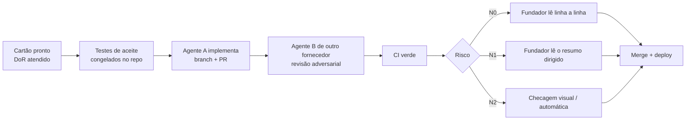

# Tarefas (cartões T-NNN)

Cada cartão descreve **uma** unidade de trabalho do tamanho de 1 a 3 sessões de um agente de codificação. O cartão é a fonte do escopo: o agente implementa o que está nele, nada além.

## Ciclo de vida



Detalhes do processo, níveis de risco e prompt do revisor: [docs/spec/14-qualidade-e-processo-ia.md](../docs/spec/14-qualidade-e-processo-ia.md).

## Definition of Ready (DoR)

Um cartão só entra em execução quando tem:

1. Objetivo em um parágrafo e fase.
2. Requisitos (REQ), invariantes (INV) e nível de risco (N0/N1/N2).
3. Escopo "fazer" e "fora do escopo" explícitos.
4. Lista de arquivos a criar/alterar.
5. Contratos (schemas, SQL, rotas) ou link exato para eles.
6. Testes de aceite com Dado/Quando/Então e valores concretos. Para N0, os arquivos de teste ficam prontos em `tests/acceptance/T-NNN/` **antes** da implementação. Cartão com blocos: o implementador copia os blocos; cartão em tabela: os testes são o 1º commit do PR, lido pelo fundador antes da implementação (um PR só de testes quebraria o `verify` de `main`).
7. Comandos de verificação exatos.
8. Dependências (tarefas e DEC) resolvidas ou com plano B escrito.
9. Seção "Decisões já tomadas" com respostas às dúvidas prováveis.

## Definition of Done (DoD)

- Comandos de verificação verdes local e no CI.
- Testes congelados intactos (`acceptance-freeze` verde).
- Revisão cruzada registrada no PR (obrigatória em N0 e N1).
- Spec, contratos e ADR atualizados na mesma PR quando o comportamento mudou.
- Sem segredo ou dado pessoal em código, fixture ou log.

## Template

```markdown
# T-NNN — Título

| Campo | Valor |
|---|---|
| Fase | F0 |
| Requisitos | REQ-... |
| Invariantes | INV-... |
| Risco de revisão | N0 / N1 / N2 |
| Depende de | T-... |
| Estimativa | N sessões de agente |
| Bloqueado por decisão | DEC-.. ou nenhuma |

## Objetivo
## Contexto obrigatório
## Escopo — fazer
## Fora do escopo
## Arquivos a criar/alterar
## Especificação detalhada
## Testes de aceite (congelados)
## Comandos de verificação
## Definição de pronto
## Decisões já tomadas
```

## Índice de tarefas

O índice com todas as tarefas do F0 e do F1 está em [INDEX.md](INDEX.md): fase, janela, risco, dependências, status (pronto ou resumido), caminho crítico e ordem sugerida de execução. No F0, a tabela 2.3 de [docs/spec/02-escopo-e-fases.md](../docs/spec/02-escopo-e-fases.md) continua dona de fase, dependência e risco. Cartão resumido (com a seção "Para completar o DoR") não é implementado antes de cumprir o DoR.
