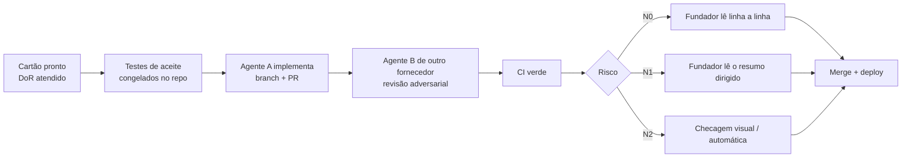

# Tarefas (cartões T-NNN)

Cada cartão descreve **uma** unidade de trabalho do tamanho de 1 a 3 sessões de um agente de codificação (ou uma fatia declarada no cartão). O cartão é a fonte do escopo: o agente implementa o que está nele, nada além.

## Ciclo de vida

Detalhes do processo, níveis de risco e prompt do revisor: [docs/spec/14-qualidade-e-processo-ia.md](../docs/spec/14-qualidade-e-processo-ia.md).

## DoR, DoD e template

Definition of Ready, Definition of Done e template do cartão: [14 §4–§5](../docs/spec/14-qualidade-e-processo-ia.md#4-cartão-de-tarefa). O fato fica em um lugar só.

Cartão com a seção "Para completar o DoR" não se implementa. Cartão de até 3 sessões pode declarar `## Fatias` (1 PR por fatia).

## Índice de tarefas

O índice com todas as tarefas do F0 e do F1 está em [INDEX.md](INDEX.md): status (pronto ou resumido), tabela completa do F1, calendário do DoR e ordem sugerida de execução.

No F0, a tabela 2.3 de [docs/spec/02-escopo-e-fases.md](../docs/spec/02-escopo-e-fases.md) é dona de fase, dependência, risco e caminho crítico.
